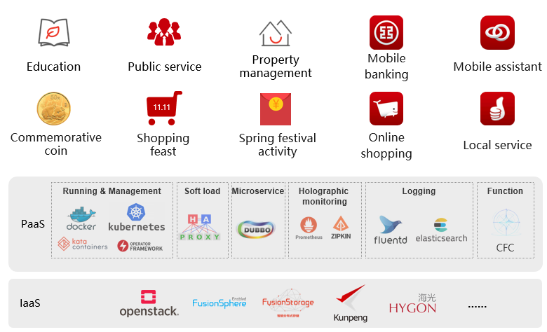
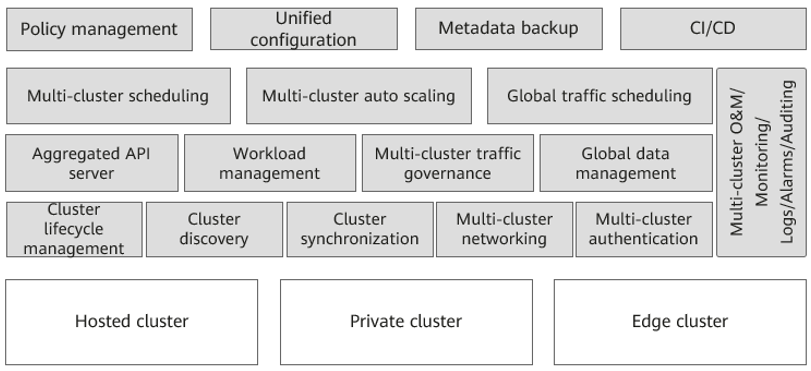
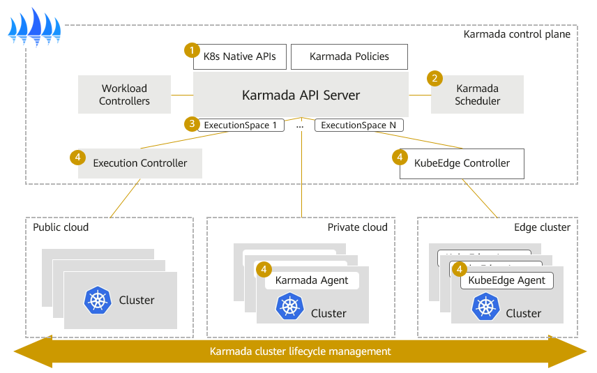
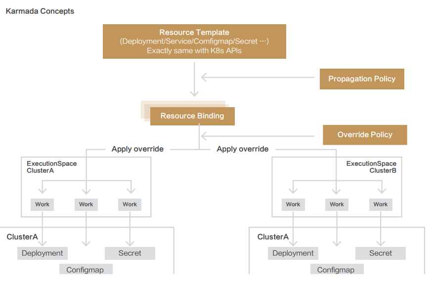
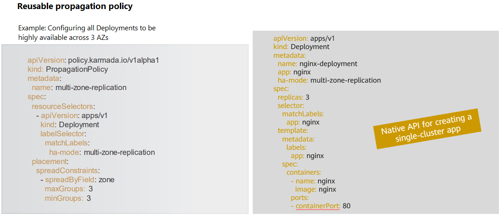

In terms of multi-cluster management, Industrial and Commercial Bank of China (ICBC) found a new way to do it efficiently, that is, using Karmada. At KubeCon 2021, Kevin Wang from Huawei Cloud and Shen Yifan from ICBC shared how they managed it.

<!--truncate-->

## Construction of ICBC Cloud Platform

1. ICBC cloud services support the running of many applications, including online activities in holidays, core service applications; MySQL, Redis and other technical support applications; and the ones in blockchain, AI and some new technical fields.
2. ICBC has been developing a customized cloud platform based on mainstream open-source projects, ensuring overall independence and controllability.
3. It is also the largest container cloud of its kind in the industry, with more than 280 thousand containers deployed. 

## Business Requirements and Cloud Native Infrastructure

ICBC services run with specific requirements and on a large-scale cloud native infrastructure.

There are four typical requirements, namely, high availability (HA) deployment, cross-cluster auto scaling, cross-cluster scheduling, and a specific dependency on Kubernetes versions. 

Here’s how ICBC’s cloud native infrastructure is running now. 

1. High requirements on the reliability of a single cluster. The number of nodes in a single cluster is less than 2,000 to reduce the fault domain of a cluster.
2. Rapid growing of resource pools as services are migrated to the cloud. New and core applications have been developed or running in the cloud, and existing applications are being migrated.
3. Production-level heterogeneous clusters. ICBC services depend on specific Kubernetes versions, and we are using a large number of heterogeneous CNIs, CSIs, and some heterogeneous underlying hardware.
4. Banking services are distributed in multiple regions, centers, and clouds. ICBC cloud services run in the headquarter, branch, and ecosystem clouds. In terms of fault domains, geo-redundancy data centers are constructed, and there is a finer-grained division of multiple fault domains in each data center.

For now, the number of Kubernetes clusters in ICBC has reached more than 100. They are managed by the container cloud platform in a unified manner. However, we also face the following four problems.

1. Limited availability. A Kubernetes cluster is also a fault domain, so automatic recovery across fault domains is required.
2. Limited resources. Only application scheduling and auto scaling are available only to single clusters.
3. Non-transparent clusters. With heterogeneous resources, fault domains, and other attributes configured for clusters, the service team has to distinguish all the underlying clusters to find out the target cluster where they want to run services. Upper-layer applications are not aware of cluster differences.
4. Duplicate configuration. Although our services are configured on the cloud management platform in a unified manner, the specific configuration needs to be delivered to each cluster, which must be synchronized.

To address these challenges, we formulated the following objectives for multi-cluster management.

1. Multi-cluster management: Manage all clusters in one place and their entire lifecycle, and use unified, standard APIs.
2. Resource management: Support multi-version and comprehensive Kubernetes resources and multi-dimensional resource override.
3. Cross-cluster auto scheduling: Should be realized based on the fault domain and resource margin, partnering with cross-cluster auto scaling.
4. Disaster recovery: Cross-cluster resources should be able to auto recovered and the control plane and service clusters should be decoupled.
5. Compatibility: Smooth management is required for a large number of existing heterogeneous clusters, and the open source software we use should be highly scalable and adopted by a large user base.

With these objectives, let’s think about how to achieve them.

## Joint Innovations

Commercial products bring in vendor lock-in, which do not meet our requirements on independence and controllability. So, pass. Other open source software can be a consideration, such as KubeFed. According to the survey on KubeFed, it uses non-native Kubernetes APIs, which makes it difficult to migrate existing clusters. In addition, its community is becoming less active. It doesn’t become the de facto implementation standard in the industry. **So we decided to develop Karmada to satisfy our needs**. As we are building the ICBC financial cloud based on open-source software, we hope to closely work with members from the community and make more contributions to boost the open source development.

Some of you may wonder, why don’t we choose to go further with KubeFed, but initiate a new project? Actually, we did develop the Kubernetes Federation V3 at the early stage and quickly completed the prototype development. However, after communicating with many community users, we found that the Federation itself cannot fully satisfy what’s expected. In addition to multi-cluster workload management, we wanted that Federation has capabilities such as resource scheduling, fault migration, auto scaling, service discovery, data automation, and multi-platform cluster lifecycle management, to provide users with ready-to-use, open-source software for multi-cluster, multi-cloud applications. **Therefore, a neutral, open source project hosted by CNCF will be more suitable for long-term technology evolution and community development**.

## Karmada Project

#### Core architecture of Karmada

In terms of the core architecture development of Karmada, we have learned from the experience of multiple co-sponsors in multi-cloud and multi-cluster management. We focus on the native API support of Kubernetes and the scalability of the core architecture. 

The architecture of Karmada is similar to that of a single Kubernetes cluster in many ways. Both of them have a control plane, an API server, a scheduler, and a group of controllers.

- The API server of the Karmada control plane provides Kubernetes native APIs and policy APIs extended by Karmada.
- Karmada Scheduler focuses on fault domains, cluster resources, Kubernetes versions, and add-ons enabled in the cluster to implement multi-dimensional, multi-weight, and multi-cluster scheduling policies. In addition, the scheduler framework has a pluggable design so that users can customize and extend scheduling policies.
- In terms of member cluster synchronization, Karmada implements agent-based pull mode. In this way, the working pressure on the control plane can be effectively reduced, and users can easily manage large-scale, multi-cluster resource pools. 
- As for Kubernetes clusters in various network environments such as public, private, and edge clouds, Karmada also supports Execution Controller and KubeEdge integration to directly manage Kubernetes clusters.
- To allow multiple clusters to run securely, Karmada has an execution space to isolate the access permissions and resources across multiple clusters.

## Core Karmada Concepts

All workload-related resource objects specified by users are defined in a resource template. They are exactly the same as native Kubernetes APIs, including Deployment, Service, and ConfigMap, and CRD objects. In this way, users can use YAML files or APIs used in single-cluster deployments to create multi-cluster applications without any modification. The service platforms developed based on Kubernetes do not need to be modified either.

For cross-cluster deployment models and scheduling, Karmada provides independent propagation policies, defined using a policy API, that can be reused across applications. For example, ICBC has its independent platform team and service team. This model can well adapt to their organizational structures. The platform teams can set common policies for typical application deployment models, such as high-availability model for applications with multiple fault domains. The service team can still use the Kubernetes native single-cluster APIs to manage their daily service rollout and version upgrade.

Here is an example of how they use Karmada to manage services.

## Zero Refactoring: Using Kubernetes Native APIs to Deploy a 3-AZ HA Application

In the definition of this propagation policy, the platform team sets a resource selector to restrict all Deployments. If an application has a special label and its HA mode is **multi-zone-replication**, the applications are strictly propagated to the three zones. The YAML manifest on the right is the API definition of a standard Deployment. From the two definitions, we can see that the platform team focuses on the settings of the common application deployment model, and the service team focuses on the definitions of images, versions, and container pods in the applications. Karmada combines the requirements of the two teams to achieve cross-region HA of applications. If any underlying cluster is faulty, the missing clusters or pods in the AZ can be automatically supplemented with the dynamic scheduling capability to implement cross-cluster fault migration.

## Thoughts

During Karmada’s positive cycle consisting of design, R&D, practices, redesign and R&D, ICBC has summarized some of its advantages and lessons learned in the following four aspects: resource scheduling, disaster recovery, cluster management, and resource management. I think the following three points deserve special attentions and are especially prominent in the actual implementation process.

- Binding and scheduling of multiple types of resources, which can ensure that Kubernetes resources required by service nodes can be scheduled at the same time. This greatly improves the real-time resource provisioning.
- Support for Kubernetes native objects, which can ensure that a large number of Kubernetes external clients do not need to be reconstructed. 
- Support of Karmada for distribution in pull and push modes, which adapt to multiple scenarios. Especially in the scenario with a large number of clusters, the pull mode can greatly reduce the performance pressure on the Karmada control plane.

## Follow-up Plans

In terms of large-scale production, we hope that the container cloud platform will serve as a user-oriented platform, and the underlying layer will manage and schedule resources of multiple clusters in a unified manner based on Karmada. In this way, more than 100 existing Kubernetes clusters, including heterogeneous clusters, can be managed. 

We also hope to make continuous contributions to the community. We mainly focus on the feature which includes a smooth migration of existing applications and can be automatically incorporated into Karmada for federation. We will keep optimizing and implementing cross-cluster scaling, application migration, and data linkage.

You can find us on GitHub to learn more about Karmada. If you have any suggestions or feedback when using Karmada, please join our Slack channel to reach out to us.

## More information for Karmada:

GitHub [https://github.com/karmada-io/karmada](https://github.com/karmada-io/karmada)

Slack [https://slack.cncf.io/ ](https://slack.cncf.io/) （channel#karmada)
