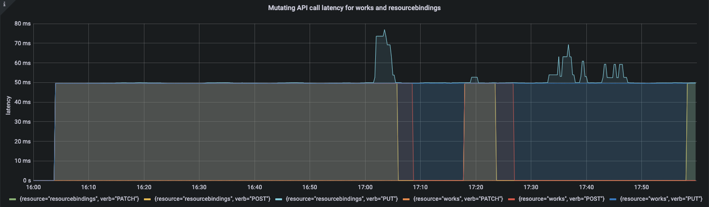

## Abstract

The popularity of Karmada is now drawing users' attention to Karmada's scalability and deployment at scale. Therefore, we launched a large-scale test on Karmada, and the test results show that Karmada can stably support 100 clusters with 500,000 nodes connected at the same time, running more than 2 million pods. This article will introduce the metrics used in the test, how to conduct large-scale testing, and how we realize massive connection of nodes and clusters.

## Background

Cloud computing is entering a new stage featuring multicloud and distributed clouds. As surveyed by Flexera, a well-known analyst company, more than 93% of enterprises are using services from multiple cloud vendors at the same time. Single Kubernetes clusters, limited by their capacity and fault recovery capabilities, cannot support services to run as distributed as wanted, especially if one's organization wants to go globalization. A hybrid cloud or multi-public cloud architecture helps avoid vendor lock-in or optimize costs.
Karmada users are also demanding large-scale node and application management in their multi-cluster deployments.

<!--truncate-->

## Introduction to Karmada

Karmada (Kubernetes Armada) is a Kubernetes management system that enables you to run your cloud-native applications across multiple Kubernetes clusters and clouds, with no changes to your applications. By speaking Kubernetes-native APIs and providing advanced scheduling capabilities, Karmada enables truly open, multi-cloud Kubernetes.

Karmada aims to provide turnkey automation for multi-cluster application management in multi-cloud and hybrid cloud scenarios, with key features such as centralized multi-cloud management, high availability, failure recovery, and traffic scheduling.


The Karmada Control Plane consists of the following components:

- Karmada API Server
- Karmada Controller Manager
- Karmada Scheduler

ETCD stores the Karmada API objects, the API Server is the REST endpoint all other components talk to, and the Karmada Controller Manager performs operations based on the API objects you create through the API server.

The Karmada Controller Manager runs the various controllers,  the controllers watch Karmada objects and then talk to the underlying clusters' API servers to create regular Kubernetes resources.

## Multi-cluster Scalability Dimensions and Thresholds

The scalability of a multi-cluster system does not only refer to the number of clusters, that is, Scalability!=`#Num of Clusters`. It includes many dimensions of measurement.
It is pointless to consider cluster size without considering other dimensions.

We describe the scalability of a multi-cluster system in the following three dimensions by priority:

1. Num of Clusters: The number of clusters is the most direct dimension to measure the resource pool size and scalability of a multi-cluster system.
   With the remaining dimensions unchanged, the more clusters the system can access, the larger the resource pool of the system and the stronger the carrying capacity.
2. Num of Resources (API Objects): For the control plane of a multi-cluster system, the storage is not unlimited, and the number and overall size of API objects created on the control plane are limited by the storage of the control plane, which is also an important dimension restricting the resource pool size of the multi-cluster system.
   The API objects here not only refer to the resource templates distributed to member clusters, but also include the cluster scheduling policies, multi-cluster services and other resources.
3. Cluster Size: Cluster size is a dimension that cannot be ignored when measuring the resource pool size of a multi-cluster system. On the one hand, when the number of clusters is equal, the larger the scale of a single cluster, the larger the resource pool of the entire multi-cluster system.
   On the other hand, the upper-layer feature of a multi-cluster system depends on the system's resource portrait of the cluster. For example, in the scheduling process, the resource status of the destination cluster is an indispensable factor.
   Under the same circumstances, the larger the cluster scale, the greater the pressure on the control plane. Among cluster resources, Node and Pod are undoubtedly the two most important resources.
   Node is the smallest carrier of computing, storage and other resources, and the number of Pods represents the application carrying capacity of a cluster. 
   In fact, API objects in a single cluster also include common objects such as Services, ConfigMaps, Secrets and so on. The introduction of these variables will make the testing process more complicated, so this test does not focus too much on the above variables.
   * Num of Nodes
   * Num of Pods

For a multi-cluster system, it is impossible for a Kubernetes cluster to expand resource objects without limitation while satisfying SLIs/SLOs.
Dimensions are interactive. One weighs more, the rest weigh less.
Take the dimensions `#Num of Clusters` and `#Num of Nodes` as an example. When scaling from 5k nodes to 10k in 100 individual clusters, or expanding to 200 clusters while maintaining the original size of each cluster, the specifications of other dimensions will be surely affected.
A heavy workload is required if all scenarios are tested. In this test, we focus on the typical scenarios. On the basis of satisfying SLIs/SLOs, we implement access and management of 100 clusters with 5k nodes and 20k pods.

## SLIs/SLOs

Scalability and performance are important features of multi-cluster federation. As a user of multi-cluster federation, we expect quality of service to be guaranteed in the above two aspects. Before conducting large-scale performance testing, we need to define measurement metrics.
With reference to the SLI (Service Level Indicator)/SLO (Service Level Objectives) of the Kubernetes community and typical applications of multi-cluster, the Karmada community defines the following SLI/SLO to measure the service quality of multi-cluster federation.

1. API Call Latency


| Status  | SLI                                                                                                                      | SLO                                                                           |
|---------|--------------------------------------------------------------------------------------------------------------------------|-------------------------------------------------------------------------------|
| Offical | P99 latency of Mutating API calls (including POST, PUT, DELETE, PATCH) to a single resource object in the last 5 minutes | P99 <= 1s                                                                     |
| Offical | P99 latency of non-streaming read-only API calls (including GET and LIST) in the last 5 minutes                          | (a)Scope=resource, P99 <= 1s, (b)Scope=namespace or Scope=cluster, P99 <= 30s |

2. Resource Distribution Latency


| Status  | SLI                                                                                                                                                                                                                                                                         | SLO       |
|---------|-----------------------------------------------------------------------------------------------------------------------------------------------------------------------------------------------------------------------------------------------------------------------------|-----------|
| Offical | After the user submits the resource template and delivers the policy on the federated control plane, the P99 delay from the time when the resource is created on the member cluster, regardless of the network fluctuation between the control plane and the member cluster | P99 <= 2s |

3. Cluster Registration Latency


| Status | SLI                                                                                                                                    | SLO |
|--------|----------------------------------------------------------------------------------------------------------------------------------------|-----|
| WIP    | P99 delay from when the cluster is registered in the federation control plane to when the status can be collected by the control plane | TBD |

4. Resource Usage


| Status | SLI                                                                                                                                               | SLO |
|--------|---------------------------------------------------------------------------------------------------------------------------------------------------|-----|
| WIP    | The amount of necessary resource usage for the cluster federation to maintain its normal operation after registering a certain number of clusters | TBD |

**Note**:

1. Network fluctuations between the control plane and member clusters, as well as intra-cluster SLOs, are not taken into account for the metrics measured.
2. Resource Usage is a very important indicator of a multi-cluster system, but the upper-layer services provided by each system are different, so the resource requirements are also different. We do not make hard constraints here.
3. Cluster Registration Latency contains the duration from when the cluster is registered in the control plane to when the cluster becomes available.
   It relies on how the control plane obtains the status of the cluster.

## Test Tools

### ClusterLoader2

ClusterLoader2 is an open source Kubernetes cluster performance test tool. It can test the Kubernetes SLIs/SLOs to check whether the cluster meets the service quality standards. It also visualizes data for locating cluster problems and optimizing cluster performance.
After the test, users get a performance report with detailed test results. However, ClusterLoader2 is a test tool customized for a single Kubernetes cluster, and in multi-cluster scenarios, it cannot obtain the resources of all clusters.
Here we only use ClusterLoader2 to distribute resources.

### Prometheus

Prometheus is a systems and service monitoring system. It collects metrics from configured targets at given intervals, evaluates rule expressions, displays the results, and triggers alerts when specified conditions are observed. After analyzing the processing of indicators by ClusterLoader2, we use Prometheus to monitor various indicators of the control plane according to specific query statements.

### Kind

Kind is a tool for running local Kubernetes clusters using Docker container "nodes". In order to test Karmada's application distribution capabilities, we need a real single-cluster control plane to manage applications distributed by the federated control plane.
Kind is able to simulate a real cluster while saving resources.

### Fake-kubelet

Fake-kubelet is a tool for simulating any number of nodes and maintain pods on those nodes. Compared to Kubemark, fake-kubelet only does the minimum work of maintaining nodes and pods, and is very suitable for simulating a large number of nodes and pods for pressure testing on the control plane.

## Cluster Deployment Scheme for the Test


The Kubernetes control plane is deployed with one master node. The etcd, kube-apiserver, kube-scheduler, and kube-controller are deployed as single-instance.
The Karmada control plane components are deployed on the Kubernetes master node. All of them are deployed as single-instance.
The components of both Kubernetes control plane and Karmada control plane run on high-performance nodes and do not limit resources.
We simulate a single-master cluster through kind and simulate work nodes in the cluster through fate-kubelet.

## Test Environment Information

Control Plane OS Version

`Ubuntu 18.04.6 LTS (Bionic Beaver)`

Kubernetes Version

`Kubernetes v1.23.10`

Karmada Version

`Karmada v1.3.0-4-g1f13ad97`

Karmada Control Plane Node Configurations

* CPU

```
Architecture:        x86_64
CPU op-mode(s):      32-bit, 64-bit
Byte Order:          Little Endian
CPU(s):              64
On-line CPU(s) list: 0-63
Thread(s) per core:  2
Core(s) per socket:  16
Socket(s):           2
NUMA node(s):        2
Vendor ID:           GenuineIntel
CPU family:          6
Model:               85
Model name:          Intel(R) Xeon(R) Gold 6266C CPU @ 3.00GHz
Stepping:            7
CPU MHz:             3000.000
BogoMIPS:            6000.00
Hypervisor vendor:   KVM
Virtualization type: full
L1d cache:           32K
L1i cache:           32K
L2 cache:            1024K
L3 cache:            30976K
NUMA node0 CPU(s):   0-31
NUMA node1 CPU(s):   32-63
```

* Memory

```
Maximum Capacity: 512 GB
```

* Disk

```
Disk /dev/vda: 200 GiB, 214748364800 bytes, 419430400 sectors
```

## Component Parameter Configurations

1. karmada-apiserver

```
--max-requests-inflight=2000
--max-mutating-requests-inflight=1000
```

2. karmada-aggregated-server

```
--kube-api-qps=200
--kube-api-burst=400
```

3. karmada-scheduler

```
--kube-api-qps=200
--kube-api-burst=400
```

4. karmada-controller-manager

```
--kube-api-qps=200
--kube-api-burst=400
```

5. karmada-agent

```
--kube-api-qps=40
--kube-api-burst=60
```

6. karmada-etcd

```
--quota-backend-bytes=8G
```

## Test Execution

Before using ClusterLoader2 to perform the performance test, we defined the test policy using the configuration file. The configuration file we used can be obtained here:

<details>

<summary>unfold me to see the yaml</summary>

```yaml
name: test

namespace:
   number: 10

tuningSets:
   - name: Uniformtinyqps
     qpsLoad:
        qps: 0.1
   - name: Uniform1qps
     qpsLoad:
        qps: 1

steps:
   - name: Create deployment
     phases:
        - namespaceRange:
             min: 1
             max: 10
          replicasPerNamespace: 20
          tuningSet: Uniformtinyqps
          objectBundle:
             - basename: test-deployment
               objectTemplatePath: "deployment.yaml"
               templateFillMap:
                  Replicas: 1000
        - namespaceRange:
             min: 1
             max: 10
          replicasPerNamespace: 1
          tuningSet: Uniform1qps
          objectBundle:
             - basename: test-policy
               objectTemplatePath: "policy.yaml"
```

```yaml
# deployment.yaml
apiVersion: apps/v1
kind: Deployment
metadata:
  name: {{.Name}}
  labels:
    group: test-deployment
spec:
  replicas: {{.Replicas}}
  selector:
    matchLabels:
      app: fake-pod
  template:
    metadata:
      labels:
        app: fake-pod
    spec:
      affinity:
        nodeAffinity:
          requiredDuringSchedulingIgnoredDuringExecution:
            nodeSelectorTerms:
              - matchExpressions:
                  - key: type
                    operator: In
                    values:
                      - fake-kubelet
      tolerations: 
          - key: "fake-kubelet/provider"
            operator: "Exists"
            effect: "NoSchedule"
      containers:
        - image: fake-pod
          name: {{.Name}}
```

```yaml
# policy.yaml
apiVersion: policy.karmada.io/v1alpha1
kind: PropagationPolicy
metadata:
  name: test
spec:
  resourceSelectors:
    - apiVersion: apps/v1
      kind: Deployment
  placement:
    replicaScheduling:
      replicaDivisionPreference: Weighted
      replicaSchedulingType: Divided
```

</details>

The following table describes the detailed Kubernetes resource configurations:


| Maximum Type                     | Maximum Value |
|----------------------------------|---------------|
| Number of Clusters               | 100           |
| Number of Pods                   | 2000000       |
| Number of Nodes per Cluster      | 5000          |
| Number of Pods per Cluster       | 20000         |
| Number of Namespaces per Cluster | 20            |
| Number of Pods per Namespace     | 1000          |

For details about test method and procedure, see the following links:

[https://github.com/kubernetes/perf-tests/blob/master/clusterloader2/docs/GETTING_STARTED.md](https://github.com/kubernetes/perf-tests/blob/master/clusterloader2/docs/GETTING_STARTED.md)

## Test Results

APIResponsivenessPrometheus:





Cluster Registration Latency:


| metric           | P50(ms) | P90(ms) | P99(ms) | SLO |
|------------------|---------|---------|---------|-----|
| cluster_register | 5356    | 6125    | 6904    | N/A |

**Note**: Karmada's Pull mode is suitable for private cloud scenarios. Compared with Push mode, there is a component named karmada-agent running on the member cluster side. It will pull the user-submitted application and run it locally.
In the process of cluster registration in Pull mode, the latency will include the installation time of Karmada-agent in the member cluster. When the image of karmada-agent is ready, the latency depends on that of Pod startup in a single cluster.
This article does not describe much of this indicator in Pull mode.

Resource Distribution Latency:


| metric                      | P50(ms) | P90(ms) | P99(ms) | SLO  |
|-----------------------------|---------|---------|---------|------|
| cluster_schedule            | 12      | 15      | 32      | N/A  |
| resource_distribution(Push) | 706     | 899     | 1298    | 2000 |
| resource_distribution(Pull) | 612     | 881     | 989     | 2000 |

### Push Mode

Etcd latency:


Resource Usage:


### Pull Mode

Etcd latency:


Resource Usage:


Karmada-agent in the member cluster with 5k Nodes and 2w Pods consumes 40m CPU(cores) and 266Mi Memory(bytes).

## Conclusion and Analysis

From the preceding test results, the API Call Latency and Resource Distribution Latency meet the SLIs/SLOs above, and the resources consumed by the system during the whole process are in a controllable range.
Therefore, **Karmada can stably support 100 clusters with 500,000 nodes and more than two million pods**. In production, Karmada effectively supports the management of hundreds of large-sized clusters.
Next, we will analyze the data of each indicator in detail.

### Resource Templates and Policies

Karmada uses Kubernetes native APIs for federated resource templates and reusable Policy APIs for cluster scheduling strategies. These allow Karmada to integrate with the Kubernetes ecosystem and greatly reduce the number of resources on the control plane.
Based on this, the number of resources for the control plane does not depend on how many clusters on the control plane, but on how many multi-cluster applications.

Karmada's arthrecture inherits the simplicity and scalability of Kubernetes. Karmada-apiserver as the entry point of the control plane is like kube-apiserver in Kubernetes. You can optimize the component in multi-cluster scenarios using the parameters you need in single cluster configuration.

During the entire resource distribution process, API call latency is within a resonable range.

### Cluster Registry and Resource Distribution

In Karmada 1.3, we provides the ability to register Pull mode clusters based on Bootstrap tokens, which not only simplifies the cluster registration process, but also facilitates access control.
For both the Push and Pull modes, we can use the karmadactl CLI to complete cluster registration. Unlike the Push mode, the Pull mode runs a component named karmada-agent on member clusters.

Cluster Registration Latency above contains the delay for the control plane to successfully collect the member cluster status. In the process of cluster lifecycle management, Karmada will collect the cluster version, API enablement and whether the cluster is online or healthy.
Besides, Karmada will obtain the resource usage of the cluster to model the cluster so that the scheduler can better select the target cluster. In this case, Cluster Registration Latency depends on the size of the cluster.
This article shows the latency of joining a 5,000-node cluster until it is ready. You can [disable cluster resource modeling](https://karmada.io/docs/next/userguide/scheduling/cluster-resources#disable-cluster-resource-modeling) so that cluster Registration latency will be independent of cluster size and less than 2000ms.

No matter whether you are using the Push mode or Pull mode, Karmada maintains a fast rate for distributing resources to member clusters. The only difference is that karmada-controller-manager on the control plane is responsible for the distribution of all cluster resources in Push mode whereas karmada-agent is only responsible for one cluster in Pull mode.
Therefore, in the process of distributing resources with high concurrency, Pull mode will be slightly faster than Push mode under the same configuration.
Also, you may adjust `--concurrent-work-syncs` parameter in karmada-controller-manager to improve performance.

### Resource Usage between Push Mode and Pull Mode

In Karmada 1.3, we did a lot to reduce Karmada's resource consumption when managing large clusters. Compared with version 1.2, Karmada 1.3 reduces memory consumption by **85%** and CPU consumption by **32%** in large-scale scenarios.
In general, Pull Mode has a clear advantage in memory usage, and the rest of the resources are similar.

In Push mode, the main resource consumption of the control plane is concentrated on the karmada-controller-manager. And karmada-apiserver is not under much pressure.


From the qps of karmada-apiserver and the request latency of karmada-etcd, we can know that the number of requests to karmada-apiserver is kept at a low level.
In Push mode, all requests come from karmada-controller-manager on the control plane. You can configure `--kube-api-qps` and `--kube-api-burst` in karmada-controller-manager to control requests within a certain threshold.

In Pull mode, the main resource consumption of the control plane is concentrated on the karmada-apiserver instead of karmada-controller-manager.


From the qps of karmada-apiserver and the request latency of karmada-etcd, we can know that the number of requests to karmada-apiserver is kept at a high level.
In Pull mode, karmada-agent of each member cluster needs to maintain a long connection with karmada-apiserver.
We can easily conclude that the number of requests for karmada-apiserver will be N times that of configuration in karmada-agent(N=`#Num of clusters`).
Therefore, in the scenario of a large number of Pull mode clusters, we recommand increasing the `--max-requests-inflight`, `--max-mutating-requests-inflight` in karmada-apiserver and `--quota-backend-bytes` in karmada-etcd to improve the throughout of the control plane.

Now Karmada provides the ability named [cluster resource modeling](https://karmada.io/docs/next/userguide/scheduling/cluster-resources) to make scheduling decisions in scenario of dynamic replica assignment based on idle cluster resources.
In the process of resource modeling, it will collect node and pod information from all clusters managed by Karmada. This imposes a considerable performance burden in large-scale scenarios.
If you do not use this ability, you can [disable cluster resource modeling](https://karmada.io/docs/next/userguide/scheduling/cluster-resources#disable-cluster-resource-modeling) to further reduce resource consumption.

### Summary

In terms of use scenarios, Push mode is suitable for managing Kubernetes clusters on public clouds, while Pull mode covers private cloud and edge-related scenarios. In terms of performance and security, the Pull mode outperforms the Push mode.
Each cluster is managed by the karmada-agent component in the cluster and is completely isolated.
However, while the Pull mode improves performance, it also needs to correspondingly improve the performance of karmada-apiserver and karmada-etcd to face challenges in traffic-intensive and high-concurrency scenarios. For specific methods, please refer to the optimization of Kubernetes for large-scale clusters.
In general, users can choose different deployment modes according to usage scenarios to improve the performance of the entire multi-cluster system through parameter tuning and other means.
