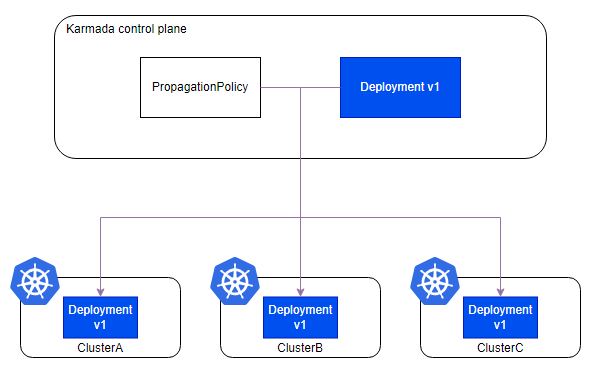
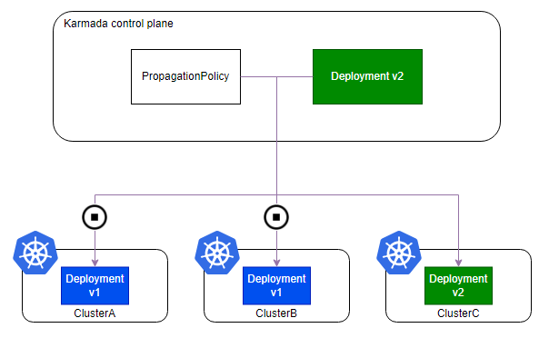
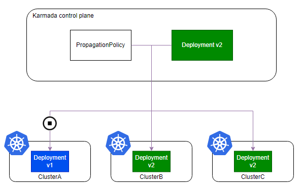
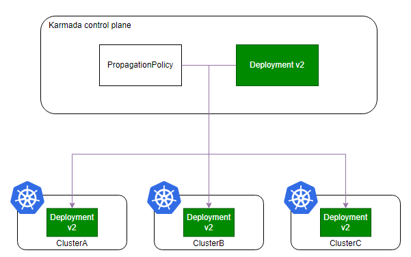
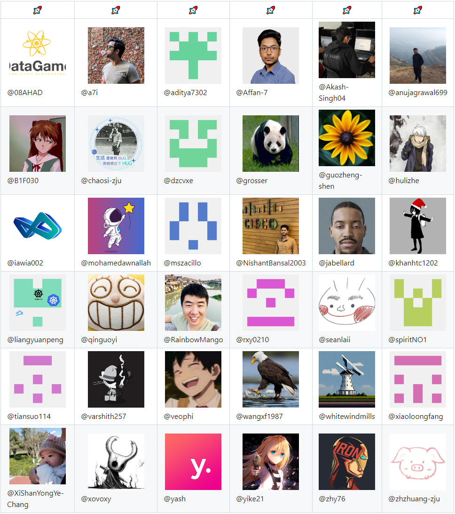

# Karmada v1.11 version released! New cross-cluster rolling upgrade capability for workload!

Karmada is an open multi-cloud and multi-cluster container orchestration engine designed to help users deploy and operate business applications in a multi-cloud environment. With its compatibility with the native Kubernetes API, Karmada can smoothly migrate single-cluster workloads while still maintaining coordination with the surrounding Kubernetes ecosystem tools.

This version includes the following new features:
- Supports cross-cluster rolling upgrades of federated workloads, making the user's version release process more flexible and controllable.
- karmadactl has added multiple operational capabilities, providing a unique multi-cluster operational experience.
- It provides standardized generation semantics for federated workloads, enabling CD execution in one step.
- Karmada Operator supports custom CRD download strategies, making offline deployment more flexible.

## Cross-Cluster Rolling Upgrade of Federated Workloads

In the latest released v1.11 version, Karmada has added the feature of cross-cluster rolling upgrades for federated workloads. This feature is particularly suitable for workloads deployed across multiple clusters, allowing users to adopt more flexible and controllable rolling upgrade strategies when releasing new versions of their workloads. Users can finely control the upgrade process to ensure a smooth transition for each cluster during the upgrade, minimizing the impact on the production environment. This feature not only enhances the user experience but also provides more flexibility and reliability for complex multi-cluster management.

Below is an example to demonstrate how to perform a rolling upgrade on federated workloads:

Assuming that the user has already propagated the Deployment to three member clusters through PropagationPolicy: `ClusterA`, `ClusterB`, `ClusterC`:

```yaml
apiVersion: policy.karmada.io/v1alpha1
kind: PropagationPolicy
metadata:
  name: nginx-propagation
spec:
  resourceSelectors:
    - apiVersion: apps/v1
      kind: Deployment
      name: nginx
  placement:
    clusterAffinity:
      clusterNames:
        - ClusterA
        - ClusterB
        - ClusterC
```



At this point, the version of the Deployment is v1. To upgrade the Deployment resource version to v2, you can perform the following steps in sequence.

Firstly, configure the PropagationPolicy to temporarily halt the propagation of resources to `ClusterA` and `ClusterB`, so that the deployment changes will only occur in `ClusterC`:

```yaml
apiVersion: policy.karmada.io/v1alpha1
kind: PropagationPolicy
metadata:
  name: nginx-propagation
spec:
  #...
  suspension:
    dispatchingOnClusters:
      clusterNames:
        - ClusterA
        - ClusterB
```



Then, update the PropagationPolicy resource to allow the system to synchronize the new version of the resources to the `ClusterB` cluster:

```yaml
  suspension:
    dispatchingOnClusters:
      clusterNames:
        - ClusterA
```



Finally, remove the `suspension` field from the PropagationPolicy resource to allow the system to synchronize the new version of the resources to the `ClusterA` cluster:



From the example above, we can see that by using the cross-cluster rolling upgrade capability of federated workloads, the new version of the workload can be rolled out cluster by cluster, and precise control can be achieved.

Additionally, this feature can also be applied to other scenarios, particularly for developers facing situations where resources are frequently updated due to competition between the Karmada control plane and member clusters for resource control. In such cases, suspending the synchronizing process of resources to member clusters can facilitate the quick identification of issues.

## Enhancements to karmadactl

In this version, the Karmada community has focused on enhancing Karmadactl capabilities to provide a better multi-cluster operations experience, thereby reducing users' reliance on kubectl.

### A More Extensive Command Set

Karmadactl now supports a richer command set including `create`, `patch`, `delete`, `label`, `annotate`, `edit`, `attach`, `top node`, `api-resources`, and `explain`. These commands allow users to perform more operations on resources either on the Karmada control plane or member clusters.

### Enhanced Functionality

Karmadactl introduces the `--operation-scope` parameter to control the scope of command operations. With this new parameter, commands such as `get`, `describe`, `exec`, and `explain` can flexibly switch between cluster perspectives to operate on resources in the Karmada control plane or member clusters.

### More Detailed Command Output Information

The output of the `karmadactl get cluster` command now includes additional details such as the cluster object's `Zones`, `Region`, `Provider`, `API-Endpoint`, and `Proxy-URL`.

Through these capability enhancements, the operational experience with karmadactl has been improved. New features and more detailed information about karmadactl can be accessed using `karmadactl --help`.

## Standardization of Federation Workload Generation Semantics

In this version, Karmada has standardized the generation semantics of workload at the federation level. This update provides a reliable reference for the release system, enhancing the accuracy of cross-cluster deployments. By standardizing generation semantics, Karmada simplifies the release process and ensures consistent tracking of workload status, making it easier to manage and monitor applications across multiple clusters.

The specifics of the standardization are as follows: the observedGeneration value in the status of the federated workload is set to its own `.metadata.generation` value only when the state of resources distributed to all member clusters satisfies `status.observedGeneration` >= `metadata.generation`. This ensures that the corresponding controllers in each member cluster have completed processing of the workload. This move aligns the generation semantics at the federation level with those of Kubernetes clusters, allowing users to more conveniently migrate single-cluster applications to a multi-cluster setup.

The following resources have been adapted in this version:

- GroupVersion: apps/v1 Kind: Deployment, DaemonSet, StatefulSet
- GroupVersion: apps.kruise.io/v1alpha1 Kind: CloneSet, DaemonSet
- GroupVersion: apps.kruise.io/v1beta1 Kind: StatefulSet
- GroupVersion: helm.toolkit.fluxcd.io/v2beta1 Kind: HelmRelease
- GroupVersion: kustomize.toolkit.fluxcd.io/v1 Kind: Kustomization
- GroupVersion: source.toolkit.fluxcd.io/v1 Kind: GitRepository
- GroupVersion: source.toolkit.fluxcd.io/v1beta2 Kind: Bucket, HelmChart, HelmRepository, OCIRepository

If you need to adapt more resources (including CRDs), you can provide feedback to the Karmada community or extend using [the Resource Interpreter](https://karmada.io/docs/next/userguide/globalview/customizing-resource-interpreter/).

## Karmada Operator Supports Custom CRD Download Strategies

CRD (Custom Resource Definition) resources are key prerequisite resources used by the Karmada Operator to configure new Karmada instances. These CRD resources contain critical API definitions for the Karmada system, such as PropagationPolicy, ResourceBinding, and Work.

In version v1.11, the Karmada Operator supports custom CRD download strategies. With this feature, users can specify the download path for CRD resources and define additional download strategies, providing a more flexible offline deployment method.

For a detailed description of this feature, refer to the [proposal: Custom CRD Download Strategy Support for Karmada Operator](https://github.com/karmada-io/karmada/tree/master/docs/proposals/operator-custom-crd-download-strategy).

# Acknowledging Our Contributors

The Karmada v1.11 release includes 223 code commits from 36 contributors. We would like to extend our sincere gratitude to all the contributors:


