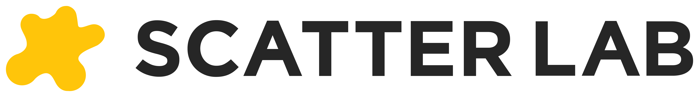

# Welcome Scatter Lab to the Karmada Adopter Group!

Karmada is thrilled to announce that **[Scatter Lab](https://www.scatterlab.co.kr/ko)** has officially joined the 
Karmada Adopter Group and has become an important member of the community. As a project under the Cloud Native Computing 
Foundation (CNCF), Karmada is committed to providing users with powerful multi-cluster management and scheduling 
capabilities to help enterprises achieve efficient application deployment and management in complex distributed 
environments. The joining of **Scatter Lab** will further strengthen the Karmada community, bring fresh energy to the 
project's ongoing innovation, and marks another important milestone in the growth of our community and the adoption of 
Karmada in diverse production environments.

## About Scatter Lab

Scatter Lab is a South Korean technology company pioneering the future of AI-powered entertainment through advanced 
natural language processing and generative AI. The company is best known for `Zeta`, an immersive AI chat-based 
entertainment platform launched in April 2024.

Zeta redefines user engagement by enabling users to co-create dynamic, personalized narratives with AI 
characters—shifting entertainment from passive consumption to active, real-time collaboration. Within its first year, 
Zeta surpassed 2 million cumulative users and 800,000 monthly active users, with users spending an average of over 2 
hours and 40 minutes per day on the app.

At the core of Zeta is Spotwrite-1, Scatter Lab’s proprietary AI model optimized not just for coherence, but for 
fun—leveraging creativity, unpredictability, and even controlled “hallucinations” to deliver compelling experiences. 
The company has achieved vertical integration across data, training, and application layers, enabling both high 
performance and cost efficiency.

Notably, Scatter Lab has been profitable for six consecutive quarters since Q4 2024, demonstrating a rare combination of 
rapid growth and sustainable monetization in the AI consumer space.

With a vision to make AI a true companion in human storytelling, Scatter Lab is expanding Zeta globally, starting with 
Japan, and shaping the next generation of AI-native entertainment.

## About Karmada Adopter Group

The **Karmada Adopter Group** is a community of organizations and users who have successfully adopted Karmada in their 
environments. Members share their experiences, best practices, and feedback to help improve Karmada and foster a 
vibrant, collaborative ecosystem.

Becoming a member of the Karmada Adopter Group offers several advantages:

- **Community Recognition**: Showcase your organization as a leader in cloud native multi-cluster management and gain visibility within the CNCF and Karmada communities.
- **Collaboration & Networking**: Connect with other adopters, share best practices, and collaborate on real-world use cases and solutions.
- **Stay Updated**: Receive timely notifications on critical updates, including key features, bug fixes, and security advisories.
- **Event Participation**: Invitations to participate in Karmada-related events, including KubeCon + CloudNativeCon, webinars, and meetups.
- **Job Postings**: Opportunity to post job openings related to Karmada on the Karmada Community Supported Job Board (not available now).
- **Business Opportunities**: Potential business connections and collaborations with other members of the Karmada ecosystem.

Learn more about the Karmada Adopter Group in [GitHub community repository](https://github.com/karmada-io/community/tree/main/adopter-group), and see the full list of `public` adopters at [karmada.io/adopters](https://karmada.io/adopters).

## Join Karmada Adopter Group

The Karmada Adopter Group is open to `end users` and `vendors` who are currently using Karmada in `production`. This 
includes:

- **End Users**: Organizations that run Karmada in their production environments.
- **Vendors**: Companies that offer products or services based on Karmada and have customers using it in production.

Are you using Karmada in production and interested in joining the Karmada Adopter Group?

Joining is simple—just fill out the [Karmada Adopter Group Application Form](https://github.com/karmada-io/karmada/issues/4540) 
with your organization's information. After your application is reviewed and approved, your organization will be added
to the Karmada Adopter Group.

For more details, please see the [How to Join](https://github.com/karmada-io/community/tree/main/adopter-group#how-to-join) 
section in the community repository.

Let's grow the Karmada community and the broader multicluster ecosystem together!
