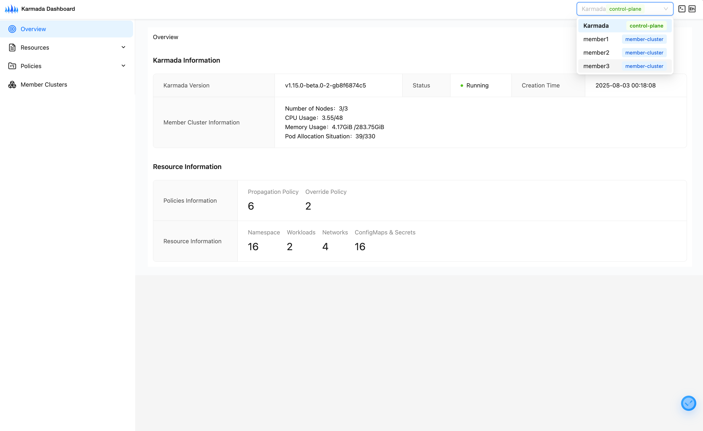

# Karmada 1.17 Released! Introducing Workload Affinity and Anti-Affinity Support

Karmada is an open multi-cloud and multi-cluster container orchestration engine designed to help users deploy and operate business applications in a multi-cloud environment. With its compatibility with the native Kubernetes API, Karmada can smoothly migrate single-cluster workloads while still maintaining coordination with the surrounding Kubernetes ecosystem tools.

[Karmada v1.17](https://github.com/karmada-io/karmada/blob/master/docs/CHANGELOG/CHANGELOG-1.17.md) is now released, and this version includes the following new features:

- Workload Affinity and Anti-Affinity Scheduling
- Dashboard v0.3.0 Release
- Continuous Performance Optimization

These features make Karmada more mature and reliable when handling large-scale, complex multi-cluster scenarios. We encourage you to upgrade to v1.17.0 to experience the value brought by these new features.

## New Feature Overview

### Support for Workload Affinity and Anti-Affinity Scheduling

In multi-cluster scenarios, a large number of applications have clear requirements for the deployment locations between workloads to achieve high availability, low latency, cost optimization, and operational isolation. To meet such refined deployment needs, this version officially launches the **Workload Affinity and Anti-Affinity Scheduling** capability, allowing you to finely control the topological relationships of workloads across multiple clusters.

#### Workload Affinity

Schedule associated workloads (such as microservices and their caches, distributed training tasks, etc.) to the same cluster.

- Core Value: Reduce cross-cluster network latency and significantly improve the operational efficiency of performance-sensitive applications.
- Typical Scenarios: Co-deployment of services and dependent components, nearby scheduling of training task components.

#### Workload Anti-Affinity

Distribute workloads of the same logical group to different clusters.

- Core Value: Avoid overall unavailability of critical applications due to single-cluster failures and strengthen multi-cluster high availability guarantees.
- Typical Scenarios: Decentralized deployment of core services across multiple clusters, cross-cluster disaster recovery for multiple replicas.

#### Usage Method

You only need to add the `workloadAffinity` configuration in the PropagationPolicy to define affinity groups based on labels on the resource template, enabling co-cluster deployment or cross-cluster distribution of workloads.
Let's take an example of **Workload Affinity**. Suppose you have a set of training tasks, and to achieve the best training results, you want the jobs of this set of training tasks to run on the same cluster. You can configure it as follows:

```yaml
apiVersion: policy.karmada.io/v1alpha1
kind: PropagationPolicy
metadata:
  name: training-tasks-affinity-example
  namespace: default
spec:
  resourceSelectors:
    - apiVersion: batch/v1
      kind: Job
      labelSelector:
        matchLabels:
          workload.type: training
  placement:
    spreadConstraints:
      - maxGroups: 1
        minGroups: 1
    clusterAffinity:
      clusterNames:
        - member1
        - member2
        - member3
    workloadAffinity:
      affinity:
        groupByLabelKey: app.training-group
```

**After enabling the Workload Affinity and Anti-Affinity Scheduling feature,** Karmada will schedule training tasks with the same label value of `app.training-group` to the same cluster.

Let's look at an example of **Workload Anti-Affinity**. Suppose you are running Flink data processing tasks that are highly sensitive to downtime. To ensure high availability, you deploy multiple replicas of the same Flink task. To avoid complete service interruption due to a single cluster failure, you want multiple replicas of the same task to run on different clusters. You can configure it as follows:

```yaml
apiVersion: policy.karmada.io/v1alpha1
kind: PropagationPolicy
metadata:
  name: flink-anti-affinity-example
  namespace: default
spec:
  resourceSelectors:
    - apiVersion: flink.apache.org/v1beta1
      kind: FlinkDeployment
      labelSelector:
        matchLabels:
          ha.enabled: "true"
  placement:
    spreadConstraints:
      - maxGroups: 1
        minGroups: 1
    clusterAffinity:
      clusterNames:
        - clusterA
        - clusterB
        - clusterC
    workloadAffinity:
      antiAffinity:
        groupByLabelKey: karmada.io/group
```

**After enabling the Workload Affinity and Anti-Affinity Scheduling feature,** Karmada will schedule Flink tasks with the same label value of `karmada.io/group` to different clusters, as shown in the following effect diagram:


For more information about this feature, please refer to: [Workload Affinity](https://karmada.io/docs/next/userguide/scheduling/propagation-policy/#workloadaffinity).

### Dashboard v0.3.0 Release

Karmada Dashboard is a graphical interface tool specially designed for Karmada users, aiming to simplify the operation process of multi-cluster management and improve user experience. Through the Dashboard, users can intuitively view cluster status, resource distribution, and task execution status, while easily completing configuration adjustments and policy deployment.

Thanks to the joint efforts of community developers, Karmada Dashboard v0.3.0 is officially released! This update brings capabilities such as an intelligent assistant and member cluster management, comprehensively upgrading the multi-cluster operation and maintenance experience to be more user-friendly, stable, and intelligent!

The main features of Karmada Dashboard v0.3.0 include:

- **Intelligent Operation and Maintenance:** Deeply integrate MCP (Model Context Protocol) and LLM to launch an intelligent chat assistant. Support natural language interaction, real-time response, and tool capability expansion, making multi-cluster management more intelligent!
- **Enhanced Member Cluster Management Capabilities:** Add a dedicated dashboard for member clusters, support real-time log viewing and terminal interaction, and achieve refined control over sub-clusters.
- **Interface Optimization:** Adopt more modern UI components (Ant Design v6) and upgrade to React 19 for a more beautiful interface; optimize data request and build performance to improve interaction experience and operational efficiency.
- **Enhanced Security and Stability:** Introduce a comprehensive E2E testing framework to maintain basic functional features, and automatically upgrade security dependencies to reduce security risks.

The following is a display of the new interface of Karmada Dashboard v0.3.0. You can switch member clusters on the top navigation bar and seamlessly switch to member clusters:



For more information about Karmada Dashboard, please refer to: [Karmada Dashboard](https://github.com/karmada-io/dashboard)

### Continuous Performance Optimization

In this version, the performance optimization team continues to enhance Karmada's performance and has made the following improvements to the controllers:

#### ControllerPriorityQueue Feature Upgraded to Beta and Enabled by Default

Since its first launch in version v1.15, the `ControllerPriorityQueue` feature has undergone continuous iteration and rigorous testing over two versions, and its capabilities have matured. This version officially upgrades it to Beta and enables the feature by default.
Based on this feature, the Karmada controller can **immediately respond to and prioritize processing** resource changes triggered by users after restart or leader switch, thereby significantly reducing downtime during service restart and planned upgrades.

#### Performance Optimization of Dependent Resource Distribution Capability

By reducing API conflicts generated by concurrent updates of ResourceBinding related to dependent resources, the efficiency of dependent resource follow-up distribution has been significantly improved.
The test environment includes 30,000 Workloads and their PropagationPolicies, as well as 30,000 ConfigMaps as resources dependent on Workloads. This optimization has drastically reduced the queue processing time of the controller's first startup from more than 20 minutes to about 5 minutes, significantly improving the system response speed in large-scale clusters.

For detailed optimization content and test reports, please refer to the PR: [\[Performance\] optimize the mechanism of create or update dependencies-distribute resourcebinding](https://github.com/karmada-io/karmada/pull/7153)

# Acknowledgements to Contributors

The Karmada v1.17 version includes 264 code commits from 32 contributors. We sincerely thank all contributors:

| ^-^              | ^-^             | ^-^                     |
|------------------|-----------------|-------------------------|
| @7h3-3mp7y-m4n   | @Abhay349       | @abhinav-1305           |
| @AbhinavPInamdar | @Ady0333        | @Aman-Cool              |
| @Arhell          | @arnavgogia20   | @CharlesQQ              |
| @cmontemuino     | @dahuo98        | @FAUST-BENCHOU          |
| @gmarav05        | @goyalpalak18   | @jabellard              |
| @kajal-jotwani   | @LivingCcj      | @mohamedawnallah        |
| @mszacillo       | @RainbowMango   | @rayo1uo                |
| @seanlaii        | @SunsetB612     | @suresh-subramanian2013 |
| @vie-serendipity | @warjiang       | @XiShanYongYe-Chang     |
| @yaten2302       | @yoursanonymous | @zach593                |
| @zhengjr9        | @zhzhuang-zju   |                         |


