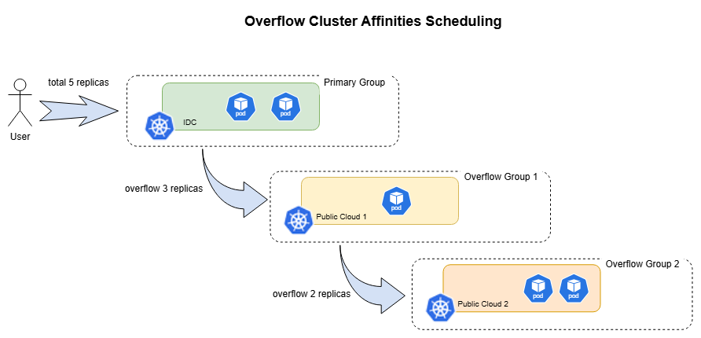

# Karmada v1.18 Released! Introducing Hybrid Cloud Overflow Scheduling Capability

Karmada is an open multi-cloud and multi-cluster container orchestration engine designed to help users deploy and operate business applications in multi-cloud environments. With its compatibility with Kubernetes native APIs, Karmada allows for the smooth migration of single-cluster workloads while maintaining synergy with the surrounding Kubernetes ecosystem toolchain.

[Karmada v1.18](https://github.com/karmada-io/karmada/releases/tag/v1.18.0) is now officially released! This version includes the following new features:

* Support for Overflow Cluster Affinity scheduling in hybrid cloud scenarios
* Introduction of the Scheduling Overcommit Protection mechanism

These updates further enhance Karmada's usability and flexibility in hybrid cloud and large-scale scheduling scenarios. We encourage you to upgrade to v1.18.0 to experience the value brought by these new capabilities.

# Feature Overview

## Support for Overflow Cluster Affinity Scheduling in Hybrid Cloud Scenarios

In hybrid cloud environments, enterprises often use on-premises data centers as their primary resource pool and public clouds as elastic supplementary resources for peak traffic. Previously, Karmada's `ClusterAffinities` supported declaring multiple candidate cluster groups, but these groups were mutually exclusive during a single scheduling process: the scheduler would eventually choose only one of them, and it could not continue to expand remaining replicas to a supplementary resource pool when the preferred resource pool's capacity was insufficient.

Karmada v1.18 introduces **Overflow Cluster Affinities** by adding an `overflowAffinities` field to `ClusterAffinityTerm` to declare supplementary cluster groups arranged by priority. The scheduler will prioritize filling the primary cluster group. Once the primary group's resources are exhausted, replicas will overflow to the supplementary cluster groups step-by-step according to the declared order, achieving a "prefer IDC, overflow to cloud when capacity is insufficient" hybrid cloud scheduling pattern.

This capability brings the following core values:

* **Progressive Overflow**: Users can declare multiple supplementary cluster groups in a single `ClusterAffinityTerm`, and the scheduler will expand the scheduling scope sequentially.
* **Reverse Contraction**: During scale-down, replicas will be reclaimed from supplementary cluster groups first, aiming to preserve stable workloads in the primary resource pool.
* **Cost Optimization**: Ensure baseline workloads run stably on more cost-effective on-premises clusters, using public cloud resources to handle sudden traffic bursts only when truly necessary.

This capability is particularly suitable for the following scenarios:

* **Elastic GPU Scheduling**: Local IDC GPU clusters carry daily inference traffic, while cloud GPU clusters are used only for peak loads.
* **Cost Control**: Keep routine business on local infrastructure and leverage public cloud elasticity to handle traffic spikes.
* **Capacity Planning**: Define resource pool usage order with clear priority relationships, reducing manual intervention.

The illustration is as follows:



Below is a simplified example that prioritizes scheduling workloads to an IDC GPU cluster and overflows to cloud GPU clusters when capacity is insufficient:

```yaml
apiVersion: policy.karmada.io/v1alpha1
kind: PropagationPolicy
metadata:
  name: gpu-inference-overflow
spec:
  resourceSelectors:
    - apiVersion: apps/v1
      kind: Deployment
  placement:
    clusterAffinities:
      - affinityName: idc-gpu
        clusterNames:
          - idc-gpu-cluster1
        overflowAffinities:
          - affinityName: cloud-gpu
            clusterNames:
              - cloud-gpu-cluster1
              - cloud-gpu-cluster2
    replicaScheduling:
      replicaSchedulingType: Divided
      replicaDivisionPreference: Weighted
      weightPreference:
        dynamicWeight: AvailableReplicas
```

For more information about this feature, please refer to: [Official Feature Documentation](https://karmada.io/docs/userguide/scheduling/propagation-policy#how-overflowaffinities-works) and [Feature Proposal](https://github.com/karmada-io/karmada/blob/master/docs/proposals/scheduling/multi-scheduling-group/overflow-affinities/README.md).

## Introduction of Scheduling Overcommit Protection Mechanism

In large-scale multi-cluster environments, while the scheduler processes scheduling requests sequentially, it relies on the cluster capacity estimation results provided by the `karmada-scheduler-estimator` to determine if a cluster has available capacity. The problem is: there is a natural time window between when the scheduler completes a replica allocation and when the new workload is actually dispatched to a member cluster, creates Pods, and binds them to nodes.

If new scheduling requests arrive within this window, the `scheduler-estimator` might still see an "old capacity snapshot," causing consecutive scheduling decisions to reuse the same un-updated idle resources, leading to resource overcommitment. The ultimate result is that the scheduling phase appears successful, but the workloads remain Pending for a long time after landing due to insufficient resources.

To solve this problem, Karmada v1.18 introduces **Scheduling Overcommit Protection**. This feature introduces an "assume and deduct" mechanism between the scheduler and the estimator:

* After completing a scheduling decision, the scheduler assumes these resources are already occupied.
* The estimator considers these "assumed occupied" resources in subsequent capacity calculations.
* This avoids subsequent scheduling from repeatedly consuming the same set of resources before the real state is updated.

This feature is especially suitable for high-throughput scheduling scenarios, significantly reducing resource overcommitment issues caused by state latency and making replica allocation results closer to the actual carrying capacity of member clusters.

This feature is currently in Alpha, disabled by default, and needs to be enabled on both `karmada-scheduler` and `karmada-scheduler-estimator`:

```shell
--feature-gates=SchedulingOvercommitProtection=true
```

Note that this feature only takes effect in scenarios with `ReplicaSchedulingType: Divided` and using capacity-aware allocation strategies, such as `Aggregated` or `DynamicWeight`. It has no impact on the `Duplicated` mode or static weight allocation scenarios.

For more information about this feature, please refer to: [Scheduling Overcommit Protection](https://karmada.io/docs/userguide/scheduling/scheduling-overcommit-protection).

# Acknowledgements to Contributors

Karmada v1.18 includes 144 code commits from 31 contributors. We would like to express our sincere gratitude to all contributors:

| ^-^              | ^-^             | ^-^                 |
|:-----------------|:----------------|:--------------------|
| @abhicodes11     | @Ady0333        | @dahuo98            |
| @Denyme24        | @faucct         | @FAUST-BENCHOU      |
| @gjbravi         | @hl8086         | @jabellard          |
| @Krishiv-Mahajan | @LivingCcj      | @manmathbh          |
| @mszacillo       | @nXtCyberNet    | @Park-Jiyeonn       |
| @qiuming520      | @RainbowMango   | @seanlaii           |
| @SujoyDutta      | @SunsetB612     | @Tej-Katika         |
| @tessapham       | @vanshiz        | @vgt-rangehrn       |
| @vie-serendipity | @Vinayak9769    | @Viscous106         |
| @warjiang        | @whitewindmills | @XiShanYongYe-Chang |
| @zhzhuang-zju    |                 |                     |


# References

[1] Karmada v1.18 Release Page: https://github.com/karmada-io/karmada/releases/tag/v1.18.0

[2] Karmada v1.18: https://github.com/karmada-io/karmada/blob/master/docs/CHANGELOG/CHANGELOG-1.18.md

[3] Overflow Cluster Affinities Feature Documentation: https://karmada.io/docs/userguide/scheduling/propagation-policy#how-overflowaffinities-works

[4] Overflow Cluster Affinities Proposal: https://github.com/karmada-io/karmada/blob/master/docs/proposals/scheduling/multi-scheduling-group/overflow-affinities/README.md

[5] Scheduling Overcommit Protection Documentation: https://karmada.io/docs/userguide/scheduling/scheduling-overcommit-protection

[6] Scheduling Overcommit Protection Proposal: https://github.com/karmada-io/karmada/blob/master/docs/proposals/scheduling/estimator-reservation/README.md
