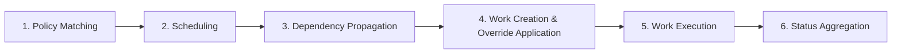

import Tabs from '@theme/Tabs';
import TabItem from '@theme/TabItem';

# Reliability Engineering Guide

Reliability is fundamental to any Karmada deployment. As a multi-cluster orchestration system, Karmada serves as the critical path for distributing workloads across member clusters.
Any degradation in Karmada's reliability directly impacts the ability to deploy, update, and manage applications across member clusters.

## Why Reliability Matters

In a multi-cluster environment, Karmada is the control plane that:

- **Orchestrates workload placement** - Determines which clusters run which workloads based on policies
- **Propagates resources** - Distributes Kubernetes manifests from the control plane to member clusters
- **Maintains consistency** - Ensures declared state matches actual state across all clusters
- **Enables scaling** - Manages resource distribution as clusters and workloads scale

A reliable Karmada control plane means:

- **Predictable deployments** - Applications deploy consistently and within expected timeframes
- **Fast failure recovery** - Issues are detected and remediated quickly
- **Operational confidence** - Teams can trust the platform to handle critical workloads
- **Reduced incidents** - Proactive monitoring prevents issues from becoming outages

## Karmada Resource Propagation Flow

Understanding how resources flow through Karmada is essential for monitoring reliability. The propagation pipeline consists of several sequential stages:




Each stage can be instrumented with metrics that feed into Service Level Objectives (SLOs) to monitor reliability at every step.

## Service Level Objectives (SLOs)

Karmada's reliability can be monitored using SLOs that map directly to the propagation flow stages. These SLOs measure both **availability** (success rate) and **latency** (response time) to catch different types of degradation.

The thresholds and objectives below are recommended starting points. Adjust them to match the reliability requirements and operational constraints of your specific environment.

### API Server SLOs

#### karmada-apiserver-availability
- **Stage**: Entry point for all operations
- **Objective**: 99.9% availability
- **Threshold**: HTTP 5xx errors and 429 (rate limiting)
- **Why it matters**: The API server is the gateway to Karmada. All user operations, controller reconciliations, and scheduling decisions flow through it. API server failures block the entire system.
- **Impact of degradation**: Users cannot create or modify resources; controllers cannot reconcile state; workload deployments and updates halt.
- **Common issues**:
  - API server pod restarts or crashes
  - Insufficient resources (CPU/memory)
  - etcd connectivity or performance issues
  - Network problems
  - Excessive request load

#### karmada-apiserver-latency
- **Stage**: Entry point for all operations
- **Objective**: 99.9% of requests complete within 400ms
- **Threshold**: 0.4 seconds
- **Why it matters**: API latency impacts user experience (kubectl responsiveness) and controller efficiency. High latency often precedes complete failures.
- **Impact of degradation**: Slow CLI operations; delayed reconciliation loops; cascading delays through the entire pipeline.
- **Common issues**:
  - etcd performance degradation
  - API server resource contention
  - Large object sizes
  - Complex admission webhook processing
  - Network latency

### Policy Application SLOs

#### policy-apply-availability
- **Stage**: 1. Policy Matching
- **Objective**: 99.9% availability
- **Threshold**: Error rate in policy evaluation
- **Why it matters**: This is the first stage of propagation. Policies define how resources are distributed. Failures here prevent resources from entering the propagation pipeline.
- **Impact of degradation**: New resources aren't scheduled; policy changes don't take effect; workloads remain unbound and never deploy.
- **Common issues**:
  - Invalid policy configurations
  - Conflicting policies
  - Policy controller errors
  - API server connectivity issues
  - Resource template selector mismatches

#### policy-apply-latency
- **Stage**: 1. Policy Matching
- **Objective**: 99.9% of operations complete within 1.024s
- **Threshold**: 1.024 seconds
- **Why it matters**: Policy evaluation latency determines how quickly new resources enter the scheduling pipeline. Complex policies can slow this stage.
- **Impact of degradation**: Delayed workload deployments; slow response to policy changes.
- **Common issues**:
  - Complex label selectors
  - Many policies to evaluate
  - Policy controller performance issues
  - API server latency

### Scheduler SLOs

#### karmada-scheduler-availability
- **Stage**: 2. Scheduling
- **Objective**: 99.9% availability
- **Threshold**: Scheduling attempt errors
- **Why it matters**: The scheduler makes multi-cluster placement decisions. It's the only mechanism for determining which clusters run which workloads.
- **Impact of degradation**: Workloads cannot be placed on clusters; resources stuck in "unscheduled" state; no rescheduling when clusters fail.
- **Common issues**:
  - No clusters match scheduling constraints (affinity/tolerations)
  - All matching clusters are NotReady
  - Insufficient cluster capacity
  - Scheduler pod issues
  - Plugin execution failures

#### karmada-scheduler-latency
- **Stage**: 2. Scheduling
- **Objective**: 99.9% of scheduling operations complete within 512ms
- **Threshold**: 0.512 seconds
- **Why it matters**: Scheduling latency directly impacts deployment speed and rescheduling responsiveness during cluster failures.
- **Impact of degradation**: Slow workload placement; delayed failure recovery; reduced system throughput.
- **Common issues**:
  - Complex scheduling plugins
  - Many clusters to evaluate
  - Slow estimator responses
  - Scheduler resource constraints

#### karmada-scheduler-estimator-availability
- **Stage**: 2. Scheduling (capacity estimation)
- **Objective**: 99.9% availability
- **Threshold**: Estimator request errors
- **Why it matters**: Estimators provide cluster capacity information for informed scheduling decisions.
- **Impact of degradation**: Scheduler lacks capacity data; suboptimal placement decisions; potential scheduling failures.
- **Common issues**:
  - Estimator pod failures
  - Network issues between scheduler and estimators
  - Member cluster API server issues
  - Calculation errors

#### karmada-scheduler-estimator-latency
- **Stage**: 2. Scheduling (capacity estimation)
- **Objective**: 99.9% of estimations complete within 128ms
- **Threshold**: 0.128 seconds
- **Why it matters**: Estimator latency contributes to overall scheduling latency.
- **Impact of degradation**: Slower scheduling decisions; reduced scheduling throughput.
- **Common issues**:
  - Member cluster API server latency
  - Complex capacity calculations
  - Network latency

### Resource Propagation SLOs

#### binding-sync-work-availability
- **Stage**: 4. Work Creation & Override Application
- **Objective**: 99.9% availability
- **Threshold**: Work creation/update errors
- **Why it matters**: This converts scheduling decisions into actionable Work objects - the contract between Karmada and member clusters.
- **Impact of degradation**: Scheduled workloads never reach member clusters; pipeline stalls; user intent doesn't materialize.
- **Common issues**:
  - Execution namespace doesn't exist
  - Binding controller errors
  - API server issues
  - RBAC permission problems
  - Override policy application failures

#### binding-sync-work-latency
- **Stage**: 4. Work Creation & Override Application
- **Objective**: 99.9% of operations complete within 1.024s
- **Threshold**: 1.024 seconds
- **Why it matters**: Determines propagation speed from scheduling to deployment preparation.
- **Impact of degradation**: Slow workload propagation; delayed updates; poor system responsiveness.
- **Common issues**:
  - Complex override policies
  - API server latency
  - Large resource manifests
  - Controller performance issues

#### work-sync-workload-availability
- **Stage**: 5. Work Execution
- **Objective**: 99.9% availability
- **Threshold**: Workload sync errors to member clusters
- **Why it matters**: This is the final deployment step where resources actually reach member clusters. Most visible failure point.
- **Impact of degradation**: Workloads don't run despite successful scheduling; applications fail to start; direct user impact.
- **Common issues**:
  - Member cluster unreachable
  - Member cluster API server errors
  - Network failures
  - Authentication/authorization issues
  - Resource conflicts in member clusters
  - Missing CRDs in member clusters

#### work-sync-workload-latency
- **Stage**: 5. Work Execution
- **Objective**: 99% of operations complete within 2.048s
- **Threshold**: 2.048 seconds
- **Why it matters**: Final step before workloads start running. Directly affects end-to-end deployment time.
- **Impact of degradation**: Slow deployments; delayed updates; poor user experience.
- **Common issues**:
  - Network latency to member clusters
  - Member cluster API server load
  - Large resource manifests
  - Member cluster admission webhook latency

### Cluster Health SLOs

#### cluster-sync-latency
- **Stage**: Continuous (parallel to propagation flow)
- **Objective**: 99.9% of operations complete within 1s
- **Threshold**: 1.0 second
- **Why it matters**: The scheduler needs current cluster status for placement decisions. Fast status sync enables quick failure detection and rescheduling.
- **Impact of degradation**: Scheduler uses stale data; failed clusters continue receiving placements; slow failure detection; delayed remediation.
- **Common issues**:
  - Member cluster API server latency
  - Network issues
  - Cluster controller performance
  - Many clusters to monitor

## SLO Alerting Framework

The **Multi-Window, Multi-Burn-Rate Alerting** framework from [Google's SRE Workbook](https://sre.google/workbook/alerting-on-slos/) is a well-proven approach for alerting on SLO violations. It provides fast detection of severe issues while avoiding alert fatigue from transient problems.

### How Multi-Window, Multi-Burn-Rate Alerts Work

Traditional alerting on raw error rates creates two problems:
- **Slow detection**: By the time an alert fires, significant error budget may be consumed
- **False positives**: Brief spikes trigger alerts even if the SLO is still met

The multi-burn-rate framework solves this by:

1. **Burn rate calculation**: Measures how fast the error budget is being consumed relative to the SLO. A burn rate of 1x means the budget is consumed at exactly the pace that exhausts it at the end of the SLO period (typically 30 days). Higher burn rates indicate faster consumption.

2. **Multiple time windows**: Each alert condition uses two windows — a long window and a short window (sized at 1/12th of the long window). The long window detects that error budget is being consumed at an unsustainable rate. The short window confirms the issue is still actively occurring, preventing alerts from firing on problems that have already resolved.

3. **Severity-based thresholds**: The framework defines four alert tiers across two severity levels, based on the rate and duration of budget consumption:

   **Page (critical):**

   | Burn Rate | Long Window | Short Window | Budget Consumed | Time to Exhaustion | Action |
   |-----------|-------------|--------------|-----------------|-------------------|--------|
   | 14.4x | 1 hour | 5 minutes | 2% | ~2 days | Immediate action required |
   | 6x | 6 hours | 30 minutes | 5% | ~5 days | Investigate and fix promptly |

   **Ticket (warning):**

   | Burn Rate | Long Window | Short Window | Budget Consumed | Time to Exhaustion | Action |
   |-----------|-------------|--------------|-----------------|-------------------|--------|
   | 3x | 1 day | 2 hours | 10% | ~10 days | Address during business hours |
   | 1x | 3 days | 6 hours | 10% | 30 days | Plan remediation before window closes |

   An alert fires only when **both** the long window and the short window exceed their burn-rate threshold simultaneously. This dual-window requirement eliminates false positives from brief spikes that have already resolved.

### Benefits of This Framework

- **Fast detection**: Critical issues trigger alerts within minutes
- **Precision**: Requires sustained degradation in both windows, not just brief spikes
- **Actionable severity**: Page-worthy alerts indicate urgent, ongoing user impact
- **Error budget awareness**: Alerts directly relate to remaining error budget
- **Low false-positive rate**: The dual-window requirement filters out transient issues

### Alert Routing

- **Availability SLOs** — Critical pages (failures block operations)
- **Latency SLOs** — Warnings only (gradual degradation, time to investigate)

## Defining SLOs and Alerts with Sloth

[Sloth](https://sloth.dev/) is an open-source tool that generates the Prometheus recording rules and multi-window, multi-burn-rate alerting rules described in the previous section from a simple, declarative SLO definition file. Instead of hand-crafting dozens of recording rules and alert expressions, you write concise SLO specs and let Sloth generate the complete, production-ready rule set.

### How Sloth Works

Sloth reads a YAML configuration file that describes your SLOs — the service, the SLI (what to measure), the objective (e.g., 99.9%), and alerting metadata. From this single config it generates:

1. **SLI recording rules** — pre-computed error-ratio windows (5m, 30m, 1h, 2h, 6h, 1d, 3d) used by alerts and dashboards
2. **Metadata recording rules** — labels that identify the SLO across all generated rules
3. **Multi-window, multi-burn-rate alert rules** — page and ticket alerts at the severity levels described in the [SLO Alerting Framework](#slo-alerting-framework) above

The workflow is:

```
sloth config (YAML)  →  sloth generate  →  Prometheus rules file (YAML)  →  load into Prometheus
```

### API Server Availability SLO — Example

The following example shows the Sloth config for the `karmada-apiserver-availability` SLO and the Prometheus rules file it produces.

> The objective (99.9%) and the error conditions (HTTP 5xx and 429) are **recommendations**. Adjust them to match the reliability requirements of your environment.

<Tabs>
  <TabItem value="config" label="Sloth Config">

```yaml
version: "prometheus/v1"
service: "karmada"

slos:
  - name: "apiserver-availability"
    objective: 99.9
    description: "Karmada API Server availability based on HTTP request success rate"
    labels:
      category: "availability"
      component: "karmada-apiserver"
    sli:
      events:
        error_query: |
          sum(
            rate(apiserver_request_total{
              code=~"(5..|429)",
              verb!~"",
              subresource!~"healthz|livez|readyz"
            }[{{.window}}])
          )
        total_query: |
          sum(
            rate(apiserver_request_total{
              verb!~"",
              subresource!~"healthz|livez|readyz"
            }[{{.window}}])
          )
    alerting:
      name: "KarmadaApiserverAvailabilityBurnRateHigh"
      page_alert:
        labels:
          severity: "critical"
        annotations:
          summary: "[KarmadaAlerts][Page] Karmada API Server Availability SLO Error Budget Burn Rate Exceeded"
          title: "[Page] {{ $labels.sloth_service }} {{ $labels.sloth_slo }} SLO error budget burn rate is too fast."
          description: |
            This SLO monitors the availability of the Karmada API Server,
            which is critical for all control plane operations.
            The API server handles all resource management requests
            including workload deployments and policy updates.

            Violations indicate that users cannot reliably interact
            with the Karmada control plane, preventing workload
            deployments and updates across member clusters.
          runbook_url: "https://karmada.io/docs/administrator/reliability/runbooks/SLO/{{ $labels.sloth_slo }}"
      ticket_alert:
        labels:
          severity: "warning"
        annotations:
          summary: "[KarmadaAlerts][Ticket] Karmada API Server Availability SLO Error Budget Burn Rate Exceeded"
          title: "[Ticket] {{ $labels.sloth_service }} {{ $labels.sloth_slo }} SLO error budget burn rate is too fast."
          description: |
            This SLO monitors the availability of the Karmada API Server,
            which is critical for all control plane operations.
            The API server handles all resource management requests
            including workload deployments and policy updates.

            Violations indicate that users cannot reliably interact
            with the Karmada control plane, preventing workload
            deployments and updates across member clusters.
          runbook_url: "https://karmada.io/docs/administrator/reliability/runbooks/SLO/{{ $labels.sloth_slo }}"
```

  </TabItem>
  <TabItem value="output" label="Generated Prometheus Rules">

```yaml

---
# Code generated by Sloth (v0.10.0): https://github.com/slok/sloth.
# DO NOT EDIT.

groups:
- name: sloth-slo-sli-recordings-karmada-apiserver-availability
  rules:
  - record: slo:sli_error:ratio_rate5m
    expr: |
      (sum(
        rate(apiserver_request_total{
          code=~"(5..|429)",
          verb!~"",
          subresource!~"healthz|livez|readyz"
        }[5m])
      )
      )
      /
      (sum(
        rate(apiserver_request_total{
          verb!~"",
          subresource!~"healthz|livez|readyz"
        }[5m])
      )
      )
    labels:
      category: availability
      component: karmada-apiserver
      sloth_id: karmada-apiserver-availability
      sloth_service: karmada
      sloth_slo: apiserver-availability
      sloth_window: 5m
  - record: slo:sli_error:ratio_rate30m
    expr: |
      (sum(
        rate(apiserver_request_total{
          code=~"(5..|429)",
          verb!~"",
          subresource!~"healthz|livez|readyz"
        }[30m])
      )
      )
      /
      (sum(
        rate(apiserver_request_total{
          verb!~"",
          subresource!~"healthz|livez|readyz"
        }[30m])
      )
      )
    labels:
      category: availability
      component: karmada-apiserver
      sloth_id: karmada-apiserver-availability
      sloth_service: karmada
      sloth_slo: apiserver-availability
      sloth_window: 30m
  - record: slo:sli_error:ratio_rate1h
    expr: |
      (sum(
        rate(apiserver_request_total{
          code=~"(5..|429)",
          verb!~"",
          subresource!~"healthz|livez|readyz"
        }[1h])
      )
      )
      /
      (sum(
        rate(apiserver_request_total{
          verb!~"",
          subresource!~"healthz|livez|readyz"
        }[1h])
      )
      )
    labels:
      category: availability
      component: karmada-apiserver
      sloth_id: karmada-apiserver-availability
      sloth_service: karmada
      sloth_slo: apiserver-availability
      sloth_window: 1h
  - record: slo:sli_error:ratio_rate2h
    expr: |
      (sum(
        rate(apiserver_request_total{
          code=~"(5..|429)",
          verb!~"",
          subresource!~"healthz|livez|readyz"
        }[2h])
      )
      )
      /
      (sum(
        rate(apiserver_request_total{
          verb!~"",
          subresource!~"healthz|livez|readyz"
        }[2h])
      )
      )
    labels:
      category: availability
      component: karmada-apiserver
      sloth_id: karmada-apiserver-availability
      sloth_service: karmada
      sloth_slo: apiserver-availability
      sloth_window: 2h
  - record: slo:sli_error:ratio_rate6h
    expr: |
      (sum(
        rate(apiserver_request_total{
          code=~"(5..|429)",
          verb!~"",
          subresource!~"healthz|livez|readyz"
        }[6h])
      )
      )
      /
      (sum(
        rate(apiserver_request_total{
          verb!~"",
          subresource!~"healthz|livez|readyz"
        }[6h])
      )
      )
    labels:
      category: availability
      component: karmada-apiserver
      sloth_id: karmada-apiserver-availability
      sloth_service: karmada
      sloth_slo: apiserver-availability
      sloth_window: 6h
  - record: slo:sli_error:ratio_rate1d
    expr: |
      (sum(
        rate(apiserver_request_total{
          code=~"(5..|429)",
          verb!~"",
          subresource!~"healthz|livez|readyz"
        }[1d])
      )
      )
      /
      (sum(
        rate(apiserver_request_total{
          verb!~"",
          subresource!~"healthz|livez|readyz"
        }[1d])
      )
      )
    labels:
      category: availability
      component: karmada-apiserver
      sloth_id: karmada-apiserver-availability
      sloth_service: karmada
      sloth_slo: apiserver-availability
      sloth_window: 1d
  - record: slo:sli_error:ratio_rate3d
    expr: |
      (sum(
        rate(apiserver_request_total{
          code=~"(5..|429)",
          verb!~"",
          subresource!~"healthz|livez|readyz"
        }[3d])
      )
      )
      /
      (sum(
        rate(apiserver_request_total{
          verb!~"",
          subresource!~"healthz|livez|readyz"
        }[3d])
      )
      )
    labels:
      category: availability
      component: karmada-apiserver
      sloth_id: karmada-apiserver-availability
      sloth_service: karmada
      sloth_slo: apiserver-availability
      sloth_window: 3d
  - record: slo:sli_error:ratio_rate30d
    expr: |
      sum_over_time(slo:sli_error:ratio_rate5m{sloth_id="karmada-apiserver-availability", sloth_service="karmada", sloth_slo="apiserver-availability"}[30d])
      / ignoring (sloth_window)
      count_over_time(slo:sli_error:ratio_rate5m{sloth_id="karmada-apiserver-availability", sloth_service="karmada", sloth_slo="apiserver-availability"}[30d])
    labels:
      sloth_window: 30d
- name: sloth-slo-meta-recordings-karmada-apiserver-availability
  rules:
  - record: slo:objective:ratio
    expr: vector(0.9990000000000001)
    labels:
      category: availability
      component: karmada-apiserver
      sloth_id: karmada-apiserver-availability
      sloth_service: karmada
      sloth_slo: apiserver-availability
  - record: slo:error_budget:ratio
    expr: vector(1-0.9990000000000001)
    labels:
      category: availability
      component: karmada-apiserver
      sloth_id: karmada-apiserver-availability
      sloth_service: karmada
      sloth_slo: apiserver-availability
  - record: slo:time_period:days
    expr: vector(30)
    labels:
      category: availability
      component: karmada-apiserver
      sloth_id: karmada-apiserver-availability
      sloth_service: karmada
      sloth_slo: apiserver-availability
  - record: slo:current_burn_rate:ratio
    expr: |
      slo:sli_error:ratio_rate5m{sloth_id="karmada-apiserver-availability", sloth_service="karmada", sloth_slo="apiserver-availability"}
      / on(sloth_id, sloth_slo, sloth_service) group_left
      slo:error_budget:ratio{sloth_id="karmada-apiserver-availability", sloth_service="karmada", sloth_slo="apiserver-availability"}
    labels:
      category: availability
      component: karmada-apiserver
      sloth_id: karmada-apiserver-availability
      sloth_service: karmada
      sloth_slo: apiserver-availability
  - record: slo:period_burn_rate:ratio
    expr: |
      slo:sli_error:ratio_rate30d{sloth_id="karmada-apiserver-availability", sloth_service="karmada", sloth_slo="apiserver-availability"}
      / on(sloth_id, sloth_slo, sloth_service) group_left
      slo:error_budget:ratio{sloth_id="karmada-apiserver-availability", sloth_service="karmada", sloth_slo="apiserver-availability"}
    labels:
      category: availability
      component: karmada-apiserver
      sloth_id: karmada-apiserver-availability
      sloth_service: karmada
      sloth_slo: apiserver-availability
  - record: slo:period_error_budget_remaining:ratio
    expr: 1 - slo:period_burn_rate:ratio{sloth_id="karmada-apiserver-availability",
      sloth_service="karmada", sloth_slo="apiserver-availability"}
    labels:
      category: availability
      component: karmada-apiserver
      sloth_id: karmada-apiserver-availability
      sloth_service: karmada
      sloth_slo: apiserver-availability
  - record: sloth_slo_info
    expr: vector(1)
    labels:
      category: availability
      component: karmada-apiserver
      sloth_id: karmada-apiserver-availability
      sloth_mode: cli-gen-prom
      sloth_objective: "99.9"
      sloth_service: karmada
      sloth_slo: apiserver-availability
      sloth_spec: prometheus/v1
      sloth_version: v0.10.0
- name: sloth-slo-alerts-karmada-apiserver-availability
  rules:
  - alert: KarmadaApiserverAvailabilityBurnRateHigh
    expr: |
      (
          (slo:sli_error:ratio_rate5m{sloth_id="karmada-apiserver-availability", sloth_service="karmada", sloth_slo="apiserver-availability"} > (14.4 * 0.0009999999999999432))
          and ignoring (sloth_window)
          (slo:sli_error:ratio_rate1h{sloth_id="karmada-apiserver-availability", sloth_service="karmada", sloth_slo="apiserver-availability"} > (14.4 * 0.0009999999999999432))
      )
      or ignoring (sloth_window)
      (
          (slo:sli_error:ratio_rate30m{sloth_id="karmada-apiserver-availability", sloth_service="karmada", sloth_slo="apiserver-availability"} > (6 * 0.0009999999999999432))
          and ignoring (sloth_window)
          (slo:sli_error:ratio_rate6h{sloth_id="karmada-apiserver-availability", sloth_service="karmada", sloth_slo="apiserver-availability"} > (6 * 0.0009999999999999432))
      )
    labels:
      severity: critical
      sloth_severity: page
    annotations:
      description: |
        This SLO monitors the availability of the Karmada API Server,
        which is critical for all control plane operations.
        The API server handles all resource management requests
        including workload deployments and policy updates.

        Violations indicate that users cannot reliably interact
        with the Karmada control plane, preventing workload
        deployments and updates across member clusters.
      runbook_url: https://karmada.io/docs/administrator/reliability/runbooks/SLO/{{ $labels.sloth_slo }}
      summary: '[KarmadaAlerts][Page] Karmada API Server Availability SLO Error Budget
        Burn Rate Exceeded'
      title: '[Page] {{ $labels.sloth_service }} {{ $labels.sloth_slo }} SLO error
        budget burn rate is too fast.'
  - alert: KarmadaApiserverAvailabilityBurnRateHigh
    expr: |
      (
          (slo:sli_error:ratio_rate2h{sloth_id="karmada-apiserver-availability", sloth_service="karmada", sloth_slo="apiserver-availability"} > (3 * 0.0009999999999999432))
          and ignoring (sloth_window)
          (slo:sli_error:ratio_rate1d{sloth_id="karmada-apiserver-availability", sloth_service="karmada", sloth_slo="apiserver-availability"} > (3 * 0.0009999999999999432))
      )
      or ignoring (sloth_window)
      (
          (slo:sli_error:ratio_rate6h{sloth_id="karmada-apiserver-availability", sloth_service="karmada", sloth_slo="apiserver-availability"} > (1 * 0.0009999999999999432))
          and ignoring (sloth_window)
          (slo:sli_error:ratio_rate3d{sloth_id="karmada-apiserver-availability", sloth_service="karmada", sloth_slo="apiserver-availability"} > (1 * 0.0009999999999999432))
      )
    labels:
      severity: warning
      sloth_severity: ticket
    annotations:
      description: |
        This SLO monitors the availability of the Karmada API Server,
        which is critical for all control plane operations.
        The API server handles all resource management requests
        including workload deployments and policy updates.

        Violations indicate that users cannot reliably interact
        with the Karmada control plane, preventing workload
        deployments and updates across member clusters.
      runbook_url: https://karmada.io/docs/administrator/reliability/runbooks/SLO/{{ $labels.sloth_slo }}
      summary: '[KarmadaAlerts][Ticket] Karmada API Server Availability SLO Error
        Budget Burn Rate Exceeded'
      title: '[Ticket] {{ $labels.sloth_service }} {{ $labels.sloth_slo }} SLO error
        budget burn rate is too fast.'

```

  </TabItem>
</Tabs>

### Loading Generated Rules into Prometheus

After running `sloth generate` to produce the Prometheus rules file, load it into your Prometheus server using one of the following methods.

#### Option 1: Static Rule File

Use this approach when Prometheus is running directly on a server (e.g., via a binary or systemd service) and you manage rule files on disk.

1. **Generate the rules** directly into the Prometheus rules directory:

   ```bash
   sloth generate -i karmada-slo-config.yaml -o /etc/prometheus/rules/karmada-slo-rules.yaml
   ```

2. **Validate the rules** before reloading:

   ```bash
   promtool check rules /etc/prometheus/rules/karmada-slo-rules.yaml
   ```

3. **Reload Prometheus** to pick up the new rules (no restart required):

   ```bash
   curl -X POST http://localhost:9090/-/reload
   ```

   > Prometheus must be started with the `--web.enable-lifecycle` flag for the reload endpoint to work.

4. **Verify the rules are loaded** by querying for one of the SLI recording rules:

   ```bash
   curl -s 'http://localhost:9090/api/v1/query?query=slo:sli_error:ratio_rate5m' | jq '.data.result | length'
   ```

#### Option 2: PrometheusRule (kube-prometheus-stack)

Use this approach when running the [kube-prometheus-stack](https://github.com/prometheus-community/helm-charts/tree/main/charts/kube-prometheus-stack) Helm chart. The Prometheus Operator watches for `PrometheusRule` custom resources and automatically loads them into Prometheus.

1. **Generate the rules file**:

   ```bash
   sloth generate -i karmada-slo-config.yaml -o karmada-slo-rules.yaml
   ```

2. **Create a `PrometheusRule` manifest**. Extract the `groups` array from the generated file and embed it in the resource:

   ```yaml
   apiVersion: monitoring.coreos.com/v1
   kind: PrometheusRule
   metadata:
     name: karmada-slo-rules
     namespace: monitoring
     labels:
       # This label must match the Prometheus Operator's ruleSelector.
       # The default for kube-prometheus-stack is "release: <helm-release-name>".
       release: kube-prometheus-stack
   spec:
     groups:
       # Paste the contents of the generated rules file here,
       # or use a tool like yq to inline them:
       #   yq '.groups' karmada-slo-rules.yaml
   ```

3. **Apply the manifest**:

   ```bash
   kubectl apply -f karmada-slo-prometheusrule.yaml
   ```

4. **Verify the rules are loaded**. The Prometheus Operator reconciles `PrometheusRule` resources automatically. Confirm by querying Prometheus:

   ```bash
   kubectl port-forward -n monitoring svc/kube-prometheus-stack-prometheus 9090:9090 &
   curl -s 'http://localhost:9090/api/v1/query?query=slo:sli_error:ratio_rate5m' | jq '.data.result | length'
   ```

### Grafana Dashboards

Sloth provides two ready-to-use [Grafana dashboards](https://sloth.dev/introduction/ui/#grafana-dashboards) that visualize the SLI and error budget data produced by the recording rules above. Import them into your Grafana instance after loading the Prometheus rules.

| Dashboard | Grafana ID | Description |
|-----------|------------|-------------|
| [SLO Details](https://grafana.com/grafana/dashboards/14348) | 14348 | Per-SLO drill-down: SLI values, burn rates, error budget remaining, monthly burndown, and alert state |
| [SLO Overview](https://grafana.com/grafana/dashboards/14643) | 14643 | Fleet-wide view: total SLO count, average burn rates, active alerts, and budget consumption trends |

### Karmada SLO Configuration

We provide a complete Sloth configuration covering all Karmada SLOs described in this guide. Download it, review the objectives and thresholds, adjust them for your environment, and then generate your Prometheus rules.

> **Note**: All SLO objectives and thresholds in the config file are **recommendations**. Each SLO's `description` field explains what the threshold represents and why. Adjust any of them to match your operational requirements.

<a href="/sloth/karmada-slo-config.yaml" download>📥 Download SLO Config</a>

**Generate rules with Sloth:**

```bash
# Install Sloth (see https://sloth.dev/introduction/install/)
sloth generate -i karmada-slo-config.yaml -o karmada-slo-rules.yaml
```

Then load `karmada-slo-rules.yaml` into Prometheus using the steps above.

### SLO Runbooks

Each SLO has a dedicated runbook that covers what the SLO measures, why it matters, investigation steps, and remediation actions for when an alert fires.

→ **[View all SLO Runbooks](./runbooks/SLO/index.md)**

## Operational Best Practices

### Monitoring SLO Health

1. **Check burn rate trends**: Is error budget consumption accelerating?
2. **Compare across SLOs**: Are multiple stages degraded (cascading failure)?
3. **Correlate with changes**: Did recent deployments or configuration changes impact reliability?
4. **Review error budget**: How much budget remains this month?

### Responding to SLO Violations

When an SLO alert fires:

1. **Assess impact**: Is this affecting production workloads?
2. **Check related SLOs**: Is it a cascading failure through the pipeline?
3. **Review recent changes**: Deployments, configuration changes, policy updates
4. **Investigate root cause**: Logs, metrics, events
5. **Document findings**: Capture new insights for future reference

### Error Budget Policy

Error budget policy defines how the team responds as the error budget is consumed:

- **>50% budget remaining**: Normal operations, continuous improvement
- **25-50% budget remaining**: Increase monitoring, defer risky changes
- **10-25% budget remaining**: Freeze non-critical changes, focus on reliability
- **&lt;10% budget remaining**: Emergency response, all hands on stability

## Further Reading

- [Alerting on SLOs](https://sre.google/workbook/alerting-on-slos/) - Multi-Window, Multi-Burn-Rate alerting framework (Google SRE Workbook)
- [Sloth](https://sloth.dev/) - SLO generator for Prometheus
- [SLO Runbooks](./runbooks/SLO/index.md) - Investigation and remediation guides for each Karmada SLO
