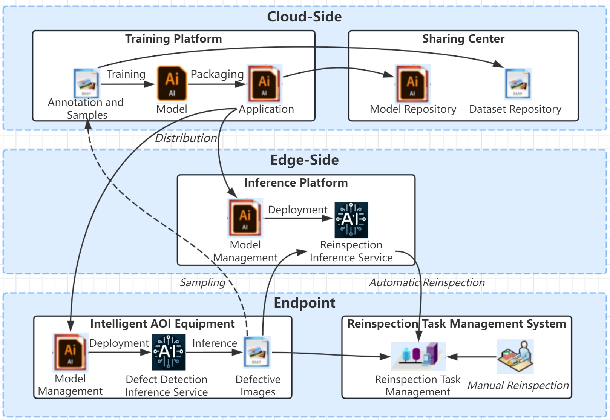

## 行业背景

在液晶面板生产领域，由于多种因素，产品常出现不良品。为此，关键工艺节点后引入了自动光学检测（AOI）设备，通过光学原理检测常见缺陷。然而，现有 AOI 设备仅识别缺陷有无，需要人工分类和识
别假缺陷，这一过程耗时且影响生产效率。[BOE 集团](https://www.boe.com/)引入自动缺陷分类系统（ADC）以提高判定准确性并减轻劳动强度，使用深度学习技术自动分类 AOI
输出的缺陷图片，并筛除误判，从而提高生产效率。

BOE 率先在一个工厂引入 ADC，后续在其他工厂推广，节省人力资源，提高判定效率。尽管如此，由于工艺复杂和供应商差异，现场建设呈现出割裂和分散管理的趋势，给数据共享和运维带来困难。为解
决这些问题，BOE 启动了工业智能检测平台（I3Plat）的建设，该平台利用人工智能技术，标准化智能检测并提高生产效率和良率。


I3Plat 将 ADC 作为核心，扩展至模型训练和检测复判，实现“云”（管理+训练）+“边”（推理）+“端”（业务）的一体化方案，旨在通过标准化平台提高生产质量和数据价值。建设范围包括资源共享中心、现地
训练和边侧推理等子平台，将在若干工厂实施。



项目目标是实现现地 ADC 上线、资源共享和云边端标准化，以减轻运维负荷、提升标准。I3Plat 旨在通过规范化和标准化 BOE 集团的 ADC 系统，为后续 ADC 建设提供样本和模板，降低成本和周期，提高生
产和质检效率以及产品良率。包含系统管理员、资源配置员等用户角色，并涉及 ADC 推理、模型训练、数据共享等信息流，以及云端协同功能，确保 ADC 的自动缺陷分类生产过程，并提高模型和缺陷图片的
利用率。

## 产品与技术实现

### 一、集群管理

不同现地可将对应的 K8s 集群注册至中心云系统，中心云系统对多个现地的集群进行管理。


我们选择了 PULL 模式。

为了降低 OP 的操作成本，我们在中心云提供了 step-by-step 的注册流程。

1. 引导安装 karmada-agent。
2. 使用 karmadactl token create 控制面生成 token。
3. 引导注册 karmadactl register 。
4. 在成员集群中编辑由 karmadactl register 创建的 deploy/karmada-agent 以确保其可以访问该成员集群的 kube-apiserver。

### 二、使用聚合层 API

通过 karmada-aggregator 组件提供的集群统一访问能力，我们可以在中心云实现可视化大屏等需要聚合成员集群的数据的功能。

通常我们用 Service 来暴露 Java 实现的功能，并用 Java Fabric8 等客户端调用 kubectl get --raw 来实现调用：

```
/apis/cluster.karmada.io/v1alpha1/clusters/%s/proxy/api/v1/namespaces/%s/services/%s/proxy/%s
```

#### 1、集群监控

针对在线的集群，中心云系统可对内存、CPU、磁盘、网络流入流出速率、GPU、日志等指标进行监控数据展示，并可切换集群进行数据查看。


中心云可以看到和训练云相同的监控，通过 Karmada 聚合层 API 由集群的 Java 程序对 PromQL 封装后提供给前端页面，以下是一个 Java 查询节点 CPU 利用率的示例：

```
/apis/cluster.karmada.io/v1alpha1/clusters/%s/proxy/api/v1/namespaces/%s/services/%s/proxy/api/v1/query_range?query=node:node_cpu_utilization:avg1m{node='%s'}&start=%s&end=%s&step=%s
```

#### 2、中心云数据下发

用户在中心云上传的数据，可自由选择下发至指定现地，包括数据集、标注、算子工程、算子镜像以及模型等。


数据集、算子工程、模型，通常是文件，在完成传输后，会保存到本地或NAS等存储中。标注，通常是结构化数据，在完成传输后，会保存到 DB 中。算子镜像，一般导出为 tar 包，在完成传输后，会推送到当前集群的 harbor 中。
中心云除了 Karmada 的控制面以外，也带有自己的业务 K8s 集群，也包括存储，因此可以作为一个中转器。以上均通过 Karmada 的聚合层 API 来调用我们提供的文件上传等 svc。实现了集群和集群之间的调用。

#### 3、跨现地训练

针对某现地训练资源不足的情况下，可通过申请其他现地资源的方式，进行跨现地训练。该功能实现方式为将 A 现地训练所需要的数据集、标注、算子工程、算子镜像等数据发送至 B 现地，通过 B 现地的资源进行训练。再将训练好的模型返回给 A 现地。


原理和中心云数据下发类似，任务所需的数据会直接发送到对应集群，体现了成员集群和成员集群之间的调用关系。

#### 4、可视化大屏

根据中心云注册的现地，统计不同现地的各类指标数据进行大屏展示。


通过 Karmada 聚合层 API，我们在这类大屏中展示实时数据的时候，可以方便地直接调用成员集群的 svc。而无需让所有的数据显示都走大数据的离线分析、实时分析。提供更高的时效性。

## 项目管理

本项目的团队由我司经验丰富的训练平台产品经理，以及专业的研发工程师和测试工程师 14 名组成。团队从 2023 年 4 月开始工作，直至 2023 年 12 月完成了开发和部署工作。尽管项目在进程中经历了三个大的里程碑，每个阶段都充满了挑战，但团队的每一个成员都坚持不懈，积极应对，展现了我们团队的战斗力、凝聚力和专业能力。

考虑到训练平台的用户主要是算法工程师和产线业务人员，他们的使用习惯和知识背景存在显著差异，因此产品经理进行了深入的市场研究和讨论，最终设计出一款既能满足算法工程师的灵活性需求，又能满足产线业务人员追求高效、简洁的系统。

为了确保项目的范围、进度、质量和成本可控，我们在关键阶段举行了包括产品设计、开发、测试和部署评审等会议，并定期召开项目会议以及客户沟通会议。系统部署后，我们积极获取用户反馈，解决问题并持续优化系统以满足客户需求。
