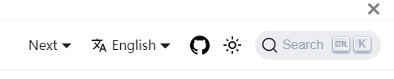

## Before You Get Started

Before you start contributing, it is recommended to familiarize yourself with the Karmada project and its architecture. You can check out the [official documentation](https://karmada.io/docs/) to learn more about Karmada.

Starting from version 1.3, the community documentation will be available on the Karmada website.
This document explains how to contribute docs to
the `karmada-io/website` repository.

## Prerequisites

- Docs, like codes, are also categorized and stored by version.
  1.3 is the first version we have archived.
- Docs need to be translated into multiple languages for readers from different regions.
  The community now supports both Chinese and English.
  English is the official language of documentation.
- For our docs we use markdown. If you are unfamiliar with Markdown, please see https://guides.github.com/features/mastering-markdown/ or https://www.markdownguide.org/ if you are looking for something more substantial. 
- We get some additions through [Docusaurus 2](https://docusaurus.io/), a model static website generator.


## How to Contribute

If you want to contribute to Karmada, you can follow these steps:

1. Check the [issue tracker](https://github.com/karmada-io/karmada/issues) for any open issues related to the feature or bug you want to work on. If there isn't an issue for it, feel free to create one.

2. Assign yourself to the issue you want to work on.

3. Fork the repository.

4. Create a new branch with a descriptive name for the issue you are working on.

5. Write your code/chnages and commit your changes.

6. Create a pull request (PR) from your branch to the master branch of the main repository.

7. Wait for your PR to be reviewed and approved by the maintainers.

8. Once your PR is merged, your changes will be included in the next release of Karmada!

## Setup

You can set up your local environment by cloning our website repository.

```shell
git clone https://github.com/karmada-io/website.git
cd website
```

Our website is organized like below:

```
website
├── sidebars.json        # sidebar for the current docs version
├── docs                 # docs directory for the current docs version
│   ├── foo
│   │   └── bar.md       # https://mysite.com/docs/next/foo/bar
│   └── hello.md         # https://mysite.com/docs/next/hello
├── versions.json        # file to indicate what versions are available
├── versioned_docs
│   ├── version-1.1.0
│   │   ├── foo
│   │   │   └── bar.md   # https://mysite.com/docs/foo/bar
│   │   └── hello.md
│   └── version-1.0.0
│       ├── foo
│       │   └── bar.md   # https://mysite.com/docs/1.0.0/foo/bar
│       └── hello.md
├── versioned_sidebars
│   ├── version-1.1.0-sidebars.json
│   └── version-1.0.0-sidebars.json
├── docusaurus.config.js
└── package.json
```

The `versions.json` file is a list of versions, from the latest to earliest.
The table below explains how a versioned file maps to its version and the generated URL.

| Path                                    | Version        | URL               |
| --------------------------------------- | -------------- | ----------------- |
| `versioned_docs/version-1.0.0/hello.md` | 1.0.0          | /docs/1.0.0/hello |
| `versioned_docs/version-1.1.0/hello.md` | 1.1.0 (latest) | /docs/hello       |
| `docs/hello.md`                         | current        | /docs/next/hello  |

:::tip

The files in the `docs` directory belong to the `current` docs version.

The `current` docs version is labeled as `Next` and hosted under `/docs/next/*`.

Contributors mainly contribute documentation to the current version.
:::

## Writing docs

### Starting a title at the top

It's important for your article to specify metadata concerning an article at the top of the Markdown file, in a section called **Front Matter**.

For now, let's take a look at a quick example which should explain the most relevant entries in **Front Matter**:

```
---
title: A doc with tags
---

## secondary title
```

The top section between two lines of --- is the Front Matter section. Here we define a couple of entries which tell Docusaurus how to handle the article:
* Title is the equivalent of the `<h1>` in a HTML document or `# <title>` in a Markdown article.
* Each document has a unique ID. By default, a document ID is the name of the document (without the extension) related to the root docs directory.

### Linking to other docs

You can easily route to other places by adding any of the following links:
* Absolute URLs to external sites like `https://github.com` or `https://k8s.io` - you can use any of the Markdown notations for this, so
  * `<https://github.com>` or
  * `[kubernetes](https://k8s.io)` will work.
* Link to markdown files or the resulting path.
  You can use relative paths to index the corresponding files.
* Link to pictures or other resources.
  If your article contains images or other resources, you may create a corresponding directory in `/docs/resources`, and article related files are placed in that directory.
  Now we store public pictures about Karmada in `/docs/resources/general`. You can use the following to link the pictures:
  * ``

### Directory organization 

Docusaurus 2 uses a sidebar to manage documents. 

Creating a sidebar is useful to:
* Group multiple related documents
* Display a sidebar on each of those documents
* Provide paginated navigation, with next/previous button

For our docs, you can know how our documents are organized from <https://github.com/karmada-io/website/blob/main/sidebars.js>.

```
module.exports = {
    docs: [
        {
            type: "category",
            label: "Core Concepts",
            collapsed: false,
            items: [
                "core-concepts/introduction",
                "core-concepts/concepts",
                "core-concepts/architecture",
            ],
        },
        {
            type: "doc",
            id: "key-features/features",
        },
        {
            type: "category",
            label: "Get Started",
            items: [
                "get-started/nginx-example"
            ],
        },
....
```

The order of documents in a directory is strictly in the order of items.
```
type: "category",
label: "Core Concepts",
collapsed: false,
items: [
  "core-concepts/introduction",
  "core-concepts/concepts",
  "core-concepts/architecture",
],
```

If you add a document, you must add it to `sidebars.js` to make it display properly. If you're not sure where your docs are located, you can ask community members in the PR.

### About Chinese docs

If you want to contribute to our Chinese documentation, you can:
* Translate our existing English docs to Chinese. In this case, you need to modify the corresponding file content from <https://github.com/karmada-io/website/tree/main/i18n/zh/docusaurus-plugin-content-docs/current>. 
  The organization of this directory is exactly the same as the outer layer. `current.json` holds translations for the documentation directory. You can edit it if you want to translate the name of directory.
* Submit Chinese docs without the English version. No limits on the topic or category. In this case, you can add an empty article and its title to the main directory first, and complete the rest later.
  Then add the corresponding Chinese content to the Chinese directory.

## Debugging docs

Now you have already completed docs. After you start a PR to `karmada.io/website`, if you have passed CI, you can get a preview of your document on the website.

Click **Details** marked in red, and you will enter the preview view of the website.


Click **Next** and you can see the corresponding changes. If you have changes related to the Chinese version, click the language drop-down box next to it to switch to Chinese.



If the previewed page is not what you expected, please check your docs again.

## FAQ

### Versioning

For the newly supplemented documents of each version, we will synchronize to the latest version on the release date of each version, and the documents of the old version will not be modified.
For errata found in the documentation, we will fix it with every release.