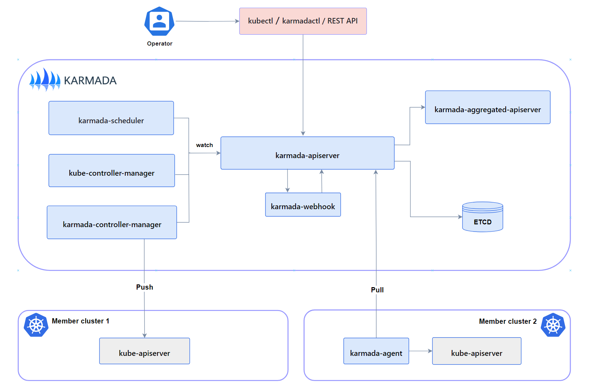

This document provides an overview of the components required for a fully functional and operational Karmada setup.

## Control Plane Components

A complete and working Karmada control plane consists of the following components. 
The `karmada-agent` might be optional, that depends on 
[Cluster Registration Mode](../userguide/clustermanager/cluster-registration).

### karmada-apiserver

The API server is a component of the Karmada control plane that exposes the Karmada API in addition to the Kubernetes API. 
The API server is the front end of the Karmada control plane.

Karmada API server directly uses the implementation of `kube-apiserver` from Kubernetes, which is the reason why Karmada 
is naturally compatible with Kubernetes API. That makes integration with the Kubernetes ecosystem very simple for Karmada, 
such as allowing users to use `kubectl` to operate Karmada, 
[integrating with ArgoCD](../userguide/cicd/working-with-argocd), 
[integrating with Flux](../userguide/cicd/working-with-flux) and so on.

### karmada-aggregated-apiserver

The aggregate API server is an extended API server implemented using
[Kubernetes API Aggregation Layer](https://kubernetes.io/docs/concepts/extend-kubernetes/api-extension/apiserver-aggregation/) technology.
It offers [Cluster API](https://github.com/karmada-io/karmada/blob/master/pkg/apis/cluster/types.go)
and related sub-resources, such as `cluster/status` and `cluster/proxy`, it implements advanced capabilities like
[Aggregated Kubernetes API](../userguide/globalview/aggregated-api-endpoint)
which can be used to access member clusters through karmada-apiserver.

### kube-controller-manager

The kube-controller-manager is composed of a bunch of controllers.
Karmada just inherits some controllers from the official image of Kubernetes to keep a consistent user experience and behavior.

It's worth noting that not all controllers are needed by Karmada, for the recommended controllers please refer to
[Recommended Controllers](../administrator/configuration/configure-controllers#required-controllers).

> Note: When users submit Deployment or other Kubernetes standard resources to the karmada-apiserver,
> they are solely recorded in the etcd of the Karmada control plane. Subsequently, these resources are
> synchronized with the member cluster. However, these Deployment resources
> do not undergo reconciliation processes (such as pod creation) in the Karmada control plane cluster.

### karmada-controller-manager

The karmada-controller-manager runs various custom controller processes.

The controllers watch Karmada objects and then talk to the underlying clusters' API servers to create regular Kubernetes resources.

The controllers are listed at [Karmada Controllers](../administrator/configuration/configure-controllers.md/#karmada-controllers).

### karmada-scheduler

The karmada-scheduler is responsible for scheduling k8s native API resource objects (including CRD resources) to member clusters.

The scheduler determines which clusters are valid placements for each resource in the scheduling queue according to constraints and available resources.
The scheduler then ranks each valid cluster and binds the resource to the most suitable cluster.

### karmada-webhook

karmada-webhooks are HTTP callbacks that receive Karmada/Kubernetes API requests and do something with them.
You can define two types of karmada-webhook, validating webhook and mutating webhook.

Mutating webhooks are invoked first, and can modify objects sent to the karmada-apiserver to enforce custom defaults.
After all object modifications are complete, and after the incoming object is validated by the karmada-apiserver,
validating webhooks are invoked and can reject requests to enforce custom policies.

> Note: Webhooks that need to guarantee they see the final state of the object in order to enforce policy should use a validating webhook,
> since objects can be modified after being seen by mutating webhooks.

### etcd

Consistent and highly-available key value store used as Karmada' backing store for all Karmada/Kubernetes API objects.

If your Karmada uses etcd as its backing store, make sure you have a back up plan for the data.

You can find in-depth information about etcd in the official [documentation](https://etcd.io/docs/).

### karmada-agent

Karmada has two [Cluster Registration Mode](../userguide/clustermanager/cluster-registration) such as Push and Pull,
karmada-agent shall be deployed on each Pull mode member cluster.
It can register a specific cluster to the Karmada control plane and sync manifests from the Karmada control plane to the member cluster.
In addition, it also syncs the status of member cluster and manifests to the Karmada control plane.

## Addons

### karmada-scheduler-estimator

The karmada-scheduler-estimator runs an accurate scheduler estimator of a cluster. 
It provides the scheduler with more accurate cluster resource information.

> Note: Early karmada-scheduler only supported scheduling the number of replicas based on the total number of cluster resources.
> In this case, scheduling failure occurred when the total cluster resources were sufficient but each node resources were insufficient.
> To address this issue, the estimator component was introduced, which calculates the number of callable replicas for
> each node based on resource requests, thereby calculating the true number of schedulable replicas for a cluster.

### karmada-descheduler

This component is responsible for detecting all replicas at regular intervals (two minutes by default),
and triggering reschedule based on instance state changes in member clusters.

The descheduler only takes effect when the scheduling strategy is dynamic division
and it perceives how many instance state has changed by calling scheduler-estimator.

### karmada-search

The karmada-search starts an aggregated server. It provides capabilities such as global search and resource proxy in a multi-cloud environment.

The ability of [global search](../tutorials/karmada-search/) is to cache resource objects and events across multiple clusters,
and to provide graphical retrieval services externally through search APIs.

The ability of [resource proxy](../userguide/globalview/proxy-global-resource/) allows users to access 
all the resources both in karmada controller panel and member clusters.

## CLI tools

### karmadactl

Karmada provides a command line tool, `karmadactl`, for communicating with Karmada's control plane, using the Karmada API.

You can use `karmadactl` to perform join/unjoin of a member cluster, mark/unmark a member cluster as non schedulable and so on.
For more information including a complete list of `karmadactl` operations, see the 
[karmadactl](../reference/karmadactl/karmadactl-commands/karmadactl).

### kubectl karmada

kubectl karmada provides capabilities in the form of kubectl plugins, yet its realization is exactly the same as `karmadactl`.
