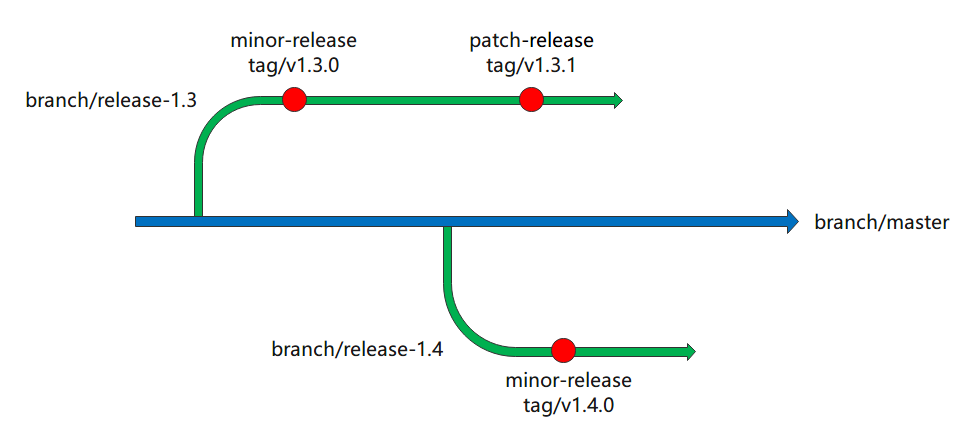

Karmada release could be minor release or patch release. For example, `v1.3.0` is a minor release, and `v1.3.1` is a patch release. Minor release indicates addition of functionality in a backwards-compatible manner, and patch release indicates backwards-compatible bug fixes.  
 The relationship between release, tag, and branch is as follows:


For different release types, the procedure is different.

## Minor release
The minor version should be released from corresponding minor release branch. The release procedure is described as follows.

### Create release branch(manually)
Ensure the necessary PRs are merged, and then create the minor release branch from master branch. The minor release branch name should follow `release-{major}.{minor}`, for example, `release-1.4`.  

### Prepare release-note(manually)
Every release requires a well-formed release note. The release note should follow the format:
```md
# What's New
The highlighted updates, for example, new key features. This part is collected manually.

# Other Notable Changes
## API Changes
* API changes, such as API version changes. This part is collected manually.

## Bug Fixes
* Bug fixes. This part is collected manually.

## Features & Enhancements
* New features and enhancements. This part is collected manually.

## Security
* Security fixes. This part is collected manually.

## Other
### Dependencies
* Dependency changes, such as golang version updates. This part is collected manually.

### Instrumentation
* Observability-related changes. For example, metric adding/event recording.
```
Compare the newly created minor release branch with the previous minor release tag, for example, compare `release-1.4` branch with `v1.3.0` tag, to get all relevant changes. Then extract the preceding types of release notes from these changes. For example, extract [this](https://github.com/karmada-io/karmada/pull/2675) as:
```md
## Bug Fixes
* `karmada-controller-manager`: Fixed the panic when cluster ImpersonatorSecretRef is nil.
```

### Commit release-notes(manually)
After the release note is ready, commit it to `docs/CHANGELOG/CHANGELOG-{major}.{minor}.md` of the minor release branch.

### Prepare contributor-list(manually)
List the contributors in each release. Compare the newly created minor release branch with the previous minor release tag, for example, compare `release-1.4` branch with `v1.3.0` tag, to get contributors' Github IDs. The list should be in alphabetical order, like:
```md
## Contributors
Thank you to everyone who contributed to this release!

Users whose commits are in this release (alphabetically by username)
@a
@B
@c
@D
...
```

### Update manifest(manually)
When installing `Karmada`, the images needed to be pulled from DockerHub/SWR, so we should update manifests with image tags of the new version in the minor release branch. The following files need to be updated:
* `charts/karmada/values.yaml`: Update `Karmada` related image tag with the new version.
* `charts/index.yaml`: Add helm repository index.

### Add upgrading docs(manually)
When releasing a new minor version, the upgrading docs `docs/administrator/upgrading/v{major}.{minor_previous}-v{major}.{minor_new}.md` needs to be added to [website](https://github.com/karmada-io/website) repository, for example, adding `docs/administrator/upgrading/v1.3-v1.4.md` when releasing `v1.4.0`.

### Create release(manually)
Now, all prepared, let's create a release on the release page.  
* Create a new minor release tag, the tag name format should follow `v{major}.{minor}.{patch}`, for example, `v1.4.0`. 
* The target branch is the newly created minor release branch.
* The content of `Describe this release` should be the combination of the chapter `Prepare release-notes` and the chapter `Prepare contributor-list`.


### Attach asserts(automatically)
After the release is published, GitHub will run workflow `.github/workflows/release.yml` to build `karmadactl` and `kubectl-karmada` and attach them to the newly published release.


### Build/Push images(automatically)
After the release is published, GitHub will run `.github/workflows/swr-released-image.yml` and `.github/workflows/dockerhub-released-image.yml` to build all `Karmada` components' images and push them to DockerHub/SWR.

### Verifying release(manually)
After all the workflows have been finished, we should perform manual checks to see if the release came out correctly:
 * Check if all required assets are attached.
 * Check if all the required images have been published on DockerHub/SWR.

## Patch release
The patch version should be released from the corresponding minor release branch.

### Prepare release-note(manually)
This step is almost the same as the minor release, but we need to compare the minor release branch with the minor tag to extract the release note, for example, compare `release-1.3` branch with `v1.3.0` tag to collect `v1.3.1` patch release note.

### Create release(manually)
This step is almost the same as the minor release, but the target branch is the minor version release branch, for example, creating release tag `v1.3.1` from minor release branch `release-1.3`.
And also, we do not need to indicate the contributors, Github will automatically add contribureleators to the release note.

### Attach asserts(automatically)
Same with the minor release.

### Build/Push images(automatically)
Same with the minor release.

### Verifying release(manually)
Same with the minor release.
