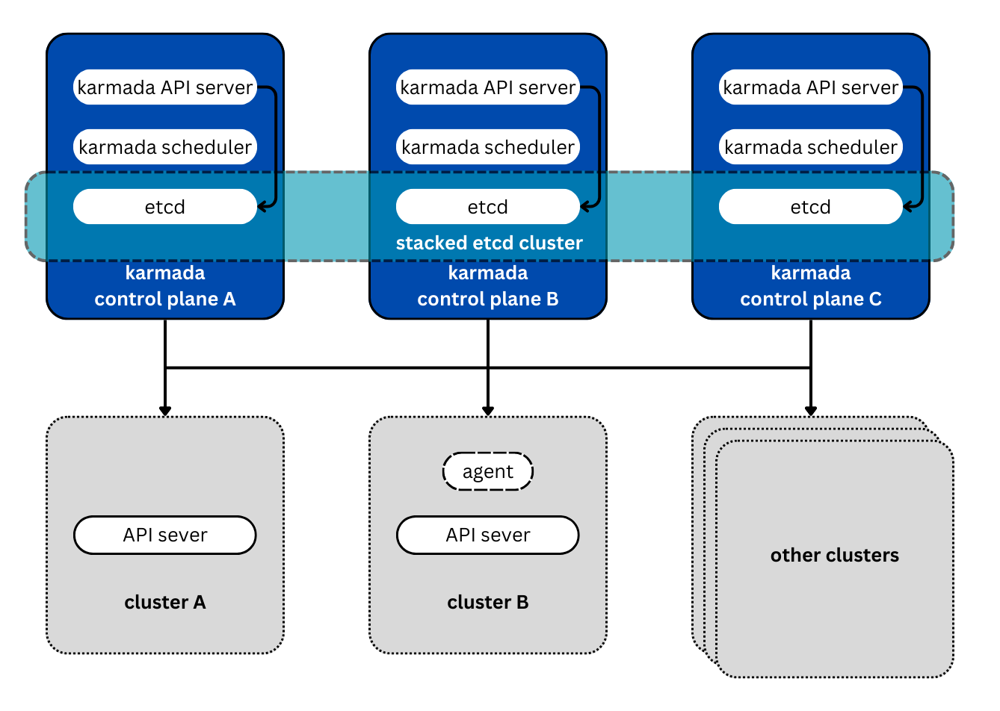

This documentation explains high availability for Karmada.
The Karmada high availability architecture is very similar to the Kubernetes high
availability architecture. To deploy Karmada in a HA (High Availability) environment
we can create multiple Karmada API servers instead of using a single API server.
So even if a Karmada control plane goes down, you can still manage your clusters
using the other Karmada control planes.

## Options for highly available topology

There are two options for configuring the topology of your highly available Karmada
cluster.

You can set up an HA cluster:

* With stacked control plane nodes, where etcd nodes are colocated with control plane
  nodes

* With external etcd nodes, where etcd runs on separate nodes from the control plane

You should carefully consider the advantages and disadvantages of each topology before
setting up an HA cluster.

## Stacked etcd topology

A stacked HA cluster is a topology where the distributed data storage cluster provided
by etcd is stacked on top of the Karamada control plane nodes.

Each control plane node runs an instance of the Karmada API server, Karmada scheduler,
and Karmada controller manager. The Karmada API server can communicate with the multiple
member clusters, and these member clusters can be registered to the multiple Karmada
API servers.

Each Karmada control plane node creates a local etcd member and this etcd member
communicates only with the Karmada API server of that node. The same applies to the
local Karmada controller manager and Karmada scheduler instances.

This topology couples the control planes and etcd members on the same nodes. It is simpler
to set up than a cluster with external etcd nodes, and simpler to manage for replication.

However, a stacked cluster runs the risk of failed coupling. If one node goes down, both an
etcd member and a Karmada control plane instance are lost, and redundancy is compromised.
You can mitigate this risk by adding more control plane nodes.

You should therefore run a minimum of three stacked control plane nodes for an HA cluster.

## External etcd topology

An HA cluster with external etcd is a topology where the distributed data storage cluster
provided by etcd is external to the Karmada cluster formed by the nodes that run Karmada
control plane components.

Like the stacked etcd topology, each Karmada control plane node in an external etcd
topology runs an instance of the Karmada API server, Karmada scheduler, and Karmada
controller manager. And the Karmada API server is exposed to the member clusters.
However, etcd members run on separate hosts, and each etcd host communicates with the
Karmada API server of each Karmada control plane node.

This topology decouples the Karmada control plane and etcd member. It therefore
provides an HA setup where losing a control plane instance or an etcd member has less
impact and does not affect the cluster redundancy as much as the stacked HA topology.

However, this topology requires twice the number of hosts as the stacked HA topology.
A minimum of three hosts for control plane nodes and three hosts for etcd nodes are
required for an HA cluster with this topology.

