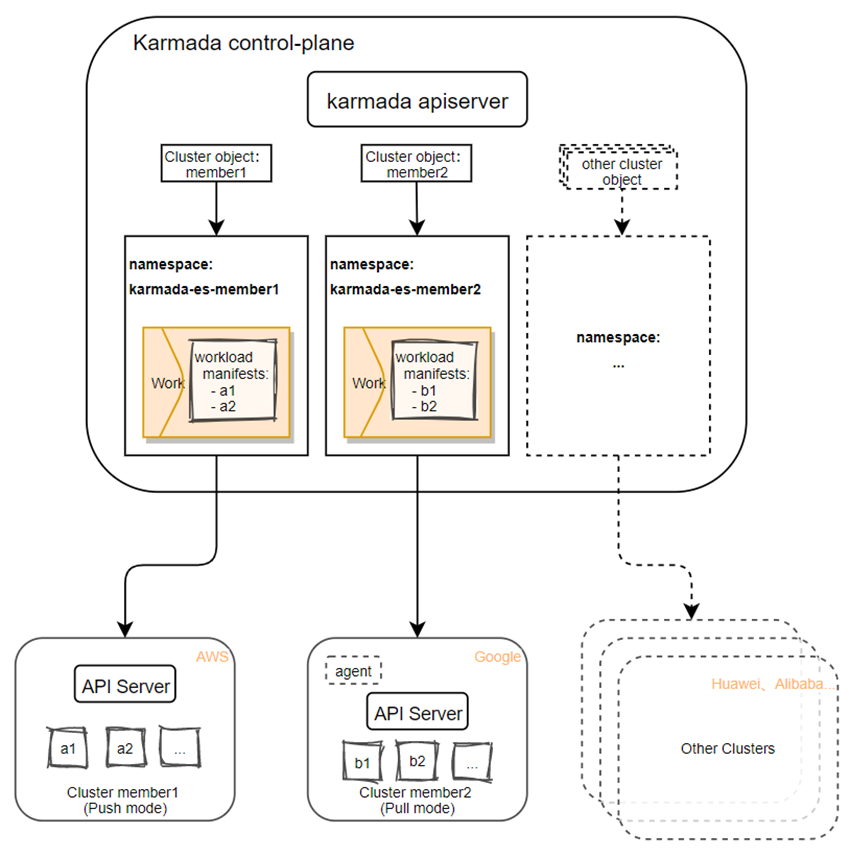
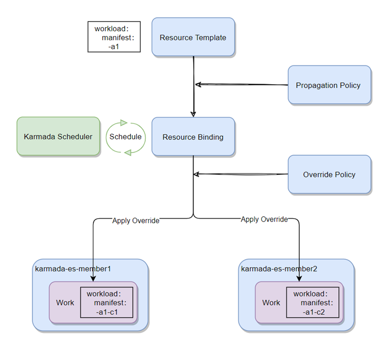
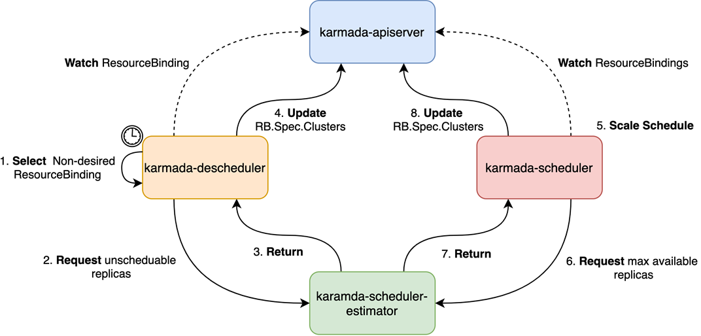
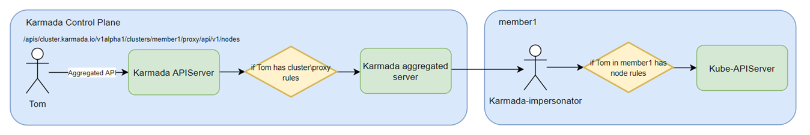
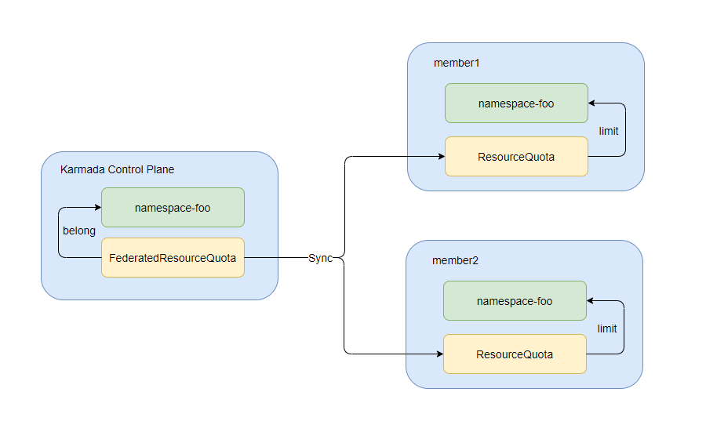
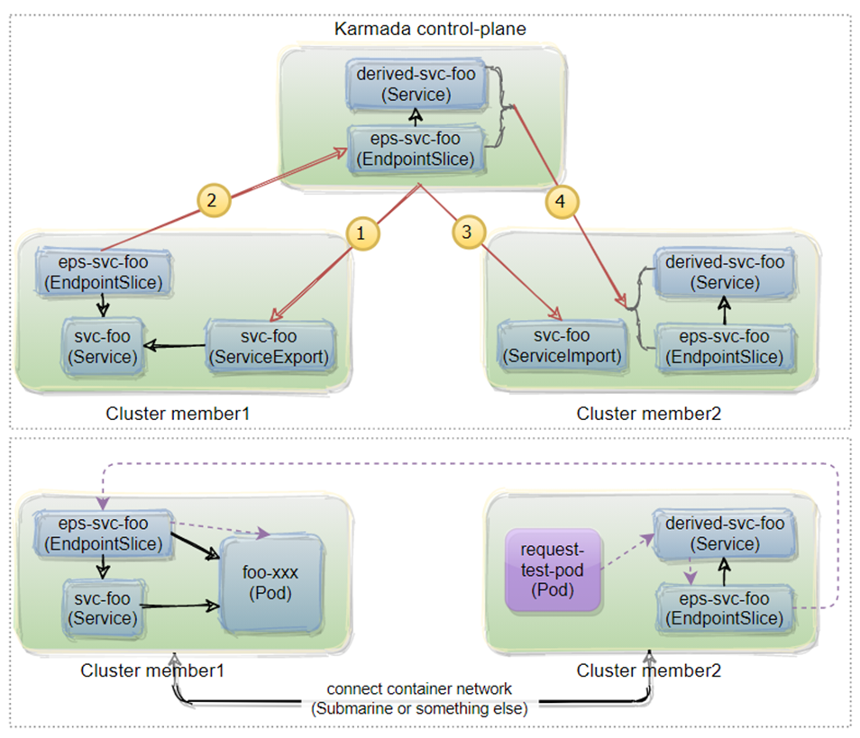

## Cross-cloud multi-cluster multi-mode management
Karmada supports:
* Safe isolation:
  * Create a namespace for each cluster, prefixed with `karmada-es-`.
* [Multi-mode](https://karmada.io/docs/userguide/clustermanager/cluster-registration) connection:
  * Push: Karmada is directly connected to the cluster kube-apiserver.
  * Pull: Deploy one agent component in the cluster, Karmada delegates tasks to the agent component.
* Multi-cloud support(Only if compliant with Kubernetes specifications):
  * Support various public cloud vendors.
  * Support for private cloud.
  * Support self-built clusters.

The overall relationship between the member cluster and the control plane is shown in the following figure:  

## Multi-policy multi-cluster scheduling
Karmada supports:
* Cluster distribution capability under [different scheduling strategies](https://karmada.io/docs/userguide/scheduling/resource-propagating):
  * ClusterAffinity: Oriented scheduling based on ClusterName, Label, Field.
  * Toleration: Scheduling based on Taint and Toleration.
  * SpreadConstraint: Scheduling based on cluster topology.
  * ReplicasScheduling: Replication mode and split mode for instanced workloads.
* Differential configuration([OverridePolicy](https://karmada.io/docs/userguide/scheduling/override-policy)):
  * ImageOverrider: Differentiated configuration of mirrors.
  * ArgsOverrider: Differentiated configuration of execution parameters.
  * CommandOverrider: Differentiated configuration for execution commands.
  * PlainText: Customized Differentiation Configuration.
* [Support reschedule](https://karmada.io/docs/userguide/scheduling/descheduler) with following components:
  * Descheduler(karmada-descheduler): Trigger rescheduling based on instance state changes in member clusters.
  * Scheduler-estimator(karmada-scheduler-estimator): Provides the scheduler with a more precise desired state of the running instances of the member cluster.

Much like k8s scheduling, Karmada support different scheduling policy. The overall scheduling process is shown in the figure below:  

If one cluster does not have enough resource to accommodate their pods, Karamda will reschedule the pods. The overall rescheduling process is shown in the following figure:  

## Cross-cluster failover of applications
Karmada supports:
* [Cluster failover](https://karmada.io/docs/userguide/failover/):
  * Karmada supports users to set distribution policies, and automatically migrates the faulty cluster replicas in a centralized or decentralized manner after a cluster failure.
* Cluster taint settings:
  * When the user sets a taint for the cluster and the resource distribution strategy cannot tolerate the taint, Karmada will also automatically trigger the migration of the cluster replicas.
* Uninterrupted service:
  * During the replicas migration process, Karmada can ensure that the service replicas does not drop to zero, thereby ensuring that the service will not be interrupted.

Karmada supports failover for clusters, one cluster failure will cause failover of replicas as follows:  

## Global Uniform Resource View
Karmada supports:
* [Resource status collection and aggregation](https://karmada.io/docs/userguide/globalview/customizing-resource-interpreter): Collect and aggregate state into resource templates with the help of the Resource Interpreter.
  * User-defined resource, triggering webhook remote calls.
  * Fixed encoding in Karmada for some common resource types.
* [Unified resource management](https://karmada.io/docs/userguide/globalview/aggregated-api-endpoint): Unified management for `create`, `update`, `delete`, `query`.
* [Unified operations](https://karmada.io/docs/userguide/globalview/proxy-global-resource): Exec operations command(`describe`, `exec`, `logs`) in one k8s context.
* [Global search for resources and events](https://karmada.io/docs/tutorials/karmada-search/):
  * Cache query: global fuzzy search and global precise search are supported.
  * Third-party storage: Search engine (Elasticsearch or OpenSearch), relational database, graph database are supported.

Users can access and operate all member clusters via karmada-apiserver:  

Users also can check and search all member clusters resources via karmada-apiserver:  

## Separating the concerns of different roles
karmada supports:
* [Unified authentication](https://karmada.io/docs/userguide/roleseparation/unifiedAuth):
  * Aggregate API unified access entry.
  * Access control is consistent with member clusters.
* Unified resource quota(`FederatedResourceQuota`):
  * Globally configures the ResourceQuota of each member cluster.
  * Configure ResourceQuota at the federation level.
  * Collects the resource usage of each member cluster in real time.
* Reusable scheduling strategy:
  * Resource templates are decoupled from scheduling policies, plug and play.

Users can access all member clusters with unified authentication:

Users also can defined global resource quota via `FederatedResourceQuota`:  

## Cross-cluster service governance
karmada supports:
* [Multi-cluster service discovery](https://karmada.io/docs/userguide/service/multi-cluster-service):
  * With ServiceExport and ServiceImport, achieving cross-cluster service discovery.
* [Multi-cluster network support](https://karmada.io/docs/userguide/network/working-with-submariner):
  * Use `Submariner` to open up the container network between clusters.

Users can enable service governance for cross-cluster with Karmada:  

