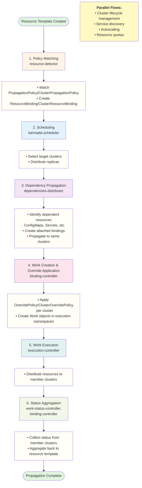

This document provides a comprehensive reference of all Kubernetes events emitted by Karmada components. Events provide real-time visibility into operational state changes, errors, and important milestones in resource propagation and cluster management workflows.

## About Karmada Events

Karmada uses the Kubernetes event mechanism to record significant state transitions and operations across its control plane. Events are ephemeral records that help operators:

- **Troubleshoot issues**: Identify failure points in resource propagation
- **Monitor operations**: Track the progress of scheduling, synchronization, and status aggregation
- **Audit changes**: Review what actions Karmada has taken on resources
- **Understand workflows**: Follow resources through the complete propagation lifecycle

Events are attached to the Kubernetes objects they describe (resource templates, bindings, works, clusters, etc.) and can be viewed using `kubectl describe` or `kubectl get events`.

For comprehensive monitoring and alerting, consider using [Karmada metrics](./metrics.md) which provide quantitative operational data complementary to events.

## Events by Propagation Stage

Karmada's resource propagation follows a multi-stage pipeline. Events are organized below by the stage where they occur.



Parallel flows include cluster lifecycle management, service discovery, autoscaling, and resource quotas.

### 1. Policy Matching

These events occur when Karmada determines which propagation policy applies to a resource template and creates a ResourceBinding or ClusterResourceBinding.

#### ApplyPolicySucceed

- **Component**: resource-detector
- **Type**: ✅ Normal
- **Involved Object**: Resource template
- **Description**: Successfully matched and applied a PropagationPolicy or ClusterPropagationPolicy to the resource. A ResourceBinding or ClusterResourceBinding will be created.

#### ApplyPolicyFailed

- **Component**: resource-detector
- **Type**: ⚠️ Warning
- **Involved Object**: Resource template
- **Description**: Failed to apply propagation policy. Common causes: invalid policy configuration, conflicting policies, or internal errors. Resource will not be propagated until resolved.
- **Troubleshooting**:
  - Verify the PropagationPolicy/ClusterPropagationPolicy exists and matches the resource
  - Check that policy selectors correctly target the resource
  - Ensure no conflicting policies with the same priority exist
- **Related Metrics**:
  - [`resource_match_policy_duration_seconds`](./metrics.md#resource_match_policy_duration_seconds) - Policy matching latency
  - [`resource_apply_policy_duration_seconds`](./metrics.md#resource_apply_policy_duration_seconds) - Policy application latency
  - [`karmada_policy_apply_attempts_total`](./metrics.md#karmada_policy_apply_attempts_total) - Policy application success/error rate

#### PreemptPolicySucceed

- **Component**: resource-detector
- **Type**: ✅ Normal
- **Involved Object**: Resource template
- **Description**: Successfully preempted an existing policy with a higher-priority policy. The resource will be re-propagated according to the new policy.

#### PreemptPolicyFailed

- **Component**: resource-detector
- **Type**: ⚠️ Warning
- **Involved Object**: Resource template
- **Description**: Failed to preempt existing policy. The resource continues using the current policy. Check for policy conflicts or permission issues.
- **Related Metrics**:
  - [`policy_preemption_total`](./metrics.md#policy_preemption_total) - Policy preemption success/error rate

### 2. Scheduling

Scheduling determines which clusters should receive the resource and how replicas should be distributed.

#### ScheduleBindingSucceed

- **Component**: karmada-scheduler
- **Type**: ✅ Normal
- **Involved Object**: ResourceBinding, ClusterResourceBinding, Resource template
- **Description**: Successfully scheduled the binding to target clusters. The `.spec.clusters` field is populated with selected clusters and replica distribution.
- **Related Metrics**:
  - [`karmada_scheduler_schedule_attempts_total{result="success"}`](./metrics.md#karmada_scheduler_schedule_attempts_total) - Successful scheduling attempts
  - [`karmada_scheduler_e2e_scheduling_duration_seconds`](./metrics.md#karmada_scheduler_e2e_scheduling_duration_seconds) - End-to-end scheduling latency

#### ScheduleBindingFailed

- **Component**: karmada-scheduler
- **Type**: ⚠️ Warning
- **Involved Object**: ResourceBinding, ClusterResourceBinding, Resource template
- **Description**: Failed to schedule binding to clusters. Common causes: no clusters match affinity/tolerations, insufficient cluster capacity, or no ready clusters. Resource will not propagate until scheduling succeeds.
- **Troubleshooting**:
  - Verify clusters are in Ready state: `kubectl get clusters`
  - Check cluster affinity/tolerations in the PropagationPolicy
  - Review scheduler logs for detailed failure reasons
  - Check [`scheduler_pending_bindings{queue="unschedulable"}`](./metrics.md#scheduler_pending_bindings) metric
- **Related Metrics**:
  - [`karmada_scheduler_schedule_attempts_total{result="error"}`](./metrics.md#karmada_scheduler_schedule_attempts_total) - Failed scheduling attempts
  - [`karmada_scheduler_e2e_scheduling_duration_seconds{result="error"}`](./metrics.md#karmada_scheduler_e2e_scheduling_duration_seconds) - Scheduling latency for failures
  - [`scheduler_pending_bindings{queue="unschedulable"}`](./metrics.md#scheduler_pending_bindings) - Unschedulable bindings count

#### DescheduleBindingSucceed

- **Component**: karmada-descheduler
- **Type**: ✅ Normal
- **Involved Object**: ResourceBinding, ClusterResourceBinding, Resource template
- **Description**: Successfully removed scheduling results due to descheduling policy or cluster conditions (e.g., cluster taints). Resources may be rescheduled to other clusters.
- **Related Metrics**:
  - [`karmada_scheduler_schedule_attempts_total`](./metrics.md#karmada_scheduler_schedule_attempts_total) - Rescheduling attempts after descheduling

#### DescheduleBindingFailed

- **Component**: karmada-descheduler
- **Type**: ⚠️ Warning
- **Involved Object**: ResourceBinding, ClusterResourceBinding, Resource template
- **Description**: Failed to deschedule binding. Manual intervention may be required.
- **Related Metrics**:
  - [`karmada_scheduler_schedule_attempts_total`](./metrics.md#karmada_scheduler_schedule_attempts_total) - Scheduling attempts after failed descheduling

### 3. Dependency Propagation

The dependencies-distributor automatically propagates dependent resources (ConfigMaps, Secrets, ServiceAccounts) referenced by propagated workloads. This happens after scheduling because dependencies must be sent to the same clusters as the main resource.

#### GetDependenciesSucceed

- **Component**: dependencies-distributor
- **Type**: ✅ Normal
- **Involved Object**: Resource template
- **Description**: Successfully identified dependent resources (ConfigMaps, Secrets, etc.) referenced by the workload.

#### GetDependenciesFailed

- **Component**: dependencies-distributor
- **Type**: ⚠️ Warning
- **Involved Object**: Resource template
- **Description**: Failed to identify dependencies. Dependent resources may not be propagated, causing workload failures in member clusters.
- **Troubleshooting**:
  - Verify dependent resources exist in the same namespace
  - Check that dependent resources are readable by dependencies-distributor
  - Review ResourceInterpreterCustomization for custom dependency rules

#### SyncScheduleResultToDependenciesSucceed

- **Component**: dependencies-distributor
- **Type**: ✅ Normal
- **Involved Object**: ResourceBinding, ClusterResourceBinding
- **Description**: Successfully propagated dependencies to the same clusters as the main workload.

#### SyncScheduleResultToDependenciesFailed

- **Component**: dependencies-distributor
- **Type**: ⚠️ Warning
- **Involved Object**: ResourceBinding, ClusterResourceBinding
- **Description**: Failed to propagate dependencies. Workloads may fail to start in member clusters due to missing ConfigMaps/Secrets.
- **Troubleshooting**:
  - Verify dependent resources exist in the same namespace
  - Check that dependent resources are readable by dependencies-distributor
  - Review ResourceInterpreterCustomization for custom dependency rules

#### DependencyPolicyConflict

- **Component**: dependencies-distributor
- **Type**: ⚠️ Warning
- **Involved Object**: ResourceBinding, ClusterResourceBinding
- **Description**: Detected a conflict between dependency propagation and an existing PropagationPolicy for a dependent resource. Manual policy adjustment may be needed.
- **Troubleshooting**: Check if a conflicting PropagationPolicy exists for the dependency.

### 4. Work Creation & Override Application

After scheduling and dependency propagation, the binding controller creates Work objects for each target cluster. During this phase, OverridePolicy/ClusterOverridePolicy are applied to customize resources per cluster before creating Work objects.

#### ApplyOverridePolicySucceed

- **Component**: override-manager
- **Type**: ✅ Normal
- **Involved Object**: Resource template
- **Description**: Successfully applied OverridePolicy or ClusterOverridePolicy to modify the resource for a specific cluster (e.g., different image registry, resource limits, labels).
- **Related Metrics**:
  - [`karmada_binding_sync_work_duration_seconds`](./metrics.md#karmada_binding_sync_work_duration_seconds) - Includes override application time in work sync

#### ApplyOverridePolicyFailed

- **Component**: override-manager
- **Type**: ⚠️ Warning
- **Involved Object**: Resource template
- **Description**: Failed to apply override policy for a cluster. Resource may be propagated without intended overrides. Verify override policy syntax and selectors.
- **Related Metrics**:
  - [`karmada_binding_sync_work_duration_seconds{result="error"}`](./metrics.md#karmada_binding_sync_work_duration_seconds) - May indicate override failures during work sync

#### SyncWorkSucceed

- **Component**: binding-controller, cluster-resource-binding-controller
- **Type**: ✅ Normal
- **Involved Object**: ResourceBinding, ClusterResourceBinding, Resource template, FederatedResourceQuota
- **Description**: Successfully created or updated Work objects in execution namespaces. Each Work contains the resource manifest for one cluster.

#### SyncWorkFailed

- **Component**: binding-controller, cluster-resource-binding-controller
- **Type**: ⚠️ Warning
- **Involved Object**: ResourceBinding, ClusterResourceBinding, Resource template, FederatedResourceQuota
- **Description**: Failed to create/update Work objects. Common causes: execution namespace doesn't exist, permission issues, or API server errors. Resources won't be propagated to clusters.
- **Troubleshooting**:
  - Verify execution namespace exists: `kubectl get ns karmada-es-<cluster-name>`
  - Check binding controller logs
  - Verify RBAC permissions for the binding controller
- **Related Metrics**:
  - [`karmada_binding_sync_work_duration_seconds`](./metrics.md#karmada_binding_sync_work_duration_seconds)

#### CleanupWorkFailed

- **Component**: binding-controller, cluster-resource-binding-controller
- **Type**: ⚠️ Warning
- **Involved Object**: ResourceBinding, ClusterResourceBinding
- **Description**: Failed to clean up Work objects after resource deletion or cluster removal. Orphaned Work objects may remain. Manual cleanup may be needed.

#### AggregateStatusSucceed

- **Component**: binding-controller, cluster-resource-binding-controller
- **Type**: ✅ Normal
- **Involved Object**: ResourceBinding, ClusterResourceBinding, Resource template, FederatedResourceQuota
- **Description**: Successfully aggregated status from all member clusters back to the resource template. Status reflects combined state across clusters.

#### AggregateStatusFailed

- **Component**: binding-controller, cluster-resource-binding-controller
- **Type**: ⚠️ Warning
- **Involved Object**: ResourceBinding, ClusterResourceBinding, Resource template, FederatedResourceQuota
- **Description**: Failed to aggregate status from member clusters. Status information may be incomplete or outdated. Check Work status in execution namespaces.
- **Related Metrics**:
  - [`workqueue_retries_total`](./metrics.md#workqueue_retries_total) - Controller retry rate
  - [`workqueue_depth`](./metrics.md#workqueue_depth) - Controller queue depth

#### EvictWorkloadFromClusterSucceed

- **Component**: binding-controller, taint-manager, graceful-eviction-controller
- **Type**: ✅ Normal
- **Involved Object**: ResourceBinding, ClusterResourceBinding, Resource template
- **Description**: Successfully evicted workload from a cluster (graceful eviction due to cluster failure, taint, or rebalancing).

#### EvictWorkloadFromClusterFailed

- **Component**: binding-controller, taint-manager, graceful-eviction-controller
- **Type**: ⚠️ Warning
- **Involved Object**: ResourceBinding, ClusterResourceBinding, Resource template
- **Description**: Failed to evict workload from cluster. Workload may remain on unhealthy cluster.
- **Related Metrics**:
  - [`karmada_eviction_processing_total`](./metrics.md#karmada_eviction_processing_total) - Eviction success/error rate
  - [`karmada_eviction_processing_latency_seconds`](./metrics.md#karmada_eviction_processing_latency_seconds) - Eviction processing latency
  - [`karmada_eviction_queue_depth`](./metrics.md#karmada_eviction_queue_depth) - Eviction queue backlog

### 5. Work Execution

The execution controller (in push mode) or karmada-agent (in pull mode) applies Work resources to member clusters.

#### WorkDispatching

- **Component**: execution-controller, karmada-agent
- **Type**: ✅ Normal
- **Involved Object**: Work
- **Description**: Work dispatching status has changed. Indicates the Work is being processed for deployment to the member cluster.

#### SyncSucceed

- **Component**: execution-controller, karmada-agent
- **Type**: ✅ Normal
- **Involved Object**: Work
- **Description**: Successfully applied the resource manifest to the member cluster. The resource now exists in the target cluster.
- **Related Metrics**:
  - [`karmada_work_sync_workload_duration_seconds`](./metrics.md#karmada_work_sync_workload_duration_seconds) - Work sync latency
  - [`karmada_create_resource_to_cluster`](./metrics.md#karmada_create_resource_to_cluster) - Resource creation operations
  - [`karmada_update_resource_to_cluster`](./metrics.md#karmada_update_resource_to_cluster) - Resource update operations

#### SyncFailed

- **Component**: execution-controller, karmada-agent
- **Type**: ⚠️ Warning
- **Involved Object**: Work
- **Description**: Failed to apply resource to member cluster. Common causes: cluster unreachable, resource conflicts in member cluster, invalid manifest, or insufficient permissions.
- **Troubleshooting**:
  - Check cluster connectivity and health: `kubectl get cluster <name>`
  - Verify the cluster has necessary CRDs for the resource type
  - Check for resource conflicts in the member cluster
  - Review execution controller or karmada-agent logs
  - For resource conflicts, check if resource already exists with different ownership
- **Related Metrics**:
  - [`karmada_work_sync_workload_duration_seconds`](./metrics.md#karmada_work_sync_workload_duration_seconds)
  - [`karmada_create_resource_to_cluster`](./metrics.md#karmada_create_resource_to_cluster)
  - [`karmada_update_resource_to_cluster`](./metrics.md#karmada_update_resource_to_cluster)
  - [`karmada_delete_resource_from_cluster`](./metrics.md#karmada_delete_resource_from_cluster)

### 6. Status Aggregation

The work-status-controller monitors Work objects and reflects their status back through the propagation pipeline.

#### ReflectStatusSucceed

- **Component**: work-status-controller
- **Type**: ✅ Normal
- **Involved Object**: Work
- **Description**: Successfully reflected the resource status from member cluster back to the Work object. Status is now available for aggregation.

#### ReflectStatusFailed

- **Component**: work-status-controller
- **Type**: ⚠️ Warning
- **Involved Object**: Work
- **Description**: Failed to reflect status from member cluster. Status information will be incomplete. Check member cluster connectivity.

#### InterpretHealthSucceed

- **Component**: work-status-controller
- **Type**: ✅ Normal
- **Involved Object**: Work
- **Description**: Successfully interpreted the health status of the resource in the member cluster using health interpretation rules.

#### InterpretHealthFailed

- **Component**: work-status-controller
- **Type**: ⚠️ Warning
- **Involved Object**: Work
- **Description**: Failed to interpret resource health. Default health rules will be used. Verify ResourceInterpreterCustomization if using custom health checks.
- **Troubleshooting**:
  - Check if ResourceInterpreterCustomization exists for the resource type
  - Verify health interpretation rules are valid
  - Review work-status-controller logs

## Cluster Lifecycle Events

These events track member cluster registration, health, and infrastructure operations.

#### CreateExecutionSpaceSucceed

- **Component**: cluster-controller
- **Type**: ✅ Normal
- **Involved Object**: Cluster
- **Description**: Successfully created the execution namespace (`karmada-es-<cluster-name>`) for the cluster. This namespace stores Work objects for the cluster.

#### CreateExecutionSpaceFailed

- **Component**: cluster-controller
- **Type**: ⚠️ Warning
- **Involved Object**: Cluster
- **Description**: Failed to create execution namespace. Work objects cannot be created for this cluster until resolved.
- **Related Metrics**:
  - [`cluster_ready_state`](./metrics.md#cluster_ready_state) - Cluster readiness state
  - [`cluster_sync_status_duration_seconds`](./metrics.md#cluster_sync_status_duration_seconds) - Cluster status sync latency

#### RemoveExecutionSpaceSucceed

- **Component**: cluster-controller
- **Type**: ✅ Normal
- **Involved Object**: Cluster
- **Description**: Successfully removed execution namespace during cluster de-registration. Clean uninstall completed.

#### RemoveExecutionSpaceFailed

- **Component**: cluster-controller
- **Type**: ⚠️ Warning
- **Involved Object**: Cluster
- **Description**: Failed to remove execution namespace. Manual cleanup may be required.

#### TaintClusterSucceed

- **Component**: cluster-controller
- **Type**: ✅ Normal
- **Involved Object**: Cluster
- **Description**: Successfully applied taint to cluster (e.g., due to cluster failure detection). Workloads will be evicted based on tolerations.

#### TaintClusterFailed

- **Component**: cluster-controller
- **Type**: ⚠️ Warning
- **Involved Object**: Cluster
- **Description**: Failed to apply taint to cluster. Automatic eviction may not occur.
- **Related Metrics**:
  - [`cluster_ready_state`](./metrics.md#cluster_ready_state) - Critical for monitoring cluster health
  - [`cluster_sync_status_duration_seconds`](./metrics.md#cluster_sync_status_duration_seconds)

#### SyncImpersonationConfigSucceed

- **Component**: unified-auth-controller
- **Type**: ✅ Normal
- **Involved Object**: Cluster
- **Description**: Successfully synchronized impersonation configuration for cross-cluster authentication. Cluster is ready for pull mode or multi-cluster service discovery.

#### SyncImpersonationConfigFailed

- **Component**: unified-auth-controller
- **Type**: ⚠️ Warning
- **Involved Object**: Cluster
- **Description**: Failed to sync impersonation config. Cross-cluster operations may fail. Check service account and RBAC configuration.

## Multi-Cluster Service Events

These events track multi-cluster service discovery and load balancing.

#### SyncDerivedServiceSucceed

- **Component**: service-import-controller
- **Type**: ✅ Normal
- **Involved Object**: ServiceImport
- **Description**: Successfully created or updated the derived Service for cross-cluster service discovery. The service is now discoverable across clusters.

#### SyncDerivedServiceFailed

- **Component**: service-import-controller
- **Type**: ⚠️ Warning
- **Involved Object**: ServiceImport
- **Description**: Failed to create derived Service. Cross-cluster service discovery will not work. Check ServiceImport configuration and permissions.

#### SyncServiceSucceed

- **Component**: multiclusterservice-controller
- **Type**: ✅ Normal
- **Involved Object**: MultiClusterService
- **Description**: Successfully synchronized the MultiClusterService configuration. Service exposure is configured correctly.

#### SyncServiceFailed

- **Component**: multiclusterservice-controller
- **Type**: ⚠️ Warning
- **Involved Object**: MultiClusterService
- **Description**: Failed to synchronize MultiClusterService. Cross-cluster load balancing may not work.

#### DispatchEndpointSliceSucceed

- **Component**: endpointslice-dispatch-controller
- **Type**: ✅ Normal
- **Involved Object**: EndpointSlice
- **Description**: Successfully dispatched EndpointSlice to consumer clusters. Cross-cluster endpoints are now available for load balancing.

#### DispatchEndpointSliceFailed

- **Component**: endpointslice-dispatch-controller
- **Type**: ⚠️ Warning
- **Involved Object**: EndpointSlice
- **Description**: Failed to dispatch EndpointSlice to consumer clusters. Traffic routing may be incomplete.
- **Troubleshooting**: Check network connectivity and permissions.

#### ClusterNotFound

- **Component**: endpointslice-dispatch-controller
- **Type**: ⚠️ Warning
- **Involved Object**: EndpointSlice
- **Description**: Consumer cluster specified in MultiClusterService not found. Verify cluster name and registration.
- **Troubleshooting**: Verify cluster exists with `kubectl get clusters`.

#### APIIncompatible

- **Component**: endpointslice-dispatch-controller
- **Type**: ⚠️ Warning
- **Involved Object**: EndpointSlice
- **Description**: Member cluster does not support EndpointSlice API (requires Kubernetes 1.19+). Consider upgrading the cluster.
- **Troubleshooting**: Check member cluster Kubernetes version.

## Resource Quota Events

These events track federated resource quota enforcement across clusters.

**Note**: FederatedResourceQuota controllers reuse some event reason strings that are also used by binding controllers. The context (involved object type) distinguishes them.

#### SyncWorkSucceed (FederatedResourceQuota)

- **Component**: federated-resource-quota-sync-controller
- **Type**: ✅ Normal
- **Involved Object**: FederatedResourceQuota
- **Description**: Successfully synchronized the FederatedResourceQuota specification to member clusters. Quota limits are enforced.

#### SyncWorkFailed (FederatedResourceQuota)

- **Component**: federated-resource-quota-sync-controller
- **Type**: ⚠️ Warning
- **Involved Object**: FederatedResourceQuota
- **Description**: Failed to sync quota to member clusters. Quota enforcement may be incomplete.

#### AggregateStatusSucceed (FederatedResourceQuota)

- **Component**: federated-resource-quota-status-controller
- **Type**: ✅ Normal
- **Involved Object**: FederatedResourceQuota
- **Description**: Successfully collected resource usage from member clusters. Status reflects current quota utilization.

#### AggregateStatusFailed (FederatedResourceQuota)

- **Component**: federated-resource-quota-status-controller
- **Type**: ⚠️ Warning
- **Involved Object**: FederatedResourceQuota
- **Description**: Failed to collect status from member clusters. Usage information may be incomplete.

#### CollectOverallStatusSucceed

- **Component**: federated-resource-quota-enforcement-controller
- **Type**: ✅ Normal
- **Involved Object**: FederatedResourceQuota
- **Description**: Successfully collected and aggregated overall quota status across all clusters.

#### CollectOverallStatusFailed

- **Component**: federated-resource-quota-enforcement-controller
- **Type**: ⚠️ Warning
- **Involved Object**: FederatedResourceQuota
- **Description**: Failed to collect overall status. Quota enforcement decisions may be based on stale data.

## Autoscaling Events

These events track FederatedHPA and CronFederatedHPA operations for multi-cluster autoscaling.

### FederatedHPA Events

#### SuccessfulRescale

- **Component**: federatedhpa-controller
- **Type**: ✅ Normal
- **Involved Object**: FederatedHPA
- **Description**: Successfully rescaled the target workload based on metrics. The FederatedHPA adjusted replica counts across clusters.
- **Related Metrics**:
  - [`karmada_federatedhpa_process_duration_seconds`](./metrics.md#karmada_federatedhpa_process_duration_seconds) - Processing latency
  - [`karmada_federatedhpa_pull_metrics_duration_seconds`](./metrics.md#karmada_federatedhpa_pull_metrics_duration_seconds) - Metrics collection latency

#### FailedRescale

- **Component**: federatedhpa-controller
- **Type**: ⚠️ Warning
- **Involved Object**: FederatedHPA
- **Description**: Failed to rescale the target workload. Common causes: invalid target reference, insufficient cluster capacity, or permission issues.
- **Troubleshooting**:
  - Verify the scale target reference exists and is accessible
  - Check cluster capacity and resource availability
  - Review federatedhpa-controller logs
  - Ensure RBAC permissions allow scaling operations
- **Related Metrics**:
  - [`karmada_federatedhpa_process_duration_seconds{result="error"}`](./metrics.md#karmada_federatedhpa_process_duration_seconds)

#### FailedGetScale

- **Component**: federatedhpa-controller
- **Type**: ⚠️ Warning
- **Involved Object**: FederatedHPA
- **Description**: Failed to get scale information for the target resource. The resource may not support scaling or may not exist.
- **Troubleshooting**: Verify the target resource exists and supports the scale subresource.

#### FailedComputeMetricsReplicas

- **Component**: federatedhpa-controller
- **Type**: ⚠️ Warning
- **Involved Object**: FederatedHPA
- **Description**: Failed to compute desired replicas based on metrics. Common causes: metrics unavailable, metrics server unreachable, or invalid metric queries.
- **Troubleshooting**:
  - Verify metrics server is running in member clusters
  - Check metric names and queries in FederatedHPA spec
  - Review [`karmada_federatedhpa_pull_metrics_duration_seconds{result="error"}`](./metrics.md#karmada_federatedhpa_pull_metrics_duration_seconds) for metrics collection failures

#### FailedGetBindings

- **Component**: federatedhpa-controller
- **Type**: ⚠️ Warning
- **Involved Object**: FederatedHPA
- **Description**: Failed to get ResourceBinding or ClusterResourceBinding for the target workload. The workload may not be propagated.
- **Troubleshooting**: Verify the target workload has a corresponding binding and is being propagated.

#### FailedGetTargetClusters

- **Component**: federatedhpa-controller
- **Type**: ⚠️ Warning
- **Involved Object**: FederatedHPA
- **Description**: Failed to determine target clusters for autoscaling. Cannot aggregate metrics or distribute replicas.
- **Troubleshooting**: Check that the target workload is scheduled to clusters via PropagationPolicy.

#### FailedGetScaleTargetRef

- **Component**: federatedhpa-controller
- **Type**: ⚠️ Warning
- **Involved Object**: FederatedHPA
- **Description**: Failed to get the scale target reference. The referenced resource may not exist.
- **Troubleshooting**: Verify the scaleTargetRef in FederatedHPA spec points to an existing resource.

#### SelectorRequired

- **Component**: federatedhpa-controller
- **Type**: ⚠️ Warning
- **Involved Object**: FederatedHPA
- **Description**: A selector is required for the metric but was not provided in the FederatedHPA spec.
- **Troubleshooting**: Add the required selector to the metric specification.

#### InvalidSelector

- **Component**: federatedhpa-controller
- **Type**: ⚠️ Warning
- **Involved Object**: FederatedHPA
- **Description**: The provided selector is invalid or malformed.
- **Troubleshooting**: Verify selector syntax follows Kubernetes label selector format.

#### AmbiguousSelector

- **Component**: federatedhpa-controller
- **Type**: ⚠️ Warning
- **Involved Object**: FederatedHPA
- **Description**: The selector matches multiple resources when only one is expected.
- **Troubleshooting**: Make the selector more specific to match a single resource.

#### FailedUpdateStatus

- **Component**: federatedhpa-controller
- **Type**: ⚠️ Warning
- **Involved Object**: FederatedHPA
- **Description**: Failed to update the FederatedHPA status. Status information may be outdated.
- **Troubleshooting**: Check API server connectivity and controller permissions.

### CronFederatedHPA Events

#### StartRuleFailed

- **Component**: cronfederatedhpa-controller
- **Type**: ⚠️ Warning
- **Involved Object**: CronFederatedHPA
- **Description**: Failed to start a cron rule. Common causes: invalid cron expression, rule validation failure, or internal errors.
- **Troubleshooting**:
  - Verify cron expressions are valid
  - Check rule configuration in CronFederatedHPA spec
  - Review cronfederatedhpa-controller logs
- **Related Metrics**:
  - [`karmada_cronfederatedhpa_process_duration_seconds{result="error"}`](./metrics.md#karmada_cronfederatedhpa_process_duration_seconds)
  - [`karmada_cronfederatedhpa_rule_process_duration_seconds{result="error"}`](./metrics.md#karmada_cronfederatedhpa_rule_process_duration_seconds)

#### ScaleFailed

- **Component**: cronfederatedhpa-controller
- **Type**: ⚠️ Warning
- **Involved Object**: CronFederatedHPA
- **Description**: Failed to scale workload based on cron schedule. The scheduled scaling operation did not complete successfully.
- **Troubleshooting**:
  - Verify target workload exists and is scalable
  - Check cluster capacity for the desired replica count
  - Review scheduling rules and target replica counts
- **Related Metrics**:
  - [`karmada_cronfederatedhpa_rule_process_duration_seconds{result="error"}`](./metrics.md#karmada_cronfederatedhpa_rule_process_duration_seconds)

#### UpdateCronFederatedHPAFailed

- **Component**: cronfederatedhpa-controller
- **Type**: ⚠️ Warning
- **Involved Object**: CronFederatedHPA
- **Description**: Failed to update the CronFederatedHPA object. Changes to the cron schedule may not be applied.
- **Troubleshooting**: Check API server connectivity and controller permissions.

#### UpdateStatusFailed

- **Component**: cronfederatedhpa-controller
- **Type**: ⚠️ Warning
- **Involved Object**: CronFederatedHPA
- **Description**: Failed to update the CronFederatedHPA status. Status information may be outdated, including last execution time and active rules.
- **Troubleshooting**: Check API server connectivity and controller permissions.

## Event Reference Table

Quick reference of all unique event reasons organized alphabetically. Note that some event reasons are reused across different object types (e.g., `SyncWorkFailed` for both bindings and FederatedResourceQuota).

| Event Reason | Type | Component | Involved Objects |
|--------------|------|-----------|------------------|
| AggregateStatusFailed | Warning | binding-controller, federated-resource-quota-status-controller | ResourceBinding, ClusterResourceBinding, Resource template, FederatedResourceQuota |
| AggregateStatusSucceed | Normal | binding-controller, federated-resource-quota-status-controller | ResourceBinding, ClusterResourceBinding, Resource template, FederatedResourceQuota |
| AmbiguousSelector | Warning | federatedhpa-controller | FederatedHPA |
| APIIncompatible | Warning | endpointslice-dispatch-controller | EndpointSlice |
| ApplyOverridePolicyFailed | Warning | override-manager | Resource template |
| ApplyOverridePolicySucceed | Normal | override-manager | Resource template |
| ApplyPolicyFailed | Warning | detector | Resource template |
| ApplyPolicySucceed | Normal | detector | Resource template |
| CleanupWorkFailed | Warning | binding-controller | ResourceBinding, ClusterResourceBinding |
| ClusterNotFound | Warning | endpointslice-dispatch-controller | EndpointSlice |
| CollectOverallStatusFailed | Warning | federated-resource-quota-enforcement-controller | FederatedResourceQuota |
| CollectOverallStatusSucceed | Normal | federated-resource-quota-enforcement-controller | FederatedResourceQuota |
| CreateExecutionSpaceFailed | Warning | cluster-controller | Cluster |
| CreateExecutionSpaceSucceed | Normal | cluster-controller | Cluster |
| DependencyPolicyConflict | Warning | dependencies-distributor | ResourceBinding, ClusterResourceBinding |
| DescheduleBindingFailed | Warning | descheduler | ResourceBinding, ClusterResourceBinding, Resource template |
| DescheduleBindingSucceed | Normal | descheduler | ResourceBinding, ClusterResourceBinding, Resource template |
| DispatchEndpointSliceFailed | Warning | endpointslice-dispatch-controller | EndpointSlice |
| DispatchEndpointSliceSucceed | Normal | endpointslice-dispatch-controller | EndpointSlice |
| EvictWorkloadFromClusterFailed | Warning | binding-controller, taint-manager | ResourceBinding, ClusterResourceBinding, Resource template |
| EvictWorkloadFromClusterSucceed | Normal | binding-controller, taint-manager | ResourceBinding, ClusterResourceBinding, Resource template |
| FailedComputeMetricsReplicas | Warning | federatedhpa-controller | FederatedHPA |
| FailedGetBindings | Warning | federatedhpa-controller | FederatedHPA |
| FailedGetScale | Warning | federatedhpa-controller | FederatedHPA |
| FailedGetScaleTargetRef | Warning | federatedhpa-controller | FederatedHPA |
| FailedGetTargetClusters | Warning | federatedhpa-controller | FederatedHPA |
| FailedRescale | Warning | federatedhpa-controller | FederatedHPA |
| FailedUpdateStatus | Warning | federatedhpa-controller | FederatedHPA |
| GetDependenciesFailed | Warning | dependencies-distributor | Resource template |
| GetDependenciesSucceed | Normal | dependencies-distributor | Resource template |
| InterpretHealthFailed | Warning | work-status-controller | Work |
| InterpretHealthSucceed | Normal | work-status-controller | Work |
| InvalidSelector | Warning | federatedhpa-controller | FederatedHPA |
| PreemptPolicyFailed | Warning | detector | Resource template |
| PreemptPolicySucceed | Normal | detector | Resource template |
| ReflectStatusFailed | Warning | work-status-controller | Work |
| ReflectStatusSucceed | Normal | work-status-controller | Work |
| RemoveExecutionSpaceFailed | Warning | cluster-controller | Cluster |
| RemoveExecutionSpaceSucceed | Normal | cluster-controller | Cluster |
| ScaleFailed | Warning | cronfederatedhpa-controller | CronFederatedHPA |
| ScheduleBindingFailed | Warning | scheduler | ResourceBinding, ClusterResourceBinding, Resource template |
| ScheduleBindingSucceed | Normal | scheduler | ResourceBinding, ClusterResourceBinding, Resource template |
| SelectorRequired | Warning | federatedhpa-controller | FederatedHPA |
| StartRuleFailed | Warning | cronfederatedhpa-controller | CronFederatedHPA |
| SuccessfulRescale | Normal | federatedhpa-controller | FederatedHPA |
| SyncDerivedServiceFailed | Warning | service-import-controller | ServiceImport |
| SyncDerivedServiceSucceed | Normal | service-import-controller | ServiceImport |
| SyncFailed | Warning | execution-controller | Work |
| SyncImpersonationConfigFailed | Warning | unified-auth-controller | Cluster |
| SyncImpersonationConfigSucceed | Normal | unified-auth-controller | Cluster |
| SyncScheduleResultToDependenciesFailed | Warning | dependencies-distributor | ResourceBinding, ClusterResourceBinding |
| SyncScheduleResultToDependenciesSucceed | Normal | dependencies-distributor | ResourceBinding, ClusterResourceBinding |
| SyncServiceFailed | Warning | multiclusterservice-controller | MultiClusterService |
| SyncServiceSucceed | Normal | multiclusterservice-controller | MultiClusterService |
| SyncSucceed | Normal | execution-controller | Work |
| SyncWorkFailed | Warning | binding-controller, federated-resource-quota-sync-controller | ResourceBinding, ClusterResourceBinding, Resource template, FederatedResourceQuota |
| SyncWorkSucceed | Normal | binding-controller, federated-resource-quota-sync-controller | ResourceBinding, ClusterResourceBinding, Resource template, FederatedResourceQuota |
| TaintClusterFailed | Warning | cluster-controller | Cluster |
| TaintClusterSucceed | Normal | cluster-controller | Cluster |
| UpdateCronFederatedHPAFailed | Warning | cronfederatedhpa-controller | CronFederatedHPA |
| UpdateStatusFailed | Warning | cronfederatedhpa-controller | CronFederatedHPA |
| WorkDispatching | Normal | execution-controller | Work |

## Working with Events

### Viewing Events

#### View events for a specific resource

```bash
# View events for a deployment
kubectl describe deployment my-app

# View events for a ResourceBinding
kubectl describe rb my-app-deployment

# View events for a Cluster
kubectl describe cluster member1
```

#### View all events in a namespace

```bash
# All events in default namespace
kubectl get events -n default

# All events in karmada-system
kubectl get events -n karmada-system

# Watch events in real-time
kubectl get events -n karmada-system --watch
```

#### Filter events by reason

```bash
# Show only scheduling failures
kubectl get events --field-selector reason=ScheduleBindingFailed

# Show all sync failures
kubectl get events --field-selector reason=SyncWorkFailed
```

### Common Event Patterns and Solutions

#### Pattern 1: Propagation Stuck at Scheduling

**Symptoms**:
- `ApplyPolicySucceed` event appears on resource template
- No `ScheduleBindingSucceed` event
- May see `ScheduleBindingFailed` event

**Root Causes**:
- No clusters match scheduling constraints (affinity, tolerations)
- All matching clusters are NotReady
- Insufficient cluster capacity
- Scheduler is not running

**Resolution**:
1. Check cluster status: `kubectl get clusters`
2. Review PropagationPolicy placement rules
3. Check scheduler logs: `kubectl logs -n karmada-system karmada-scheduler-xxx`
4. Review [`scheduler_pending_bindings`](./metrics.md#scheduler_pending_bindings) metric

#### Pattern 2: Work Created but Not Applied

**Symptoms**:
- `SyncWorkSucceed` event on binding
- No `SyncSucceed` on Work
- May see `SyncFailed` event

**Root Causes**:
- Member cluster unreachable or NotReady
- Resource conflicts in member cluster
- Missing CRDs in member cluster
- Permission issues

**Resolution**:
1. Verify cluster health: `kubectl get cluster <name> -o yaml`
2. Check Work status: `kubectl get work -n karmada-es-<cluster> <work-name> -o yaml`
3. Review execution controller/agent logs
4. Check for conflicts: `kubectl get <resource> -n <namespace> --context=<member-cluster>`

#### Pattern 3: Status Not Aggregating

**Symptoms**:
- `SyncWorkloadSucceed` on Work
- No `ReflectStatusSucceed` or `AggregateStatusSucceed`
- Resource status in Karmada is empty or outdated

**Root Causes**:
- Work status controller not running
- Network issues preventing status collection
- Health interpretation errors

**Resolution**:
1. Check work-status-controller logs
2. Verify Work has status: `kubectl get work -n karmada-es-<cluster> <work-name> -o yaml`
3. Review `InterpretHealthFailed` events if present
4. Check ResourceInterpreterCustomization if using custom rules

#### Pattern 4: Dependencies Not Propagating

**Symptoms**:
- `GetDependenciesSucceed` on resource template
- `SyncScheduleResultToDependenciesFailed` on binding
- Workloads fail in member clusters due to missing ConfigMaps/Secrets

**Root Causes**:
- Dependent resources don't exist
- Permission issues reading dependencies
- Policy conflicts

**Resolution**:
1. Verify dependent ConfigMaps/Secrets exist: `kubectl get cm,secret -n <namespace>`
2. Check for `DependencyPolicyConflict` events
3. Review dependencies-distributor logs
4. Verify propagation policies don't conflict

## Event Retention and History

Kubernetes events are ephemeral and automatically garbage collected:

- **Default TTL**: 1 hour for most events
- **Storage**: Events are stored in etcd like other Kubernetes objects
- **Limits**: Kubernetes limits the number of events per object to prevent etcd exhaustion

For long-term event storage and analysis:

1. **Export to external systems**: Use event exporters to send events to:
   - Elasticsearch + Kibana
   - Loki + Grafana
   - Cloud logging services (CloudWatch, Stackdriver, etc.)

2. **Use audit logs**: Kubernetes audit logs provide more comprehensive history

3. **Monitor with alerts**: Use related metrics to monitor with Prometheus alerts:
   ```yaml
   # Example alert for scheduling failures
   - alert: HighSchedulingFailureRate
     expr: |
       rate(karmada_scheduler_schedule_attempts_total{result="error"}[5m])
       / rate(karmada_scheduler_schedule_attempts_total[5m]) > 0.1
     annotations:
       summary: High scheduling failure rate (>10%)
   ```

## Related Documentation

- [Karmada Metrics Reference](./metrics.md) - Quantitative operational metrics
- [Karmada Observability Guide](../../administrator/monitoring/karmada-observability) - Complete monitoring setup
- [Kubernetes Events](https://kubernetes.io/docs/reference/kubernetes-api/cluster-resources/event-v1/) - Kubernetes event API reference
