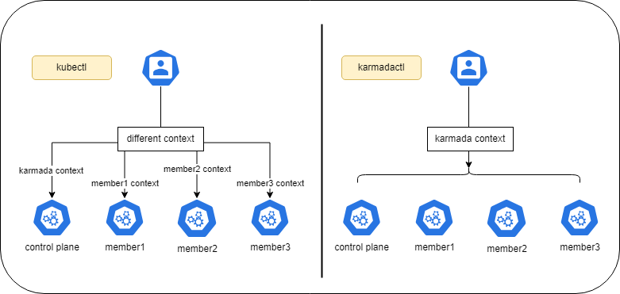
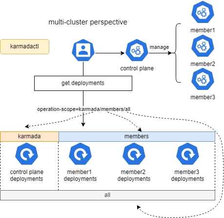

Karmadactl introduces the flag `operation-scope` to specify the operation scope of Karmadactl commands. The value of the flag `operation-scope` is of enum type, with each enum value and its meaning as follows:

- karmada: the operation scope of karmadactl is Karmada control plane.
- members: the operation scope of karmadactl is member clusters.
- all: the operation scope of karmadactl includes Karmada control plane and member clusters.

> *Note that the operation-scope enumeration values supported by different commands are different, please refer to karmadactl [command] --help for details.*

The introduction of `operation-scope` provides a flexible way to implement Karmadactl cluster perspective switching. Compared to Kubectl, Karmadactl can manage different target clusters without switching contexts. In addition, with Karmada's multi-cluster resource view, Karmadactl can access resource information of multiple target clusters at the same time, which greatly simplifies the daily operation and maintenance in multi-cluster scenarios.




## Prerequisites

### Karmada has been installed

We can install Karmada by referring to [Quick Start](https://github.com/karmada-io/karmada#quick-start), or directly run `hack/local-up-karmada.sh` script which is also used to run our E2E cases.

karmadactl version：release v1.11.0 +

### Member Cluster Network

Ensure that at least two clusters have been added to Karmada, and the container networks between member clusters are connected.

- If you use the `hack/local-up-karmada.sh` script to deploy Karmada, Karmada will have three member clusters, and the container networks of the `member1` and `member2` will be connected.
- You can use `Submariner` or other related open source projects to connect networks between member clusters.

## Switching Cluster Perspective

This section describes the application of the flag `operation-scope` to the various Karmadactl commands and uses `karmadactl get` as an example of how to see the distribution of resources across different clusters by switching cluster perspectives.

### get 

The command `karmadactl get` can be used to view the resources of a control plane or member cluster. In combination with the flag `operation-scope` and `clusters`, `karmadactl get` can display information about the resources of a cluster or clusters.

- `operation-scope`：The enumeration values `karmada`, `members`, and `all` are supported. Default to `karmada`.
- `clusters`：Used to specify target member clusters and only takes effect when the command's operation scope is `members` or `all`.



Assume that the Karmada control plane manages three member clusters, member1, member2, and member3 and that the Karmada control plane's Deployment resource, `nginx`, is distributed to all three of these member clusters. Then, we can:

- View the distribution of resources across the control plane and all member clusters.

  ```bash
  $ karmadactl get deployment nginx --operation-scope all      
  NAME    CLUSTER   READY   UP-TO-DATE   AVAILABLE   AGE   ADOPTION
  nginx   Karmada   0/2     6            0           18h   -
  nginx   member1   0/2     2            0           37s   Y
  nginx   member2   0/2     2            0           36s   Y
  nginx   member3   0/2     2            0           37s   Y
  ```

  > *The CLUSTER column represents the cluster in which the resource resides, and the ADOPTION column represents whether the resource has been taken over by the Karmada control plane.* 

- View the distribution of resources across the control plane and some of the member clusters.

  ```bash
  $ karmadactl get deployment nginx --operation-scope all --clusters member1,member2
  NAME    CLUSTER   READY   UP-TO-DATE   AVAILABLE   AGE     ADOPTION
  nginx   Karmada   4/2     6            4           18h     -
  nginx   member1   2/2     2            2           2m37s   Y
  nginx   member2   0/2     2            0           2m36s   Y
  ```

  When `--clusters member1,member2` is set, the member cluster perspective of the command will be limited to clusters member1 and member2.

- View the resource of Karmada control plane.

  ```bash
  $ karmadactl get deployment nginx 
  NAME    CLUSTER   READY   UP-TO-DATE   AVAILABLE   AGE   ADOPTION
  nginx   Karmada   6/2     6            6           18h   -
  $ karmadactl get deployment nginx --operation-scope karmada 
  NAME    CLUSTER   READY   UP-TO-DATE   AVAILABLE   AGE   ADOPTION
  nginx   Karmada   6/2     6            6           18h   -
  ```

- View the distribution of resources across all member clusters.

  ```bash
  $ karmadactl get deployment nginx --operation-scope members
  NAME    CLUSTER   READY   UP-TO-DATE   AVAILABLE   AGE     ADOPTION
  nginx   member2   2/2     2            2           8m10s   Y
  nginx   member1   2/2     2            2           8m11s   Y
  nginx   member3   2/2     2            2           8m10s   Y
  ```

- View the distribution of resources across some of the member clusters.

  ```bash
  $ karmadactl get deployment nginx --operation-scope members --clusters member1,member2
  NAME    CLUSTER   READY   UP-TO-DATE   AVAILABLE   AGE    ADOPTION
  nginx   member1   2/2     2            2           9m7s   Y
  nginx   member2   2/2     2            2           9m6s   Y
  ```

### describes

In combination with the flag `operation-scope` and `cluster`, the `karmadactl describe` command can be used to display details of resources in Karmada control plane or a member cluster.

- `operation-scope`：The enumeration values `karmada` and `members` are supported. Default to `karmada`.
- `cluster`：Used to specify a target member cluster and only takes effect when the command's operation scope is `members`.

### attach

In combination with the flag `operation-scope` and `cluster`, the `karmadactl attach` command can attach to a running container in Karmada control plane or a member cluster.

- `operation-scope`：The enumeration values `karmada` and `members` are supported. Default to `karmada`.

- `cluster`：Used to specify a target member cluster and only takes effect when the command's operation scope is `members`.

### explain

In combination with the flag `operation-scope` and `cluster`, the `karmadactl explain` command can get documentation for a resource in Karmada control plane or a member cluster. This is especially convenient for scenarios where member cluster resources are differentially configured via `OverridePolicy`.

- `operation-scope`：The enumeration values `karmada` and `members` are supported. Default to `karmada`.
- `cluster`：Used to specify a target member cluster and only takes effect when the command's operation scope is `members`.

### exec

In combination with the flag `operation-scope` and `cluster`, the `karmadactl exec` command can execute a command in a container in Karmada control plane or a member cluster.

- `operation-scope`：The enumeration values `karmada` and `members` are supported. Default to `karmada`.
- `cluster`：Used to specify a target member cluster and only takes effect when the command's operation scope is `members`.

### api-resources

In combination with the flag `operation-scope` and `cluster`, the `karmadactl api-resources` command can print the supported API resources on the server in Karmada control plane or a member cluster.

- `operation-scope`：The enumeration values `karmada` and `members` are supported. Default to `karmada`.
- `cluster`：Used to specify a target member cluster and only takes effect when the command's operation scope is `members`.

### api-versions

In combination with the flag `operation-scope` and `cluster`, the `karmadactl api-versions` command can print the supported API versions on the server in Karmada control plane or a member cluster.

- `operation-scope`：The enumeration values `karmada` and `members` are supported. Default to `karmada`.
- `cluster`：Used to specify a target member cluster and only takes effect when the command's operation scope is `members`.