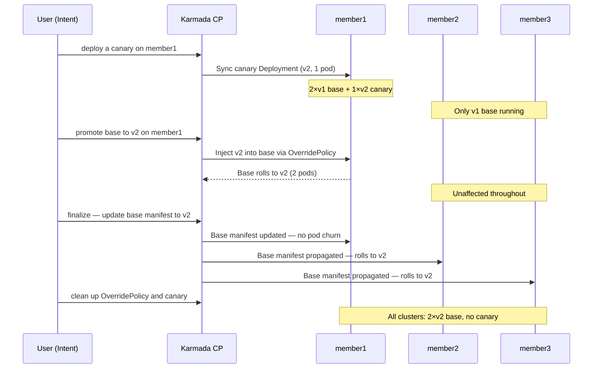
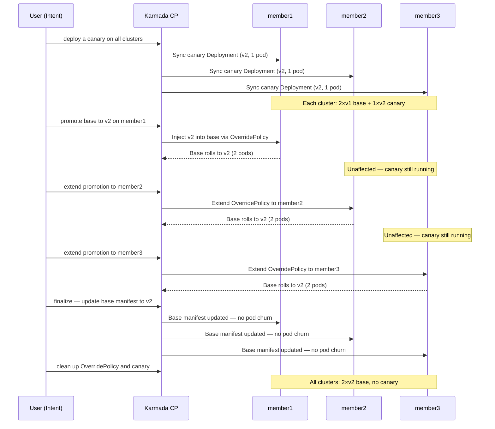
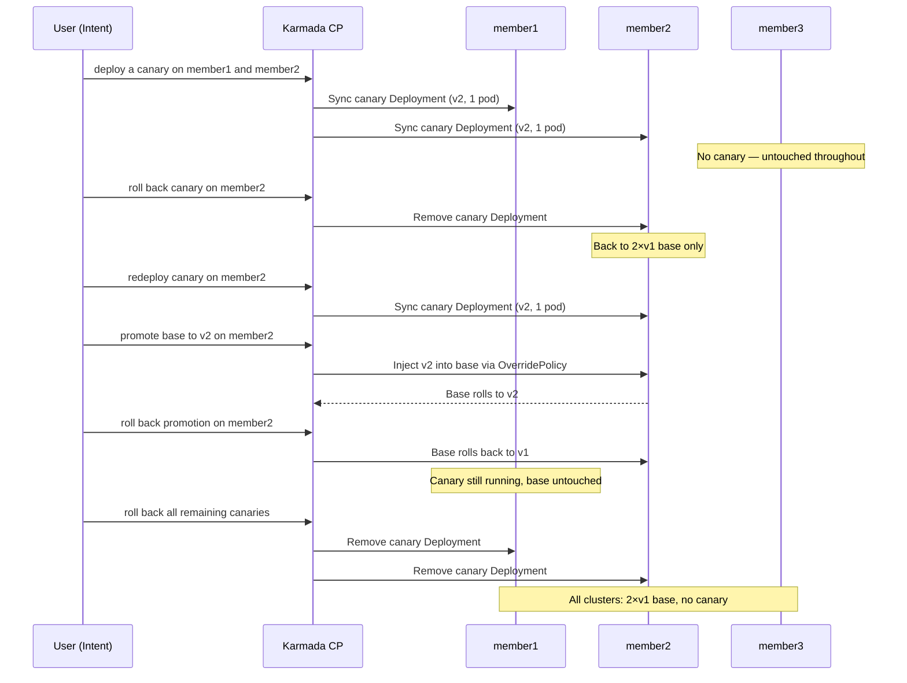

> Back to [Progressive Rollout Strategies overview](./overview).

**Goal**: validate a new version in isolation alongside production in a single cluster before
committing to a full region rollout.

### How it works

A canary release with Karmada primitives uses three object types:

1. **Base `Deployment`** — the stable version, propagated to all clusters by a
   `PropagationPolicy`.
2. **Canary `Deployment`** — a separate Deployment running the new version, propagated to a
   single target cluster by its own `PropagationPolicy`. Both Deployments share the same
   `Service` selector (`app: http-probe-app`), so traffic splits by pod count automatically.
3. **`OverridePolicy`** — patches the base Deployment's `ROLLOUT_LABEL` value on the target
   cluster, triggering a Kubernetes rolling update there to converge on the new version.
   Finalization applies the new version to the base manifest and removes all temporary
   resources.

### Demo 1 — Canary in one cluster, promote to region

Validate the new version in `member1` only before committing to the rest of the region.
`member2` and `member3` serve stable traffic throughout.

The following diagram depicts the full sequence of operations — from single-cluster canary
deployment through promotion and region-wide finalization:



### Step 1: Deploy a canary alongside the base on member1

Create a separate canary Deployment running version `v2`, propagated to `member1` only.

<details>
<summary>http-probe-app-canary-member1.yaml</summary>

```yaml
apiVersion: apps/v1
kind: Deployment
metadata:
  name: http-probe-app-canary-member1
  labels:
    app: http-probe-app
    version: canary
spec:
  replicas: 1
  selector:
    matchLabels:
      app: http-probe-app
      version: canary-member1
  template:
    metadata:
      labels:
        app: http-probe-app
        version: canary-member1
    spec:
      containers:
        - name: http-probe-app
          image: ghcr.io/cmontemuino/http-probe-test-app:v0.5.0
          ports:
            - containerPort: 8080
          env:
            - name: ROLLOUT_LABEL
              value: v2
          resources:
            requests:
              cpu: 25m
              memory: 64Mi
            limits:
              cpu: 25m
              memory: 64Mi
          readinessProbe:
            httpGet:
              path: /readyz
              port: 8080
            initialDelaySeconds: 3
            periodSeconds: 5
---
apiVersion: policy.karmada.io/v1alpha1
kind: PropagationPolicy
metadata:
  name: http-probe-app-canary-member1-propagation
spec:
  resourceSelectors:
    - apiVersion: apps/v1
      kind: Deployment
      name: http-probe-app-canary-member1
  placement:
    clusterAffinity:
      clusterNames:
        - member1
```

</details>

Two things to note:

- The canary Deployment uses an additional label `version: canary-member1` on its pod
  template. This label is not present in the base Deployment's pod template, so the canary
  pods are distinct from the base pods. However, both share the `app: http-probe-app` label,
  which is all the Service selector matches — so traffic is distributed across all pods from
  both Deployments proportionally.
- The canary `PropagationPolicy` selects only `http-probe-app-canary-member1` by name,
  targeting `member1` only. The base `PropagationPolicy` is unaffected — it continues
  propagating the base Deployment to all three clusters.

```shell
kubectl apply -f https://raw.githubusercontent.com/karmada-io/karmada/refs/heads/master/samples/progressive-rollout/canary/http-probe-app-canary-member1.yaml
```

Verify the canary Deployment was created and propagated:

```shell
kubectl get deployment http-probe-app-canary-member1
```

Expected output:

```
NAME                            READY   UP-TO-DATE   AVAILABLE   AGE
http-probe-app-canary-member1   1/1     1            1           2m44s
```

```shell
kubectl get resourcebinding http-probe-app-canary-member1-deployment
```

Expected output:

```
NAME                                       SCHEDULED   FULLYAPPLIED   AGE
http-probe-app-canary-member1-deployment   True        True           2m48s
```

At this point `member1` is running 2 base pods (`v1`) and 1 canary pod (`v2`), for 3 pods
total. `member2` and `member3` run only their 2 base pods. Approximately 1 in 3 requests to
`member1` will be served by the canary.

**What to observe in the dashboard:**

- **Replica panel**: a new canary pod (yellow `●`) appears in the `member1` column alongside
  the 2 existing stable pods (green `○`). The `member2` and `member3` columns show only
  stable pods — the canary `PropagationPolicy` targets `member1` only.
- **Traffic panel**: the `member1` column begins showing yellow-highlighted responses as
  requests land on the canary pod. The ratio of yellow to white responses reflects the 1
  canary pod out of 3 total pods on `member1`.

### Step 2: Promote v2 to the base deployment on member1

Once the canary has been validated, apply an `OverridePolicy` to patch the base Deployment's
`ROLLOUT_LABEL` to `v2` on `member1`. This triggers a Kubernetes rolling update on `member1`
— the local controller replaces base pods one by one with pods running `v2`.

<details>
<summary>http-probe-promote-override-member1.yaml</summary>

```yaml
apiVersion: policy.karmada.io/v1alpha1
kind: OverridePolicy
metadata:
  name: http-probe-promote-override
spec:
  resourceSelectors:
    - apiVersion: apps/v1
      kind: Deployment
      name: http-probe-app
  overrideRules:
    - targetCluster:
        clusterNames:
          - member1
      overriders:
        plaintext:
          - path: /spec/template/spec/containers/0/env/0/value
            operator: replace
            value: v2
```

</details>

The `OverridePolicy` patches only the rendered manifest sent to `member1` — the base
Deployment spec on the Karmada API is unchanged. `member2` and `member3` continue running
`v1` without any interruption.

```shell
kubectl apply -f https://raw.githubusercontent.com/karmada-io/karmada/refs/heads/master/samples/progressive-rollout/canary/http-probe-promote-override-member1.yaml
```

Watch the base Deployment roll on `member1`:

```shell
kubectl --kubeconfig ~/.kube/members.config --context member1 \
  rollout status deployment/http-probe-app
```

**What to observe in the dashboard:**

- **Replica panel**: the base pods in `member1` begin rolling to `v2` one by one. During the
  transition both yellow `●` (new) and green `○` (old) base pods are visible in the `member1`
  column simultaneously alongside the canary pod. The `member2` and `member3` columns are
  unaffected.
- **Traffic panel**: the `member1` column shows an increasing proportion of yellow-highlighted
  responses as more base pods roll to `v2`. Once all base pods have updated, the `member1`
  column becomes fully yellow — the canary pod is now indistinguishable from the promoted
  base pods since they run the same version.

### Step 3: Finalize the promotion

Once you are satisfied that `v2` is healthy on `member1`, finalize the promotion. This step:

1. Applies `http-probe-app-v2.yaml` — the base manifest with `ROLLOUT_LABEL: v2` — to the
   Karmada API. Because the `OverridePolicy` already has `member1` running `v2`, Karmada
   reconciles the updated manifest and Kubernetes sees no change in the pod spec on `member1`
   — **no pods are restarted there**. `member2` and `member3` receive the updated manifest
   for the first time and roll via a standard Kubernetes rolling update.
2. Deletes the `OverridePolicy` — no longer needed since the base manifest now matches the
   live state.
3. Deletes the canary Deployment and its `PropagationPolicy`.

```shell
kubectl apply -f https://raw.githubusercontent.com/karmada-io/karmada/refs/heads/master/samples/progressive-rollout/base/http-probe-app-v2.yaml
kubectl delete overridepolicy http-probe-promote-override
kubectl delete -f https://raw.githubusercontent.com/karmada-io/karmada/refs/heads/master/samples/progressive-rollout/canary/http-probe-app-canary-member1.yaml
```

Verify all clusters are now on `v2`:

```shell
kubectl get resourcebinding http-probe-app-deployment -o jsonpath=\
'{range .status.aggregatedStatus[*]}{.clusterName}: {.health}  ready={.status.readyReplicas}/{.status.replicas}{"\n"}{end}'
```

Expected output:

```
member1: Healthy  ready=2/2
member2: Healthy  ready=2/2
member3: Healthy  ready=2/2
```

Confirm the running version is `v2` on all clusters:

```shell
curl -s -H "Host: http-probe.local" http://localhost:8090/info | jq .rollout_label
curl -s -H "Host: http-probe.local" http://localhost:8091/info | jq .rollout_label
curl -s -H "Host: http-probe.local" http://localhost:8092/info | jq .rollout_label
```

Each command should return `"v2"`.

**What to observe in the dashboard:**

- **Replica panel**: the canary pod (yellow `●`) disappears from the `member1` column. All
  pods across all three clusters now show as stable (green `○`). The `member2` and `member3`
  columns roll to `v2` as the updated base manifest propagates to them — you will briefly see
  yellow `●` pods appear as the rolling update proceeds, then settle back to green `○` once
  complete.
- **Traffic panel**: all three columns return to uniform white responses once the base manifest
  has propagated and all pods have rolled. The `ver=v2` field will be consistent across every
  response in every cluster column.

### Demo 2 — Canary across the region, promote per cluster

Validate the new version in all three clusters simultaneously using a single canary
`Deployment` propagated to all members, then promote the base one cluster at a time — giving
a deliberate gate between each step before committing to the next.

The following diagram depicts the full sequence of operations — from canary deployment across
all clusters through per-cluster promotion and zero-churn finalization:



> **Note:** Before running Demo 2, ensure the cluster is back to `v1`. If you ran Demo 1,
> the cluster will already be on `v2`. Re-apply the base manifest to reset:
>
> ```shell
> kubectl apply -f https://raw.githubusercontent.com/karmada-io/karmada/refs/heads/master/samples/progressive-rollout/base/http-probe-app.yaml
> ```

#### Step 1: Deploy a canary across all clusters

A single canary `Deployment` with a `PropagationPolicy` targeting all three clusters. Each
member gets 1 canary pod running `v2` alongside its 2 base pods running `v1`.

<details>
<summary>http-probe-app-canary-all.yaml</summary>

```yaml
apiVersion: apps/v1
kind: Deployment
metadata:
  name: http-probe-app-canary
  labels:
    app: http-probe-app
    version: canary
spec:
  replicas: 1
  selector:
    matchLabels:
      app: http-probe-app
      version: canary
  template:
    metadata:
      labels:
        app: http-probe-app
        version: canary
    spec:
      containers:
        - name: http-probe-app
          image: ghcr.io/cmontemuino/http-probe-test-app:v0.5.0
          ports:
            - containerPort: 8080
          env:
            - name: ROLLOUT_LABEL
              value: v2
          resources:
            requests:
              cpu: 25m
              memory: 64Mi
            limits:
              cpu: 25m
              memory: 64Mi
          readinessProbe:
            httpGet:
              path: /readyz
              port: 8080
            initialDelaySeconds: 3
            periodSeconds: 5
---
apiVersion: policy.karmada.io/v1alpha1
kind: PropagationPolicy
metadata:
  name: http-probe-app-canary-propagation
spec:
  resourceSelectors:
    - apiVersion: apps/v1
      kind: Deployment
      name: http-probe-app-canary
  placement:
    clusterAffinity:
      clusterNames:
        - member1
        - member2
        - member3
```

</details>

```shell
kubectl apply -f https://raw.githubusercontent.com/karmada-io/karmada/refs/heads/master/samples/progressive-rollout/canary/http-probe-app-canary-all.yaml
```

**What to observe in the dashboard:**

- **Replica panel**: a canary pod (yellow `●`) appears in all three cluster columns
  simultaneously alongside the 2 stable base pods (green `○`). Each cluster shows `stable=2
  canary=1` in the column header.
- **Traffic panel**: all three columns begin showing yellow-highlighted responses as requests
  land on the canary pods. Approximately 1 in 3 requests per cluster hits the canary.

#### Step 2: Promote the base on member1

Apply an `OverridePolicy` targeting `member1` only. This patches the base Deployment's
`ROLLOUT_LABEL` to `v2` on `member1`, triggering a Kubernetes rolling update there.

<details>
<summary>http-probe-promote-override-member1.yaml</summary>

```yaml
apiVersion: policy.karmada.io/v1alpha1
kind: OverridePolicy
metadata:
  name: http-probe-promote-override
spec:
  resourceSelectors:
    - apiVersion: apps/v1
      kind: Deployment
      name: http-probe-app
  overrideRules:
    - targetCluster:
        clusterNames:
          - member1
      overriders:
        plaintext:
          - path: /spec/template/spec/containers/0/env/0/value
            operator: replace
            value: v2
```

</details>

```shell
kubectl apply -f https://raw.githubusercontent.com/karmada-io/karmada/refs/heads/master/samples/progressive-rollout/canary/http-probe-promote-override-member1.yaml
```

Watch the base Deployment roll on `member1`:

```shell
kubectl --kubeconfig ~/.kube/members.config --context member1 \
  rollout status deployment/http-probe-app
```

**What to observe in the dashboard:**

- **Replica panel**: the base pods in `member1` begin rolling to `v2` one by one. During the
  transition both yellow `●` (new) and green `○` (old) base pods are visible in the `member1`
  column alongside the canary pod. The `member2` and `member3` columns are unaffected —
  their canary pods continue alongside their stable base pods.
- **Traffic panel**: the `member1` column shows a growing proportion of yellow responses as
  the base rolls. The `member2` and `member3` columns maintain their existing 1-in-3 canary
  ratio.

> **How progressive promotion works**: each subsequent step does not create a new policy —
> it applies a manifest with the same `OverridePolicy` name (`http-probe-promote-override`)
> and an expanded `clusterNames` list. Karmada reconciles the update immediately, triggering
> a rolling update on each newly added cluster. The promotion state is fully visible and
> auditable as a single Karmada object at any point during the rollout.

#### Step 3: Extend the promotion to member2

Apply the same `OverridePolicy` with `member1` and `member2` in `clusterNames`. Karmada
patches the existing policy in place — no new object is created.

<details>
<summary>http-probe-promote-override-member1-member2.yaml</summary>

```yaml
apiVersion: policy.karmada.io/v1alpha1
kind: OverridePolicy
metadata:
  name: http-probe-promote-override
spec:
  resourceSelectors:
    - apiVersion: apps/v1
      kind: Deployment
      name: http-probe-app
  overrideRules:
    - targetCluster:
        clusterNames:
          - member1
          - member2
      overriders:
        plaintext:
          - path: /spec/template/spec/containers/0/env/0/value
            operator: replace
            value: v2
```

</details>

```shell
kubectl apply -f https://raw.githubusercontent.com/karmada-io/karmada/refs/heads/master/samples/progressive-rollout/canary/http-probe-promote-override-member1-member2.yaml
```

Watch the base Deployment roll on `member2`:

```shell
kubectl --kubeconfig ~/.kube/members.config --context member2 \
  rollout status deployment/http-probe-app
```

**What to observe in the dashboard:**

- **Replica panel**: the base pods in `member2` begin rolling to `v2` one by one. During the
  transition both yellow `●` (new) and green `○` (old) base pods are now also visible in the
  `member2` column alongside the canary pod. The `member3` column is unaffected —
  its canary pod continues alongside its stable base pods.
- **Traffic panel**: the `member2` column shows a growing proportion of yellow responses.
  The `member3` column maintains its 1-in-3 canary ratio.

#### Step 4: Extend the promotion to member3

Apply the `OverridePolicy` with all three clusters in `clusterNames`.

<details>
<summary>http-probe-promote-override-all.yaml</summary>

```yaml
apiVersion: policy.karmada.io/v1alpha1
kind: OverridePolicy
metadata:
  name: http-probe-promote-override
spec:
  resourceSelectors:
    - apiVersion: apps/v1
      kind: Deployment
      name: http-probe-app
  overrideRules:
    - targetCluster:
        clusterNames:
          - member1
          - member2
          - member3
      overriders:
        plaintext:
          - path: /spec/template/spec/containers/0/env/0/value
            operator: replace
            value: v2
```

</details>

```shell
kubectl apply -f https://raw.githubusercontent.com/karmada-io/karmada/refs/heads/master/samples/progressive-rollout/canary/http-probe-promote-override-all.yaml
```

Watch the base Deployment roll on `member3`:

```shell
kubectl --kubeconfig ~/.kube/members.config --context member3 \
  rollout status deployment/http-probe-app
```

**What to observe in the dashboard:**

- **Replica panel**: the base pods in `member3` begin rolling to `v2` one by one. During the
  transition both yellow `●` (new) and green `○` (old) base pods are visible in the `member3`
  column alongside the canary pod. Once complete all base and canary pods across the region
  are now on `v2`.
- **Traffic panel**: all three columns are fully yellow — every response carries `v2`.

#### Step 5: Finalize the promotion

Update the base manifest to `v2`, then delete the `OverridePolicy` and the canary
`Deployment`. Because all clusters are already running `v2` via the `OverridePolicy`,
updating the base manifest is a no-op at the pod level — **no pods are restarted**.

```shell
kubectl apply -f https://raw.githubusercontent.com/karmada-io/karmada/refs/heads/master/samples/progressive-rollout/base/http-probe-app-v2.yaml
kubectl delete overridepolicy http-probe-promote-override
kubectl delete -f https://raw.githubusercontent.com/karmada-io/karmada/refs/heads/master/samples/progressive-rollout/canary/http-probe-app-canary-all.yaml
```

Verify:

```shell
kubectl get resourcebinding http-probe-app-deployment -o jsonpath=\
'{range .status.aggregatedStatus[*]}{.clusterName}: {.health}  ready={.status.readyReplicas}/{.status.replicas}{"\n"}{end}'
```

Expected output:

```
member1: Healthy  ready=2/2
member2: Healthy  ready=2/2
member3: Healthy  ready=2/2
```

Confirm the running version is `v2` on all clusters:

```shell
curl -s -H "Host: http-probe.local" http://localhost:8090/info | jq .rollout_label
curl -s -H "Host: http-probe.local" http://localhost:8091/info | jq .rollout_label
curl -s -H "Host: http-probe.local" http://localhost:8092/info | jq .rollout_label
```

Each command should return `"v2"`.

**What to observe in the dashboard:**

- **Replica panel**: all canary pods (yellow `●`) disappear from all three columns. All pods
  return to stable (green `○`) running `v2`. No pod churn occurs — the `OverridePolicy`
  already had all clusters on `v2`, so updating the base manifest is purely a source-of-truth
  update; Kubernetes sees no diff in the pod spec and restarts nothing.
- **Traffic panel**: all three columns continue showing responses from `v2` without
  interruption. The legend at the bottom bar disappears — no two versions are present
  simultaneously.

> The sequence — promote via `OverridePolicy` first, finalize the base manifest second — is
> what makes this approach zero-churn. The `OverridePolicy` acts as a live patch; the
> finalize step absorbs that patch into the source of truth and cleans up temporary resources.

### Demo 3 — Selective canary, partial promote, and rollback

Demonstrates the full flexibility of independent per-cluster control: deploy canaries
selectively to two clusters (skip the third), roll one back, redeploy it, promote only that
cluster, then roll back the promotion — all without affecting other clusters at any point.
This demo exercises every primitive operation available: canary deploy, canary rollback,
per-cluster promotion, promotion rollback, and full cleanup.

> **Note:** Before running Demo 3, ensure the cluster is back to `v1`. If you ran Demo 2,
> re-apply the base manifest to reset:
>
> ```shell
> kubectl apply -f https://raw.githubusercontent.com/karmada-io/karmada/refs/heads/master/samples/progressive-rollout/base/http-probe-app.yaml
> ```

The steps we will execute are:

1. Deploy a canary to `member1` and `member2` — skip `member3` entirely
2. Roll back the canary on `member2`
3. Re-deploy the canary to `member2`
4. Promote the base on `member2` only via an `OverridePolicy`
5. Roll back that promotion on `member2` — base returns to `v1`
6. Roll back all remaining canaries — environment returns to baseline

The following diagram depicts the full sequence of operations:



#### Step 1: Deploy a canary to member1 and member2 (skip member3)

Deploy individual canary `Deployments` to `member1` and `member2` — `member3` is
intentionally skipped throughout this demo.

```shell
kubectl apply -f https://raw.githubusercontent.com/karmada-io/karmada/refs/heads/master/samples/progressive-rollout/canary/http-probe-app-canary-member1.yaml
kubectl apply -f https://raw.githubusercontent.com/karmada-io/karmada/refs/heads/master/samples/progressive-rollout/canary/http-probe-app-canary-member2.yaml
```

Verify both canaries are running:

```shell
kubectl get resourcebinding http-probe-app-canary-member1-deployment \
  http-probe-app-canary-member2-deployment
```

Expected output:

```
NAME                                       SCHEDULED   FULLYAPPLIED   AGE
http-probe-app-canary-member1-deployment   True        True           30s
http-probe-app-canary-member2-deployment   True        True           30s
```

**What to observe in the dashboard:**

- **Replica panel**: canary pods (yellow `●`) appear in the `member1` and `member2` columns
  alongside their 2 stable base pods (green `○`). The `member3` column shows only stable
  pods — no canary was deployed there.
- **Traffic panel**: yellow-highlighted responses appear in the `member1` and `member2`
  columns. The `member3` column stays fully white.

#### Step 2: Roll back the canary on member2

Delete the canary `Deployment` and its `PropagationPolicy` for `member2`. The `member1`
canary is unaffected.

```shell
kubectl delete -f https://raw.githubusercontent.com/karmada-io/karmada/refs/heads/master/samples/progressive-rollout/canary/http-probe-app-canary-member2.yaml
```

**What to observe in the dashboard:**

- **Replica panel**: the canary pod (yellow `●`) disappears from the `member2` column. The
  `member1` column is unaffected — its canary pod continues alongside its stable base pods.
  The `member3` column remains unchanged.
- **Traffic panel**: the `member2` column returns to fully white stable responses. The
  `member1` column continues showing yellow-highlighted responses.

#### Step 3: Re-deploy the canary to member2

Re-apply the canary manifest for `member2`. This is the same manifest as Step 1 — the
operation is fully idempotent.

```shell
kubectl apply -f https://raw.githubusercontent.com/karmada-io/karmada/refs/heads/master/samples/progressive-rollout/canary/http-probe-app-canary-member2.yaml
```

**What to observe in the dashboard:**

- **Replica panel**: the canary pod (yellow `●`) reappears in the `member2` column. Both
  `member1` and `member2` now show canary pods alongside their stable base pods — identical
  state to after Step 1.
- **Traffic panel**: yellow-highlighted responses resume in the `member2` column.

#### Step 4: Promote the base on member2 only

Apply the `OverridePolicy` targeting `member2` only. This patches the base Deployment's
`ROLLOUT_LABEL` to `v2` on `member2`, triggering a Kubernetes rolling update there.
`member1` has a canary running but its base remains on `v1` — the `OverridePolicy` does
not target it.

```shell
kubectl apply -f https://raw.githubusercontent.com/karmada-io/karmada/refs/heads/master/samples/progressive-rollout/canary/http-probe-promote-override-member2.yaml
```

Watch the base Deployment roll on `member2`:

```shell
kubectl --kubeconfig ~/.kube/members.config --context member2 \
  rollout status deployment/http-probe-app
```

**What to observe in the dashboard:**

- **Replica panel**: the base pods in `member2` begin rolling to `v2` one by one. During the
  transition both yellow `●` (new) and green `○` (old) base pods are visible in the `member2`
  column alongside the canary pod. The `member1` column is unaffected — its canary pod
  continues alongside its unchanged stable base pods. The `member3` column remains fully
  stable throughout.
- **Traffic panel**: the `member2` column shows a growing proportion of yellow responses as
  the base rolls. The `member1` column maintains its existing 1-in-3 canary ratio unchanged.

This is the most complex state in the demo: `member1` has a canary pod but its base is still
on `v1` (no `OverridePolicy` targeting it), `member2` has a canary pod and its base has been
promoted to `v2` via the `OverridePolicy`, and `member3` is completely untouched.

#### Step 5: Roll back the promotion on member2

Delete the `OverridePolicy`. Karmada removes the patch from `member2` and Kubernetes rolls
the base Deployment back to `v1`. The canary `Deployment` on `member2` remains — only the
base is rolled back.

```shell
kubectl delete overridepolicy http-probe-promote-override
```

Watch the rollback on `member2`:

```shell
kubectl --kubeconfig ~/.kube/members.config --context member2 \
  rollout status deployment/http-probe-app
```

**What to observe in the dashboard:**

- **Replica panel**: the base pods in `member2` roll back to `v1` one by one. During the
  transition both yellow `●` and green `○` base pods are briefly visible in the `member2`
  column. Once complete, the `member2` column returns to `stable=2 canary=1` — the same
  state as after Step 3. The `member1` column is unaffected throughout.
- **Traffic panel**: the `member2` column returns to a 1-in-3 yellow ratio once the
  rollback completes. The `member1` column is unchanged.

#### Step 6: Roll back all remaining canaries

Delete the canary `Deployments` for both `member1` and `member2`. The environment returns
to the baseline state — only the base `Deployment` and its `PropagationPolicy` remain.

```shell
kubectl delete -f https://raw.githubusercontent.com/karmada-io/karmada/refs/heads/master/samples/progressive-rollout/canary/http-probe-app-canary-member1.yaml
kubectl delete -f https://raw.githubusercontent.com/karmada-io/karmada/refs/heads/master/samples/progressive-rollout/canary/http-probe-app-canary-member2.yaml
```

**What to observe in the dashboard:**

- **Replica panel**: canary pods (yellow `●`) disappear from both `member1` and `member2`
  columns. All three columns return to fully stable (green `○`). The `member3` column was
  never touched throughout this entire demo.
- **Traffic panel**: all three columns show only white stable responses. The bottom bar
  legend disappears — no two versions are present anywhere in the region.

> This demo illustrates the key strength of Karmada primitives: every operation — deploy,
> rollback, promote, rollback promotion — is a targeted, declarative change to a specific
> policy object. No cluster is ever affected unless you explicitly name it. The base
> `Deployment` and its `PropagationPolicy` are the stable anchor throughout; all canary and
> override objects are temporary and surgical.

---
