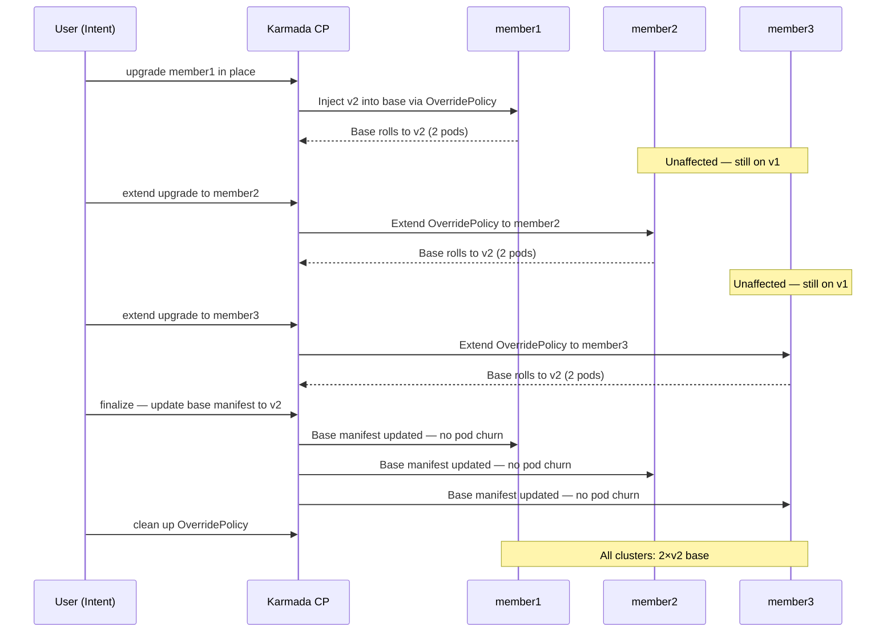
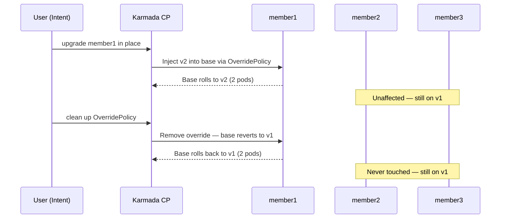

> Back to [Progressive Rollout Strategies overview](./overview).

**Goal**: controlled, pod-by-pod upgrade of the base `Deployment` using native Kubernetes
rolling update semantics, cluster by cluster — no separate canary `Deployment` required.

### How it works

Unlike Strategy 1, which deploys a separate canary `Deployment` alongside the base, the
rolling upgrade patches the base `Deployment` directly via an `OverridePolicy`. The local
Kubernetes controller inside each target cluster handles the rolling update, respecting the
`maxSurge` and `maxUnavailable` settings already configured on the `Deployment`. You can
upgrade one cluster first, observe, then extend to remaining clusters — or roll back at any
point before the change spreads further.

The `OverridePolicy` used for the rolling upgrade strategy is functionally identical to the
canary `http-probe-promote-override` `OverridePolicy`: both override the application
environment variable `ROLLOUT_LABEL` with the value `v2`. The only distinction lies in the
policy naming — we name it `http-probe-rolling-upgrade` merely for differentiation purposes.
The two policies are independent of each other. They can either be merged by combining their
`overrideRules.targetCluster` configurations, or coexist as-is: a rolling upgrade can run
on some clusters while a canary deployment runs on others simultaneously.

> **Controlling rollout speed:** with this strategy the only way to influence how fast or
> slow the rolling update progresses within a cluster is by tuning three parameters on the
> `Deployment` spec:
>
> - `spec.strategy.rollingUpdate.maxSurge` — how many extra pods can exist above the desired
>   count during the update. With `maxSurge: 1` only one new pod is created at a time.
> - `spec.strategy.rollingUpdate.maxUnavailable` — how many pods can be unavailable during
>   the update. With `maxUnavailable: 0` no pod is terminated until its replacement is ready.
> - `spec.template.spec.containers[].readinessProbe.initialDelaySeconds` — how long
>   Kubernetes waits before starting readiness checks on a new pod. Together with
>   `periodSeconds` this determines the minimum time each pod takes to be declared ready,
>   which gates when the next pod starts rolling.
>
> With `maxUnavailable: 0` and `maxSurge: 1` (the settings used in this tutorial), pods roll
> one at a time and each must pass its readiness probe before the next starts — giving you
> fine-grained control per pod but no way to express a target traffic percentage explicitly.
> If explicit percentage-based traffic control is a requirement, see
> [Strategy 3 — Percentage-based Shifting (Wave Rollout)](./wave-rollout)
> which achieves approximate traffic percentages by balancing replica counts across two
> Deployments.


### Demo 1 — Rolling upgrade one cluster, extend to region

Upgrade `member1` first and observe the in-place roll, then extend to the full region
cluster by cluster and finalize.

The steps we will execute are:

1. Apply an `OverridePolicy` targeting `member1` — base rolls to `v2` in place
2. Extend the `OverridePolicy` to `member2` — base rolls to `v2` in place
3. Extend the `OverridePolicy` to all three clusters — `member3` rolls to `v2`
4. Finalize — update the base manifest to `v2`, delete the `OverridePolicy` (zero-churn)

The following diagram depicts the full sequence of operations:



> **Note:** Before running Demo 1, ensure the cluster is on `v1`:
>
> ```shell
> kubectl apply -f base/http-probe-app.yaml
> ```

#### Step 1: Upgrade the base on member1

Apply the rolling upgrade `OverridePolicy` targeting `member1`. Karmada patches the base
`Deployment` spec on `member1` — the local Kubernetes controller triggers a standard rolling
update replacing pods one by one.

<details>
<summary>http-probe-rolling-upgrade-member1.yaml</summary>

```yaml
apiVersion: policy.karmada.io/v1alpha1
kind: OverridePolicy
metadata:
  name: http-probe-rolling-upgrade
spec:
  resourceSelectors:
    - apiVersion: apps/v1
      kind: Deployment
      name: http-probe-app
  overrideRules:
    - targetCluster:
        clusterNames:
          - member1
      overriders:
        plaintext:
          - path: /spec/template/spec/containers/0/env/0/value
            operator: replace
            value: v2
```

</details>

```shell
kubectl apply -f rolling-upgrade/http-probe-rolling-upgrade-member1.yaml
```

Watch the base Deployment roll on `member1`:

```shell
kubectl --kubeconfig ~/.kube/members.config --context member1 \
  rollout status deployment/http-probe-app
```

**What to observe in the dashboard:**

- **Replica panel**: the pods in `member1` roll in place — there are no separate canary
  pods. During the transition a mix of yellow `●` (v2) and green `○` (v1) pods is visible
  in the `member1` column as Kubernetes replaces them one by one. Once complete, the entire
  `member1` column shows yellow `●`. The `member2` and `member3` columns remain fully green
  throughout.
- **Traffic panel**: the `member1` column shows a growing proportion of yellow-highlighted
  responses as pods are replaced. The `member2` and `member3` columns remain fully white.

#### Step 2: Extend the upgrade to member2

Apply the same `OverridePolicy` with `member1` and `member2` in `clusterNames`. Karmada
patches the existing policy in place and triggers the rolling update on `member2`.

```shell
kubectl apply -f rolling-upgrade/http-probe-rolling-upgrade-member1-member2.yaml
```

Watch the base Deployment roll on `member2`:

```shell
kubectl --kubeconfig ~/.kube/members.config --context member2 \
  rollout status deployment/http-probe-app
```

**What to observe in the dashboard:**

- **Replica panel**: the `member2` column transitions through the same rolling pattern —
  a mix of yellow `●` and green `○` pods visible during the update. The `member1` column
  is already fully yellow and unchanged. The `member3` column remains fully green.
- **Traffic panel**: yellow-highlighted responses spread to the `member2` column as pods
  roll. The `member3` column remains fully white.

#### Step 3: Extend the upgrade to member3

Apply the `OverridePolicy` with all three clusters in `clusterNames`.

```shell
kubectl apply -f rolling-upgrade/http-probe-rolling-upgrade-all.yaml
```

Watch the base Deployment roll on `member3`:

```shell
kubectl --kubeconfig ~/.kube/members.config --context member3 \
  rollout status deployment/http-probe-app
```

**What to observe in the dashboard:**

- **Replica panel**: the `member3` column transitions through the rolling pattern. Once
  complete, all three columns show only yellow `●` pods — all base pods across the region
  are on `v2`.
- **Traffic panel**: all three columns are fully yellow — every response carries `v2`.

#### Step 4: Finalize the upgrade

Update the base manifest to `v2` and delete the `OverridePolicy`. Because all clusters are
already running `v2` via the override, updating the base manifest is a no-op at the pod
level — **no pods are restarted**.

```shell
kubectl apply -f base/http-probe-app-v2.yaml
kubectl delete overridepolicy http-probe-rolling-upgrade
```

Verify all clusters are on `v2`:

```shell
kubectl get resourcebinding http-probe-app-deployment -o jsonpath=\
'{range .status.aggregatedStatus[*]}{.clusterName}: {.health}  ready={.status.readyReplicas}/{.status.replicas}{"\n"}{end}'
```

Expected output:

```
member1: Healthy  ready=2/2
member2: Healthy  ready=2/2
member3: Healthy  ready=2/2
```

**What to observe in the dashboard:**

- **Replica panel**: all pods remain yellow `●` then settle back to green `○` — no pod
  churn occurs. The `OverridePolicy` already had all clusters on `v2`; updating the base
  manifest is purely a source-of-truth update.
- **Traffic panel**: all three columns continue serving `v2` without interruption. The
  bottom bar legend disappears — no two versions are present simultaneously.

---

### Demo 2 — Rolling upgrade one cluster, rollback

Upgrade `member1`, observe a problem, and roll it back — demonstrating that a rolling
upgrade can be safely aborted on any cluster before it spreads to others.

The steps we will execute are:

1. Apply an `OverridePolicy` targeting `member1` — base rolls to `v2` in place
2. Roll back by deleting the `OverridePolicy` — base on `member1` rolls back to `v1`

The following diagram depicts the full sequence of operations:



> **Note:** Before running Demo 2, ensure the cluster is on `v1`:
>
> ```shell
> kubectl apply -f base/http-probe-app.yaml
> ```

#### Step 1: Upgrade the base on member1

```shell
kubectl apply -f rolling-upgrade/http-probe-rolling-upgrade-member1.yaml
```

Watch the base Deployment roll on `member1`:

```shell
kubectl --kubeconfig ~/.kube/members.config --context member1 \
  rollout status deployment/http-probe-app
```

**What to observe in the dashboard:**

- **Replica panel**: pods in `member1` roll in place from green `○` to yellow `●` one by
  one. The `member2` and `member3` columns remain fully green throughout.
- **Traffic panel**: the `member1` column shows a growing proportion of yellow responses.
  The `member2` and `member3` columns remain fully white.

#### Step 2: Roll back the upgrade on member1

Delete the `OverridePolicy`. Karmada removes the patch and Kubernetes rolls the base
`Deployment` on `member1` back to the version declared in the base manifest (`v1`).
`member2` and `member3` are untouched — they were never part of the `OverridePolicy`.

```shell
kubectl delete overridepolicy http-probe-rolling-upgrade
```

Watch the rollback on `member1`:

```shell
kubectl --kubeconfig ~/.kube/members.config --context member1 \
  rollout status deployment/http-probe-app
```

**What to observe in the dashboard:**

- **Replica panel**: pods in `member1` roll back to `v1` one by one — a brief mix of yellow
  `●` and green `○` is visible during the transition. Once complete, all three columns are
  fully green `○` — the region is back on `v1` with no `OverridePolicy` in place.
- **Traffic panel**: the `member1` column returns to fully white responses. All three columns
  are uniform white once the rollback completes.

> Deleting the `OverridePolicy` is the complete rollback operation — no additional cleanup
> is needed. The base manifest remains at `v1` and the region converges to it immediately.

---