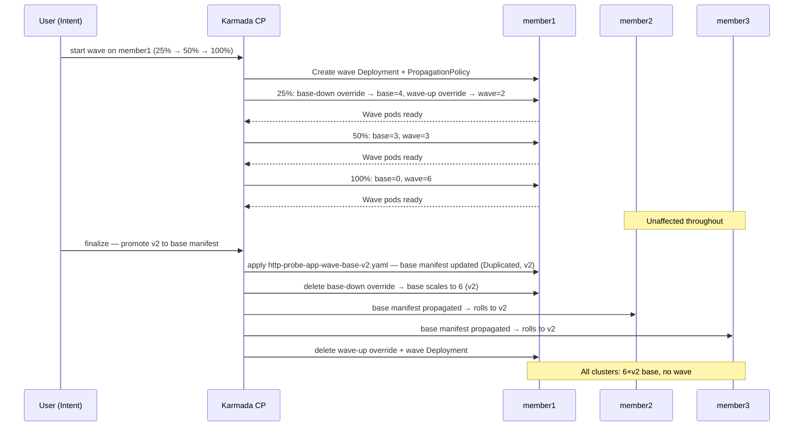
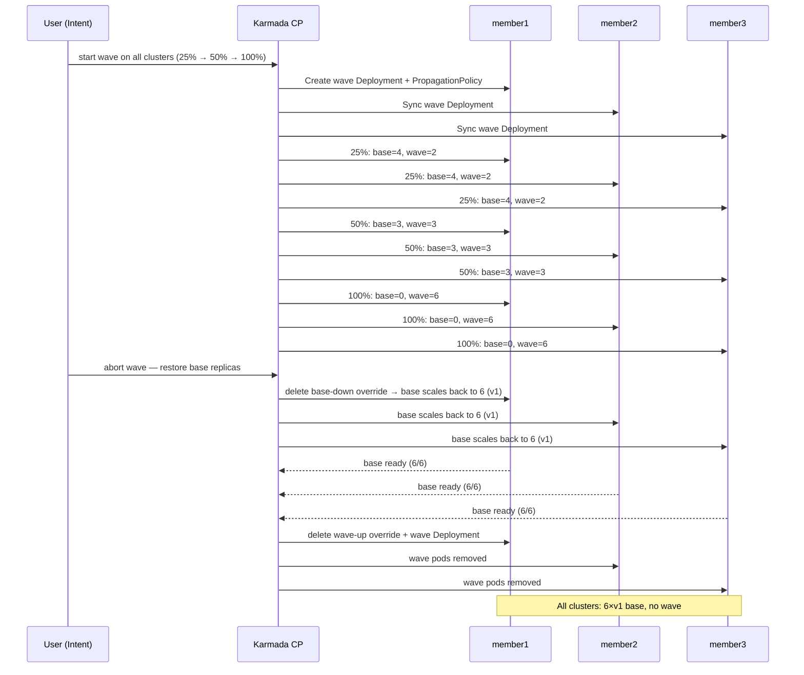

> Back to [Progressive Rollout Strategies overview](./overview).

**Goal**: shift traffic progressively between two versions by balancing replica counts across
two `Deployment` objects simultaneously — achieving approximate percentage-based traffic
migration without ingress weight annotations or a dedicated rollout controller.

### How it works

Both Strategy 1 (canary) and Strategy 2 (rolling upgrade) change the version of the base
`Deployment` — either by deploying a separate canary alongside it or by patching it in
place. The wave strategy takes a different approach: the base `Deployment` keeps running
`v1` while a second `Deployment` (`http-probe-app-wave`) brings up `v2` in parallel.
Traffic shifts from old to new as pod counts are gradually adjusted — the base shrinks while
the wave grows.

Traffic splitting is driven entirely by pod count. Both `Deployments` share the same
`Service` selector (`app: http-probe-app`), so Kubernetes load-balances across all matching
pods proportionally. There are no ingress weight annotations involved — the percentage is
approximate and depends on how cleanly the replica counts divide.

Two `OverridePolicy` resources work in tandem:

- `http-probe-wave-base-down` — scales the base `Deployment` down step by step
- `http-probe-wave-up` — scales the wave `Deployment` up step by step

The orchestration is handled by [`wave-rollout.sh`](../../resources/tutorials/rollout/progressive/wave-rollout.sh), which patches both policies at each
step and waits for pod readiness before advancing.

> **Prerequisites for this strategy:** the wave demo requires 6 replicas per cluster to
> make the percentage steps (25%/50%/100%) meaningful. Strategies 1 and 2 use
> `replicaSchedulingType: Divided` (6 replicas split across 3 clusters = 2 per cluster),
> which does not produce clean integer replica counts at each wave step. A dedicated
> manifest `http-probe-app-wave-base.yaml` is provided for this strategy — it is identical
> to `http-probe-app.yaml` except it uses `replicaSchedulingType: Duplicated`, giving each
> member cluster a full 6 replicas independently. If the app is already deployed from a
> previous strategy, delete it first to avoid state conflicts, then apply the wave base
> manifest:
>
> `wave-rollout.sh` reads YAML files relative to its own location. Ensure you have already
> cloned the website repository and are running all commands from
> `docs/resources/tutorials/rollout/progressive/` as described in the
> [overview prerequisites](./overview#website-repository-cloned). Then apply the wave base
> manifest:
>
> ```shell
> kubectl delete -f base/http-probe-app.yaml --ignore-not-found
> kubectl apply -f wave/http-probe-app-wave-base.yaml
> ```
>


With 6 replicas per cluster (via `Duplicated` scheduling), the progression is:

| Step | Base replicas | Wave replicas | Approx. traffic share |
|------|--------------|---------------|----------------------|
| Initial | 6 | 0 | 100% base (v1) |
| 25% | 4 | 2 | ~33% wave (v2) |
| 50% | 3 | 3 | 50% wave (v2) |
| 100% | 0 | 6 | 100% wave (v2) |

> **Note on pod churn at finalization**: when `finalize` is called, the `base-down`
> `OverridePolicy` is deleted, releasing the base `Deployment` replica count. The base pods
> scale back up running `v2` (from the updated base manifest), and then the wave pods are
> deleted. This causes a brief period of over-provisioning — both base and wave pods running
> simultaneously — before the wave is cleaned up. This is an inherent artifact of balancing
> two separate `Deployment` objects; Karmada has no mechanism to transfer pod ownership
> between them.

### Demo 1 — Wave rollout on member1, then finalize

Progress `v2` through percentage steps on `member1` only, then finalize to promote `v2`
to the base manifest across the full region.

The steps we will execute are:

1. Run `wave-rollout.sh start member1 25,50,100` — creates the wave `Deployment`, steps
   through 25%, 50% and 100%
2. Run `wave-rollout.sh finalize` — updates base manifest to `v2`, removes wave resources

The following diagram depicts the full sequence of operations:



> **Note:** Before running Demo 1, ensure the cluster is on `v1` with `Duplicated`
> scheduling (see prerequisites above):
>
> ```shell
> kubectl apply -f wave/http-probe-app-wave-base.yaml
> ```

#### Step 1: Start the wave on member1

```shell
./wave-rollout.sh start member1 25,50,100
```

The script is long-running — it does not return until all steps have completed. Observe the
dashboard while it progresses. The `--wait` flag controls how long the script pauses at each
step before advancing (default: 30 seconds):

```shell
./wave-rollout.sh start member1 25,50,100 --wait 60
```

> **Note:** The script prints every YAML manifest it applies to the terminal as it runs —
> watch the output to follow exactly what Karmada objects are being created or patched at
> each step.

**What to observe at 25%** (base=4, wave=2 on member1):

- **Replica panel**: 2 wave pods (yellow `●`) appear in the `member1` column alongside 4
  remaining base pods (green `○`). The `member2` and `member3` columns are unaffected.
- **Traffic panel**: the `member1` column begins showing yellow-highlighted responses as
  approximately 1 in 3 requests land on wave pods. The `member2` and `member3` columns
  remain fully white.

**What to observe at 50%** (base=3, wave=3 on member1):

- **Replica panel**: wave and base pods are balanced — 3 yellow `●` and 3 green `○` in the
  `member1` column.
- **Traffic panel**: approximately half the responses in the `member1` column are
  yellow-highlighted.

**What to observe at 100%** (base=0, wave=6 on member1):

- **Replica panel**: all 6 pods in the `member1` column are wave pods (yellow `●`). The
  base has been scaled to 0 by the `base-down` `OverridePolicy`.
- **Traffic panel**: the `member1` column is fully yellow — 100% of traffic is served by
  the wave.

#### Step 2: Finalize the wave

Once satisfied with the wave, finalize to update the base manifest to `v2` and remove all
wave resources.

```shell
./wave-rollout.sh finalize
```

**What to observe in the dashboard:**

- **Replica panel** (`member1`): the `base-down` `OverridePolicy` is deleted, releasing the
  base `Deployment` replica count. Base pods scale back up to 6 running `v2`. The wave pods
  are then deleted. During the brief handoff both base (yellow `●`, scaling up) and wave
  (yellow `●`, scaling down) pods may be visible simultaneously — all on `v2`, so traffic
  is never interrupted.
- **Replica panel** (`member2` and `member3`): these columns begin rolling to `v2` via a
  standard in-place rolling update — triggered by the base manifest update propagating to
  all clusters. You will see a mix of yellow `●` and green `○` pods during the transition.
- **Traffic panel**: all three columns transition to fully yellow as each cluster completes
  its roll. The bottom bar legend disappears once all pods are on the same version.

> **Important side effect**: finalizing a wave on one cluster updates the base manifest and
> propagates it to all clusters via the `PropagationPolicy`. `member2` and `member3` receive
> a direct in-place rolling upgrade — no wave, no canary. If you want to wave all clusters
> independently before finalizing, use Demo 2 instead.

---

### Demo 2 — Wave rollout across all clusters, then abort

Progress `v2` through percentage steps on all three clusters simultaneously, then abort
mid-wave to restore the base — demonstrating safe recovery at any point.

The steps we will execute are:

1. Run `wave-rollout.sh start all 25,50,100` — wave progresses across all three clusters in
   lockstep
2. Run `wave-rollout.sh abort all` — restores base replicas and removes all wave resources

The following diagram depicts the full sequence of operations:



> **Note:** Before running Demo 2, ensure the cluster is on `v1` with `Duplicated`
> scheduling (see prerequisites above):
>
> ```shell
> kubectl apply -f wave/http-probe-app-wave-base.yaml
> ```

#### Step 1: Start the wave across all clusters

```shell
./wave-rollout.sh start all 25,50,100
```

> **Note:** The script prints every YAML manifest it applies to the terminal as it runs —
> watch the output to follow exactly what Karmada objects are being created or patched at
> each step.

**What to observe at 25%** (base=4, wave=2 per cluster):

- **Replica panel**: 2 wave pods (yellow `●`) appear in all three columns simultaneously
  alongside 4 remaining base pods (green `○`). All three clusters progress in lockstep — a
  single `OverridePolicy` covers all three clusters.
- **Traffic panel**: yellow-highlighted responses appear in all three columns at the same
  time — approximately 1 in 3 responses in each column land on wave pods.

**What to observe at 50%** (base=3, wave=3 per cluster):

- **Replica panel**: wave and base pods are balanced — 3 yellow `●` and 3 green `○` in
  each column simultaneously.
- **Traffic panel**: approximately half the responses in each column are yellow-highlighted.

**What to observe at 100%** (base=0, wave=6 per cluster):

- **Replica panel**: all 6 pods in all three columns are wave pods (yellow `●`). Base pods
  have been scaled to 0 across the entire region.
- **Traffic panel**: all three columns are fully yellow — 100% of traffic is served by the
  wave across the region.

#### Step 2: Abort the wave

Abort to restore the base `Deployment` and remove all wave resources. The base manifest
version is not changed — the region returns to `v1`.

```shell
./wave-rollout.sh abort all
```

**What to observe in the dashboard:**

- **Replica panel**: wave pods (yellow `●`) disappear from all three columns as the
  `wave-up` `OverridePolicy` is deleted. Base pods (green `○`) scale back up to 6 per
  cluster as the `base-down` `OverridePolicy` is removed. During the brief restore period
  a mix of old base pods scaling up and remaining wave pods scaling down may be visible.
- **Traffic panel**: all three columns return to fully white stable responses once the base
  is fully restored. The bottom bar legend disappears.

> `abort` is safe to run at any point during a wave — whether at 50%, 100%, or mid-step.
> It always restores the base replica count and removes all temporary wave resources. The
> base manifest version is unchanged — the region converges back to `v1` immediately.

---