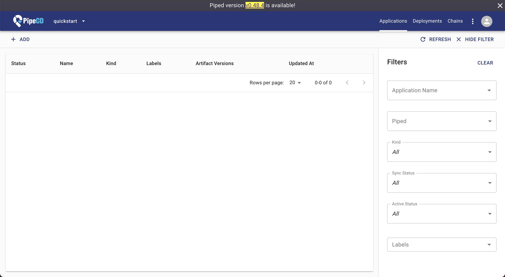
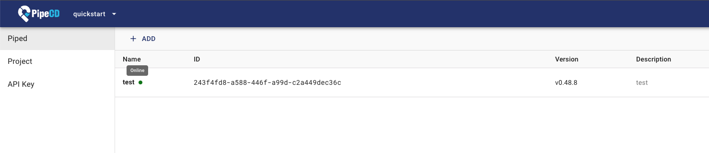
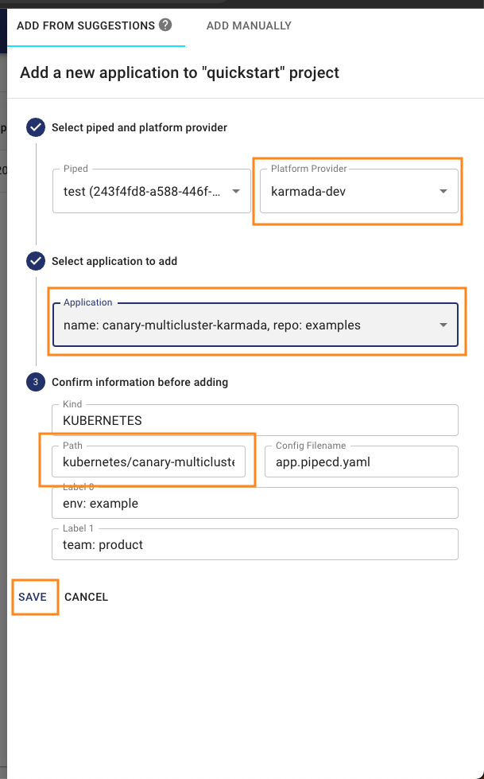
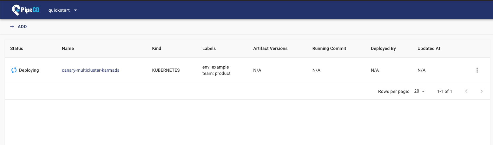
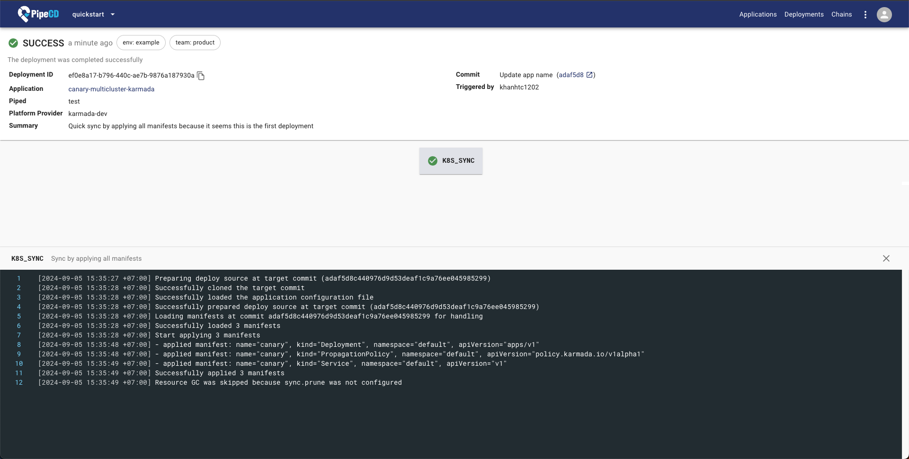
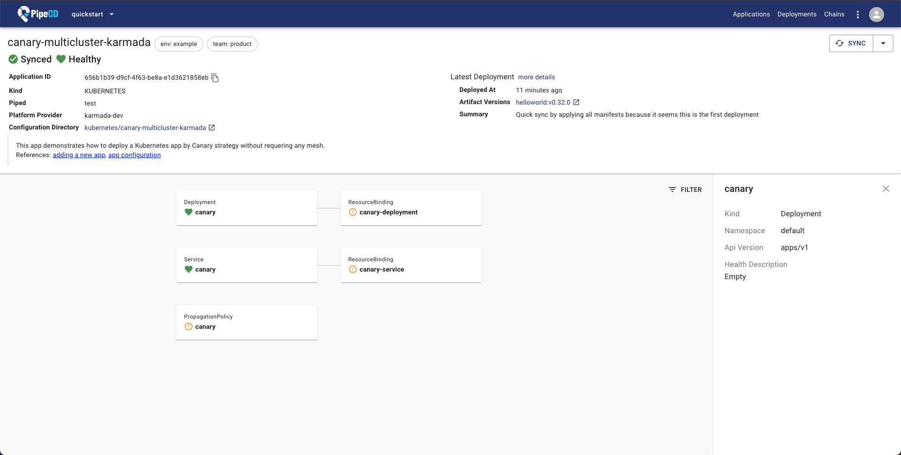

This topic walks you through how to use the [PipeCD](https://github.com/pipe-cd/pipecd/) to manage your workload
`across clusters` with `Karmada`.

## Prerequisites
### PipeCD Installation

For the purpose of this example, you can install PipeCD follow the [Quickstart](https://pipecd.dev/docs/quickstart/) instructions.

You can access to `localhost:8080`, login and get the following UI to confirm PipeCD is ready.



### Karmada Installation
In this example, we are using a Karmada environment with at least `3` member clusters joined.

You can set up the environment by `hack/local-up-karmada.sh`, which is also used to run our E2E cases.

```bash
$ kubectl get clusters
NAME      VERSION   MODE   READY   AGE
member1   v1.19.1   Push   True    18h
member2   v1.19.1   Push   True    18h
member3   v1.19.1   Pull   True    17h
```

## Install and configure PipeCD agent (piped) to make it works with Karmada

This step install the PipeCD agent `piped` and configure it to connect the Karmada API server.

In this example, for simplicity we follow the instruction at [Install piped on a single machine](https://pipecd.dev/docs/installation/install-piped/installing-on-single-machine/). The piped will be installed in your local machine, and use the `karmada-apiserver` context to connect with the Karmada control plane.

Access [localhost:8080/settings/piped?project=quickstart](http://localhost:8080/settings/piped?project=quickstart) from your browser, and register information for a new piped.

Prepare piped configuration yaml as below and save it as `piped-config.yaml`

```yaml
apiVersion: pipecd.dev/v1beta1
kind: Piped
spec:
  projectID: quickstart
  pipedID: <YOUR_PIPED_ID>
  pipedKeyData: <YOUR_PIPED_KEY_DATA>
  apiAddress: localhost:8080
  syncInterval: 1m
  repositories:
    - repoId: examples
      remote: <YOUR_MANIFEST_REPO_URL>
      branch: master
  platformProviders:
    - name: karmada-dev
      type: KUBERNETES
      config:
        kubeConfigPath: $HOME/.kube/karmada.config
        appStateInformer:
          includeResources:
            - apiVersion: policy.karmada.io/v1alpha1
              kind: PropagationPolicy
            - apiVersion: work.karmada.io/v1alpha2
              kind: ResourceBinding
            - apiVersion: work.karmada.io/v1alpha1
              kind: Work
```

For `<YOUR_PIPED_ID>` and `<YOUR_PIPED_KEY_DATA>`, please refer to [installing piped](https://pipecd.dev/docs-v0.48.x/quickstart/#12-installing-piped) docs.

For the `<YOUR_MANIFEST_REPO_URL>` you can fork from [the PipeCD examples repo](https://github.com/pipe-cd/examples).

Next, download the piped binary from the PipeCD official GitHub repo

```bash
# OS="darwin" or "linux"
$ curl -Lo ./piped https://github.com/pipe-cd/pipecd/releases/download/v0.48.8/piped_v0.48.8_{OS}_amd64
$ chmod +x piped
```

Then you can start running your piped agent on your machine, which can connect to the PipeCD control plane dashboard and delivery your application to the Karmada fleet clusters.

```bash
$ ./piped piped --config-file=piped-config.yaml --insecure=true
```

Note: The `--insecure=true` is required since we connect to the PipeCD control plane without SSL in the quickstart mode.

Once, your piped is ready, you can see its status in the [localhost:8080/settings/piped?project=quickstart](http://localhost:8080/settings/piped?project=quickstart) page as below



## Creating Apps Via UI

### Preparing Apps

In the previous step, suppose you prepared a manifest repository under `<YOUR_MANIFEST_REPO_URL>`.

Next, you have to prepare a directory contains manifests for your application like this [canary-multicluster-karmada](https://github.com/khanhtc1202/pipecd-examples/tree/master/kubernetes/canary-multicluster-karmada) directory.

This directory includes:
- `app.pipecd.yaml`: configuration used by piped to perform deploy tasks
- `propagationpolicy.yaml`: configuration used by Karmada to delivery your app resources to member clusters
- `deployment and service`: raw Kubernetes manifests

### Creating Apps

Access [localhost:8080/applications?project=quickstart](http://localhost:8080/applications?project=quickstart) to create a new application.

Click the `+ADD` button as shown below:


From the `ADD FROM SUGGESTIONS` form, select value from selection box to register your application information as show in the picture




Click `SAVE` in the form and confirmation box, and your app will be registered successfully and ready to go.


### Syncing Apps

You don't need to do anything! After registered the application, PipeCD will automatically trigger the first deployment for it under Quick Sync strategy (for more about PipeCD sync strategy, refer to [docs](https://pipecd.dev/docs-v0.48.x/concepts/#sync-strategy)).



You can check the detailed log of the deployment by access [localhost:8080/deployments?project=quickstart](http://localhost:8080/deployments?project=quickstart), then navigate to your application deployment detail page.



PipeCD supports many approach to trigger new deployment for your application, please refer to [trigger deployment docs](https://pipecd.dev/docs/user-guide/managing-application/triggering-a-deployment/).

### Check detailed status

Via the PipeCD control plane application detailed page, you can check the application resources status.

Access [localhost:8080/applications?project=quickstart](http://localhost:8080/applications?project=quickstart) and navigate to your application page for detail.



That's all!
