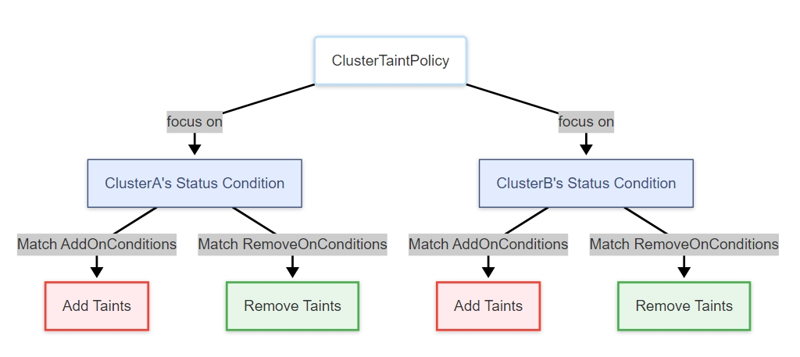

Taints in a cluster, specifically configured in the `.spec.taints` field of the `Cluster` object, have a significant impact
on application scheduling and execution. For instance, if a cluster has a `NoSchedule` taint, it can prevent new applications
from being scheduled onto that cluster. The effect of a taint on an application depends on the `Effect` configuration of
the taint.

Karmada supports different types of taints based on their `Effect` values:
- `NoSchedule`: Prevents new applications from scheduling to the cluster unless the application explicitly tolerates it.
- `NoExecute`: Prevents new scheduling **and evicts existing applications** from the cluster unless the application explicitly
tolerates it.

Note that the eviction feature of NoExecute is disabled by default, to enable it, you need to use the `--enable-no-execute-taint-eviction=true`
flag in the `karmada-controller-manager` and also explicitly enable the `Failover` feature gate.

This document explains how Karmada manages taints on clusters, including
- Customized taint management based on cluster conditions.
- Taints managed by the Karmada system.
- Configuring application tolerations to bypass taint effects.

## Customized Taint Management

The `ClusterTaintPolicy` API allows administrators to define rules for applying or removing taints from clusters based on
specific conditions. This is particularly useful for implementing advanced scheduling policies or failover strategies.

Cluster conditions can be determined not only by the Karmada system but also by any third-party system. This offers administrators
great flexibility in defining cluster health criteria. For example, the Karmada system set the `Ready` condition based on
its built-in health checks. However, a third-party system can introduce additional conditions, such as `SchedulerDown`,
to indicate that the cluster scheduler is non-functional. When combined with `ClusterTaintPolicy`, these custom conditions
can be used to prevent new applications from being scheduled onto affected clusters, providing more granular control over
application placement and enhancing overall system reliability.



The `ClusterTaintPolicy` is a cluster-scoped resource, its apiVersion is `policy.karmada.io/v1alpha1`.

The following is an example of a `ClusterTaintPolicy` that adds or remove taints to the target cluster:

```yaml
apiVersion: policy.karmada.io/v1alpha1
kind: ClusterTaintPolicy
metadata:
  name: foo
spec:
  targetClusters:
    clusterNames:
    - member1
    - member2
  addOnConditions:
  - conditionType: KubeComponentsHealthy
    operator: NotIn
    statusValues:
    - "True"
  removeOnConditions:
  - conditionType: KubeComponentsHealthy
    operator: In
    statusValues:
    - "True"
  taints:
  - key: kube-components-unhealthy
    effect: NoSchedule
```

This above YAML defines a ClusterTaintPolicy named `foo` that manages taints on clusters `member1` and `member2`. It adds
a `NoSchedule` taint with key `kube-component-unhealthy` when the `KubeComponentsHealthy` condition is `False`and removes
the taint when `KubeComponentsHealthy` is `True`.

This ensures applications are not scheduled to clusters with non-functional Kubernetes components, enhancing multi-cluster
reliability by allowing automatic rescheduling to healthy clusters.

### Select a group of target clusters

`TargetClusters` field specifies the clusters that `ClusterTaintPolicy` needs to pay attention to. It uses the `ClusterAffinity`
structure from the `PropagationPolicy` API to select target clusters. The usage is identical, so you can directly refer to
[its documentation](../scheduling/resource-propagating#deploy-deployment-into-a-specified-set-of-target-clusters)
for user-guide.

> Note: If you modify the `TargetClusters` field or change the label of the clusters such that no longer match the ClusterTaintPolicy's
criteria, existing taints previously added by this ClusterTaintPolicy will not be automatically removed.

### Add On Match Conditions

`AddOnConditions` field defines the conditions to match for triggering the system to add taints on the cluster object. The
match conditions are ANDed. If `AddOnConditions` is empty, no taints will be added.

It can be configured as follows:

```yaml
apiVersion: policy.karmada.io/v1alpha1
kind: ClusterTaintPolicy
metadata:
  name: foo
spec:
  #...
  addOnConditions:
  - conditionType: Ready
    operator: NotIn
    statusValues:
    - "True"
  - conditionType: NetworkAvailable
    operator: NotIn
    statusValues:
    - "True"
  #...
```

The above example specifies that when the cluster's status conditions meet:
- `Ready` condition value is **not** True **AND**
- `NetworkAvailable` condition value is **not** True,

the policy will add taints to the target cluster defined in the `TargetClusters` field.

### Remove On Match Conditions

`RemoveOnConditions` field defines the conditions to match for triggering the system to remove taints from the cluster
object. The match conditions are ANDed. If `RemoveOnConditions` is empty, no taints will be removed.

It can be configured as follows:

```yaml
apiVersion: policy.karmada.io/v1alpha1
kind: ClusterTaintPolicy
metadata:
  name: foo
spec:
  #...
  removeOnConditions:
  - conditionType: Ready
    operator: In
    statusValues:
    - "True"
  - conditionType: NetworkAvailable
    operator: In
    statusValues:
    - "True"
  #...
```

The above example specifies that when the cluster's status conditions meet:
- `Ready` condition value is **True** **AND**
- `NetworkAvailable` condition value is **True**,

the policy will remove taints from the target cluster.

> Note: When the controller reconciles a ClusterTaintPolicy, it first evaluates `AddOnConditions` to determine which taints
should be added to target clusters, then turn to `RemoveOnConditions` to identify taints for removal, applying all changes
atomically in a single operation. This sequence means that if a taint is both expected for addition via `AddOnConditions`
and removal via `RemoveOnConditions`, the removal takes precedence in the final state. To avoid scenarios where expected
taints fail to be applied, ensure that conditions for adding and removing the same taint are mutually exclusive, as overlapping
configurations can lead to unintended behavior during the reconciliation process.

### Configure Taints

`Taints` field specifies the taints that need to be added or removed on the cluster object which match with `TargetClusters`.

It can be configured as follows:

```yaml
apiVersion: policy.karmada.io/v1alpha1
kind: ClusterTaintPolicy
metadata:
  name: foo
spec:
  #...
  taints:
  - key: not-ready
    effect: NoSchedule
  - key: not-ready
    effect: NoExecute
  #...
```

- When the cluster's status conditions simultaneously meet the `AddOnConditions`, the policy will add taints to the target
cluster.
- When the cluster's status conditions simultaneously meet the `RemoveOnConditions`, the policy will remove taints from
the target cluster.

> Note: Modifying the taints field in a ClusterTaintPolicy (e.g., removing a taint definition) does not automatically
clear existing taints applied by the policy. The controller only manages taints based on the updated configuration.

> Note: Deleting a ClusterTaintPolicy does not automatically clear existing taints applied by the policy.

### Allow NoExecute Effect Taint

Given the significant impact of `NoExecute` taints, which evict all applications that cannot tolerate the taint from the
entire cluster, using `ClusterTaintPolicy` to configure `NoExecute` taints is disabled by default. This precaution prevents
accidental widespread disruptions. To enable this capability, you must explicitly configure the `karmada-webhook` component
to allow `NoExecute` taint configurations:

- karmada-webhook

  ```
  --allow-no-execute-taint-policy bool: Allows configuring taints with NoExecute effect in ClusterTaintPolicy. Given the impact of NoExecute, applying such a taint to a cluster may trigger the eviction of workloads that do not explicitly tolerate it, potentially causing unexpected service disruptions.
   This parameter is designed to remain disabled by default and requires careful evaluation by administrators before being enabled.
  ```

In order to let `NoExecute` effect, after configuring `--allow-no-execute-taint-policy=true` in the `karmada-webhook`, you
also need to configure the following parameter in the `karmada-controller-manager` component:

- karmada-controller-manager:

  ```
  --enable-no-execute-taint-eviction bool: Enables controller response to NoExecute taints on clusters, which triggers eviction of workloads without explicit tolerations. Given the impact of eviction caused by NoExecute Taint.
  This parameter is designed to remain disabled by default and requires careful evaluation by administrators before being enabled.
  ```

### Failover FeatureGate

The cluster taint management capability requires the **Failover FeatureGate** to be enabled. **Failover FeatureGate** is
currently in the **Beta** stage and is turned off by default. If you want to enable automatic taint management for clusters
via `ClusterTaintPolicy`, you can configure it in the `karmada-controller-manager` as follows:

```
--feature-gates=Failover=true
```

## Taints Managed by Karmada System

The taints with the **NoSchedule** effect that are automatically handled by the `cluster-controller` in the current Karmada
system are as follows:

| Taint Key                      | When was added                                 | When to be cleared                                     |
|--------------------------------|------------------------------------------------|--------------------------------------------------------|
| cluster.karmada.io/unreachable | When the Ready Condition of cluster is Unknown | When the Ready Condition of cluster is True or False   |
| cluster.karmada.io/not-ready   | When the Ready Condition of cluster is False   | When the Ready Condition of cluster is True or Unknown |

Prior to v1.14, Karmada automatically added or removed taints based on cluster status conditions change. Starting with v1.14,
Karmada no longer performs automatic `NoExecute` effect taint management.

## Configuring Application Tolerations

Taints on the cluster object can be tolerated by workloads, which is defined in the [`.spec.placement.clusterTolerations` field of PropagationPolicy/ClusterPropagationPolicy](../scheduling/resource-propagating#schedule-based-on-taints-and-tolerations).

When a workload tolerates a **NoSchedule** taint, the workload will be able to schedule to the cluster even if the cluster
has the **NoSchedule** taint.

When a workload tolerates a **NoExecute** taint, the workload can be able to still run on the cluster even if the cluster
has the **NoExecute** taint.
