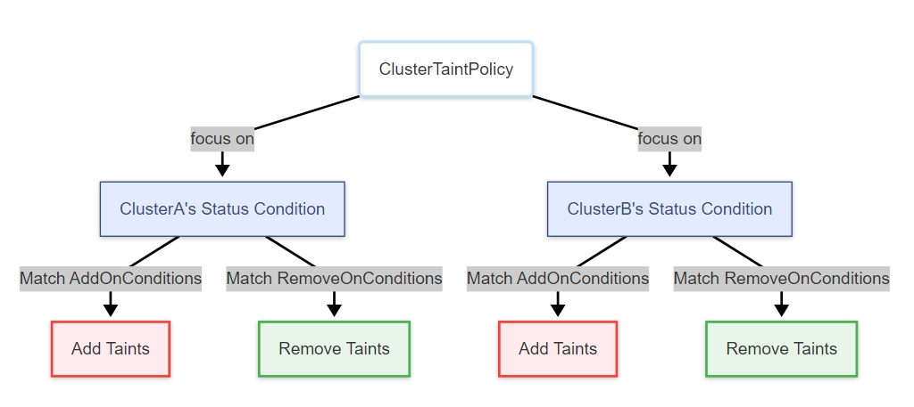

The Karmada system uses cluster taints to influence the scheduling behavior of new applications on target clusters and to trigger the migration of applications already running on those clusters. For example:
When a cluster has a taint with the NoExecute effect:
- If the user has not configured corresponding taint tolerations in the PropagationPolicy resource, resources propagated through that policy will be prevented from being scheduled to the cluster.
- Additionally, if applications running on the cluster do not tolerate this taint, the Karmada system will trigger their migration.

Currently, the Karmada system supports two types of effect taints: **NoSchedule** and **NoExecute**:
- **NoSchedule**: Affects the scheduling of new applications. When a cluster has taint{effect: NoSchedule}, newly created applications will not be scheduled to this cluster.
- **NoExecute**: Affects both the scheduling and execution of all applications. This is a hard eviction policy — if a cluster has taint{effect: NoExecute}, not only will newly create applications be prevented from being scheduled to this cluster, but existing applications on the cluster will also be migrated.

To streamline automated management of cluster taints, Karmada introduced the **ClusterTaintPolicy** resource in version v1.14. Administrators can customize the failure judgment logic of clusters - i.e., "how to taint a cluster based on conditions" - by configuring ClusterTaintPolicy resources.

## Taint Cluster By Conditions - ClusterTaintPolicy

The ClusterTaintPolicy is a Cluster-scoped resource, its apiVersion is `policy.karmada.io/v1alpha1`. The ClusterTaintPolicy can be used to describe which taints should be added to or removed from the target cluster when the cluster status conditions meet certain criteria.



For more complex cluster failure judgment scenarios, users can directly implement a customer "cluster taint controller" to control how taints are added to or removed from Cluster objects.

### Select a group of target clusters

`TargetClusters` field specifies the clusters that ClusterTaintPolicy needs to pay attention to. It uses the ClusterAffinity structure from the PropagationPolicy API to select target clusters. The usage is identical, so you can directly refer to [its documentation](https://karmada.io/docs/userguide/scheduling/resource-propagating#deploy-deployment-into-a-specified-set-of-target-clusters) for user-guide.

In addition to this, there is one thing that needs to be noted, for clusters that no longer match the `TargetClusters`, the taints will be kept unchanged.

### Add On Match Conditions

`AddOnConditions` field defines the conditions to match for triggering the `cluster-taint-policy-controller` to add taints on the cluster object. The match conditions are ANDed. If AddOnConditions is empty, no taints will be added.

It can be configured as follows:

```yaml
apiVersion: "policy.karmada.io/v1alpha1"
kind: "ClusterTaintPolicy"
metadata:
  name: "detect-cluster-notready"
spec:
  #...
  addOnConditions:
  - conditionType: "Ready"
    operator: "NotIn"
    statusValues:
    - "True"
  - conditionType: "NetworkAvailable"
    operator: "NotIn"
    statusValues:
    - "True"
  #...
```

The above example specifies that when the cluster's status conditions meet:
- Type condition value is **not** True **AND**
- NetworkAvailable condition value is **not** True,

the policy will add taints to the target cluster.

### Remove On Match Conditions

`RemoveOnConditions` field defines the conditions to match for triggering the `cluster-taint-policy-controller` to remove taints from the cluster object. The match conditions are ANDed. If RemoveOnConditions is empty, no taints will be removed.

It can be configured as follows:

```yaml
apiVersion: "policy.karmada.io/v1alpha1"
kind: "ClusterTaintPolicy"
metadata:
  name: "detect-cluster-notready"
spec:
  #...
  removeOnConditions:
  - conditionType: "Ready"
    operator: "In"
    statusValues:
    - "True"
  - conditionType: "NetworkAvailable"
    operator: "In"
    statusValues:
    - "True"
  #...
```

The above example specifies that when the cluster's status conditions meet:
- Type condition value is **True** **AND**
- NetworkAvailable condition value is **True**,

the policy will remove taints from the target cluster.

> Note: AddOnConditions are evaluated before RemoveOnConditions.

### Handle with Taints

`Taints` field specifies the taints that need to be added or removed on the cluster object which match with `TargetClusters`.

It can be configured as follows:

```yaml
apiVersion: "policy.karmada.io/v1alpha1"
kind: "ClusterTaintPolicy"
metadata:
  name: "detect-cluster-notready"
spec:
  #...
  taints:
  - key: "not-ready"
    effect: NoSchedule
  - key: "not-ready"
    effect: NoExecute
  #...
```

- When the cluster's status conditions simultaneously meet the `AddOnConditions`, the policy will add taints to the target cluster.
- When the cluster's status conditions simultaneously meet the `RemoveOnConditions`, the policy will remove taints from the target cluster.

> Note: If the Taints is modified, the system will process the taints based on the latest value of Taints during the next condition-triggered execution, regardless of whether the taint has been added or removed.

> Note: Taints are NEVER automatically removed when the ClusterTaintPolicy is deleted.

### Allow NoExecute Effect Taint

Given that the **NoExecute** taint effect can evict all resources on a cluster — resulting in drastic impacts, we have added the following parameter to the `karmada-webhook` component to control whether users are allowed to configure taints with the **NoExecute** effect in ClusterTaintPolicy:

- karmada-webhook
```
--allow-no-execute-taint-policy bool: Allows configuring taints with NoExecute effect in ClusterTaintPolicy. Given the impact of NoExecute, applying such a taint to a cluster may trigger the eviction of workloads that do not explicitly tolerate it, potentially causing unexpected service disruptions.
  This parameter is designed to remain disabled by default and requires careful evaluation by administrators before being enabled.
```

Even if users configure `--allow-no-execute-taint-policy=true` in the `karmada-webhook`, it does not guarantee that the system will act on **NoExecute** taints. Users must still pay attention to the following configurations in the `karmada-controller-manager` component:

- karmada-controller-manager：
```
--enable-no-execute-taint-eviction bool: Enables controller response to NoExecute taints on clusters, which triggers eviction of workloads without explicit tolerations. Given the impact of eviction caused by NoExecute Taint.
 This parameter is designed to remain disabled by default and requires careful evaluation by administrators before being enabled.
```

### Failover FeatureGate

The cluster taint management capability requires the **Failover FeatureGate** to be enabled. **Failover FeatureGate** is currently in the **Beta** stage and is turned off by default. If you wish to enable automatic taint management for clusters via ClusterTaintPolicy, you can configure it in the `karmada-controller-manager` as follows:

```
--feature-gates=Failover=true
```

## Cluster Taints Tolerations

Just like Kubernetes, taints on the cluster object can be tolerated by workloads, which is defined in the [`.spec.placement.clusterTolerations` field of PropagationPolicy/ClusterPropagationPolicy](https://karmada.io/docs/userguide/scheduling/resource-propagating#schedule-based-on-taints-and-tolerations).

When a workload tolerates a **NoSchedule** taint, the workload will be able to schedule to the cluster even if the cluster has the **NoSchedule** taint.

When a workload tolerates a **NoExecute** taint, the workload can be able to still run on the cluster even if the cluster has the **NoExecute** taint.

## Taints Managed by System

Currently, the Karmada system will not actively add the taint with the **NoExecute** effect to clusters, thus eliminating all implicit cluster failover behaviors in the system.

The taints with the **NoSchedule** effect that are automatically handled by the `cluster-controller` in the current Karmada system are as follows:

| Taint Key                      | When was added                                 | When to be cleared                                     |
|--------------------------------|------------------------------------------------|--------------------------------------------------------|
| cluster.karmada.io/unreachable | When the Ready Condition of cluster is Unknown | When the Ready Condition of cluster is True or False   |
| cluster.karmada.io/not-ready   | When the Ready Condition of cluster is False   | When the Ready Condition of cluster is True or Unknown |
