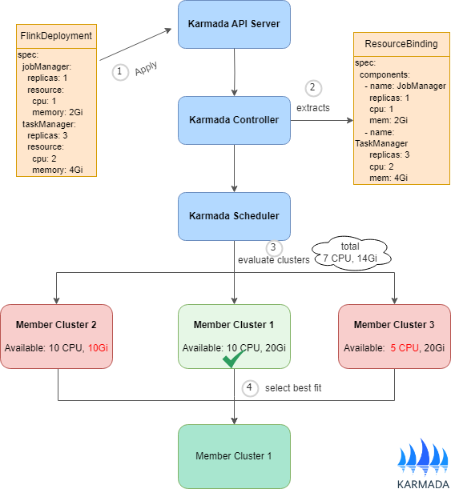

## Overview

Many modern distributed applications consist of multiple components with heterogeneous resource requirements. For example, a `Flink cluster` includes `JobManager` and `TaskManager` components, while a `Ray cluster` comprises `Head` and `Worker` nodes. Each component typically has different replica counts and resource specifications.

Starting from Karmada v1.16, the `multiple pod templates scheduling` feature enables accurate resource-aware scheduling for these complex workloads. This ensures that Karmada correctly understands the total resource requirements of multi-component applications and makes informed scheduling decisions across your member clusters.

## Why Multiple Component Scheduling?

Prior to v1.16, Karmada's scheduler assumed all replicas in a workload were identical, using a single pod template to represent resource requirements. This assumption worked well for simple applications like Deployments, but led to inaccuracies with multi-component workloads.

Consider a FlinkDeployment with two components:
- JobManager: 1 replica requiring 1 CPU and 2Gi memory
- TaskManager: 3 replicas, each requiring 2 CPU and 4Gi memory

With traditional scheduling, the scheduler could only represent one component's requirements, leading to:
- Underestimation: Applies JobManager profile to all replicas → Calculates only **4 CPUs** total (vs. 7 needed) → Risks scheduling to an insufficient cluster (**Pending Pods**).
- Overestimation: Applies TaskManager profile to all replicas → Estimates **8 CPUs** total (vs. 7 needed) → Wastes resources and limits cluster selection.
- Inaccurate quota calculations: FederatedResourceQuota shows incorrect usage.

With multi-component scheduling, the scheduler accurately understands:
- Total resources needed: (1 × 1 CPU + 1 × 2Gi) + (3 × 2 CPU + 3 × 4Gi) = 7 CPU and 14Gi memory
- Each component's specific requirements
- Whether a cluster can accommodate all components together

## Supported Workload Types

The multi-component scheduling feature is designed for CRDs with multiple heterogeneous pod templates. Common use cases include:

| Category | Examples |
|----------|----------|
| Streaming processing | Flink, Kafka Streams, Apache Storm |
| AI/ML frameworks | Ray, TensorFlow, PyTorch, MXNet |
| ML training | Parameter servers, distributed training jobs |
| Batch processing | Spark, Volcano, Hadoop |
| Data processing | XGBoost, PaddlePaddle, Distributed databases |
| Distributed systems | Elasticsearch, Redis Cluster, Database clusters |

Karmada provides built-in interpreter support for popular CRDs. You can find the list of CRDs with built-in interpreter support in the [Resource Interpreter documentation](../globalview/customizing-resource-interpreter). For new CRD types or custom workloads, you can implement a custom interpreter (see [Customizing Resource Interpreter](../globalview/customizing-resource-interpreter)) or [reach out to the Karmada community](https://github.com/karmada-io/karmada?tab=readme-ov-file#contact) for support. 

## Feature Maturity and Requirements

The multi-component scheduling feature is currently in **Alpha** stage and available starting from Karmada v1.16. As an alpha feature, it is subject to changes in future releases, but the core scheduling functionality is fully functional and ready for evaluation and testing environments.

To use the multi-component scheduling feature, you must enable the `MultiplePodTemplatesScheduling` feature gate. This feature gate must be enabled on the following components:

- `karmada-controller-manager`: Responsible for interpreting multi-component workload specifications and populating component information in ResourceBinding objects.
- `karmada-scheduler`: Responsible for scheduling decisions based on the component resource requirements extracted by the controller.
- `karmada-webhook`: Responsible for validating the component information parsed from the resource template.

## How It Works

The following diagram shows the process of multi-component scheduling, using FlinkDeployment as an example. The same workflow applies to other multi-component applications such as RayCluster, TensorFlow Clusters, and other distributed systems.

The diagram above shows the scheduling workflow:

1. Multi-component applications (e.g., FlinkDeployment, RayCluster) are submitted to the Karmada API Server. A `PropagationPolicy` or `ClusterPropagationPolicy` is required to specify how the workload should be distributed across member clusters.

2. The Karmada controller leverages the `Resource Interpreter` to parse each component's resource requirements. These requirements are stored in the `spec.components` field of the ResourceBinding object.

3. The scheduler evaluates candidate clusters on a per-component basis rather than by total resource sum. For example, it checks whether a cluster can accommodate the JobManager, then whether the same cluster can also accommodate all TaskManagers. This approach better accounts for resource distribution and fragmentation across cluster nodes.

4. The scheduler selects the cluster that can satisfy all component requirements. All components are then scheduled to that cluster as a single unit.

## Limitations and Constraints

Currently, the multi-component scheduling feature has the following limitations:
- All components of a workload must be scheduled to the same cluster
- Cross-cluster component distribution is not supported yet

Multi-component workloads often have tight coupling between components (shared storage, network connectivity, synchronization requirements). Distributing components across clusters introduces significant complexity in resource management, failure handling, and performance optimization.

We recognize that distributing components across clusters is a natural evolution to better utilize multi-cluster resources. This approach would enable more flexible resource allocation and improved utilization across your infrastructure. However, supporting this requires:
- Clear splitting rules and policies defined by users to ensure components are placed appropriately
- Dependency and affinity specifications to prevent incompatible placements that could result in scheduled but non-functional workloads

We welcome user feedback and use cases for cross-cluster component distribution. If you have specific requirements or scenarios, please don't hesitate to [reach out to us](https://github.com/karmada-io/karmada?tab=readme-ov-file#contact).

## What's Next

- [Customizing Resource Interpreter](../globalview/customizing-resource-interpreter) - Implement interpreters for your CRDs
- [Scheduler Estimator](./scheduler-estimator) - Enable resource-aware scheduling
- [Resource Propagating](./resource-propagating) - Basics of propagating resources to clusters
- [Cluster Resources](./cluster-resources) - Understanding cluster resource modeling
