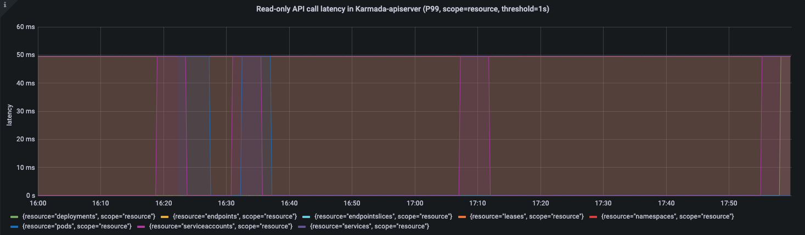

## 摘要

随着云原生技术在越来越多的企业和组织中的大规模落地，如何高效、可靠地管理大规模资源池以应对不断增长的业务挑战成为了当下云原生技术的关键挑战。
在过去的很长一段时间内，不同厂商尝试通过定制Kubernetes原生组件的方式扩展单集群的规模，这在扩大规模的同时也引入了复杂的单集群运维、不清晰的集群升级路径等问题。
而多集群技术能在不侵入修改Kubernetes单集群的基础上横向扩展资源池的规模，在扩展资源池的同时降低了企业的运维管理等成本。

在Karmada的大规模落地进程中，Karmada的可扩展性和大规模逐渐成为社区用户的新关注点。
因此，我们对Karmada开展了大规模环境下的测试工作，以获取Karmada管理多个Kubernetes集群的性能基线指标。
**对于以Karmada为代表的多集群系统而言，单集群的规模不是制约它的资源池规模的限制因素。**
因此，我们参考了**Kubernetes的大规模集群的标准配置和用户的生产落地实践**，测试了Karmada同时管理100个5k节点和2wPod的Kubernetes集群的用户场景。
受限于测试环境和测试工具，本次测试并未追求测试到Karmada多集群系统的上限，而是希望能覆盖到在生产中大规模使用多集群技术的典型场景。
根据测试结果分析，以Karmada为核心的集群联邦可以**稳定支持100个大规模集群**，管理超过50万个节点和200万个Pod，可以满足用户在大规模生产落地的需要。

在本文中，我们将介绍用于测试的相关指标，如何进行大规模测试，以及我们如何实现大规模的集群接入。

## 背景

随着云原生技术的不断发展和使用场景的不断丰富，多云、分布式云逐渐成为引领云计算发展的趋势。著名分析公司Flexera在2021的调查报告显示，超过93%的企业正同时使用多个云厂商的服务，一方面受限于Kubernetes单集群的业务承载能力和故障恢复能力，单一的集群无法适应现有的企业业务，另一方面，在全球化的当下，企业出于避免被单家厂商垄断的目的，或是出于成本等因素考虑，更倾向于选择混合云或者多公有云的架构。 与此同时，Karmada社区的用户在落地的进程中也提出了多集群下大规模节点和应用管理的诉求。

<!--truncate-->

## Karmada介绍

Karmada(Kubernetes Armada)是一个Kubernetes管理系统，它能够使你在无需修改应用的情况下跨集群和跨云运行你的云原生应用。通过使用Kubernetes原生API并在其上提供高级调度功能，Karmada实现了真正开放的多云Kubernetes。

Karmada旨在为多云和混合云场景中的多集群应用管理提供完全的自动化。它具备集中式多云管理、高可用性、故障恢复和流量调度等关键特性。


Karmada控制面包括以下组件:

- Karmada API Server
- Karmada Controller Manager
- Karmada Scheduler

ETCD存储了Karmada的API对象, karmada-apiserver提供了与所有其他组件通信的REST端口, 之后由karmada-controller-manager对你向karmada-apiserver提交的API对象进行对应的调和操作。

karmada-controller-manager运行着各种控制器，这些控制器watch着Karmada的对象，然后发送请求至成员集群的apiserver来创建常规的Kubernetes资源。

## 多集群系统资源池规模的维度和阈值

一个多集群系统的资源池规模不单指集群数量，即Scalability!=#Num of Clusters, 实际上多集群资源池规模包含很多维度的测量，在不考虑其他维度的情况下只考虑集群数量是毫无意义的。

我们将一个多集群的资源池规模**按优先级**描述为以下所示的三个维度：

1. Num of Clusters: 集群数量是衡量一个多集群系统资源池规模和承载能力最直接且最重要的维度，在其余维度不变的情况下系统能接入的集群数量越多，说明系统的资源池规模越大，承载能力越强。
2. Num of Resources(API Objects): 对于一个多集群系统的控制面来说，存储并不是无限制的，而在控制面创建的资源对象的数量和总体大小受限于系统控制面的存储，也是制约多集群系统资源池规模的重要维度。这里的资源对象不仅指下发到成员集群的资源模板，而且还包括集群的调度策略、多集群服务等资源。
3. Cluster Size: 集群规模是衡量一个多集群系统资源池规模不可忽视的维度。一方面，集群数量相等的情况下，单个集群的规模越大，整个多集群系统的资源池越大。另一方面，多集群系统的上层能力依赖系统对集群的资源画像，例如在多集群应用的调度过程中，集群资源是不可或缺的一个因素。 **综上所述，单集群的规模与整个多集群系统息息相关，但单集群的规模同样不是制约多集群系统的限制因素**。用户可以通过优化原生的Kubernetes组件的方式来提升单集群的集群规模，达到扩大整个多集群系统的资源池的目的，但这不是衡量多集群系统性能的关注点。
   本次测试中，社区参考了kubernetes的[大规模集群的标准配置](https://kubernetes.io/zh-cn/docs/setup/best-practices/cluster-large/)以及测试工具的性能，制定了测试集群的规模，以贴切实际生产环境中的单集群配置。在集群的标准配置中，Node与Pod毫无疑问是其中最重要的两个资源，Node是计算、存储等资源的最小载体，而Pod数量则代表着一个集群的应用承载能力。
   事实上，单集群的资源对象也包括像service，configmap，secret这样的常见资源。这些变量的引入会使得测试过程变得更复杂，所以这次测试不会过多关注这些变量。
   * Num of Nodes
   * Num of Pods

对于多集群系统而言想要无限制地扩展各个维度而且又满足SLIs/SLOs各项指标显然是不可能实现的。
各个维度不是完全独立的，某个维度被拉伸相应的其他维度就要被压缩，可以根据使用场景进行调整。
以Clusters和Nodes两个维度举例，在100集群下将单集群的5k 节点拉伸到10k node的场景或者在单集群规格不变的同时扩展集群数量到200集群，其他维度的规格势必会受到影响。
如果各种场景都进行测试分析工作量是非常巨大的，在本次测试中，我们会重点选取典型场景配置进行测试分析。在满足SLIs/SLOs的基础上，实现单集群支持5k节点，20k pod规模的100数量的集群接入和管理。

## SLIs/SLOs

可扩展性和性能是多集群联邦的重要特性。作为多集群联邦的用户，我们期望在以上两方面有服务质量的保证。在进行大规模性能测试之前，我们需要定义测量指标。
在参考了Kubernetes社区的SLI(Service Level Indicator)/SLO(Service Level Objectives)和多集群的典型应用，Karmada社区定义了以下SLI/SLO来衡量多集群联邦的服务质量。

1. API Call Latency


| Status  | SLI                                                        | SLO                                                                               |
|---------|------------------------------------------------------------|-----------------------------------------------------------------------------------|
| Offical | 最近5min对单个资源对象Mutating API调用（包括POST、PUT、DELETE、PATCH）的P99时延 | P99 \<\= 1s                                                                       |
| Offical | 最近5min的non-streaming的只读API调用（包括GET和LIST）的P99时延             | (a)Scope=resource, P99 \<\= 1s, (b)Scope=namespace or Scope=cluster, P99 \<\= 30s |

2. Resource Distribution Latency


| Status  | SLI                                                       | SLO         |
|---------|-----------------------------------------------------------|-------------|
| Offical | 用户在联邦控制面提交资源模板和下发策略后到资源在成员集群上被创建的P99时延，不考虑控制面与成员集群之间的网络波动 | P99 \<\= 2s |

3. Cluster Registration Latency


| Status | SLI                                             | SLO |
|--------|-------------------------------------------------|-----|
| WIP    | 集群从接入联邦控制面到状态能被控制面正常收集的P99时延，不考虑控制面与成员集群之间的网络波动 | TBD |

4. Resource usage


| Status | SLI                             | SLO |
|--------|---------------------------------|-----|
| WIP    | 在接入一定数量的集群后集群联邦维持其正常工作所必需的资源使用量 | TBD |

**Note**:

1. 上述指标不考虑控制面和成员集群的网络波动。同时，单集群内的SLO不会考虑在内。
2. 资源使用量是一个对于多集群系统非常重要的指标，但是不同多集群系统提供的上层服务不同，所以对各个系统来说资源的要求也会不同。我们不对这个指标进行强制的限制。
3. 集群注册时延是从集群注册到控制面到集群在联邦侧可用的时延。它在某种程度上取决于控制面如何收集成员集群的状态。

## 测试工具

### ClusterLoader2

ClusterLoader2是一款开源Kubernetes集群负载测试工具，该工具能够针对Kubernetes 定义的SLIs/SLOs 指标进行测试，检验集群是否符合各项服务质量标准。此外ClusterLoader2为集群问题定位和集群性能优化提供可视化数据。ClusterLoader2 最终会输出一份Kubernetes集群性能报告，展示一系列性能指标测试结果。
然而，在Karmada性能测试的过程中，由于ClusterLoader2是一个为Kubernetes单集群定制的测试工具，且在多集群场景下它不能获取到所有集群的资源， 因此我们只用ClusterLoader2来分发被Karmada管理的资源。

### Prometheus

Prometheus是一个开源的用于监控和告警的工具, 它包含数据收集、数据报告、数据可视化等功能。在分析了Clusterloader2对各种监控指标的处理后，我们使用Prometheus根据具体的查询语句对控制面的指标进行监控。

### Kind

Kind是一个是用容器来运行Kubernetes本地集群的工具。为了测试Karmada的应用分发能力，我们需要一个真实的单集群控制面来管理被联邦控制面分发的应用。Kind能够在节约资源的同时模拟一个真实的集群。

### Fake-kubelet

Fake-kubelet是一个能模拟节点且能维护虚拟节点上的Pod的工具。与Kubemark相比，fake-kubelet只做维护节点和Pod的必要工作。它非常适合模拟大规模的节点和Pod来测试控制面的在大规模环境下的性能。

## 测试集群部署方案


Kubernetes控制面部署在单master的节点上。etcd，kube-apiserver，kube-scheduler和kube-controller以单实例的形式部署。
Karmada的控制面组件部署在这个master节点上。他们同样以单实例的形式部署。
所有的Kubernetes组件和Karmada组件运行在高性能的节点上，且我们不对他们限制资源。
我们通过kind来模拟单master节点的集群，通过fake-kubelet来模拟集群中的工作节点。

## 测试环境信息

控制面操作系统版本

`Ubuntu 18.04.6 LTS (Bionic Beaver)`

Kubernetes版本

`Kubernetes v1.23.10`

Karmada版本

`Karmada v1.3.0-4-g1f13ad97`

Karmada控制面所在的节点配置

* CPU

```
Architecture:        x86_64
CPU op-mode(s):      32-bit, 64-bit
Byte Order:          Little Endian
CPU(s):              64
On-line CPU(s) list: 0-63
Thread(s) per core:  2
Core(s) per socket:  16
Socket(s):           2
NUMA node(s):        2
Vendor ID:           GenuineIntel
CPU family:          6
Model:               85
Model name:          Intel(R) Xeon(R) Gold 6266C CPU @ 3.00GHz
Stepping:            7
CPU MHz:             3000.000
BogoMIPS:            6000.00
Hypervisor vendor:   KVM
Virtualization type: full
L1d cache:           32K
L1i cache:           32K
L2 cache:            1024K
L3 cache:            30976K
NUMA node0 CPU(s):   0-31
NUMA node1 CPU(s):   32-63
```

* 内存

```
Maximum Capacity: 512 GB
```

* 磁盘

```
Disk /dev/vda: 200 GiB, 214748364800 bytes, 419430400 sectors
```

## 组件参数配置

1. karmada-apiserver

```
--max-requests-inflight=2000
--max-mutating-requests-inflight=1000
```

2. karmada-aggregated-server

```
--kube-api-qps=200
--kube-api-burst=400
```

3. karmada-scheduler

```
--kube-api-qps=200
--kube-api-burst=400
```

4. karmada-controller-manager

```
--kube-api-qps=200
--kube-api-burst=400
```

5. karmada-agent

```
--kube-api-qps=40
--kube-api-burst=60
```

6. karmada-etcd

```
--quota-backend-bytes=8G
```

## 测试执行

在使用Clusterloader2进行性能测试之前，我们需要自己通过配置文件定义性能测试策略。 我们使用的配置文件如下：

<details>

<summary>unfold me to see the yaml</summary>

```yaml
name: test

namespace:
   number: 10

tuningSets:
   - name: Uniformtinyqps
     qpsLoad:
        qps: 0.1
   - name: Uniform1qps
     qpsLoad:
        qps: 1

steps:
   - name: Create deployment
     phases:
        - namespaceRange:
             min: 1
             max: 10
          replicasPerNamespace: 20
          tuningSet: Uniformtinyqps
          objectBundle:
             - basename: test-deployment
               objectTemplatePath: "deployment.yaml"
               templateFillMap:
                  Replicas: 1000
        - namespaceRange:
             min: 1
             max: 10
          replicasPerNamespace: 1
          tuningSet: Uniform1qps
          objectBundle:
             - basename: test-policy
               objectTemplatePath: "policy.yaml"
```

```yaml
# deployment.yaml
apiVersion: apps/v1
kind: Deployment
metadata:
  name: {{.Name}}
  labels:
    group: test-deployment
spec:
  replicas: {{.Replicas}}
  selector:
    matchLabels:
      app: fake-pod
  template:
    metadata:
      labels:
        app: fake-pod
    spec:
      affinity:
        nodeAffinity:
          requiredDuringSchedulingIgnoredDuringExecution:
            nodeSelectorTerms:
              - matchExpressions:
                  - key: type
                    operator: In
                    values:
                      - fake-kubelet
      tolerations: 
        - key: "fake-kubelet/provider"
          operator: "Exists"
          effect: "NoSchedule"
      containers:
        - image: fake-pod
          name: {{.Name}}
```

```yaml
# policy.yaml
apiVersion: policy.karmada.io/v1alpha1
kind: PropagationPolicy
metadata:
  name: test
spec:
  resourceSelectors:
    - apiVersion: apps/v1
      kind: Deployment
  placement:
    replicaScheduling:
      replicaDivisionPreference: Weighted
      replicaSchedulingType: Divided
```

</details>

Kubernetes资源详细的配置如下表所示：


| Maximum Type                     | Maximum Value |
|----------------------------------|---------------|
| Number of Clusters               | 100           |
| Number of Pods                   | 2000000       |
| Number of Nodes per Cluster      | 5000          |
| Number of Pods per Cluster       | 20000         |
| Number of Namespaces per Cluster | 20            |
| Number of Pods per Namespace     | 1000          |

详细的测试方法和过程，可以参考

[https://github.com/kubernetes/perf-tests/blob/master/clusterloader2/docs/GETTING_STARTED.md](https://github.com/kubernetes/perf-tests/blob/master/clusterloader2/docs/GETTING_STARTED.md)

## 测试结果

APIResponsivenessPrometheus:





Cluster Registration Latency:


| metric           | P50(ms) | P90(ms) | P99(ms) | SLO |
|------------------|---------|---------|---------|-----|
| cluster_register | 5356    | 6125    | 6904    | N/A |

**Note**: Karmada的Pull模式适合用于私有云的场景。与Push模式相比，成员集群会运行一个名为karmada-agent的组件。它会从控制面拉取用户提交的应用，并运行在成员集群中。
在Pull模式集群注册的过程中，它会包含安装karmada-agent的时间。如果karmada-agent的镜像已经准备完毕的话，它很大程度上取决于单集群内Pod启动的时延。
这里不过多讨论Pull模式的注册时延。

Resource Distribution Latency:


| metric                      | P50(ms) | P90(ms) | P99(ms) | SLO  |
|-----------------------------|---------|---------|---------|------|
| cluster_schedule            | 12      | 15      | 32      | N/A  |
| resource_distribution(Push) | 706     | 899     | 1298    | 2000 |
| resource_distribution(Pull) | 612     | 881     | 989     | 2000 |

### Push Mode

Etcd latency:


Resource Usage:


### Pull Mode

Etcd latency:


Resource Usage:


成员集群中的karmada-agent消耗了40m CPU(cores)和266Mi Memory(bytes)。

## 结论与分析

在以上的测试结果中，API调用时延和资源分发时延均符合上述定义的SLIs/SLOs。在整个过程中，系统消耗的资源在一个可控制的范围。
因此，**Karmada能稳定支撑100个大规模集群**，并且管理超过500,000个节点和2,000,000个的pods。在生产中，Karmada能有效支持数以百计的大规模的集群。
接下来，我们会具体分析每个测试指标的数据。

### 关注点分离：资源模板和策略

Karmada使用Kubernetes原生API来表达集群联邦资源模板，使用可复用的策略API来表达集群的调度策略。 它不仅可以让Karmada能够轻松集成Kubernetes的生态, 同时也大大减少了控制面的资源数量。
基于此，控制面的资源数量不取决于整个多集群系统集群的数量，而是取决于多集群应用的数量。

Karmada的架构集成了Kubernetes架构的简洁性和扩展性。Karmada-apiserver作为控制面的入口与Kubernetes的kube-apiserver类似。你可以使用单集群配置中所需的参数优化这些组件。

在整个资源分发过程中，API调用时延在一个合理的范围。

### 集群注册与资源分发

在Karmada 1.3版本中，我们提供了基于Bootstrap tokens注册Pull模式集群的能力。这种方式不仅可以简化集群注册的流程，也增强了集群注册的安全性。
现在无论是Pull模式还是Push模式，我们都可以使用karmadactl工具来完成集群注册。与Push模式相比，Pull模式会在成员集群运行一个名为karmada-agent的组件。

集群注册时延包含了控制面收集成员集群状态所需的时间。在集群生命周期管理的过程中，Karmada会收集成员集群的版本，支持的API列表以及集群是否健康的状态信息。
此外，Karmada会收集成员集群的资源使用量，并基于此对成员集群进行建模，这样调度器可以更好地为应用选择目标集群。 在这种情况下，集群注册时延与集群的规模息息相关。
上述指标展示了加入一个5,000节点的集群直至它可用所需的时延。你可以通过[关闭集群资源建模](https://karmada.io/docs/next/userguide/scheduling/cluster-resources#disable-cluster-resource-modeling)来使集群注册时延与集群的大小无关，在这种情况下，集群注册时延这个指标将小于2s。

不论是Push模式还是Pull模式，Karmada都以一个很快的速度来下发资源到成员集群中。唯一的区别在于karmada-controller-manager负责所有Push模式集群的资源分发，而karmada-agent只负责它所在那一个Pull模式集群。
因此, 在高并发条件下发资源的过程中，Pull在相同配置条件下会比Push模式更快。
你也可以通过调整karmada-controller-manager的`--concurrent-work-syncs`的参数来调整同一时间段内并发work的数量来提升性能。

### Push模式和Pull模式的资源使用量对比

在Karmada 1.3版本中，我们做了许多工作来减少Karmada管理大型集群的资源使用量。现在我们很高兴宣布，相比于1.2版本，Karmada 1.3在大规模场景下减少了 **85%** 的内存消耗和 **32%** 的CPU消耗。
总的来说, Pull模式在内存使用上有明显的优势，而在其他资源上相差的不大。

在Push模式中，控制面的资源消耗主要集中在karmada-controller-manager，而karmada-apiserver的压力不大。


从karmada-apiserver的qps以及karmada-etcd的请求时延我们可以看出karmada-apiserver的请求量保持在一个较低的水平。
在Push模式中，绝大多数的请求来自karmada-controller-manager。你可以配置`--kube-api-qps` and `--kube-api-burst`这两个参数来控制请求数在一个确定的范围内。

在Pull模式中，控制面的资源消耗主要集中在karmada-apiserver，而不是karmada-controller-manager。


从karmada-apiserver的qps以及karmada-etcd的请求时延我们可以看出karmada-apiserver的请求量保持在一个较高的水平。
在Pull模式中，每个成员集群的karmada-agent需要维持一个与karmada-apiserver通信的长连接。
我们很容易得出：在下发应用至所有集群的过程中karmada-apiserver的请求总量是是karmada-agent中配置的N倍(N=#Num of clusters)。
因此，在大规模Pull模式集群的场景下，我们建议增加karmada-apiserver的`--max-requests-inflight`以及`--max-mutating-requests-inflight`参数的值，和karmada-etcd的`--quota-backend-bytes`参数的值来提升控制面的吞吐量。

现在Karmada提供了[集群资源模型](https://karmada.io/docs/next/userguide/scheduling/cluster-resources)的能力来基于集群空闲资源做调度决策。
在资源建模的过程中，它会收集所有集群的节点与Pod的信息。这在大规模场景下会有一定的内存消耗。
如果你不使用这个能力，你可以[关闭集群资源建模](https://karmada.io/docs/next/userguide/scheduling/cluster-resources#disable-cluster-resource-modeling)来进一步减少资源消耗。

### 总结与展望

根据测试结果分析，Karmada可以**稳定支持100个大规模集群**，管理超过50万个节点和200万个Pod。

在使用场景方面，Push模式适用于管理公有云上的Kubernetes集群，而Pull模式相对于Push模式涵盖了私有云和边缘相关的场景。在性能和安全性方面，Pull模式的整体性能要优于Push模式。
每个集群由集群中的karmada-agent组件管理，且完全隔离。
但是，Pull模式在提升性能的同时，也需要相应提升karmada-apiserver和karmada-etcd的性能，以应对大流量、高并发场景下的挑战。具体方法请参考kubernetes对大规模集群的优化。
一般来说，用户可以根据使用场景选择不同的部署模式，通过参数调优等手段来提升整个多集群系统的性能。

受限于测试环境和测试工具，本次测试尚未测试到Karmada多集群系统的上限，同时多集群系统的性能测试仍处于方兴未艾的阶段，下一步我们将继续优化多集群系统的测试工具，系统性地整理测试方法，以覆盖更大的规模和更多的场景。
