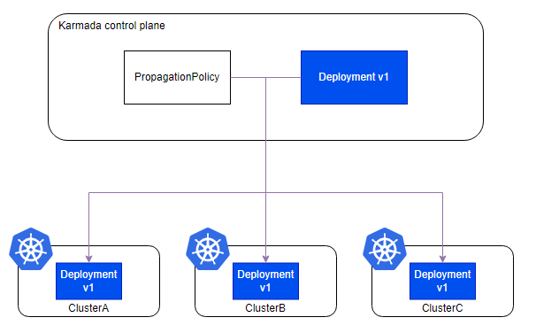
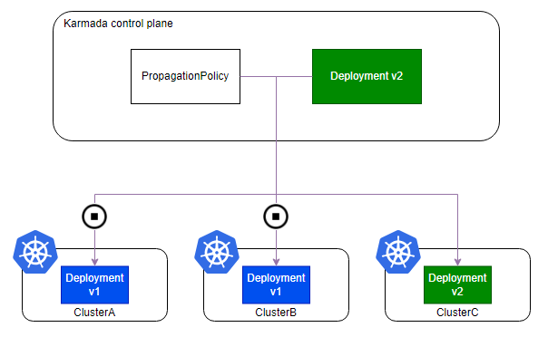
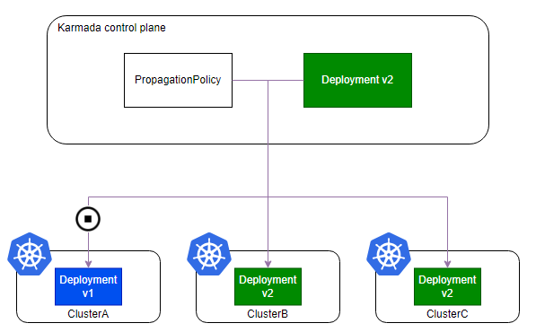
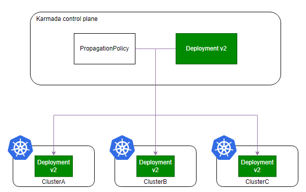
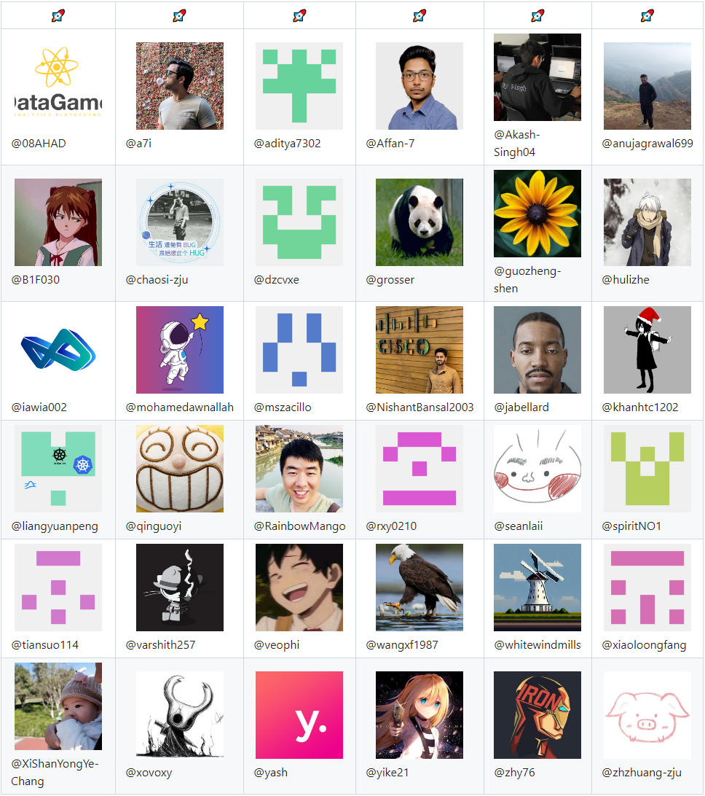

# Karmada v1.11 版本发布！新增应用跨集群滚动升级能力！

Karmada 是开放的多云多集群容器编排引擎，旨在帮助用户在多云环境下部署和运维业务应用。凭借兼容 Kubernetes 原生 API 的能力，Karmada 可以平滑迁移单集群工作负载，并且仍可保持与 Kubernetes 周边生态工具链协同。

本版本包含下列新增特性：

- 支持联邦应用跨集群滚动升级，使用户版本发布流程更加灵活可控；
- karmadactl 新增了多项运维能力，提供独特的多集群运维体验；
- 为联邦工作负载提供标准化 generation 语义，使 CD 执行一步到位；
- Karmada Operator 支持自定义 CRD 下载策略，使离线部署更灵活。

## 联邦应用跨集群滚动升级

在最新发布的 v1.11 版本中，Karmada 新增了联邦应用跨集群滚动升级特性。这一特性特别适用于那些部署在多个集群上的应用，使得用户在发布应用新版本时能够采用更加灵活和可控的滚动升级策略。用户可以精细地控制升级流程，确保每个集群在升级过程中都能够平滑过渡，减少对生产环境的影响。这一特性不仅提升了用户体验，也为复杂的多集群管理提供了更多的灵活性和可靠性。

下面通过一个示例来演示如何对联邦应用进行滚动升级：

假定用户已经通过 PropagationPolicy 将 Deployment 应用分发到三个成员集群中：`ClusterA`、`ClusterB`、`ClusterC`：

```yaml
apiVersion: policy.karmada.io/v1alpha1
kind: PropagationPolicy
metadata:
  name: nginx-propagation
spec:
  resourceSelectors:
    - apiVersion: apps/v1
      kind: Deployment
      name: nginx
  placement:
    clusterAffinity:
      clusterNames:
        - ClusterA
        - ClusterB
        - ClusterC
```



此时 Deployment 版本为v1，为了将 Deployment 资源版本升级至 v2，您可以依次执行下列步骤。

首先，通过配置 PropagationPolicy 策略，暂时停止向 `ClusterA` 和 `ClusterB` 分发资源，从而应用的变更将只发生在 `ClusterC`：

```yaml
apiVersion: policy.karmada.io/v1alpha1
kind: PropagationPolicy
metadata:
  name: nginx-propagation
spec:
  #...
  suspension:
    dispatchingOnClusters:
      clusterNames:
        - ClusterA
        - ClusterB
```



然后更新 PropagationPolicy 资源，允许系统向 `ClusterB` 集群同步新版本资源：

```yaml
  suspension:
    dispatchingOnClusters:
      clusterNames:
        - ClusterA
```



最后删除 PropagationPolicy 资源中的 `suspension` 字段，允许系统向 `ClusterA` 集群同步新版本资源：



从上述示例中我们可以看到，利用联邦应用跨集群滚动发布能力，新版本应用可以做到按集群粒度滚动升级，并且可以做到精准控制。

此外，该功能还可以应用于其他场景，特别是对于开发者来说，由于 Karmada 控制平面和成员集群之间争夺资源控制权而导致资源频繁更新的情况。在这种情况下，暂停资源与成员集群的同步过程可以方便快速识别问题。

## karmadactl 能力增强

在本版本中，Karmada 社区致力于增强 Karmadactl 的能力，以便提供更好的多集群运维体验，进而摆脱用户对 kubectl 的依赖。

### 更丰富的命令集

Karmadactl 支持更丰富的命令集，如 `create`、`patch`、`delete`、`label`、`annotate`、`edit`、`attach`、`top node`、`api-resources` 以及 `explain`，这些命令允许用户对 Karmada 控制面或成员集群上的资源执行更多操作。

### 更丰富的功能

Karmadactl 引入了 `--operation-scope` 参数来控制命令的操作范围。有了这个新参数，`get`、`describe`、`exec` 和 `explain` 等命令可以灵活切换集群视角对 Karmada 控制面或成员集群的资源进行操作。

### 更详细的命令输出信息

`karmadactl get cluster` 命令的输出现在增加了 cluster 对象的 `Zones`、`Region`、`Provider`、`API-Endpoint` 和 `Proxy-URL` 信息。

通过这些能力增强，karmadactl 的操作和运维体验得到了提升。karmadactl 的新功能和更多详细信息可以通过使用 `karmadactl --help` 获得。

## 联邦工作负载标准化 generation 语义

在本版本中，Karmada 将联邦层面的工作负载 generation 语义进行了标准化。这一更新为发布系统提供了可靠的参考，增强了跨集群部署的精确度。通过标准化 generation 语义，Karmada 简化了发布流程，并确保一致性地跟踪工作负载状态，使得跨多个集群管理和监控应用程序变得更加容易。

标准化细节为，当且仅当工作负载分发至所有成员集群中的资源状态满足 `status.observedGeneration` >= `metadata.generation` 时，联邦层面的工作负载状态中的 observedGeneration 值才会被设置为其本身 `.metadata.generation` 值，这确保了每个成员集群中相应的控制器均已完成了对该工作负载的处理。此举将联邦层面的 generation 语义同kubernetes 集群的 generation 语义进行了统一，使用户能够更便捷的将单集群业务迁移至多集群业务。

本版本已完成下列资源适配：

- GroupVersion: apps/v1 Kind: Deployment, DaemonSet, StatefulSet
- GroupVersion: apps.kruise.io/v1alpha1 Kind: CloneSet, DaemonSet
- GroupVersion: apps.kruise.io/v1beta1 Kind: StatefulSet
- GroupVersion: helm.toolkit.fluxcd.io/v2beta1 Kind: HelmRelease
- GroupVersion: kustomize.toolkit.fluxcd.io/v1 Kind: Kustomization
- GroupVersion: source.toolkit.fluxcd.io/v1 Kind: GitRepository
- GroupVersion: source.toolkit.fluxcd.io/v1beta2 Kind: Bucket, HelmChart, HelmRepository, OCIRepository

如有您有更多资源（包括CRD）需要适配，可以向 Karmada 社区进行反馈，也可以使用 [Resource Interpreter](https://karmada.io/docs/next/userguide/globalview/customizing-resource-interpreter/) 进行扩展。

## Karmada Operator 支持自定义 CRD 下载策略

CRD（Custom Resource Definition，自定义资源定义）资源是 Karmada Operator 用于配置新的 Karmada 实例的关键前提资源。这些 CRD 资源包含了 Karmada 系统的关键 API 定义，例如，PropagationPolicy，ResourceBinding，Work 等。

在 v.1.11 版本中，Karmada Operator 支持用户自定义 CRD 下载策略。利用这个功能，用户可以指定 CRD 资源的下载路径，并定义更多的下载策略，为用户提供了更灵活的离线部署方式。

有关该特性的详细描述，可以参考[提案：Custom CRD Download Strategy Support for Karmada Operator](https://github.com/karmada-io/karmada/tree/master/docs/proposals/operator-custom-crd-download-strategy)。

# 致谢贡献者

Karmada v1.11 版本包含了来自 36 位贡献者的 223 次代码提交，在此对各位贡献者表示由衷的感谢：


