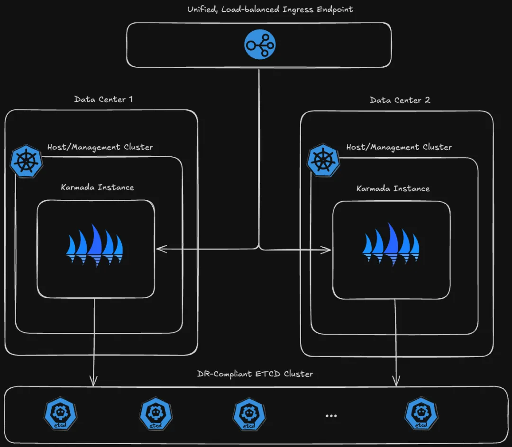

# Karmada v1.12 版本发布！单集群应用迁移可维护性增强

Karmada 是开放的多云多集群容器编排引擎，旨在帮助用户在多云环境下部署和运维业务应用。凭借兼容 Kubernetes 原生 API 的能力，Karmada 可以平滑迁移单集群工作负载，并且仍可保持与 Kubernetes 周边生态工具链协同。


[Karmada v1.12版本](https://github.com/karmada-io/karmada/releases/tag/v1.12.0) 现已发布，本版本包含下列新增特性：

- 应用级故障迁移功能增强（新增状态中继机制，适用于大数据处理程序高可用场景，如 Flink）
- 单集群应用迁移能力增强（适用于单集群存量应用迁移）
- Karmada Operator 高可用部署能力支持
- OverridePolicy 支持局部修改结构化字段值

## 新特性概览

### 应用级故障迁移功能增强

在之前的版本中，Karmada 提供了基本的应用级故障迁移能力，能够通过应用的健康状态或自定义的故障等条件触发应用迁移。为了满足有状态应用在故障迁移过程中保留其运行状态的需求，Karmada 在 v1.12 版本新增了应用状态中继机制。对于大数据处理应用（例如 Flink），利用此能力可以从故障前的 checkpoint 重新启动，无缝恢复到重启前的数据处理状态，从而避免数据重复处理。

社区在PropagationPolicy/ClusterPropagationPolicy API 中的.spec.failover.application 下引入了一个新的StatePreservation 字段， 用于定义有状态应用在故障迁移期间保留和恢复状态数据的策略。结合此策略，当应用从一个故障集群迁移到另一个集群时，能够从原始资源配置中提取关键数据。

状态保留策略StatePreservation 包含了一系列StatePreservationRule 配置，通过 JSONPath 来指定需要保留的状态数据片段，并利用关联的AliasLabelName 将数据传递到迁移后的集群。

以 Flink 应用为例，在 Flink 应用中，jobID 是一个唯一的标识符，用于区分和管理不同的 Flink 作业（jobs）。每个 Flink 作业在提交到 Flink 集群时都会被分配一个jobID。当作业发生故障时，Flink 应用可以利用jobID 来恢复故障前作业的状态，从故障点处继续执行。具体的配置和步骤如下：

```yaml
apiVersion: policy.karmada.io/v1alpha1
kind: PropagationPolicy
metadata:
  name: foo
spec:
  # ...
  failover:
    application:
      decisionConditions:
        tolerationSeconds: 60
      purgeMode: Immediately
      statePreservation:
        rules:
          - aliasLabelName: application.karmada.io/failover-jobid
            jsonPath: "{ .jobStatus.jobID }"
```

迁移前，Karmada 控制器将按照用户配置的路径提取 job ID。
迁移时，Karmada 控制器将提取的 job ID 以 label 的形式注入到 Flink 应用配置中，比如`application.karmada.io/failover-jobid : <jobID>`。
运行在成员集群的 Kyverno 拦截 Flink 应用创建请求，并根据jobID  获取该 job 的 checkpoint 数据存储路径，比如  `/<shared-path>/<job-namespace>/<jobId>/checkpoints/xxx`，然后配置initialSavepointPath 指示从save point 启动。
Flink 应用根据initialSavepointPath 下的 checkpoint 数据启动，从而继承迁移前保存的最终状态。
该能力基于 FlinkDeployment 打造，但广泛适用于能够基于某个 save point 启动的有状态应用程序，这些应用均可参考上述流程实现故障迁移的状态中继。

此功能需要启用 StatefulFailoverInjection 特性开关。StatefulFailoverInjection 目前处于 Alpha 阶段，默认情况下是关闭的。

功能约束：

应用必须限定在单个集群中运行；

迁移清理策略（PurgeMode）限定为Immediately，即故障应用需立即删除然后再创建新应用，确保数据一致性。

### 单集群应用迁移能力增强

在用户将业务从单集群迁移至多集群的过程中，如果资源已经被迁移到 Karmada 控制面，那么当控制面中的资源模板被删除时，成员集群中的资源也会随之删除。但在某些场景，用户希望能够保留成员集群中的资源。例如，作为管理员，在工作负载迁移过程中可能遇到意外情况（如云平台无法发布应用程序或 Pod 异常）， 需要回滚机制立刻恢复到迁移之前的状态，以便快速止损。

在 v1.12 版本，社区在PropagationPolicy/ClusterPropagationPolicy API 中引入了PreserveResourcesOnDeletion 字段，用于定义当控制面中的资源模板被删除时成员集群上资源的保留行为，如果设置为true，则成员集群上的资源将被保留。结合此字段，一旦用户在迁移过程中发现异常，可以快速执行回滚操作并保留成员集群中原有的资源，整个迁移回滚过程更加安全可控。

使用该字段请注意以下两点：

该配置对所有成员集群统一生效，不会仅针对部分集群进行选择性控制。
当 Policy 被删除时，资源模板及已分发的成员集群资源将保持不变，除非被显式删除。
以 PropagationPolicy 为例，用户在删除 Karmada 控制面资源模板时，可以配置如下 PropagationPolicy 来保留成员集群的资源：

```yaml
apiVersion: policy.karmada.io/v1alpha1
kind: PropagationPolicy
metadata:
  name: nginx-pp
spec:
  conflictResolution: Overwrite
  preserveResourcesOnDeletion: true # 资源模板删除后，成员集群资源依然保留
  placement:
    clusterAffinity:
      clusterNames:
        - member1
  resourceSelectors:
    - apiVersion: apps/v1
      kind: Deployment
      name: nginx
    - apiVersion: v1
      kind: Service
      name: nginx-svc
```
更多有关安全回滚迁移的资料请参考：[迁移操作如何回滚](https://karmada.io/zh/docs/next/administrator/migration/migrate-in-batch)

### Karmada Operator 高可用部署能力支持

作为社区维护的安装工具，Karmada-operator 可以用来部署和管理多个 Karmada 实例。为了更好地支持高可用部署方案，karmada-operator 在本版本实施了一系列针对性的改进和优化措施，包括：

引入了对自定义 CA 证书的支持；
支持连接外部 etcd；
可通过 Secret 指定外部 etcd 客户端的凭据；
可为 Karmada 组件指定卷和卷挂载；
对外暴露 APISever 服务，用于服务发现。
这些增强使得 karmada-operator 能够跨多个管理集群部署一个高度可用的 Karmada 控制平面，这些集群可以跨越不同的数据中心，从而满足故障恢复的诉求。



上图是通过 Karmada-operator 构建的生产级高可用架构，在这个架构中，Karmada-operator 跨不同地理位置的数据中心部署多个 Karmada 控制面，并将它们连接到同一个外部 etcd 集群。这种设置不仅确保了跨数据中心的数据一致性，还简化了数据管理和维护工作。

此外，借助 Karmada-operator 提供的 APIServer 服务暴露能力，结合 Ingress 对外提供统一的服务访问。同时，利用可配置的CA证书机制，保障了 Karmada 实例与外部服务间通信的安全性。

此架构显著增强了系统对单个数据中心故障的抵御能力，最大限度地减少了因数据中心故障导致的服务中断风险，保证了业务连续性和用户体验的稳定性，符合严格的灾难恢复标准。

### OverridePolicy 支持局部修改结构化字段值

OverridePolicy 允许用户针对特定集群自定义资源的覆盖策略，确保资源可以在不同环境中灵活适配和优化。Kubernetes 资源如 Secrets 和 ConfigMaps 常常会用到结构化的字段值，如 ConfigMaps 的.data 利用 YAML 格式的结构化数据承载配置信息。在实际应用中，存在只需要修改其部分字段的情况，而且，当原始的结构化字段值复杂且内容繁多时，使用全覆盖将会大大增大 OverridePolicy 的配置难度。

为了解决这一问题，并提高 OverridePolicy 在此类场景中的易用性，Karmada 引入了FieldOverrider 特性。FieldOverrider 支持对 JSON 和 YAML 格式的结构化字段值进行局部修改，即只添加或替换或删除所需的字段。这种方式简化了配置过程，提高了效率，同时减少了出错的可能性，使得资源管理更加直观和便捷。通过FieldOverrider，用户可以对结构化字段值进行更精细化地处理，适应多变的应用环境需求。

下面以 ConfigMap 为例，用户可通过FieldOverrider 部分覆盖 ConfigMap 的.data 字段来实现集群间的差异化配置。

```yaml
# example-configmap
apiVersion: v1
kind: ConfigMap
metadata:
  name: example-configmap
data:
  config.yaml: |
    app:
      database:
        port: 5432
        ip: 127.0.0.1
        name: example
        zone: zone1
```

```yaml
# example-overridepolicy
apiVersion: policy.karmada.io/v1alpha1
kind: OverridePolicy
metadata:
  name: example
spec:
  resourceSelectors:
    - apiVersion: v1
      kind: ConfigMap
      name: example-configmap
  overrideRules:
    - overriders:
        fieldOverrider:
          - fieldPath: /data/config.yaml
            yaml:
              - subPath: /app/database/port
                operator: replace # 支持add、remove和replace操作
                value: "3306"
      targetCluster:
        clusterNames:
          - member1
```

经过以上配置，集群 member1 中的 ConfigMap 将更新为：

```yaml
# example-configmap in member1
apiVersion: v1
kind: ConfigMap
metadata:
  name: myconfigmap
data:
  config.yaml: |
    app:
      database:
        port: 3306 # 更新了port
        ip: 127.0.0.1
        name: example
        zone: zone1
```
更多FieldOverrider 的用法请参考：[FieldOverrider 使用指南](https://karmada.io/docs/userguide/scheduling/override-policy/#fieldoverrider)

# 致谢贡献者

Karmada v1.12 版本包含了来自 33 位贡献者的 253 次代码提交，在此对各位贡献者表示由衷的感谢：

贡献者列表：

| ^-^           | ^-^                 | ^-^                |
|---------------|---------------------|--------------------|
| @a7i          | @ahorine            | @anujagrawal699    |
| @B1f030       | @chaosi-zju         | @CharlesQQ         |
| @chaunceyjiang| @husnialhamdani     | @iawia002          |
| @ipsum-0320   | @jabellard          | @jklaw90           |
| @KhalilSantana| @LavredisG          | @liangyuanpeng     |
| @LivingCcj    | @MAVRICK-1          | @mohamedawnallah   |
| @mszacillo    | @RainbowMango       | @SataQiu           |
| @seanlaii     | @sophiefeifeifeiya  | @tiansuo114        |
| @wangxf1987   | @whitewindmills     | @wulemao           |
| @XiShanYongYe-Chang | @xovoxy        | @yanfeng1992       |
| @yelshall     | @zach593            | @zhzhuang-zju      |


