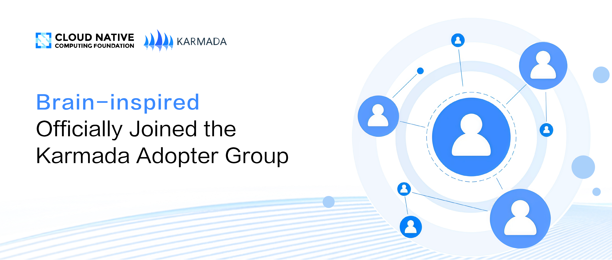
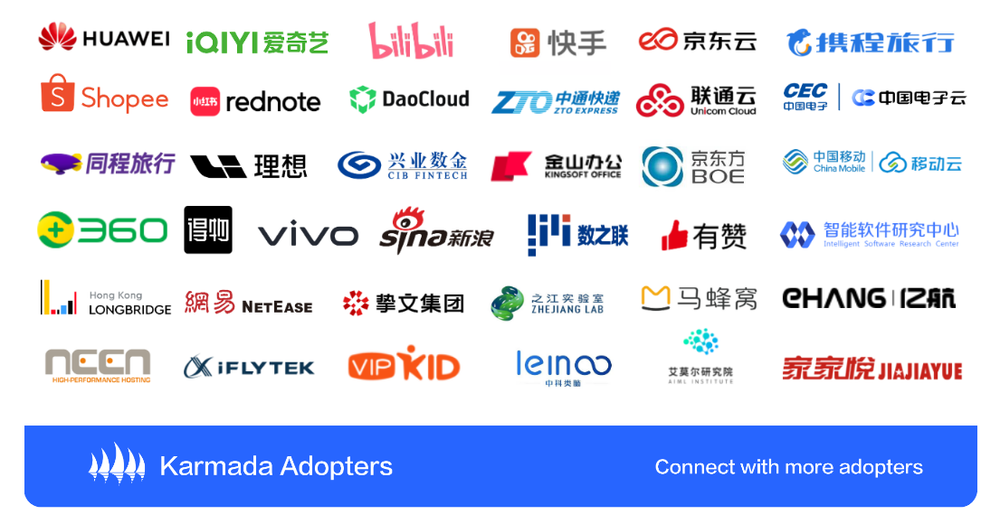

# [中科类脑]正式加入Karmada用户组！携手社区共建多集群生态

Karmada 社区非常高兴地宣布**中科类脑**正式加入**Karmada 用户组**（Karmada Adopter Group），成为该开源社区的重要成员。作为云原生计算基金会（CNCF）旗下的开源项目，Karmada 致力于为用户提供强大的多集群管理和调度能力，帮助企业在复杂的分布式环境中实现高效的应用部署和管理。**中科类脑**的加入将进一步丰富 Karmada 社区的生态，并为项目的持续创新注入新的动力。

  

## 关于中科类脑

  

合肥中科类脑智能技术有限公司成立于2017年，是一家专注于类脑智能技术研发与应用的国家高新技术企业、国家级专精特新“小巨人”企业。公司在机器视觉大模型、小样本学习、因果视觉与因果推理、稳定学习、类脑博弈优化决策等多个人工智能前沿技术领域处于行业先进地位，广泛应用于算力基础设施、智慧能源和算电碳协同发展三大业务领域。

中科类脑秉承“推动前沿智能技术落地，助力产业数智升级”的使命，持续推出创新的智能化产品及解决方案，力求打造垂直领域人工智能应用的深度闭环。公司致力于成为全球领先的能源智能服务企业，致力于成为全球AI生态建设者。

## 关于 Karmada 用户组

作为连接社区与用户的核心纽带，**Karmada 用户组**致力于打造一个深度融合、开放协作的高价值平台，推动成员间的高效联动与经验共享。通过技术支持、活动共创及最佳实践交流，**Karmada 用户组**将持续赋能用户在多云管理领域的能力提升，助力云原生多云多集群生态系统的蓬勃发展。其主要目标和功能包括：
- 分享知识：促进 Karmada 用户之间的经验、挑战和解决方案交流
- 促进协作：提供一个用户可以协作、分享想法并解决共同问题的平台
- 支持用户：提供资源、教程和指导，帮助用户有效利用 Karmada
- 收集反馈：倾听用户声音，以指导 Karmada 未来的发展方向
- 社区活动组织：通过定期 meetup、网络研讨会和其他活动，增强社区参与度

截至目前，Karmada 用户组已吸纳来自全球的35+家机构和组织。更多使用场景及案例研究请查阅：https://karmada.io/adopters

## 欢迎加入用户组

任何在**生产环境**中使用 Karmada 的公司，其开发者均可申请加入 **Karmada 用户组**。无论您是**最终用户**还是**云厂商**，我们都欢迎您的加入。
- **最终用户**：指在其内部 IT 基础设施中直接部署和使用 Karmada 进行多云或多集群管理的企业或组织。这些公司利用 Karmada 作为关键技术底座来管理和优化算力资源。
- **供应商**：指那些将 Karmada 集成到他们的产品或服务中，以提供给其他企业或组织使用的公司。

加入 **Karmada 用户组**，您可以与面临类似挑战的同行建立联系并分享 Karmada 实践经验，一同探索多云多集群生态，包括但不限于以下内容：
- **社区技术支持**：包括且不限于方案评估、日常运维、问题定位、版本升级等社区支持
- **公司知名度提升**：您的公司和团队将获得全球范围内更多的曝光机会
- **技术影响力构建**：邀请共建技术演讲，包括 KubeCon 等海内外业界大会，Karmada 社区伙伴举办的线上、线下系列会议
- **保持信息同步**：及时接收重要信息更新，包括新版本的关键特性、重要 Bug 修复、安全风险等内容，确保您的项目能够第一时间受益于新的改进和增强。
- **顶尖人才招募**：利用社区渠道招聘宣传，全球范围内精准招募优秀人才
- **拓展商业机会**：与 Karmada 生态系统其他成员建立潜在的商业联系和合作

当前，加入 **Karmada 用户组**对社区贡献没有硬性要求，我们鼓励成员积极参与社区活动，分享经验与见解。然而，请注意，未来可能会要求成员对 Karmada 社区做出一定的贡献，以维持其用户组成员身份。这种贡献可以包括但不限于代码提交、文档编写、问题修复、使用案例分享等。

访问下方 **Karmada 用户组申请表单**，提交 issue 申请，即可接收申请进度。手机端可扫描下方二维码快捷填写申请表单。

  
  
扫描申请加入用户组

Karmada 用户组欢迎您的加入！期待与您共同创建一个友好而活跃的空间，共享知识、最佳实践和经验，为企业与社区发展缔造更多可能。如需了解更多关于 Karmada 用户组的信息，请邮件联系: cncf-karmada-maintainers@lists.cncf.io 。
