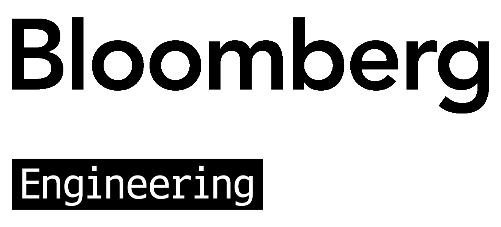

# 欢迎彭博加入 Karmada 用户组

Karmada 非常高兴地宣布 **[彭博](https://www.techatbloomberg.com/opensource/)** 正式加入 Karmada 用户组，成为社区的重要成员。作为云原生计算基金会（CNCF）旗下的项目，Karmada 致力于为用户提供强大的多集群管理和调度能力，帮助企业在复杂的分布式环境中实现高效的应用部署和管理。**彭博**的加入将进一步加强 Karmada 社区，为项目的持续创新带来新的活力，标志着我们社区发展和 Karmada 在多样化生产环境中采用的又一个重要里程碑。

## 关于彭博

彭博（Bloomberg）是全球商业与金融信息领域的领军者，提供值得信赖的数据、新闻与深度洞察，为市场注入透明度、提升效率并维护公平性。彭博借助可靠的技术解决方案，助力全球金融生态系统中具有影响力的各方建立连接，帮助客户做出更明智的决策，并促进更高效的协作。

## 关于 Karmada 用户组

**Karmada 用户组**是一个由在其环境中成功采用 Karmada 的组织和用户组成的社区。成员分享他们的经验、最佳实践和反馈，以帮助改进 Karmada 并培育一个充满活力的协作生态系统。

成为 Karmada 用户组成员具有以下几个优势：

- **社区认可**：作为云原生多集群管理领域的领导者来展示您的组织，在 CNCF 和 Karmada 社区中获得知名度。
- **促进协作**：与其他采用者建立联系，分享最佳实践，并在实际用例和解决方案上进行协作。
- **保持信息同步**：及时接收重要更新通知，包括关键功能、错误修复和安全建议。
- **技术影响力构建**：受邀参与 Karmada 相关活动，包括 KubeCon + CloudNativeCon、网络研讨会和聚会。
- **职位发布**：有机会在 Karmada 社区支持的职位公告板上发布与 Karmada 相关的职位空缺（目前暂不可用）。
- **扩展商业机会**：与 Karmada 生态系统的其他成员建立潜在的商业联系和合作。

在 [GitHub 社区仓库](https://github.com/karmada-io/community/tree/main/adopter-group) 中了解更多关于 Karmada 用户组的信息，并在 [karmada.io/adopters](https://karmada.io/zh/adopters) 查看完整的`公开`的采用者列表。

## 加入 Karmada 用户组

**Karmada 用户组**对当前正在**生产环境**中使用 Karmada 的**最终用户**和**供应商**开放。这包括：

- **最终用户**：在其生产环境中运行 Karmada 的组织。
- **供应商**：提供基于 Karmada 的产品或服务，并有客户在生产环境中使用这些产品或服务的公司。

您是否在生产环境中使用 Karmada 并有兴趣加入 Karmada 用户组？  
加入很简单——只需填写 [Karmada 用户组申请表单](https://github.com/karmada-io/karmada/issues/4540) 并提供您组织的信息。
在您的申请经过审核和批准后，您的组织将被添加到 Karmada 用户组。

更多详情，请查看社区仓库中的 [如何加入](https://github.com/karmada-io/community/tree/main/adopter-group#how-to-join) 部分。

让我们一起发展 Karmada 社区和更广泛的多集群生态系统！