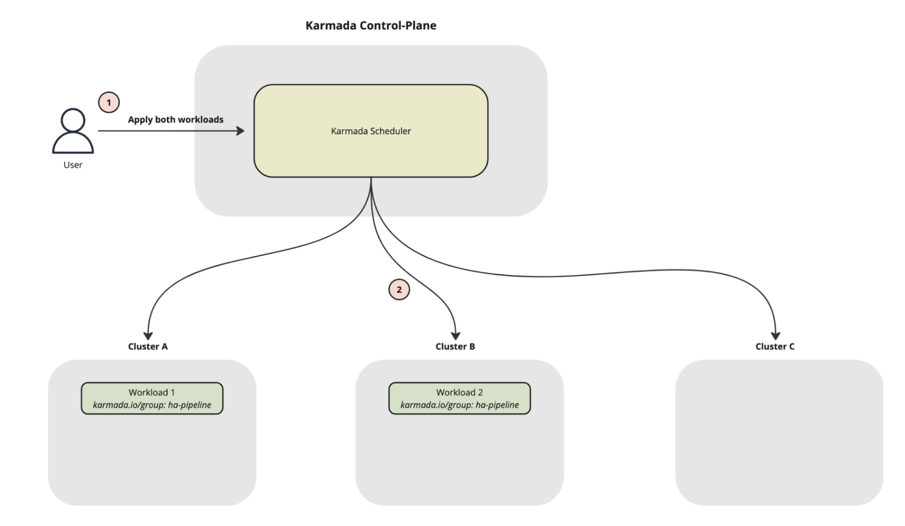

# Karmada v1.17 版本发布！新增工作负载亲和性支持

Karmada 是开放的多云多集群容器编排引擎，旨在帮助用户在多云环境下部署和运维业务应用。凭借兼容 Kubernetes 原生 API 的能力，Karmada 可以平滑迁移单集群工作负载，并且仍可保持与 Kubernetes 周边生态工具链协同。

[Karmada v1.17](https://github.com/karmada-io/karmada/blob/master/docs/CHANGELOG/CHANGELOG-1.17.md) 版本现已发布，本版本包含下列新增特性：

- 工作负载亲和与反亲和调度
- Dashboard v0.3.0 发布
- 持续的性能优化

这些特性使 Karmada 在处理大规模、复杂的多集群场景时更加成熟和可靠。我们鼓励您升级到 v1.17.0，体验这些新功能带来的价值。

## 新特性概览

### 支持工作负载亲和与反亲和调度

在多集群场景下，大量应用对工作负载之间的部署位置存在明确诉求，以实现高可用、低延迟、成本优化与运维隔离等目标。为满足这类精细化部署需求，本版本正式推出**工作负载亲和与反亲和调度**能力，让你能够精细控制工作负载在多集群间的拓扑关系。

#### 工作负载亲和（Workload Affinity）

将存在关联的工作负载（如微服务与其缓存、分布式训练任务等）调度到同一集群。

- 核心价值：降低跨集群网络延迟，显著提升性能敏感型应用的运行效率。
- 典型场景：服务与依赖组件同集群部署、训练任务组件就近调度。

#### 工作负载反亲和（Workload Anti-Affinity）

将同一逻辑组的工作负载分散到不同集群。

- 核心价值：避免单集群故障导致关键应用整体不可用，强化多集群高可用保障。
- 典型场景：核心服务多集群分散、多副本跨集群容灾。

#### 使用方式

只需在 PropagationPolicy 中添加 workloadAffinity 配置，即可基于资源模板上的标签定义亲和组，实现工作负载的同集群部署或跨集群分散。  
让我们举一个**工作负载亲和性**的例子，假设您有一组训练任务，为了达到最佳的训练效果，您希望这一组训练任务的作业能在同一个集群上运行，您可以这样配置：
```yaml
apiVersion: policy.karmada.io/v1alpha1
kind: PropagationPolicy
metadata:
  name: training-tasks-affinity-example
  namespace: default
spec:
  resourceSelectors:
    - apiVersion: batch/v1
      kind: Job
      labelSelector:
        matchLabels:
          workload.type: training
  placement:
    spreadConstraints:
      - maxGroups: 1
        minGroups: 1
    clusterAffinity:
      clusterNames:
        - member1
        - member2
        - member3
    workloadAffinity:
      affinity:
        groupByLabelKey: app.training-group
```
**启用工作负载亲和与反亲和调度功能后，**Karmada 会将具有相同 `app.training-group` 标签值的训练任务调度到同一个集群。

再来看一个**工作负载反亲和性**的例子，假设您运行着对停机时间非常敏感的 Flink 数据处理任务，为了保证高可用，您会部署多套相同的 Flink 任务副本。为了避免因单个集群故障导致服务完全中断，您希望同一任务的多个副本分散到不同集群上运行，您可以这样配置：
```yaml
apiVersion: policy.karmada.io/v1alpha1
kind: PropagationPolicy
metadata:
  name: flink-anti-affinity-example
  namespace: default
spec:
  resourceSelectors:
    - apiVersion: flink.apache.org/v1beta1
      kind: FlinkDeployment
      labelSelector:
        matchLabels:
          ha.enabled: "true"
  placement:
    spreadConstraints:
      - maxGroups: 1
        minGroups: 1
    clusterAffinity:
      clusterNames:
        - clusterA
        - clusterB
        - clusterC
    workloadAffinity:
      antiAffinity:
        groupByLabelKey: karmada.io/group
```
**启用工作负载亲和与反亲和调度功能后，**Karmada 会将具有相同 `karmada.io/group` 标签值的 Flink 任务调度到不同集群，效果图如下：



更多有关此功能的资料请参考：[工作负载亲和性](https://karmada.io/zh/docs/next/userguide/scheduling/propagation-policy/#workloadaffinity%E5%B7%A5%E4%BD%9C%E8%B4%9F%E8%BD%BD%E4%BA%B2%E5%92%8C%E6%80%A7)。

### Dashboard v0.3.0 发布

Karmada Dashboard 是一款专为 Karmada 用户设计的图形化界面工具，旨在简化多集群管理的操作流程，提升用户体验。通过 Dashboard，用户可以直观地查看集群状态、资源分布以及任务执行情况，同时还能轻松完成配置调整和策略部署。

经过社区开发者的共同努力，Karmada Dashboard v0.3.0 正式发布！本次更新带来智能助手、成员集群管理等能力，多集群运维体验全面升级，更易用、更稳定、更智能！

Karmada Dashboard v0.3.0 主要功能包括：

- **智能化运维：**深度集成 MCP (Model Context Protocol) 与 LLM，推出智能聊天助手。支持自然语言交互，实时响应与工具能力扩展，让多集群管理更加智能！
- **成员集群管理能力增强：**新增成员集群专用仪表盘，支持实时日志查看和终端交互，实现对子集群的精细化掌控。
- **界面优化：**采用更现代化的 UI 组件 Ant Design v6 同时升级至 React 19，界面更加美观；优化数据请求与构建性能，提升交互体验与运行效率。
- **安全性和稳定性增强：**引入全面的 E2E 测试框架维护基本功能特性，并自动升级安全依赖，减少安全风险。

下面是 Karmada Dashboard v0.3.0 新版界面展示，可以在顶部导航栏上切换成员集群，无缝切换到成员集群：


更多有关 Karmada Dashboard 的资料请参考：[Karmada Dashboard](https://github.com/karmada-io/dashboard)

### 持续的性能优化

在此版本中，性能优化团队继续增强 Karmada 的性能，对控制器进行了如下改进：

#### 控制器优先级队列（ControllerPriorityQueue）特性升级至 Beta 并默认启用

`控制器优先级队列`特性自 v1.15 版本首次推出后，历经两个版本的持续迭代与严格测试，能力已趋于成熟，本次版本正式将其升级为 Beta 版，并默认开启该特性。  
基于此特性，Karmada 控制器能够在重启或切主后**立即响应并优先处理**用户触发的资源变更，从而显著缩短服务重启和计划性升级过程中的停机时间。

#### 依赖资源分发能力性能优化

通过消减并发更新依赖资源相关的 ResourceBinding 所产生的 API 冲突，依赖资源跟随分发的效率得到了显著的提升。  
测试环境包括 30,000 个 Workload 及其 PropagationPolicy，以及 30,000 个 ConfigMap 作为 Workload 依赖的资源。该优化将控制器首次启动的队列处理时间从20 分钟以上大幅缩短至约 5 分钟，显著提升了大规模集群下的系统响应速度。

有关详细的优化内容和测试报告，请参阅 PR: [\[Performance\] optimize the mechanism of create or update dependencies-distribute resourcebinding](https://github.com/karmada-io/karmada/pull/7153)

# 致谢贡献者

Karmada v1.17 版本包含了来自 32 位贡献者的 264 次代码提交，在此对各位贡献者表示由衷的感谢：

| ^-^              | ^-^             | ^-^                     |
|------------------|-----------------|-------------------------|
| @7h3-3mp7y-m4n   | @Abhay349       | @abhinav-1305           |
| @AbhinavPInamdar | @Ady0333        | @Aman-Cool              |
| @Arhell          | @arnavgogia20   | @CharlesQQ              |
| @cmontemuino     | @dahuo98        | @FAUST-BENCHOU          |
| @gmarav05        | @goyalpalak18   | @jabellard              |
| @kajal-jotwani   | @LivingCcj      | @mohamedawnallah        |
| @mszacillo       | @RainbowMango   | @rayo1uo                |
| @seanlaii        | @SunsetB612     | @suresh-subramanian2013 |
| @vie-serendipity | @warjiang       | @XiShanYongYe-Chang     |
| @yaten2302       | @yoursanonymous | @zach593                |
| @zhengjr9        | @zhzhuang-zju   |                         |


