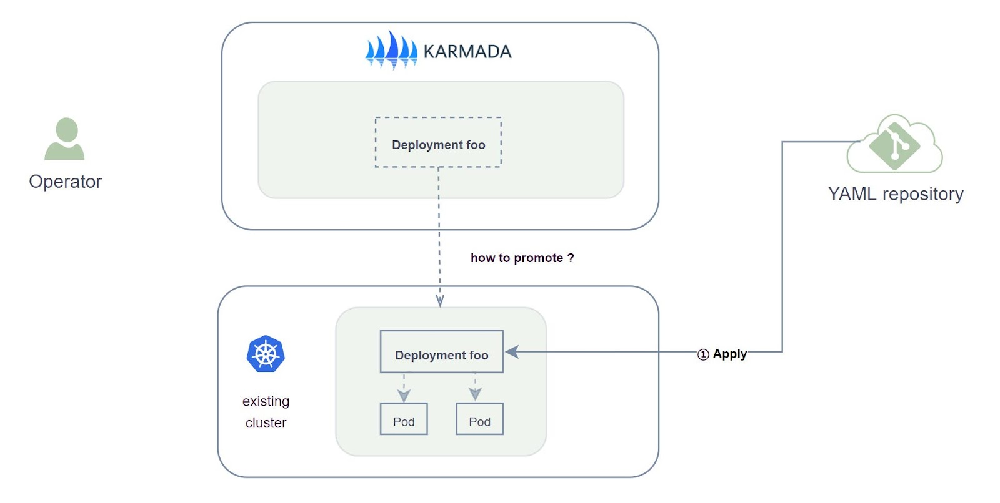
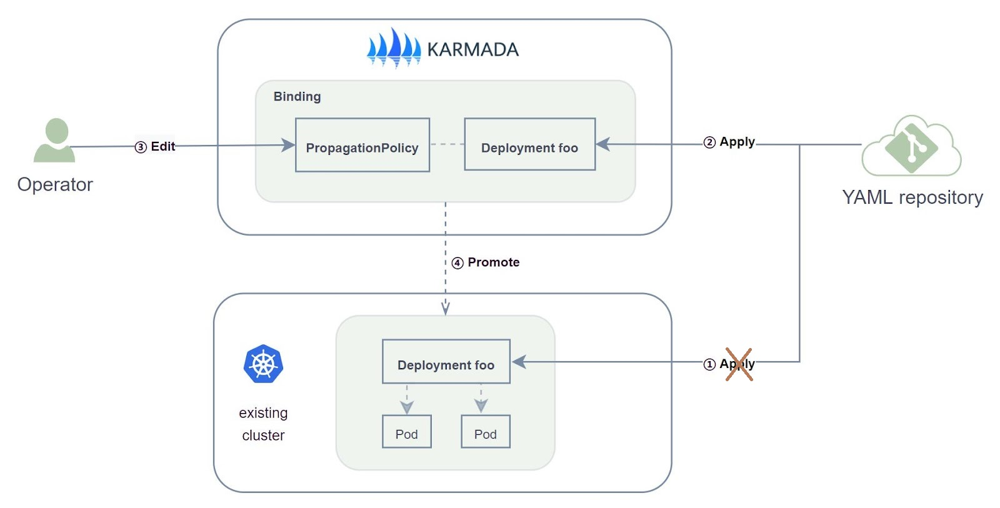

## 场景

假设用户安装了一个 Kubernetes 单集群，该集群已经部署了很多资源。

用户希望通过 Karmada 将单集群扩展成多集群，并将已部署的资源从原集群迁移到 Karmada。 用户要求已经存在的 Pod 在迁移过程中不受影响，或者说相关容器不会重新启动。

那么，如何实现资源的平滑迁移呢？




## 推荐的迁移方式

如果用户只需迁移个别资源，参考 [promote-legacy-workload](./promote-legacy-workload) 逐个资源迁移即可。

如果用户想批量迁移资源，建议您首先通过几个 `PropagationPolicy` 以资源为粒度接管所有资源，
然后，如果您还有其他以应用为粒度的分发需求，则可以应用更高优先级的 `PropagationPolicy` 来抢占它们。

那么，如何以资源为粒度接管所有资源？你可以按如下操作：



### 步骤一

由于现有资源将由 Karmada 接管，因此不再需要将相关的YAML配置应用于成员集群。 也就是说，您可以停止相应的操作或流水线。

### 步骤二

将所有资源的 YAML 配置应用到 Karmada 控制面, 作为 Karmada 的 [ResourceTemplate](https://karmada.io/docs/core-concepts/concepts#resource-template)。

### 步骤三

编写 [PropagationPolicy](https://karmada.io/docs/core-concepts/concepts#propagation-policy), 并将其应用到 Karmada 控制面。 您需要注意以下两个字段：

* `spec.conflictResolution: Overwrite`：**该字段的值必须是 [Overwrite](https://github.com/karmada-io/karmada/blob/master/docs/proposals/migration/design-of-seamless-cluster-migration-scheme.md#proposal)。**
* `spec.resourceSelectors`：指定哪些资源需要被迁移。

这里提供两个例子：

#### 示例 1. 迁移所有的 Deployment

如果您希望把所有的 Deployment 从 `member1` 集群迁移到 Karmada，你需要应用以下配置:

```yaml
apiVersion: policy.karmada.io/v1alpha1
kind: PropagationPolicy
metadata:
  name: deployments-pp
spec:
  conflictResolution: Overwrite
  placement:
    clusterAffinity:
      clusterNames:
      - member1
  priority: 0
  resourceSelectors:
  - apiVersion: apps/v1
    kind: Deployment
  schedulerName: default-scheduler
```

#### 示例 2. 迁移所有的 Service

如果您希望把所有的 Service 从 `member1` 集群迁移到 Karmada，你需要应用以下配置:

```yaml
apiVersion: policy.karmada.io/v1alpha1
kind: PropagationPolicy
metadata:
  name: services-pp
spec:
  conflictResolution: Overwrite
  placement:
    clusterAffinity:
      clusterNames:
      - member1
  priority: 0
  resourceSelectors:
  - apiVersion: v1
    kind: Service
  schedulerName: default-scheduler
```

### 步骤四

余下的迁移操作将由Karmada自动完成。

## PropagationPolicy 抢占及 Demo

在此基础上，如果您还有以应用为粒度的分发需求，则可以应用更高优先级的 `PropagationPolicy` 来抢占上文提及的用于迁移的 Policy。
详细的 Demo 可以参考教程：[平滑迁移](../../tutorials/resource-migration.md)
