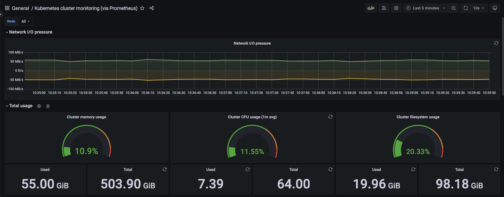

---
title:使用 Prometheus 来监控 Karmada 控制平面
---

[Prometheus](https://github.com/prometheus/prometheus) 是一个[云原生计算基金会](https://cncf.io/) 项目，是一个系统和服务监控系统。它以给定的时间间隔从配置的目标收集指标，评估规则表达式，显示结果，并在观察到指定条件时触发警报。

本文举例说明如何使用 `Prometheus` 来监控 Karmada 控制平面。


## 启动 karmada 集群

你只需要克隆 Karmada repo，并在 Karmada 目录下运行以下脚本。

```shell
hack/local-up-karmada.sh
```


## 启动 Prometheus

1. 在 `karmada-host` 文本和 `karmada-apiserver` 文本中创建 RBAC 的资源。

   ```yaml
   apiVersion: v1
   kind: Namespace
   metadata:
      name: monitor
      labels:
        name: monitor
   ---
   apiVersion: rbac.authorization.k8s.io/v1
   kind: ClusterRole
   metadata:
     name: prometheus
   rules:
   - apiGroups: [""]
     resources:
     - nodes
     - nodes/proxy
     - services
     - endpoints
     - pods
     verbs: ["get", "list", "watch"]
   - apiGroups:
     - extensions
     resources:
     - ingresses
     verbs: ["get", "list", "watch"]
   - nonResourceURLs: ["/metrics"]
     verbs: ["get"]
   - apiGroups:
     - 'cluster.karmada.io'
     resources:
     - '*'
     verbs:
     - '*'
   ---
   apiVersion: v1
   kind: ServiceAccount
   metadata:
     name: prometheus
     namespace: monitor
   ---
   apiVersion: rbac.authorization.k8s.io/v1
   kind: ClusterRoleBinding
   metadata:
     name: prometheus
   roleRef:
     apiGroup: rbac.authorization.k8s.io
     kind: ClusterRole
     name: prometheus
   subjects:
   - kind: ServiceAccount
     name: prometheus
     namespace: monitor
   ```

2. 为 ServiceAccount 创建 Secret **[在k8s v1.24+中需要]**
   (在v1.24+版本中，创建 ServiceAccount 不会自动生成 Secret )

   ```yaml
   apiVersion: v1
   kind: Secret
   type: kubernetes.io/service-account-token
   metadata:
     name: prometheus
     namespace: monitor
     annotations:
       kubernetes.io/service-account.name: "prometheus"
   ```

3. 获取访问 karmada apiserver 的令牌

   ```shell
   kubectl get secret prometheus -o=jsonpath={.data.token} -n monitor --context "karmada-apiserver" | base64 -d
   ```

4. 在 "karmada-host " 上下文中创建 Prometheus 的资源对象，同时你需要用步骤3得到的令牌替换 "<karmada-token>"（2处）。
   ```yaml
   apiVersion: v1
   kind: ConfigMap
   metadata:
     name: prometheus-config
     namespace: monitor
   data:
     prometheus.yml: |-
       global:
         scrape_interval:     15s 
         evaluation_interval: 15s
       scrape_configs:
       - job_name: 'karmada-scheduler'
         kubernetes_sd_configs:
         - role: endpoints
         scheme: http
         tls_config:
           insecure_skip_verify: true
         relabel_configs:
         - source_labels: [__meta_kubernetes_namespace, __meta_kubernetes_service_name, __meta_kubernetes_pod_label_app]
           action: keep
           regex: karmada-system;karmada-scheduler;karmada-scheduler
       - job_name: 'kubernetes-apiserver'
         kubernetes_sd_configs:
         - role: endpoints
         scheme: https
         tls_config:
           ca_file: /var/run/secrets/kubernetes.io/serviceaccount/ca.crt
         bearer_token_file: /var/run/secrets/kubernetes.io/serviceaccount/token
         relabel_configs:
         - source_labels: [__meta_kubernetes_namespace, __meta_kubernetes_service_name, __meta_kubernetes_endpoint_port_name]
           action: keep
           regex: default;kubernetes;https
         - target_label: __address__
           replacement: kubernetes.default.svc:443
       - job_name: 'karmada-apiserver'
         kubernetes_sd_configs:
         - role: endpoints
         scheme: https
         tls_config:
           insecure_skip_verify: true
         bearer_token: <karmada-token>    # need the true karmada token
         relabel_configs:
         - source_labels: [__meta_kubernetes_pod_label_app]
           action: keep
           regex: karmada-apiserver
         - target_label: __address__
           replacement: karmada-apiserver.karmada-system.svc:5443
       - job_name: 'karmada-aggregated-apiserver'
         kubernetes_sd_configs:
         - role: endpoints
         scheme: https
         tls_config:
           insecure_skip_verify: true
         bearer_token: <karmada-token>    # need the true karmada token
         relabel_configs:
         - source_labels: [__meta_kubernetes_namespace, __meta_kubernetes_service_name, __meta_kubernetes_endpoints_name]
           action: keep
           regex: karmada-system;karmada-aggregated-apiserver;karmada-aggregated-apiserver
         - target_label: __address__
           replacement: karmada-aggregated-apiserver.karmada-system.svc:443
       - job_name: 'kubernetes-cadvisor'
         scheme: https
         tls_config:
           ca_file: /var/run/secrets/kubernetes.io/serviceaccount/ca.crt
         bearer_token_file: /var/run/secrets/kubernetes.io/serviceaccount/token
         kubernetes_sd_configs:
         - role: node
         relabel_configs:
         - target_label: __address__
           replacement: kubernetes.default.svc:443
         - source_labels: [__meta_kubernetes_node_name]
           regex: (.+)
           target_label: __metrics_path__
           replacement: /api/v1/nodes/${1}/proxy/metrics/cadvisor
         - action: labelmap
           regex: __meta_kubernetes_node_label_(.+)
         metric_relabel_configs:
         - action: replace
           source_labels: [id]
           regex: '^/machine\.slice/machine-rkt\\x2d([^\\]+)\\.+/([^/]+)\.service$'
           target_label: rkt_container_name
           replacement: '${2}-${1}'
         - action: replace
           source_labels: [id]
           regex: '^/system\.slice/(.+)\.service$'
           target_label: systemd_service_name
           replacement: '${1}'
         - source_labels: [pod]
           separator: ;
           regex: (.+)
           target_label: pod_name
           replacement: $1
           action: replace
   ---
   apiVersion: v1
   kind: "Service"
   metadata:
     name: prometheus
     namespace: monitor
     labels:
       name: prometheus
   spec:
     ports:
     - name: prometheus
       protocol: TCP
       port: 9090
       targetPort: 9090
       nodePort: 31801 
     selector:
       app: prometheus
     type: NodePort
   ---
   apiVersion: apps/v1
   kind: Deployment
   metadata:
     labels:
       name: prometheus
     name: prometheus
     namespace: monitor
   spec:
     replicas: 1
     selector:
       matchLabels:
         app: prometheus
     template:
       metadata:
         labels:
           app: prometheus
       spec:
         serviceAccountName: prometheus
         containers:
         - name: prometheus
           image: prom/prometheus:latest
           command:
           - "/bin/prometheus"
           args:
           - "--config.file=/etc/prometheus/prometheus.yml"
           - "--storage.tsdb.path=/prom-data"
           - "--storage.tsdb.retention.time=180d"
           ports:
           - containerPort: 9090
             protocol: TCP
           volumeMounts:
           - mountPath: "/etc/prometheus"
             name: prometheus-config
           - mountPath: "/prom-data"
             name: prom-data
         initContainers:
         - name: prometheus-data-permission-fix
           image: busybox
           command: ["/bin/chmod","-R","777", "/data"]
           volumeMounts:
           - name: prom-data
             mountPath: /data
         volumes:
         - name: prometheus-config
           configMap:
             name: prometheus-config
         - name: prom-data
           hostPath:
             path: /var/lib/prom-data
             type: DirectoryOrCreate
   
   ```

3. 使用控制平面的任何节点IP和端口号（默认为31801），进入控制平面的 Prometheus 监控页面。

## 使用 Grafana 实现指标的可视化
为了获得更好的可视化指标体验，我们还可以使用 Grafana 与 Prometheus，以及社区提供的 [Dashboards] (https://grafana.com/grafana/dashboards/)。

1. 用Helm安装Grafana
```shell
helm repo add grafana https://grafana.github.io/helm-charts
helm repo update

cat <<EOF | helm upgrade --install grafana grafana/grafana --kube-context "karmada-host" -n monitor -f -
persistence:
  enabled: true
  storageClassName: local-storage
service:
  enabled: true
  type: NodePort
  nodePort: 31802
  targetPort: 3000
  port: 80
EOF
```
2. 获取 grafana 网页用户界面的登录密码
```shell
kubectl get secret --namespace monitor grafana -o jsonpath="{.data.admin-password}" --context "karmada-host" | base64 --decode ; echo
```
3. 使用控制平面的任何节点IP和端口号（默认为31802）进入控制平面的 grafana web UI。


**注意**

1. 在 k8s v1.24+ 中，来自 cadvisor 的指标可能会遗漏图像、名称和容器标签，这可能会导致 karmada 组件（如 karmada-apisever、kamada-controller-manager）的指标无法被观察到 [link](https://github.com/kubernetes/kubernetes/issues/111077)


## 参考资料

- https://github.com/prometheus/prometheus
- https://prometheus.io/
- https://grafana.com/grafana/dashboards/


