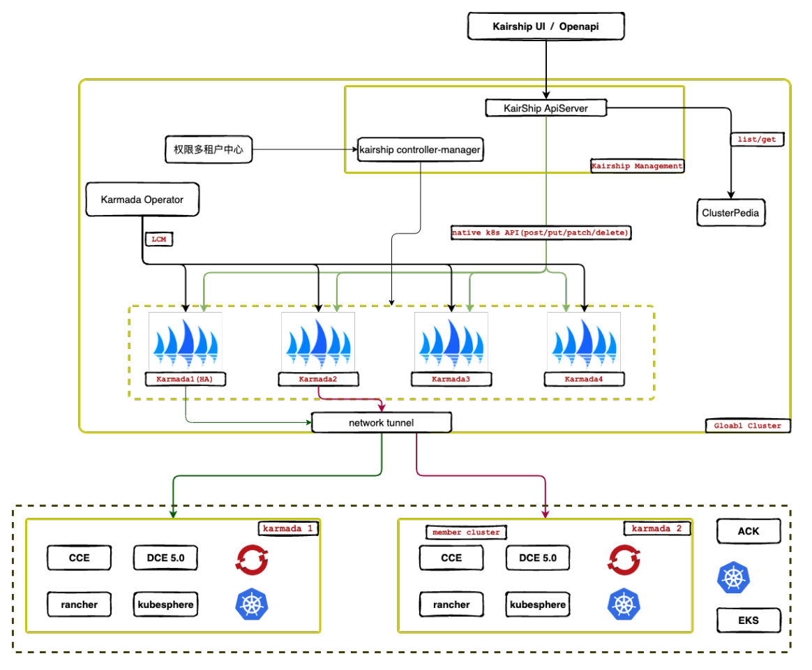
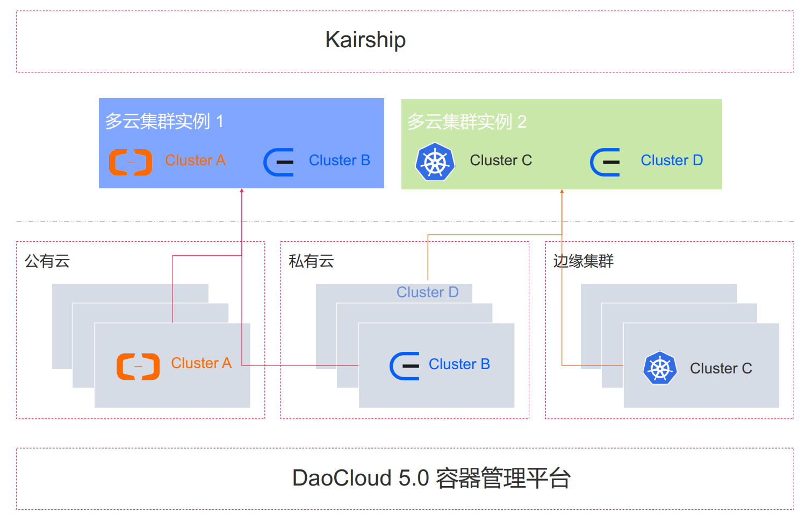
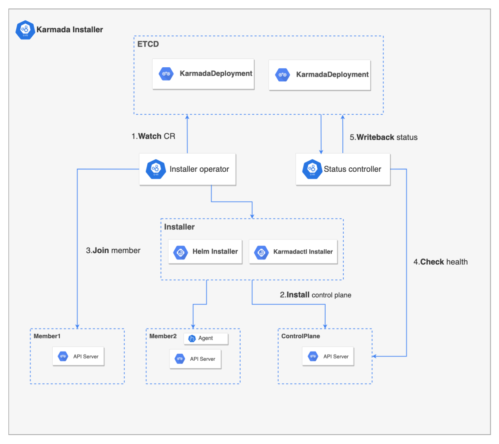
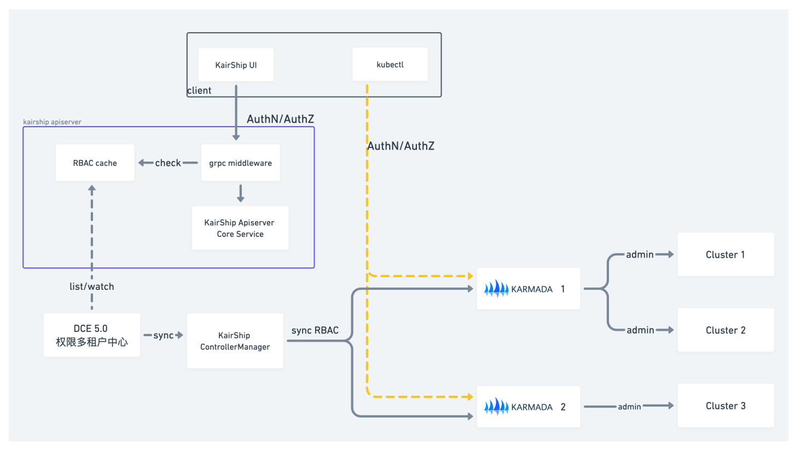
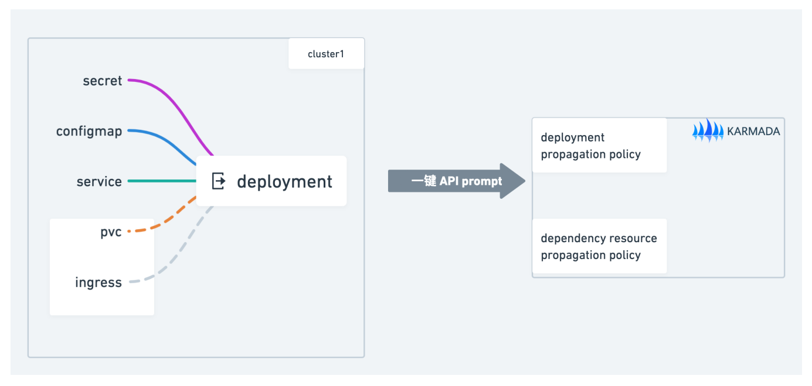
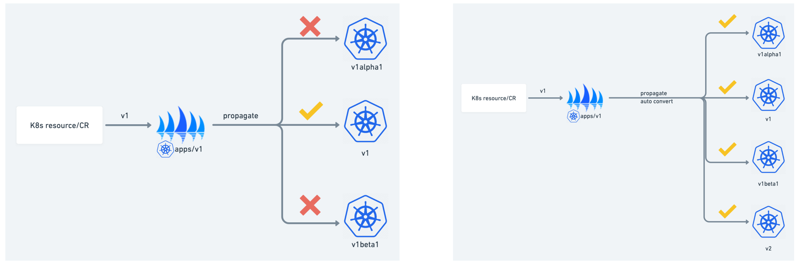
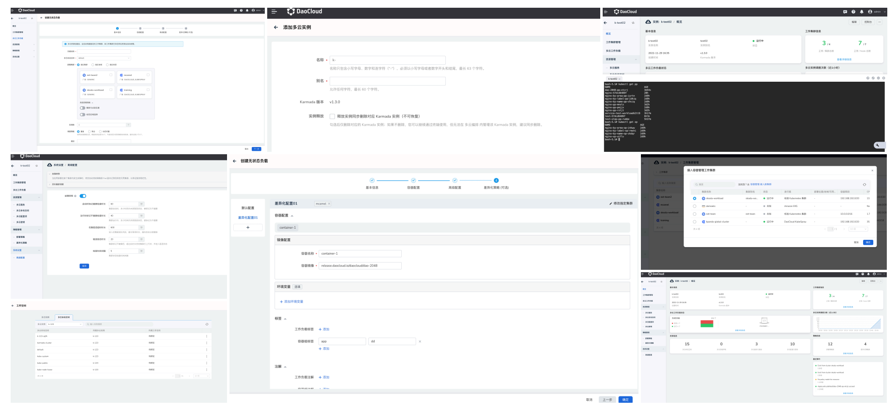

## 挑战与机遇

DaoCloud是企业级云计算领域的创新领导者。DaoCloud产品线涵盖云原生应用的开发、交付、运维和运营全生命周期，并提供公有云、私有云和混合云等多种交付方式。2022年的CNCF年度总结报告显示，Kubernetes已经成为全球主流的云计算技术，96%的组织正在使用或者评估Kubernetes，79%的用户使用经过认证的K8s平台。
随着企业业务上云的规模不断增长，多云多集群逐渐成为企业使用云计算技术的一种趋势。DaoCloud希望能打造一个具备**敏捷性、灵活性、可扩展性和强大的安全性**的企业级多云平台，帮助它的用户**降低集群繁多、业务分散所带来的管理成本，使应用能突破集群的边界，避免被供应商锁定，加强企业用户的风险管理**。

## 解决方案

在DaoCloud设计多云平台前，DaoCloud考虑了开源社区的多种解决方案，包括KubeFed、OCM、Clusternet与Karmada。在深入的对比了上述方案后，DaoCloud最终选择了Karmada。原因主要有以下几点：

1. Karmada兼容K8s原生API，这使得Karmada能帮助用户零改造从单集群升级为多集群，无缝集成K8s单集群工具链生态。
2. Karmada是一个开放中立的项目，社区积极听取用户的声音，也乐于接受开发者的贡献。
3. Karmada解决了用户在使用多集群时被厂商绑定的困扰，能够自动分配和自动迁移多集群应用，不绑定厂商的商业产品。
4. Karmada开箱即用，支持面向多场景的内置策略集。
5. Karmada具备丰富的多集群调度，支持集群的亲和性调度和多颗粒多集群的高可用部署。 
6. Karmada无需顾虑集群位置，实现了公有云、私有云、边缘集群的集中式管理

## 影响与收益

DaoCloud结合Karmada，打造了企业级的多云平台KairShip，**助力用户把业务从云下走向云上，单云丝滑切换到多云，使用户无需关注底层基础设施的差异，不用过多接受K8s之外的新概念**。

KairShip的架构如下图所示：

KairShip向用户提供了Karmada原生支持的核心能力：

* 多云权限管理，提供RBAC模型的原生认证鉴权方式。
* 应用跨集群分发，支持应用的差异化配置，依据地域、可用区、厂商分发应用。
* 支持存储、配置等丰富的多云资源的多场景的分发策略与覆盖策略。
* 跨集群故障迁移，提供应用的多云Failover能力。

得益于Karmada对Kubernetes原生API的支持，Kairship引用了Kubernetes工具链生态上的开源项目，提供了更高阶的能力。

借助于Karmada高度的灵活性和可扩展性，Kairship根据企业用户的落地需求，在Karmada之上做了功能的增强和扩展，拓展了Karmada的使用场景。

### Karmada多实例需求

在Karmada的落地实践过程中，用户对Karmada有多实例部署的需求。其一是由于用户的环境因素需要多个Karmada实例，其二，Karmada的多实例部署能够快速一键接入各个集群，屏蔽底层网络的基础设置。

DaoCloud自研了Karmada-Operator，Karmada-Operator基于Karmada社区的Helm charts，实现了Karmada实例的快速创建、更新、卸载以及维护，并且支持成员集群快速接入Karmada实例，通过控制器搜集成员集群的概览信息到Karmada控制面实例中。

### 多云权限

一个企业级的多云平台绕不开权限管理问题，对于Karmada而言，如何实现Karmada应用编排过程权限的隔离以及如何实现Karmada的多租户隔离是两个新的挑战。
Kairship将Karmada Host作为一个普通集群加到整个DCE 5.0（DaoCloud的容器引擎产品）的集群管理中，抽象出关键的RBAC，与既有的多租户中心进行对接。

此外，Kairship在Karmada之上做了大量的二次开发，新增了Kairship Apiserver组件负责整体的API请求，也提供了API层面权限的校验，新增了Kairship Controller Manager组件实现逻辑层权限的同步与校验。

### 面向企业用户的最佳实践

用户在使用Karmada之前，通常已有大量的单集群应用，这时用户希望能快捷的把单集群应用提升为多云应用，进而应用Karmada的各种高阶能力。
Kairship在社区的karmadactl prompt命令的基础上支持deployment及其依赖资源的一键迁移，对应资源都将创建Propagation Policy，且指向当前集群，后续扩展调度策略可以通过修改Propagation Policy的方式。

当前Karmada会检查成员集群的API支持列表，并在集群调度时过滤掉不支持下发应用的API的集群。这无法满足用户想要下发同一种Kubernetes资源到支持不同API版本的集群的场景。Karship提供了同一种Kubernetes资源在不同API版本的自动转换，使Karmada实现版本自适应的应用分发。

Kaiship提供了Karmada功能的可视化界面，使用户能更简单便捷地使用Karmada的能力。

## 总结

“Karmada是一个开源开放的项目，致力于让基于Karmada的多云方案无缝融入云原生技术生态，为企业提供从单集群到多云架构的平滑演进方案。得益于Karmada社区的不断发展，DaoCloud在打造企业级产品的同时，也在积极地回馈Karmada社区。未来我们将在社区参加各个领域的贡献，与社区共同发展，深入参与社区共建共治。”

————张潇，DaoCloud大容器团队技术负责人
