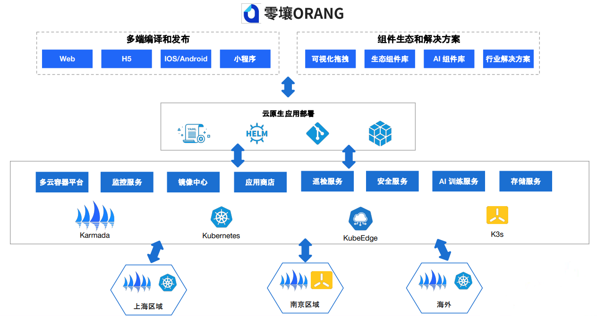
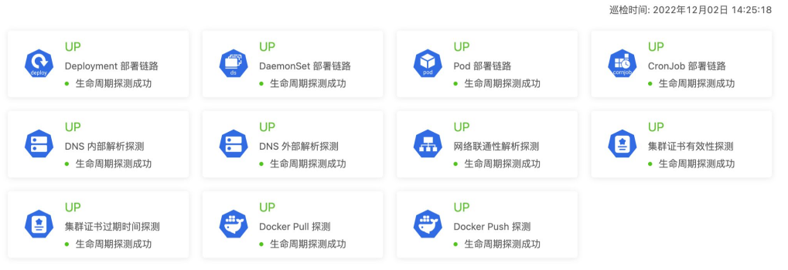
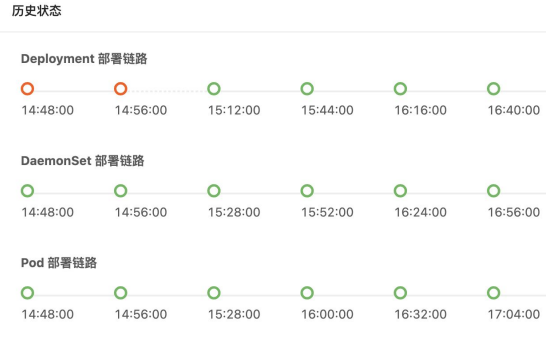
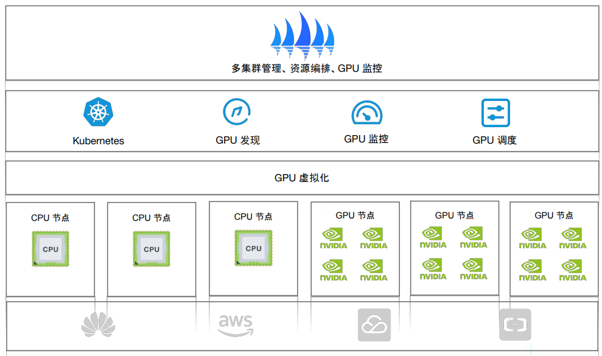
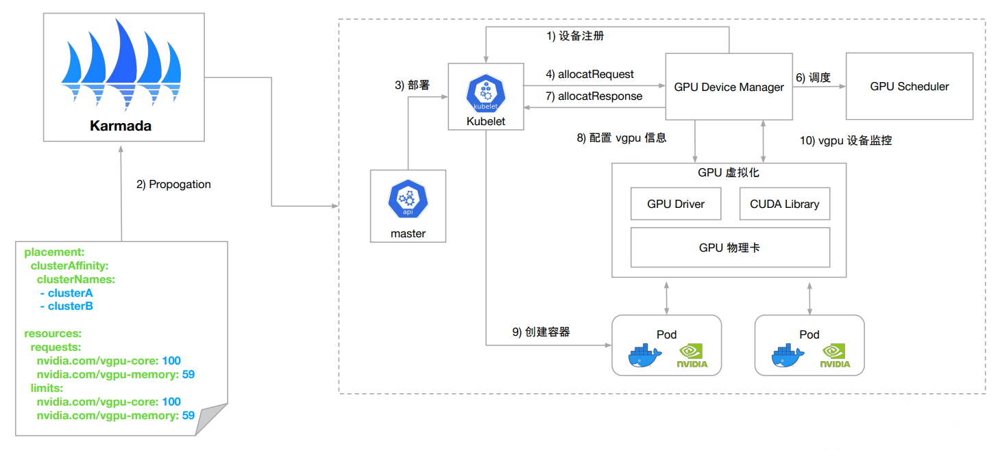
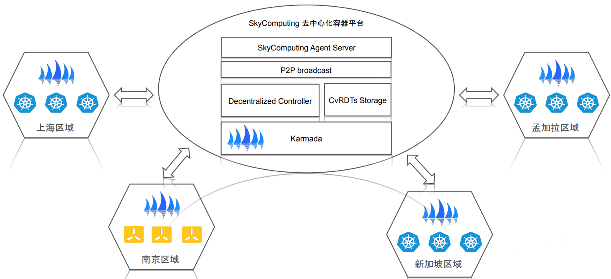
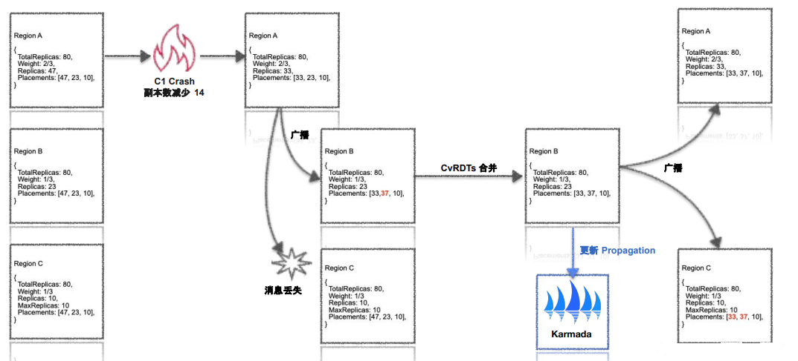

## 挑战与机遇

南京飓风引擎信息技术有限公司的企业目标在于提供一种全新的互联网产品生产方式，服务于广大的IT企业，并为更多企业的数字化转型提供助力。其新一代AI智能低代码应用开发平台——零壤（ORANG.CLOUD），可以通过可视化的编辑器实现业务视图的搭建以及业务逻辑的编排，并通过基于神经网络的AI代码生成器，构建适用于浏览器和移动端设备的原生应用。

## 解决方案

在多云系统的调研阶段，**飓风引擎**考虑了多种开源社区解决方案，结合业务情况，最终选择了 Karmada。Karmada 具有下优点：

- Cluster API 灵活，能够描述集群的状态、资源量；
- 兼容 Kubernetes 原生 API；
- 独立的调度器，支持多集群调度策略，具备自定义扩展能力；
- 控制面满足高可用、高性能；
- 支持独立 etcd 部署，能够支撑控制面更多的资源存储；
- 支持 pull 模式接入；

当 Karmada 刚刚开源时，Karmada 的安装方式尚不完善，**飓风引擎**组织研发人员向社区贡献了`helm` 安装方式，这也方便其能将 Karmada 在产品中更好地落地。

## 影响与收益

### 基于 Karmada 的多云交付实践

**飓风引擎**基于 Kubernetes 与 Karmada 等云原生技术打造了低代码应用开发平台——零壤，其架构如下图所示：

随着低代码平台的上线，客户遍布全国各地，业务可能需要就近交付服务，也可能需要多地域交付；此外，由于涉及到数据合规等问题，可能需要混合部署。上述场景呈现了一种多云需求，使用 Karmada 的多集群管理能力很好的满足了这些需求。

平台内部借助 Karmada 多集群调度与编排能力，来统一管理多个集群中的Deployment、Ingress、Service等资源，并结合 Kubernetes 周边生态提供了对基础设施、应用以及资源的监控服务。此外，借助 Karmada 实现了跨云镜像同步。

### Karmada 和内部系统集成实践

#### Karmada 和 KubeSurface 集成

**飓风引擎**内部针对单集群自研了一套巡检系统，可以定时地探测多个 workloads 的部署链路，例如 deployment、statefulset等；通过脚本的形式定向探测多个预定场景的可用性，例如 DNS 内外部解析、集群证书过期实践、镜像拉取等；以及定时、定向探测核心服务的配置数据一致性等。

在结合 Karmada 之后，**飓风引擎**将其改造成为了一套多集群的巡检系统，将巡检维度从单集群扩展到了多集群，并将多集群中的巡检结果汇聚到了 Karmada 控制面，提供了一个全局的视角。

巡检系统大盘图：

不同 workload 巡检链路时序状态图：

#### 管理多集群 vGPU 资源和工作负载

**飓风引擎**基于 Karmada 的能力，在多集群 vGPU 资源管理方面进行了扩展。在原有的单集群中，内部实现了 Kubernetes 的设备插件，vGPU 设备调度，cuda 调用拦截等能力。接入 Karmada 之后，为 vGPU Pod 提供了统一的部署方式，并提供了多集群工作负载统一编排，实现了 GPU 资源的监控聚合。

下图为多集群平台改造后的架构图：

工作负载部署流程图：

### 基于 Karmada 的去中心化探索

**飓风引擎**在海外多个地域均部署了 site，低代码生产的应用需要在海外 site 交付，过程中涉及到地域的数据合规等要求，因此需要平台满足以下条件：

- 每个地域都可以看到全局的数据
- 本地部署后可以全局同步
- 无状态服务具备容灾迁移能力
- 多方集群管理

基于karmada, **飓风引擎**设计了一套去中心化的架构，能够实现：

- 集群和工作负载提供全局最终一致性同步
- 管理流量容忍拜占庭故障 , 每个 site 可以自治

基于 Karmada 的去中心化容器平台结构：

支持最终一致性的资源调度原型设计图：

## 总结

自 2021 年初接触 Karmada 以来，**飓风引擎**基于 Karmada 构建了内部的多集群系统，获得了诸多益处：

- 原有 kubernetes 集群不需要改造即可接入多集群；
- 统一多集群层面的控制标准, 方便上层系统对接多集群管理能力；
- 面向场景的多集群资源调度和编排能力；

"在使用 Karmada 过程中，我们见证了Karmada 项目的成长。从 Karmada v0.5 到 v1.0, 我们几乎参与每次 weekly meeting，见证了 Karmada 很多令人兴奋的 feature 从 proposal 到最后的 merge， 团队先后2人成为了Karmada 社区 member。我认为这是开源项目和商业公司一种非常良性的循环。我们使用 Karmada 完成了我们系统的构建，同时将遇到的问题和新的idea回馈给社区，团队在此期间对开源的认识也更加深刻，我们很荣幸能够参与到 Karmada 项目，也希望更多的开发者加入到 Karmada 一起共建繁荣社区。"

——徐元昌，飓风引擎（Hurricane Engine）容器基础设施负责人
