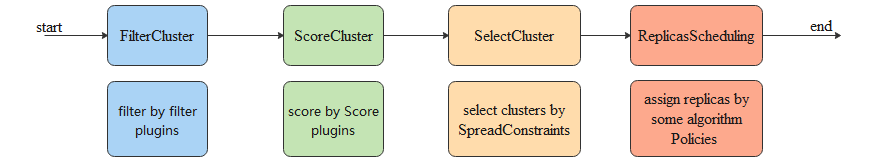

Karmada自带了一个默认调度器，其详细描述请查阅[这里](../reference/components/karmada-scheduler.md)。 如果默认调度器不适合你的需求，你可以实现自己的调度器。
Karmada的调度器框架与Kubernetes类似，但与K8s不同的是，Karmada是需要将应用部署至一组集群上，而不是一个单一对象，根据用户的调度策略的placement字段以及内部的调度插件算法将用户应用部署到预期的集群组上。

调度流程可以分为如下四步：
* Predicate阶段：过滤不合适的集群
* Priority阶段：为集群打分
* SelectClusters选取阶段：根据集群得分以及SpreadConstraint选取集群组
* ReplicaScheduling阶段：根据配置的副本调度策略将用户作业副本部署在选取的集群组上



其中过滤与打分的插件可以基于调度器框架进行自定义的开发与配置。

Karmada默认的调度器有几个内置的插件：
* APIEnablement: 一个过滤插件，用于检查需要下发的API资源（CRD）是否已在目标集群中被安装。
* TaintToleration: 一个过滤插件，用于检查调度策略是否容忍集群的污点。
* ClusterAffinity: 一个过滤和打分插件，用于实现集群的亲和性调度，支持通过names、labels、cluster的字段进行集群过滤。
* SpreadConstraint: 一个过滤插件，用于检查集群是否满足调度策略的传播属性。
* ClusterLocality: 一个打分插件，用于检查集群是否已存在被调度的资源，实现资源的聚合调度。

用户可以基于自身的场景自定义插件，并且通过Karmada的调度器框架实现自身的调度器。
以下给出了一个自定义开发调度器的具体例子。

## 开发前的准备

你需要已经安装Karmada，并拉取了Karmada的代码。 如果你想要安装Karmada，你可以按照这里的[安装指南](../installation/installation.md)。
如果你想要试用Karmada，我们推荐通过```hack/local-up-karmada.sh```来部署一个开发环境。

```sh
git clone https://github.com/karmada-io/karmada
cd karmada
hack/local-up-karmada.sh
```

## 开发一个插件

假设你想要开发一个名为`TestFilter`的过滤插件，你可以参考Karmada源代码中的调度器实现，代码位于[pkg/scheduler/framework/plugins](https://github.com/karmada-io/karmada/tree/master/pkg/scheduler/framework/plugins)。
开发完成后的目录结构类似于:

```
.
├── apienablement
├── clusteraffinity
├── clusterlocality
├── spreadconstraint
├── tainttoleration
├── testfilter
│ ├── test_filter.go
```

其中test_filter.go文件的内容如下，隐去了具体的过滤逻辑实现。

```go
package testfilter

import (
	"context"

	clusterv1alpha1 "github.com/karmada-io/karmada/pkg/apis/cluster/v1alpha1"
	policyv1alpha1 "github.com/karmada-io/karmada/pkg/apis/policy/v1alpha1"
	workv1alpha2 "github.com/karmada-io/karmada/pkg/apis/work/v1alpha2"
	"github.com/karmada-io/karmada/pkg/scheduler/framework"
)

const (
	// Name is the name of the plugin used in the plugin registry and configurations.
	Name = "TestFilter"
)

type TestFilter struct{}

var _ framework.FilterPlugin = &TestFilter{}

// New instantiates the APIEnablement plugin.
func New() (framework.Plugin, error) {
	return &TestFilter{}, nil
}

// Name returns the plugin name.
func (p *TestFilter) Name() string {
	return Name
}

// Filter checks if the API(CRD) of the resource is enabled or installed in the target cluster.
func (p *TestFilter) Filter(ctx context.Context, placement *policyv1alpha1.Placement,
	bindingSpec *workv1alpha2.ResourceBindingSpec, cluster *clusterv1alpha1.Cluster) *framework.Result {

	// implementation

	return framework.NewResult(framework.Success)
}
```

作为一个过滤插件，你需要实现`framework.FilterPlugin`接口。而作为一个打分插件，你需要实现`framework.ScorePlugin`接口。

## 注册插件

你需要编辑调度器的main函数 [cmd/scheduler/main.go](https://github.com/karmada-io/karmada/blob/master/cmd/scheduler/main.go)，在`NewSchedulerCommand`函数中传入自定义的插件配置。

```go
package main

import (
	"os"

	"k8s.io/component-base/cli"
	_ "k8s.io/component-base/logs/json/register" // for JSON log format registration
	controllerruntime "sigs.k8s.io/controller-runtime"
	_ "sigs.k8s.io/controller-runtime/pkg/metrics"

	"github.com/karmada-io/karmada/cmd/scheduler/app"
	"github.com/karmada-io/karmada/pkg/scheduler/framework/plugins/testfilter"
)

func main() {
	stopChan := controllerruntime.SetupSignalHandler().Done()
	command := app.NewSchedulerCommand(stopChan, app.WithPlugin(testfilter.Name, testfilter.New)) 
	code := cli.Run(command)
	os.Exit(code)
}

```

## 打包调度器

在你注册插件之后，你需要将你的调度器的二进制的调度器文件打包进一个容器镜像，并将上述镜像替换掉默认调度器的镜像。

```shell
cd karmada
export VERSION=## Your Image Tag
make image-karmada-scheduler
```

```shell
kubectl --kubeconfig ~/.kube/karmada.config --context karmada-host edit deploy/karmada-scheduler -nkarmada-system
...
 spec:
      automountServiceAccountToken: false
      containers:
      - command:
        - /bin/karmada-scheduler
        - --kubeconfig=/etc/kubeconfig
        - --bind-address=0.0.0.0
        - --secure-port=10351
        - --enable-scheduler-estimator=true
        - --v=4
        image: ## Your Image Address
...
```

当你启动调度器后，你可以从调度器的日志中发现`TestFilter`插件已启用。

```
I0105 09:50:11.809137       1 scheduler.go:109] karmada-scheduler version: version.Info{GitVersion:"v1.4.0-141-g119cb8e1", GitCommit:"119cb8e1e8be0142ca3d32c619c25e5ec4b0a1b6", GitTreeState:"dirty", BuildDate:"2023-01-05T09:42:41Z", GoVersion:"go1.19.3", Compiler:"gc", Platform:"linux/amd64"}
I0105 09:50:11.813339       1 registry.go:63] Enable Scheduler plugin "SpreadConstraint"
I0105 09:50:11.813470       1 registry.go:63] Enable Scheduler plugin "ClusterLocality"
I0105 09:50:11.813483       1 registry.go:63] Enable Scheduler plugin "TestFilter"
I0105 09:50:11.813489       1 registry.go:63] Enable Scheduler plugin "APIEnablement"
I0105 09:50:11.813545       1 registry.go:63] Enable Scheduler plugin "TaintToleration"
I0105 09:50:11.813596       1 registry.go:63] Enable Scheduler plugin "ClusterAffinity"
```

## 配置插件的启停

你可以通过配置`--plugins`选项来配置插件的启停。
例如，以下的配置将会关闭`TestFilter`插件。

```shell
kubectl kubectl --kubeconfig ~/.kube/karmada.config --context karmada-host edit deploy/karmada-scheduler -nkarmada-system
...
 spec:
      automountServiceAccountToken: false
      containers:
      - command:
        - /bin/karmada-scheduler
        - --kubeconfig=/etc/kubeconfig
        - --bind-address=0.0.0.0
        - --secure-port=10351
        - --enable-scheduler-estimator=true
        - --plugins=*,-TestFilter
        - --v=4
        image: ## Your Image Address
...
```

## 配置多个调度器

### 运行第二个调度器

你可以和默认调度器一起同时运行多个调度器，并告诉 Karmada 为每个工作负载使用哪个调度器。
以下是一个示例的调度器配置文件。 你可以将它保存为 `my-scheduler.yaml`。

```yaml
apiVersion: apps/v1
kind: Deployment
metadata:
  name: my-karmada-scheduler
  namespace: karmada-system
  labels:
    app: my-karmada-scheduler
spec:
  replicas: 1
  selector:
    matchLabels:
      app: my-karmada-scheduler
  template:
    metadata:
      labels:
        app: my-karmada-scheduler
    spec:
      automountServiceAccountToken: false
      tolerations:
        - key: node-role.kubernetes.io/master
          operator: Exists
      containers:
        - name: karmada-scheduler
          image: docker.io/karmada/karmada-scheduler:latest
          imagePullPolicy: IfNotPresent
          livenessProbe:
            httpGet:
              path: /healthz
              port: 10351
              scheme: HTTP
            failureThreshold: 3
            initialDelaySeconds: 15
            periodSeconds: 15
            timeoutSeconds: 5
          command:
            - /bin/karmada-scheduler
            - --kubeconfig=/etc/kubeconfig
            - --bind-address=0.0.0.0
            - --secure-port=10351
            - --enable-scheduler-estimator=true
            - --leader-elect-resource-name=my-scheduler # 你的自定义调度器名称
            - --scheduler-name=my-scheduler # 你的自定义调度器名称
            - --v=4
          volumeMounts:
            - name: kubeconfig
              subPath: kubeconfig
              mountPath: /etc/kubeconfig
      volumes:
        - name: kubeconfig
          secret:
            secretName: kubeconfig
```

> Note: 对于 `--leader-elect-resource-name` 选项，默认为 `karmada-scheduler`。如果你将另一个调度器与默认的调度器一起部署，
> 需要指定此选项，并且建议使用你的自定义调度器名称作为值。

为了在 Karmada 中运行我们的第二个调度器，在 host 集群中创建上面配置中指定的 Deployment：

```shell
kubectl --context karmada-host create -f my-scheduler.yaml
```

验证调度器 Pod 正在运行：

```
kubectl --context karmada-host get pods --namespace=karmada-system
```

输出类似于：

```
NAME                                           READY     STATUS    RESTARTS   AGE
....
my-karmada-scheduler-lnf4s-4744f               1/1       Running   0          2m
...
```

此列表中，除了默认的 karmada-scheduler Pod 之外，你应该还能看到处于 “Running” 状态的 my-karmada-scheduler Pod。

### 为 Deployment 指定调度器

现在第二个调度器正在运行，创建一些 Deployment，并指定它们由默认调度器或部署的调度器进行调度。 为了使用特定的调度器调度给定的 Deployment，在命中那个 Deployment 的 Propagation spec 中指定调度器的名称。让我们看看三个例子。

* PropagationPolicy spec 没有任何调度器名称

```yaml
apiVersion: policy.karmada.io/v1alpha1
kind: PropagationPolicy
metadata:
  name: nginx-propagation
spec:
  resourceSelectors:
    - apiVersion: apps/v1
      kind: Deployment
      name: nginx
  placement:
    clusterAffinity:
      clusterNames:
        - member1
        - member2
```

如果未提供调度器名称，则会使用 default-scheduler 自动调度 Deployment。

* PropagationPolicy spec 设置为 `default-scheduler`

```yaml
apiVersion: policy.karmada.io/v1alpha1
kind: PropagationPolicy
metadata:
  name: nginx-propagation
spec:
  schedulerName: default-scheduler
  resourceSelectors:
    - apiVersion: apps/v1
      kind: Deployment
      name: nginx
  placement:
    clusterAffinity:
      clusterNames:
        - member1
        - member2
```

通过将调度器名称作为 `spec.schedulerName` 参数的值来指定调度器。 我们提供默认调度器的名称，即 `default-scheduler`。

* PropagationPolicy spec 设置为 `my-scheduler`

```yaml
apiVersion: policy.karmada.io/v1alpha1
kind: PropagationPolicy
metadata:
  name: nginx-propagation
spec:
  schedulerName: my-scheduler
  resourceSelectors:
    - apiVersion: apps/v1
      kind: Deployment
      name: nginx
  placement:
    clusterAffinity:
      clusterNames:
        - member1
        - member2
```

在这种情况下，我们指定此 Deployment 使用我们部署的 `my-scheduler` 来进行调度。
请注意， `spec.schedulerName` 参数的值应该与调度器提供的选项中的 `schedulerName` 相匹配。

### 验证是否使用所需的调度器调度了 Deployment

为了更容易地完成这些示例, 你可以查看与此 Deployment 相关的事件日志，以验证是否由所需的调度器调度了该 Deployment。

```shell
kubectl --context karmada-apiserver describe deploy/nginx
```
