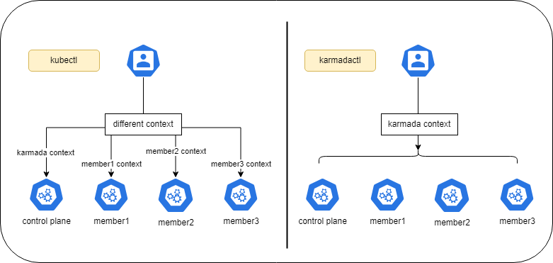
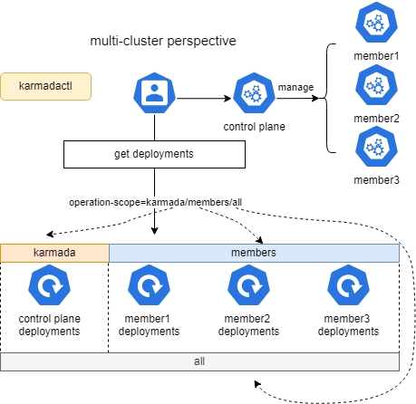

Karmadactl 引入了命令行参数 `operation-scope`，用于指定 Karmadactl 命令的作用范围。命令行参数 `operation-scope` 的值为枚举类型，各枚举值及其含义如下：

- karmada：karmadactl 的作用范围为控制面。
- members：karmadactl 的作用范围为成员集群。
- all：karmadactl 的作用范围包括控制面和成员集群。

> *需要注意的是，karmadactl 的不同命令可以支持的 operation-scope 枚举值有所不同，具体用法可以参考 karmadactl [command] --help。*

`operation-scope` 的引入提供了一种灵活的方式来实现 Karmadactl 集群视角的切换。与 Kubectl 相比，Karmadactl 可以在不切换上下文的情况下来管理不同的目标集群。并且，结合 Karmada拥有的多集群资源视图，Karmadactl 可以同时获取多个目标集群的资源信息，从而极大地简化了多集群场景下的日常运维操作。




## 前提条件

### Karmada 已安装

您可以参考[快速入门](https://github.com/karmada-io/karmada#quick-start)安装 Karmada，或直接运行 `hack/local-up-karmada.sh` 脚本，该脚本也用于运行 E2E 测试。

karmadactl 版本：release v1.11.0 +

### 成员集群网络

确保至少已有两个集群加入 Karmada，并且成员集群之间的容器网络已连通。

* 如果您使用 `hack/local-up-karmada.sh` 脚本部署 Karmada，Karmada 中会有 3 个成员集群，并且集群 `member1` 和 `member2` 间的容器网络已连通。
* 您可以使用 `Submariner` 或其他相关开源项目来连接成员集群之间的网络。

## 集群视角切换

本章节将介绍命令行参数 `operation-scope` 在 Karmadactl 各项命令的应用，并以 `karmadactl get` 的具体命令为例，展示其如何通过集群视角间的切换来查看资源在不同集群的分布状况。

### get 

命令`karmadactl get` 可以用于查看控制面或成员集群的资源。结合命令行参数 `operation-scope` 和 `clusters`，`karmadactl get` 可以展示某个集群或某几个集群资源的信息。

- `operation-scope`：支持枚举值 karmada、members 和 all，默认为 karmada。
- `clusters`：当 operation-scope 的值为 members 或 all 时，可以指定作用的成员集群列表。



假设，Karmada 控制面管理三个成员集群 member1、member2 和 member3。Karmada 控制面的 Deployment 资源 `nginx` 被分发到以上三个成员集群。那么，我们可以：

- 查看控制面以及所有成员集群的资源分布情况

  ```bash
  $ karmadactl get deployment nginx --operation-scope all      
  NAME    CLUSTER   READY   UP-TO-DATE   AVAILABLE   AGE   ADOPTION
  nginx   Karmada   0/2     6            0           18h   -
  nginx   member1   0/2     2            0           37s   Y
  nginx   member2   0/2     2            0           36s   Y
  nginx   member3   0/2     2            0           37s   Y
  ```

  > *其中，CLUSTER 列代表资源所处集群，ADOPTION 列代表资源是否被 Karmada控制面接管。*

- 查看控制面以及部分成员集群的资源分布情况

  ```bash
  $ karmadactl get deployment nginx --operation-scope all --clusters member1,member2
  NAME    CLUSTER   READY   UP-TO-DATE   AVAILABLE   AGE     ADOPTION
  nginx   Karmada   4/2     6            4           18h     -
  nginx   member1   2/2     2            2           2m37s   Y
  nginx   member2   0/2     2            0           2m36s   Y
  ```

  当设置`--clusters member1,member2`后，命令的成员集群视角将被限制为集群 member1和 member2。

- 查看控制面的资源信息

  ```bash
  $ karmadactl get deployment nginx 
  NAME    CLUSTER   READY   UP-TO-DATE   AVAILABLE   AGE   ADOPTION
  nginx   Karmada   6/2     6            6           18h   -
  $ karmadactl get deployment nginx --operation-scope karmada 
  NAME    CLUSTER   READY   UP-TO-DATE   AVAILABLE   AGE   ADOPTION
  nginx   Karmada   6/2     6            6           18h   -
  ```

- 查看所有成员集群的资源分布情况

  ```bash
  $ karmadactl get deployment nginx --operation-scope members
  NAME    CLUSTER   READY   UP-TO-DATE   AVAILABLE   AGE     ADOPTION
  nginx   member2   2/2     2            2           8m10s   Y
  nginx   member1   2/2     2            2           8m11s   Y
  nginx   member3   2/2     2            2           8m10s   Y
  ```

- 查看部分成员集群的资源分布情况

  ```bash
  $ karmadactl get deployment nginx --operation-scope members --clusters member1,member2
  NAME    CLUSTER   READY   UP-TO-DATE   AVAILABLE   AGE    ADOPTION
  nginx   member1   2/2     2            2           9m7s   Y
  nginx   member2   2/2     2            2           9m6s   Y
  ```

### describes

结合命令行参数 `operation-scope` 和 `cluster`，`karmadactl describe` 命令可以用于显示控制面或成员集群资源的细节。

- `operation-scope`：支持枚举值 karmada 和 members，默认为 karmada。
- `cluster`：当 `operation-scope` 的值为 members 时，可以指定作用的成员集群。

### attach

结合命令行参数 `operation-scope` 和 `cluster`，`karmadactl attach` 命令可以挂接到控制面或成员集群某个现有容器内已运行的进程。

- `operation-scope`：支持枚举值 karmada 和 members，默认为 karmada。

- `cluster`：当 `operation-scope` 的值为 members 时，可以指定作用的成员集群。

### explain

结合命令行参数 `operation-scope` 和 `cluster`，`karmadactl explain` 命令可以描述控制面或成员集群各种资源的字段和结构。这尤其适用于通过 `OverridePolicy` 实现成员集群资源差异化配置的场景，使用起来非常便捷。

- `operation-scope`：支持枚举值 karmada 和 members，默认为 karmada。
- `cluster`：当 `operation-scope` 的值为 members 时，可以指定作用的成员集群。

### exec

结合命令行参数 `operation-scope` 和 `cluster`，`karmadactl exec` 命令可以在控制面或成员集群的某个容器中执行特定命令。

- `operation-scope`：支持枚举值 karmada 和 members，默认为 karmada。
- `cluster`：当 `operation-scope` 的值为 members 时，可以指定作用的成员集群。

### api-resources

结合命令行参数 `operation-scope` 和 `cluster`，`karmadactl api-resources` 命令可以输出服务器支持的 API 资源。

- `operation-scope`：支持枚举值 karmada 和 members，默认为 karmada。
- `cluster`：当 `operation-scope` 的值为 members 时，可以指定作用的成员集群。

### api-versions

结合命令行参数 `operation-scope` 和 `cluster`，`karmadactl api-versions` 命令可以输出服务器支持的 API 版本。

- `operation-scope`：支持枚举值 karmada 和 members，默认为 karmada。
- `cluster`：当 `operation-scope` 的值为 members 时，可以指定作用的成员集群。