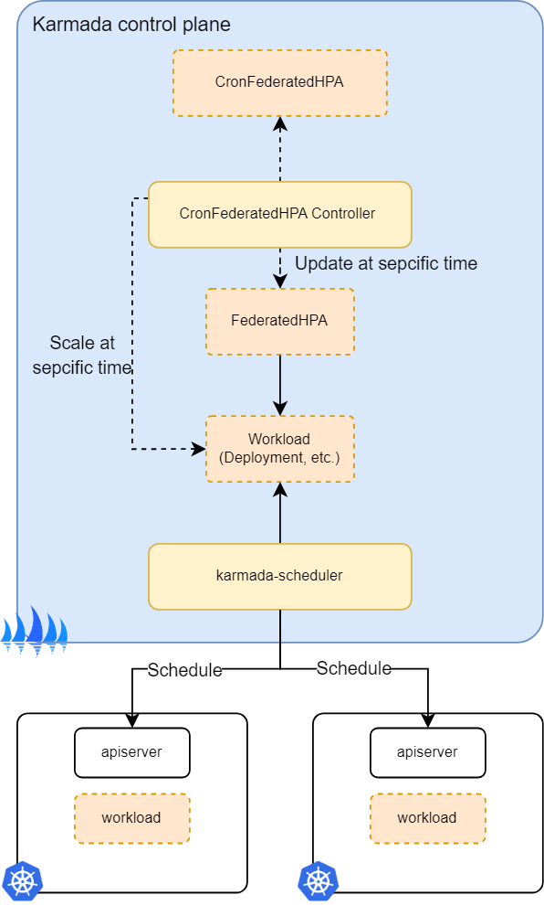
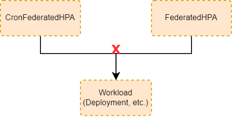

在 Karmada 中，CronFederatedHPA 用于定期自动缩放操作。它可以缩放具有scale子资源的工作负载或Karmada FederatedHPA。

典型的场景是在可预见的流量高峰到来前提前扩容工作负载。例如，如果我知道每天早上9点会突发流量洪峰，我想提前（例如，提前30分钟）扩容相关服务，以处理高峰负载并确保服务持续可用性。

CronFederatedHPA 被实现为 Karmada 的API资源和控制器。控制器的行为由 CronFederatedHPA 资源决定。在 Karmada 控制平面内运行的CronFederatedHPA控制器根据预定义的 cron 计划来伸缩工作负载的副本或FederatedHPA的最小/最大副本数。

## CronFederatedHPA 如何工作？

  
Karmada 将 CronFederatedHPA 实现为一个周期性检查 cron 计划时间的控制循环。如果达到计划时间，它将伸缩工作负载的副本或 FederatedHPA 的最小/最大副本数。

> 请注意，此功能需要 Karmada 版本 v1.7.0 或更高版本。

## 伸缩有 scale 子资源进的工作负载

CronFederatedHPA 可以扩展具有 scale 子资源（如Deployment和StatefulSet）的工作负载。但是，有一个限制需要注意。确保 CronFederatedHPA 执行的伸缩操作不会与任何其他正在进行的伸缩操作冲突。例如，如果工作负载同时由 CronFederatedHPA 和 FederatedHPA 管理，最终结果可能会不确定。  

## 伸缩 FederatedHPA

CronFederatedHPA旨在在特定时间内扩展资源。当工作负载仅由CronFederatedHPA直接进行扩展时，在到达指定的时间为止，其副本将保持不变。这意味着直到指定时间之前，它失去了处理更多请求的能力。  
因此，为了确保工作负载可以提前扩容以满足后续高峰负载和后续实时业务需求，我们建议首先使用CronFederatedHPA来伸缩FederatedHPA。然后，FederatedHPA可以根据其度量标准来伸缩工作负载的规模。

## API对象

FederatedHPA 是 Karmada 弹性伸缩 API 组中的一个 API。当前版本为 v1alpha1， 可以在[此处](https://github.com/karmada-io/karmada/blob/release-1.6/pkg/apis/autoscaling/v1alpha1/federatedhpa_types.go#L23)查看 CronFederatedHPA 的API规范。

## 下一步

如果配置了 FederatedHPA，则可能还需要考虑运行类似于 [Cluster Autoscaler](https://github.com/kubernetes/autoscaler/tree/master/cluster-autoscaler) 的集群级别自动扩缩容工具。  

有关CronFederatedHPA的更多信息：
* 阅读[使用CronFederatedHPA自动缩放FederatedHPA](../../tutorials/autoscaling-federatedhpa-with-cronfederatedhpa.md)。
* 阅读[使用CronFederatedHPA自动缩放工作负载](../../tutorials/autoscaling-workload-with-cronfederatedhpa.md)。