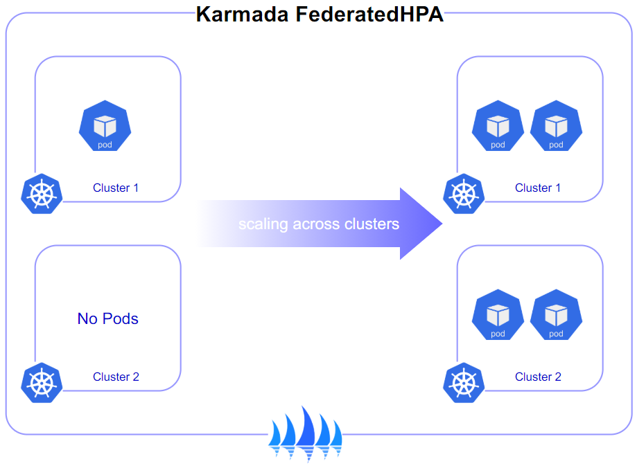
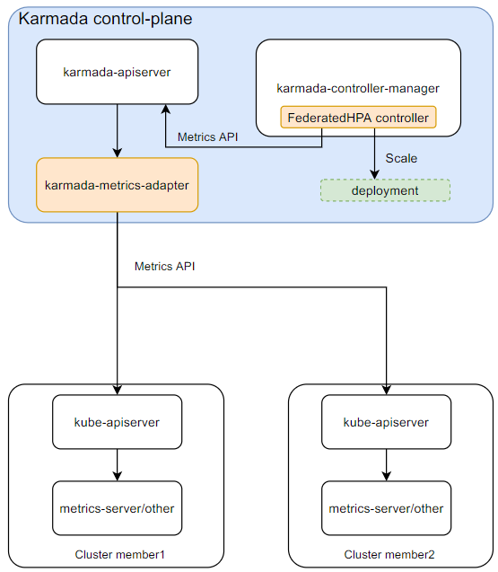

在 Karmada 中，FederatedHPA 可以跨多个集群扩展/缩小工作负载的副本，旨在根据需求自动调整工作负载的规模。

当负载增加时，如果 Pod 的数量低于配置的最大值，则 FederatedHPA 扩展工作负载（例如 Deployment、StatefulSet 或其他类似资源）的副本数。
当负载减少时，如果 Pod 的数量高于配置的最小值，则 FederatedHPA 缩小工作负载的副本数。

FederatedHPA 不适用于不能进行扩缩的对象（例如 DaemonSet）。

FederatedHPA 是作为 Karmada API 资源和控制器实现的，该资源确定了控制器的行为。
FederatedHPA 控制器运行在 Karmada 控制平面中，定期调整其目标（例如 Deployment）的所需规模，
以匹配观察到的指标，例如平均 CPU 利用率、平均内存利用率或任何其他自定义指标。

## FederatedHPA 如何工作？

  
为了实现跨集群的自动扩缩容，Karmada 引入了 FederatedHPA 控制器和 `karmada-metrics-adapter`，它们的工作方式如下：
1. HPA 控制器定期通过指标 API `metrics.k8s.io` 或 `custom.metrics.k8s.io` 使用标签选择器查询指标。
1. `karmada-apiserver` 获取指标 API 查询结果，然后通过 API 服务注册将其路由到 `karmada-metrics-adapter`。
1. `karmada-metrics-adapter` 将从目标集群（Pod 所在的集群）查询指标。收集到指标后，它会对这些指标进行聚合并返回结果。
1. HPA 控制器将根据指标计算所需的副本数，并直接扩展/缩小工作负载的规模。然后，`karmada-scheduler` 将这些副本调度到成员集群中。

> 注意：要使用此功能，Karmada 版本必须为 v1.6.0 或更高版本。

## API 对象

FederatedHPA 是 Karmada 弹性伸缩 API 组中的一个 API。当前版本为 v1alpha1，仅支持 CPU 和内存指标。 

您可以在[这里](https://github.com/karmada-io/karmada/blob/release-1.6/pkg/apis/autoscaling/v1alpha1/federatedhpa_types.go#L23)查看 FederatedHPA API 规范。

## 后续规划

如果您配置了 FederatedHPA，则可能还需要考虑运行类似于 [Cluster Autoscaler](https://github.com/kubernetes/autoscaler/tree/master/cluster-autoscaler) 的集群级别自动扩缩容工具。 

有关 FederatedHPA 的更多信息：
* 阅读 [FederatedHPA 教程](../../tutorials/autoscaling-with-federatedhpa.md)以了解 FederatedHPA。
