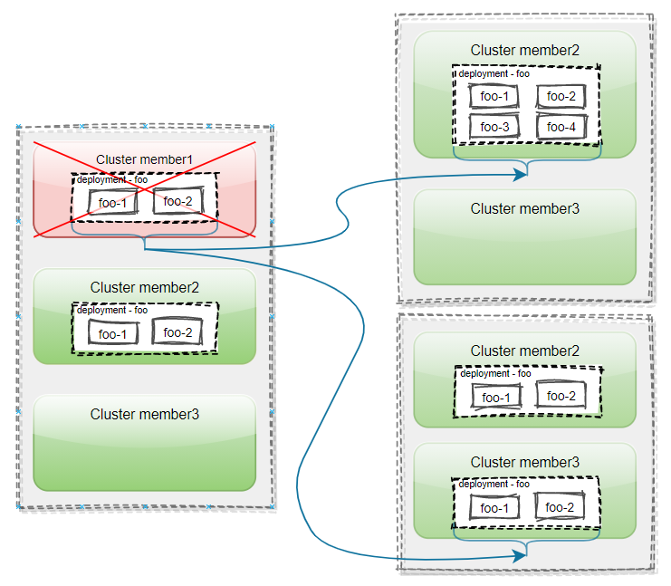

在多云多集群场景中，为了提高业务的高可用性，用户工作负载可能会被部署在多个不同的集群中。在 Karmada 中，当集群发生故障或是用户不希望在某个集群上继续运行工作负载时，用户可以通过[管理集群污点](./cluster-taint-management.md)来将工作负载从该集群驱逐，或阻止新的工作负载调度到目标集群。

被驱逐的工作负载将会被调度到其他最合适的集群，从而实现集群故障迁移，保障用户服务的可用性和连续性。

## 为何需要集群故障迁移

下面来介绍一些多集群故障迁移的场景：

- 管理员在 Karmada 控制面部署了一个离线业务，并将业务 Pod 实例分发到了多个集群。突然某个集群发生故障，管理员希望 Karmada 能够把故障集群上的 Pod 实例迁移到其他条件适合的集群中去。
- 普通用户通过 Karmada 控制面在某一个集群上部署了一个在线业务，业务包括数据库实例、服务器实例、配置文件等，服务通过控制面上的ELB对外暴露，此时某一集群发生故障，用户希望把整个业务能迁移到另一个情况较适合的集群上，业务迁移期间需要保证服务不断服。
- 管理员将某个集群进行升级，作为基础设施的容器网络、存储等发生了改变，管理员希望在集群升级之前把当前集群上的应用迁移到其他适合的集群中去，业务迁移期间需要保证服务不断服。
- ......

## 怎样进行故障迁移



用户在 Karmada 中加入了三个集群，分别为：`member1`、`member2` 和 `member3`。然后在 Karmada 控制面部署了一个名为 `foo`，且副本数为 4 的 Deployment，并通过 PropagationPolicy 将其分发到了集群 `member1` 和 `member2` 上。

当集群 `member1` 发生故障之后，其上的 Pod 实例将被驱逐，然后被迁移到集群 `member2` 或是集群 `member3` 中，这个不同的迁移行为可以通过 `PropagationPolicy/ClusterPropagationPolicy` 的副本调度策略 `ReplicaSchedulingStrategy` 来控制。

## 用户如何开启特性

用户可以通过启用 `Failover` 特性开关来开启故障迁移特性。`Failover` feature gate 目前处于 `Beta` 阶段，默认关闭，用户应明确启用以避免意外事件。您可以按照如下配置在 `karmada-controller-manager` 组件中启用 `Failover` 特性开关：

```
--feature-gates=Failover=true
```

## 配置集群故障迁移

当集群被打上 `NoExecute` 污点时，会触发该集群上工作负载的迁移。关于详细的迁移机制，请参考[故障迁移机制分析](failover-analysis.md)。此外，用户还可以通过 PropagationPolicy API 的 `.spec.failover.cluster` 字段配置集群故障迁移的行为，实现对应用级集群故障迁移的精细化控制。

`ClusterFailoverBehavior` 提供了以下可配置字段：

- PurgeMode
- StatePreservation

### 配置 PurgeMode

`PurgeMode` 用于指定在应用从某个集群迁移时，如何处理原集群上的遗留应用。目前支持的取值有 `Directly` 和 `Gracefully`，默认值为 `Gracefully`。具体说明如下：

- `Directly` 表示 Karmada 会直接驱逐原集群上的应用。适用于应用无法容忍同一时间运行两个实例的场景。例如，Flink 应用支持精确一次（exactly-once）状态一致性，要求同一时间只能有一个实例运行。在故障迁移时，必须先删除旧应用，再创建新应用，以避免重复处理并保证状态一致性。
- `Gracefully` 表示 Karmada 会等待应用在新集群恢复健康或超时后，再驱逐原集群上的应用。

PropagationPolicy 可按需配置上述行为。

```yaml
apiVersion: policy.karmada.io/v1alpha1
kind: PropagationPolicy
metadata:
  name: nginx-propagation
spec:
  failover:
    cluster:
      purgeMode: Directly
  #...
```

### 应用状态保留

自 v1.15 版本起，集群故障迁移特性新增了对有状态应用的支持，为用户在集群故障迁移场景下定义应用状态保留提供了通用方式。

#### StatePreservation 简介

Karmada 目前支持传播多种类型的资源，包括 Kubernetes 原生对象和 CRD（自定义资源定义），也涵盖了有状态工作负载。这使得分布式应用能够实现多集群弹性和高可用。无状态工作负载具有更高的容错性，丢失某个实例不会影响应用正确性，也无需数据恢复。而有状态工作负载（如 Flink）则依赖于检查点或保存的状态来在故障后恢复。如果状态丢失，作业将无法从中断点继续。

#### StatePreservation 定义

`StatePreservation` 是 `.spec.failover.cluster` 下的一个字段，用于定义有状态应用在故障迁移事件中状态数据的保留与恢复策略。当应用从一个集群迁移到另一个集群时，该策略支持从原资源配置中提取关键数据。

该字段包含多个 `StatePreservationRule` 配置。每条规则通过 JSONPath 表达式指定需要在故障迁移时保留的状态数据，并通过 `AliasLabelName` 作为标签键，将保留的数据传递到新集群。

#### StatePreservation 配置示例

以 Flink 为例，`jobID` 是用于区分和管理不同 Flink 作业的唯一标识符。当集群发生故障时，Flink 应用可以利用 `jobID` 获取作业的 checkpoint 数据存储，恢复集群故障前作业的状态，然后在新集群中从故障点继续执行。具体配置和步骤如下：

```yaml
apiVersion: policy.karmada.io/v1alpha1
kind: PropagationPolicy
metadata:
  name: flink-propagation
spec:
  resourceSelectors:
    - apiVersion: flink.apache.org/v1beta1
      kind: FlinkDeployment
      name: flink-app
  failover:
    cluster:
      purgeMode: Directly
      statePreservation:
        rules:
          - aliasLabelName: application.karmada.io/cluster-failover-jobid
            jsonPath: "{ .jobStatus.jobID }"
  placement:
    clusterAffinity:
      clusterNames:
        - member1
        - member2
    spreadConstraints:
      - maxGroups: 1
        minGroups: 1
        spreadByField: cluster
```

#### StatePreservation 字段说明

- **rules**：包含多个 `StatePreservationRule` 配置的列表
  - **aliasLabelName**：保留数据传递到新集群时使用的标签键名
  - **jsonPath**：用于从原资源配置中提取需要保留状态数据的 JSONPath 模板

#### StatePreservation 工作流程

1. **迁移前**：Karmada 控制器根据用户配置的 `jsonPath`，从 FlinkDeployment 的 status 中提取 job ID。
2. **迁移过程中**：Karmada 控制器将提取到的 job ID 以标签的形式注入到 Flink 应用配置中，例如 `application.karmada.io/cluster-failover-jobid: <jobID>`。
3. **目标集群处理**：成员集群中运行的 Kyverno 拦截 FlinkDeployment 的创建请求，根据 `jobID` 获取作业的 checkpoint 数据存储路径（如 `/<shared-path>/<job-namespace>/<jobID>/checkpoints/xxx`），并配置 `initialSavepointPath`，表示将从该 savepoint 启动。
4. **恢复执行**：FlinkDeployment 基于 `initialSavepointPath` 下的 checkpoint 数据启动，从而继承迁移前保存的最终状态。

#### 使用限制与注意事项

该功能需要开启 `StatefulFailoverInjection` 特性开关。`StatefulFailoverInjection` 目前处于 Alpha 阶段，默认关闭。

当前使用该功能时有如下限制，请注意：

1. 仅考虑应用部署在一个集群并迁移到另一个集群的场景
2. 若发生连续故障迁移（如应用从 clusterA 迁移到 clusterB，再迁移到 clusterC），则仅注入上一次故障迁移前的 PreservedLabelState。如果 PreservedLabelState 为空，则跳过注入
3. 仅当 PurgeMode 设置为 Directly 时才会进行注入操作

#### JSONPath 语法说明

JSONPath 表达式遵循 Kubernetes 规范：<https://kubernetes.io/docs/reference/kubectl/jsonpath/> 。

**注意**：JSONPath 表达式默认从 API 资源对象的 "status" 字段开始查找。例如，若要提取 Deployment 的 "availableReplicas"，应使用 `{.availableReplicas}`，而不是 `{.status.availableReplicas}`。

### 配置驱逐速率限制

在集群故障的场景下，短时间内连续驱逐大量工作负载可能会对 Karmada 控制面以及剩余的健康集群造成巨大压力。为了提升故障迁移过程的稳定性和可控性，Karmada 引入了速率限制机制，可以根据需要通过命令行参数调整驱逐速率。

用户可以通过在 `karmada-controller-manager` 组件上配置以下命令行参数，来精细化控制驱逐行为：

* `--resource-eviction-rate`:
  每秒驱逐的数量。默认值为 **0.5**。设置为 0 时驱逐速率会以 30 分钟一个的速度进行。

示例：
- 假设需要驱逐 12 个工作负载，设置 `--resource-eviction-rate=0.5` 时，大约每 2 秒驱逐 1 个，约 24 秒完成全部驱逐。
- 若设置为 `--resource-eviction-rate=2`，则大约每秒驱逐 2 个，约 6 秒完成。

:::note

集群故障迁移特性仍在持续迭代中，欢迎大家反馈实际使用场景。如果您对该特性感兴趣，欢迎提交增强 issue 与我们交流。

:::
