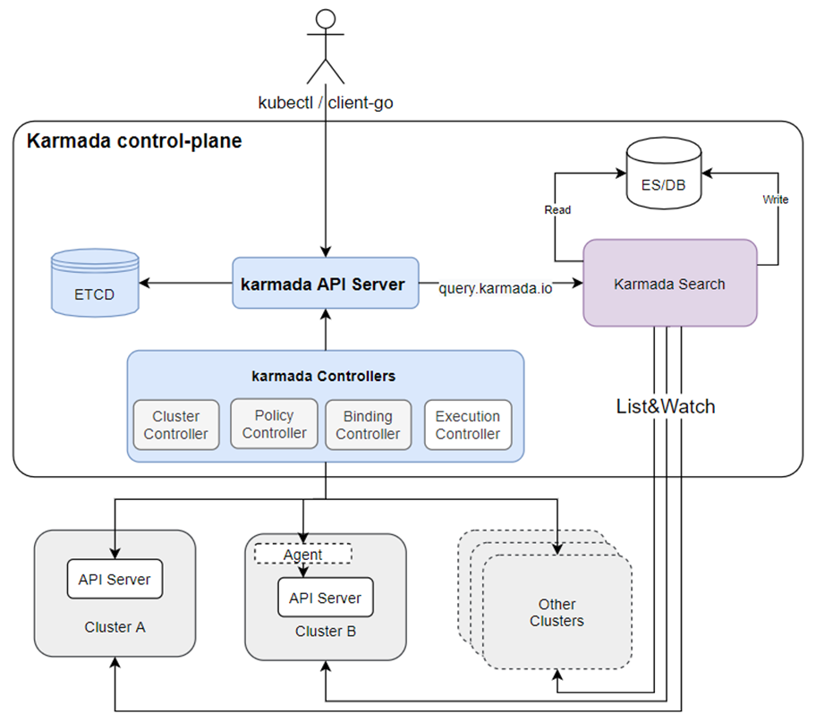

## Background

Multicluster is becoming a common practice. It brings services closer to users.
But it also makes it hard to query Kubernetes resources across clusters.
Therefore, we need a caching layer and a search engine for Karmada to cache and search for Kubernetes resources across multiple clusters.
We introduced a new component named `karmada-search` and a new API group called `search.karmada.io` to implement it.

## What karmada-search can do



karmada-search can:

* Accelerate resource requests processing across regions.
* Provide a cross-cluster resource view.
* Be compatible with multiple Kubernetes resource versions.
* Unify resource requests entries.
* Reduce API server pressure on member clusters.
* Adapt to a variety of search engines and databases.

What's more, `karmada-search` also supports proxying one global resource. See [here](./proxy-global-resource.md) for details.

:::note

1. This feature aims to build a cache to store arbitrary resources from multiple member clusters. And these resources are exposed by `search/proxy` REST APIs. If a user has access privilege to `search/proxy`, they can directly access the cached resource without routing their request to the member clusters.
1. As previously mentioned, the resource query request will not be routed to the member clusters. So if a secret is cached in the Karmada control plane but a user in the member cluster cannot access it via member cluster's apiserver due to RBAC privilege limitations, they can still access the secret through the Karmada control plane.
1. This feature is designed for administrators who needs to query and view the resources in multiple clusters, not designed for the end users. Exposing this API to the end users may cause end users to be able to view resources that do not belong to them.

:::

## Scope the caching

`.spec` in `ResourceRegistry` defines the cache scope.

It has three fields to set:
- TargetCluster
- ResourceSelector
- BackendStore

### TargetCluster

`TargetCluster` means the cluster from which the cache system collects resources.
It's exactly the same with [clusterAffinity](../scheduling/propagation-policy.md#cluster-affinity) in `PropagationPolicy`.

### ResourceSelector

`ResourceSelector` specifies the type of resources to be cached by `karmada-search`. Subfields are `APIVersion`, `Kind` and `Namespace`.

The following example `ResourceSelector` means Deployments in `default` namespace are targeted:

```yaml
apiVersion: search.karmada.io/v1alpha1
kind: ResourceRegistry
metadata:
  name: foo
spec:
  # ...
  resourceSelectors:
    - apiVersion: apps/v1
      kind: Deployment
      namespace: default
```

:::note

A null `namespace` field means all namespaces are targeted.

:::

### BackendStore

`BackendStore` specifies the location to store cached items. Defaults to the memory of `karmada-search`.
Now `BackendStore` only supports `OpenSearch` as the backend.

`BackendStore` can be configured as follows:

```yaml
apiVersion: search.karmada.io/v1alpha1
kind: ResourceRegistry
metadata:
  name: foo
spec:
  # ...
  backendStore:
    openSearch:
      addresses:
        - http://10.240.0.100:9200
      secretRef:
        namespace: default
        name: opensearch-account
```

For a complete example, you can refer to [here](../../tutorials/karmada-search.md).
