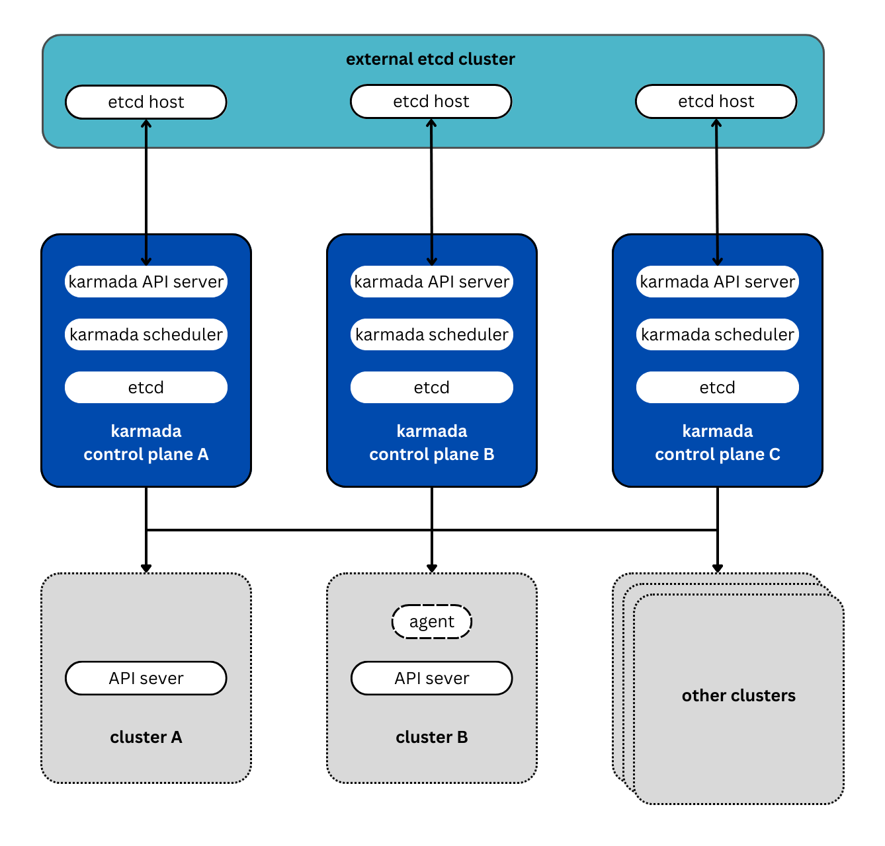

本文档旨在阐述 Karmada 的高可用性设计。Karmada 的高可用架构与 Kubernetes 的高可用架构非常相似。
要在 HA（高可用）环境中部署 Karmada，我们可以创建多个 Karmada API 服务器，以取代单个 API 服务器。
这样即使某一个 Karmada 控制平面宕机，您仍然能够借助其他 Karmada 控制平面继续管理您的集群。

## 高可用拓扑结构的选择

针对高可用 Karmada 集群的拓扑配置，有两种可选方案：

* 堆叠控制平面节点，在此模式下，etcd 节点与控制平面节点并置在一起

* 外置 etcd 节点，其中 etcd 运行在控制平面节点之外的独立节点上

在搭建高可用集群前，您应当谨慎权衡每种拓扑结构的利弊。

## 堆叠 etcd 拓扑结构

堆叠式高可用集群：etcd 提供的分布式数据存储集群堆叠在 Karmada 控制平面节点之上。

每个控制平面节点均运行有 Karmada API 服务器、Karmada 调度器及 Karmada 控制管理器的一个实例。
Karmada API 服务器能够与多个成员集群通信，并且这些成员集群可以注册到多个 Karmada API 服务器上。

每个 Karmada 控制平面节点都会创建一个本地 etcd 成员，此 etcd 成员仅与其所在节点的 Karmada API 服务器通信。
同样的规则也适用于本地的 Karmada 控制管理器和 Karmada 调度器实例。

该拓扑结构将控制平面与 etcd 成员耦合在同一节点上，相比采用外置 etcd 节点的集群，其搭建与副本管理都更为简便。

然而，堆叠式集群存在耦合失效的风险。如果某节点发生故障，将同时失去一个 etcd 成员及一个 Karmada 控制平面实例，
冗余性也会受到影响。您可以通过增加更多的控制平面节点降低这一风险。

因此，为了构建堆叠式高可用集群，您应该至少运行三个堆叠式的控制平面节点。

## 外置 etcd 拓扑结构

外置 etcd 高可用集群：在运行 Karmada 控制平面组件的节点组成的 Karmada 集群之外，
单独设有 etcd 提供的分布式数据存储集群。

与堆叠 etcd 拓扑类似，在外置 etcd 拓扑中，每个 Karmada 控制平面节点同样运行着 Karmada API 服务器、
Karmada 调度器和 Karmada 控制管理器的一个实例，并且 Karmada API 服务器对成员集群开放。不同之处在于，
etcd 成员在独立的主机上运行，各 etcd 主机与各 Karmada 控制平面节点的 API 服务器进行通信。

该拓扑结构实现了 Karmada 控制平面与 etcd 成员的解耦，因此，它提供了一种高可用架构，在此架构下，
单个控制平面实例或 etcd 成员的宕机对集群的影响较小，并且不会像堆叠式高可用拓扑那样严重地影响集群冗余性。

但需要注意的是，这种拓扑结构需要的主机数量是堆叠式高可用拓扑的两倍。采用此拓扑构建高可用集群，
至少需要三台用于控制平面节点的主机和三台用于 etcd 节点的主机。

