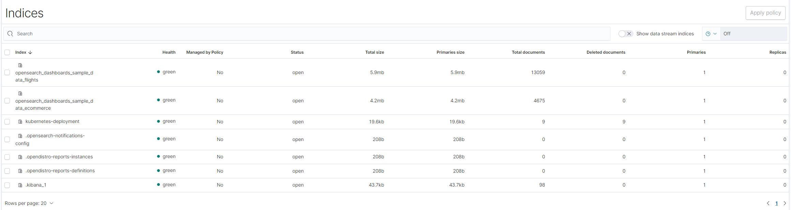

本指南将涵盖以下内容：

* 在 Karmada 控制面上安装 `karmada-search` 组件
* 缓存多个集群的 `Deployment` 资源。
* 使用 `OpenSearch` 图形界面检索 Kubernetes 资源。

## 前提条件

在安装 `karmada-search` 之前，您必须先安装 Karmada 控制平面。要启动 Karmada，您可以参考[安装概述](../installation/installation.md)。如果您只是想尝试 Karmada，我们建议使用 `hack/local-up-karmada.sh` 构建开发环境。

```shell
git clone https://github.com/karmada-io/karmada
cd karmada
hack/local-up-karmada.sh
```

## 安装 karmada-search

如果您使用 `hack/local-up-karmada.sh`，那 `karmada-search` 已经安装好了。

如果您通过 Helm 安装 Karmada，可以选择以下任意一种方式进行安装：

* 在 `host` 模式下安装 `karmada-search`
```shell
helm upgrade --install karmada -n karmada-system --create-namespace --dependency-update \
     --cleanup-on-fail ./charts/karmada \
     --set components={"search"}
```

* 在 `component` 模式下单独安装 `karmada-search`

为 `karmada-search` 编辑 `values.yaml` 文件：
```yaml
installMode: "component"
components: [
  "search"
]
...
```

执行下述命令：
```shell
kubectl config use-context host
helm install karmada -n karmada-system ./charts/karmada
```

如果您通过 Karmada Operator 安装 Karmada，可以在安装 Karmada 组件时，执行下述命令：
```shell
kubectl create namespace test
kubectl apply -f - <<EOF
apiVersion: operator.karmada.io/v1alpha1
kind: Karmada
metadata:
  name: karmada-demo
  namespace: test
spec:
  components:
    karmadaSearch: {}
EOF
```

此外，`karmadactl` 支持一键安装 `karmada-search`。
```shell
karmadactl addons enable karmada-search
```
有关更多详细信息，您可以参考 [karmadactl addons instruction](../reference/karmadactl/karmadactl-commands/karmadactl_addons.md)。

## 缓存多个集群的 Deployment 资源

在接下来的步骤中，我们将在缓存成员集群的 Deployment 资源。根据[示例](../get-started/nginx-example.md)，我们已经将一个 nginx `Deployment` 分发到了 member1 和 member2。

### 1. 创建一个 ResourceRegistry，它将缓存目标集群中的 Deployment 资源。

```yaml
### deployment-search.yaml
apiVersion: search.karmada.io/v1alpha1
kind: ResourceRegistry
metadata:
  name: deployment-search
spec:
  targetCluster:
    clusterNames:
      - member1
      - member2
  resourceSelectors:
    - apiVersion: apps/v1
      kind: Deployment
```

```shell
kubectl --kubeconfig $HOME/.kube/karmada.config --context karmada-apiserver create -f deployment-search.yaml
```

### 2. 通过 Kubernetes API 进行测试

您可以通过以下命令从 member1 和 member2 获取 deployment 资源。

```shell
kubectl --kubeconfig $HOME/.kube/karmada.config --context karmada-apiserver get --raw /apis/search.karmada.io/v1alpha1/search/cache/apis/apps/v1/deployments
```

输出类似于（忽略不相关的字段）：

```json
{
  "kind": "List",
  "apiVersion": "apps/v1",
  "metadata": {},
  "items": [{
    "apiVersion": "apps/v1",
    "kind": "Deployment",
    "metadata": {
      "annotations": {
        "deployment.kubernetes.io/revision": "1",
        "kubectl.kubernetes.io/last-applied-configuration": "{\"apiVersion\":\"apps/v1\",\"kind\":\"Deployment\",\"metadata\":{\"annotations\":{},\"labels\":{\"app\":\"nginx\"},\"name\":\"nginx\",\"namespace\":\"default\"},\"spec\":{\"replicas\":2,\"selector\":{\"matchLabels\":{\"app\":\"nginx\"}},\"template\":{\"metadata\":{\"labels\":{\"app\":\"nginx\"}},\"spec\":{\"containers\":[{\"image\":\"nginx\",\"name\":\"nginx\"}]}}}}\n",
        "resource.karmada.io/cached-from-cluster": "member1",
        "resourcebinding.karmada.io/name": "nginx-deployment",
        "resourcebinding.karmada.io/namespace": "default",
        "resourcetemplate.karmada.io/uid": "b46d2736-78d8-47db-b589-6e819139ba33"
      },
      "creationTimestamp": "2022-11-18T08:34:28Z",
      "generation": 1,
      "labels": {
        "app": "nginx",
        "propagationpolicy.karmada.io/name": "nginx-propagation",
        "propagationpolicy.karmada.io/namespace": "default",
        "resourcebinding.karmada.io/key": "687f7fb96f",
        "work.karmada.io/name": "nginx-687f7fb96f",
        "work.karmada.io/namespace": "karmada-es-member1"
      }
    }
  }, {
    "apiVersion": "apps/v1",
    "kind": "Deployment",
    "metadata": {
      "annotations": {
        "deployment.kubernetes.io/revision": "1",
        "kubectl.kubernetes.io/last-applied-configuration": "{\"apiVersion\":\"apps/v1\",\"kind\":\"Deployment\",\"metadata\":{\"annotations\":{},\"labels\":{\"app\":\"nginx\"},\"name\":\"nginx\",\"namespace\":\"default\"},\"spec\":{\"replicas\":2,\"selector\":{\"matchLabels\":{\"app\":\"nginx\"}},\"template\":{\"metadata\":{\"labels\":{\"app\":\"nginx\"}},\"spec\":{\"containers\":[{\"image\":\"nginx\",\"name\":\"nginx\"}]}}}}\n",
        "resource.karmada.io/cached-from-cluster": "member2",
        "resourcebinding.karmada.io/name": "nginx-deployment",
        "resourcebinding.karmada.io/namespace": "default",
        "resourcetemplate.karmada.io/uid": "e785db97-4d17-4871-99be-6d629c556b89"
      },
      "creationTimestamp": "2022-11-21T02:23:26Z",
      "generation": 1,
      "labels": {
        "app": "nginx",
        "propagationpolicy.karmada.io/name": "nginx-propagation",
        "propagationpolicy.karmada.io/namespace": "default",
        "resourcebinding.karmada.io/key": "687f7fb96f",
        "work.karmada.io/name": "nginx-687f7fb96f",
        "work.karmada.io/namespace": "karmada-es-member2"
      }
    }
  }]
}
```

## 使用 OpenSearch 图形界面检索 Kubernetes 资源

`karmada-search` 还支持将缓存资源同步到独立存储服务，如 [Elasticsearch](https://en.wikipedia.org/wiki/Elasticsearch) 或 [OpenSearch](https://github.com/opensearch-project/OpenSearch)。通过利用搜索引擎，您可以按字段和索引执行具有所有所需功能的全文搜索；根据分数对结果进行排名、按字段对结果进行排序，并聚合结果。

以下是使用 `OpenSearch` 以图形界面检索 Kubernetes 资源的示例。

### 1. 部署 OpenSearch 和 OpenSearch 仪表盘

使用以下脚本部署 `OpenSearch` 和 `OpenSearch` 仪表盘。

```shell
./hack/deploy-karmada-opensearch.sh $HOME/.kube/karmada.config karmada-host
```

验证安装结果：

```shell
kubectl --kubeconfig $HOME/.kube/karmada.config --context karmada-host get po -A
```

输出类似于：

```
NAMESPACE            NAME                                                   READY   STATUS    RESTARTS   AGE
karmada-system       karmada-opensearch-77454fbcf5-7rpvz                    1/1     Running   0          155m
karmada-system       karmada-opensearch-dashboards-596bf4d9dd-n9429         1/1     Running   0          156m
...
```

### 2. 更新 ResourceRegistry 与 backendStore

```yaml
### deployment-search.yaml
apiVersion: search.karmada.io/v1alpha1
kind: ResourceRegistry
metadata:
  name: deployment-search
spec:
  backendStore:
    openSearch:
      addresses:
        - http://karmada-opensearch.karmada-system.svc:9200
  targetCluster:
    clusterNames:
      - member1
      - member2
  resourceSelectors:
    - apiVersion: apps/v1
      kind: Deployment
```

```shell
kubectl --kubeconfig $HOME/.kube/karmada.config --context karmada-apiserver apply -f deployment-search.yaml
```

### 3. 暴露仪表板的服务

您需要将 Web 服务暴露到主机端口，以便可以通过 HTTP 访问仪表板。

```shell
kubectl --kubeconfig $HOME/.kube/karmada.config --context karmada-host port-forward svc/karmada-opensearch-dashboards 5601:5601 -nkarmada-system --address=0.0.0.0
```

### 4. 访问仪表盘

访问 OpenSearch 仪表板（http://NodeIP:5601）：



现在 `Deployment` 的数据已经上传到 `OpenSearch` 中的 member1 和 member2。您可以利用搜索引擎自己体验多集群检索。