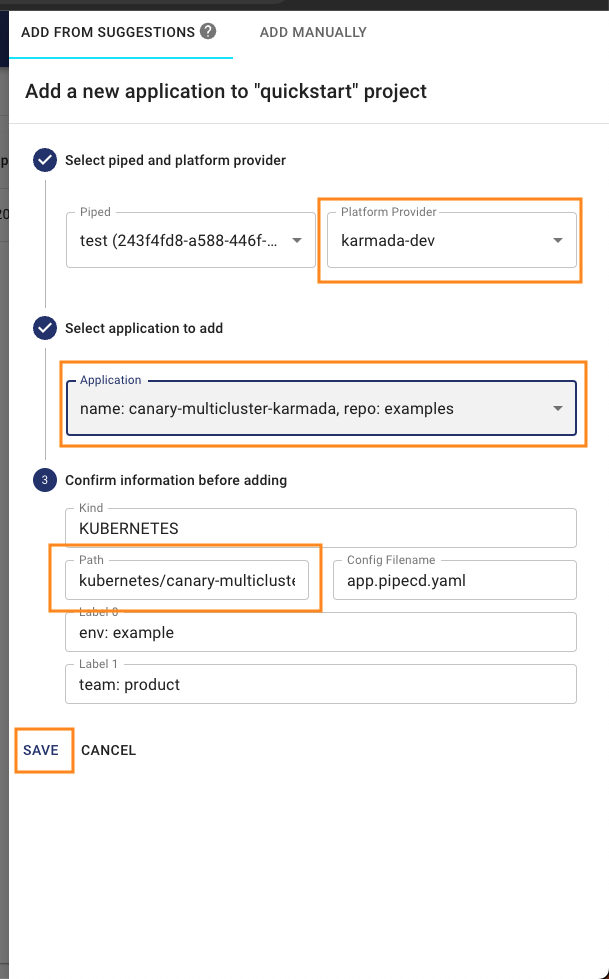

本文将引导你了解如何使用 [PipeCD](https://github.com/pipe-cd/pipecd/) 和 `Karmada` 来管理`跨集群`工作负载。

## 前提条件 {#prerequisites}

### 安装 PipeCD

在本示例中，你可以按照 [Quickstart](https://pipecd.dev/docs/quickstart/) 的说明来安装 PipeCD。

你可以访问 `localhost:8080`，登录后会看到以下 UI 界面，确认 PipeCD 已准备就绪。


### 安装 Karmada

在本示例中，我们使用一个至少有 `3` 个成员集群已加入的 Karmada 环境。

你可以通过 `hack/local-up-karmada.sh` 脚本来搭建 Karmada 环境，该脚本也用于运行我们的 E2E 测试用例。

```bash
$ kubectl get clusters
NAME      VERSION   MODE   READY   AGE
member1   v1.19.1   Push   True    18h
member2   v1.19.1   Push   True    18h
member3   v1.19.1   Pull   True    17h
```

## 安装并配置 PipeCD agent (piped) 以对接 Karmada

此步骤将安装 PipeCD agent `piped`，并将其配置为连接 Karmada API server。

在本示例中，为简单起见，我们遵循 [在单台机器上安装 piped](https://pipecd.dev/docs/installation/install-piped/installing-on-single-machine/) 的说明。piped 将安装在你的本地机器上，并使用 `karmada-apiserver` 上下文来连接 Karmada 控制平面。

从浏览器访问 [localhost:8080/settings/piped?project=quickstart](http://localhost:8080/settings/piped?project=quickstart)，并为新的 piped 注册信息。

按如下所示准备 piped 配置 yaml，并将其另存为 `piped-config.yaml`。

```yaml
apiVersion: pipecd.dev/v1beta1
kind: Piped
spec:
  projectID: quickstart
  pipedID: <YOUR_PIPED_ID>
  pipedKeyData: <YOUR_PIPED_KEY_DATA>
  apiAddress: localhost:8080
  syncInterval: 1m
  repositories:
    - repoId: examples
      remote: <YOUR_MANIFEST_REPO_URL>
      branch: master
  platformProviders:
    - name: karmada-dev
      type: KUBERNETES
      config:
        kubeConfigPath: $HOME/.kube/karmada.config
        appStateInformer:
          includeResources:
            - apiVersion: policy.karmada.io/v1alpha1
              kind: PropagationPolicy
            - apiVersion: work.karmada.io/v1alpha2
              kind: ResourceBinding
            - apiVersion: work.karmada.io/v1alpha1
              kind: Work
```

关于 `<YOUR_PIPED_ID>` 和 `<YOUR_PIPED_KEY_DATA>`，请参阅[安装 piped](https://pipecd.dev/docs-v0.48.x/quickstart/#12-installing-piped) 文档。

对于 `<YOUR_MANIFEST_REPO_URL>`，你可以对 [PipeCD 示例仓库](https://github.com/pipe-cd/examples) 执行Fork 操作。

接下来，从 PipeCD 官方 GitHub 仓库下载 piped 二进制文件。

```bash
# OS="darwin" or "linux"
$ curl -Lo ./piped https://github.com/pipe-cd/pipecd/releases/download/v0.48.8/piped_v0.48.8_{OS}_amd64
$ chmod +x piped
```

然后，你就可以在你的机器上运行 piped agent，它将连接到 PipeCD 控制平面仪表板，并将你的应用交付到 Karmada 集群。

```bash
$ ./piped piped --config-file=piped-config.yaml --insecure=true
```

注意：`--insecure=true` 是必需的，因为在快速入门模式下，我们连接到 PipeCD 控制平面时没有使用 SSL。

一旦你的 piped 准备就绪，你可以在 [localhost:8080/settings/piped?project=quickstart](http://localhost:8080/settings/piped?project=quickstart) 页面看到其状态，如下所示：


## 通过 UI 创建应用

### 准备应用

在上一步中，假设你已经在 `<YOUR_MANIFEST_REPO_URL>` 下准备了一个 manifest 仓库。

接下来，你需要准备一个包含应用程序 manifest 的目录，例如这个 [canary-multicluster-karmada](https://github.com/khanhtc1202/pipecd-examples/tree/master/kubernetes/canary-multicluster-karmada) 目录。

该目录包括：

- `app.pipecd.yaml`: piped 用于执行部署任务的配置
- `propagationpolicy.yaml`: Karmada 用于将你的应用资源交付到成员集群的配置
- `deployment and service`: 原始的 Kubernetes manifest

### 创建应用

访问 [localhost:8080/applications?project=quickstart](http://localhost:8080/applications?project=quickstart) 来创建一个新应用。

点击 `+ADD` 按钮，如下所示：


在 `ADD FROM SUGGESTIONS` 表单中，从选择框中选择值以注册你的应用信息，如图所示：



在表单和确认框中点击 `SAVE`，你的应用将被成功注册并准备就绪。


### 同步应用

你无需执行任何操作！注册应用后，PipeCD 将在快速同步策略下自动触发其首次部署（有关 PipeCD 同步策略的更多信息，请参阅[文档](https://pipecd.dev/docs-v0.48.x/concepts/#sync-strategy)）。


你可以通过访问 [localhost:8080/deployments?project=quickstart](http://localhost:8080/deployments?project=quickstart) 查看部署的详细日志，然后导航到你的应用部署详情页。


PipeCD 支持多种方式来触发应用的新部署，请参阅[触发部署文档](https://pipecd.dev/docs/user-guide/managing-application/triggering-a-deployment/)。

### 查看详细状态

通过 PipeCD 控制平面应用详情页，你可以查看应用资源的状态。

访问 [localhost:8080/applications?project=quickstart](http://localhost:8080/applications?project=quickstart) 并导航到你的应用页面查看详情。


就这些了！
