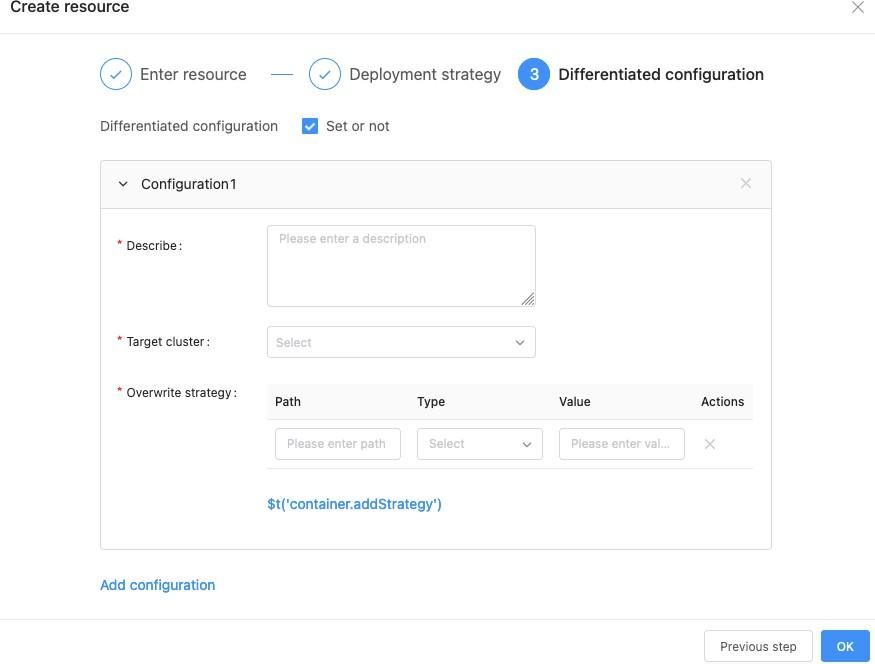
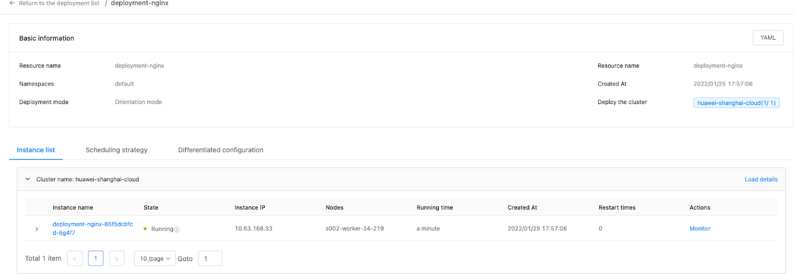
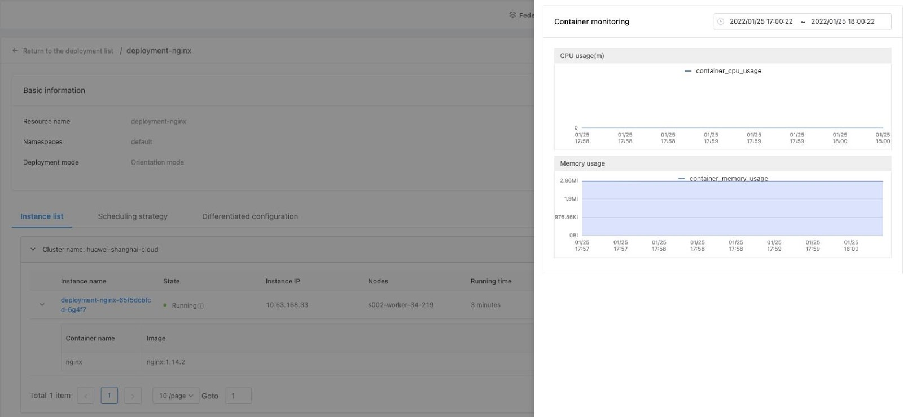

# 艾莫尔研究院基于Karmada的落地实践

## 背景

艾莫尔⼈⼯智能研究院，是矽柏集团下⼀家致⼒于使⽤云原⽣技术帮助企业数字化转型的科技公司。公司主要产品是斩浪云-云原⽣应⽤平台，该平台围绕云原生、数据智能、应用安全、应用性能、智能应用等五大方向， 面向企业级市场，提供云原生、大数据、AI、信息安全等技术产品，覆盖从开发、应用到运营整个环节， 满足不同企业在生命周期不同阶段的核心需求，为各行业打造⼀站式云原⽣解决⽅案, 助⼒企业云原⽣数字化转型。

基于Kubernetes，我们构建了云厂商无关的云原生平台，用户无需感知云厂商之间的差异即可使用Kubernetes托管业务应用。随着客户对多云需求的不断增加, 集群规模和集群数量快速增⻓，运维复杂性也急剧增加，我们迫切需要围绕 Kubernetes 构建多集群技术。过程中，我们考虑过自研多集群管理方案，也对开源社区相关项目做了细致的调研和测试，最终我们选择了 Karmada 项⽬。下⾯将结合我们内部⼀些场景和需求，介绍选择Karmada的原因以及在落地过程中的⼀些实践。

## 多集群方案选型

公司内部目前大约有50+左右的集群，每个集群有数百至上千节点不等。集群不是同构的，其中一些集群包含异构计算资源，如 GPU；集群也不是同质的，其中一些边缘集群使用 k3s 构建。根据我们的业务情况，我们对多集群方案选型主要基于以下几点：- Cluster API 定义要足够抽象且具备灵活性，方便我们描述集群的状态、资源、成员，同时可以通过添加一个很薄的胶水层就描述集群内异构成员和非同质集群。

- 能够兼容 Kubernetes 原⽣ API 和 CRD，这样我们现存的一些系统不改造或者通过很少的改造就可以迁入多集群。
- 支持多集群资源调度策略，同时具备自定义扩展的能力。因为我们的集群分散在全球多个国家，我们希望可以在统一的平台上去管理资源的调度。
- 控制面要满足高可用、高性能。我们希望随着规模的增长，多集群系统可以水平扩展。为什么选择 **Karmada**首先 Karmada 是兼容 Kubernetes 原生 API 和 CRD的。其次，从架构上而言，Karmada 的架构和  Kubernetes 很类似，具备层层递进、可扩展性，具体来说：- **独立的 etcd cluster**： Karmada 可以使用独立的 etcd 集群，这和其他多集群系统依赖 Kubernetes 不同。独立的 etcd 集群可以让控制面支撑更多的资源存储，而不需要考虑挤压 Kubernetes 集群的问题。未来，我们还可以进一步在控制面将规模较大的资源对象拆分出去，以满足更大规模的多集群管理。
- **独立的 scheduler：**Karmada 使用独立的 scheduler 提供多集群调度，这一点也是其他项目所不具备的。
- **agent/non-agent 接入模式：** 相比于控制面 All-In-One 的系统，使用场景更加丰富。下图是  Karmada 的架构图:

---

## Karmada 落地实践

## 多集群管理

当集群数量达到一定程度，同时多个集群之间存在着版本、配置、计算资源、API resource 等差异时，它们同时交叉在一起会导致多集群管理复杂度呈指数级上升。我们需要自动化的系统去降低管理的复杂度。Karmada 定义了 Cluster CRD 对象，基于该对象，我们构建了自动化的多集群管理系统功能，降低了多集群管理的整体复杂度，提高了系统管理人员的效率。

### 选择合适的集群接管模式

Karmada 提供了两种集群同步模式来处理控制⾯集群 (Karmada Control Plane) 和成员集群 (Member Cluster) 之间的协作:

1. Push 模式，Karmada 控制⾯直接管理成员集群并执行资源同步。这种模式下, 不需要为成员集群部署额外的组件，只需要将成员集群注册到Karmada控制面即可。
2. Pull 模式，成员集群主动向Karmada控制面拉取资源并同步⾃⾝状态。这种模式下, 成员集群只需要部署’karmada-agent’组件即可，该组件会自动完成集群注册。在实践过程中，我们对不同场景使⽤哪种集群管理⽅式总结如下表：

   |                |                 |          |
   | ---------------- | ----------------- | ---------- |
   | Karmada 控制⾯ | 成员集群        | 同步模式 |
   | 公有云         | 私有云          | Pull     |
   | 公有云         | 公有云 (跨公⽹) | Pull     |
   | 公有云         | 公有云 (内⽹)   | Push     |

### 自动化集群管理

添加一个 K8s 集群流程比较繁杂，涉及集群创建、集群验证、注册等流程，还会涉及到跨部门协作。我们在 Karmada 之上叠加了业务相关的管理策略，如下图所示。其中混合云是聚焦在 IaaS 层的云上、云下资源管理平台。

### 集成 Karmada 到现有平台

我们将前⾯描述的⼀些内容和内部的云原⽣平台做了集成, 以简化系统运维和管理⼈员的操作复杂度。

## 多集群资源管理和调度

有些项目使用CRD来包裹Kubernetes原生API，用户普遍感觉很痛苦，其中一个原因在于存量系统无法平滑接入，改造成本较大。更本质的原因是这些多集群项目把资源管理和调度的复杂性暴露给了用户或者系统维护人员，而 Karmada 的出现带给了我们惊喜！下面我们将谈谈我们是如何基于 Karmada 来解决问题的。

## 兼容 K8s 原生 API
Karmada 是⾸个完全兼容 K8s 原⽣ API 的多集群容器编排项⽬, 用户无需改动即可将现有集群资源通过 Karmada 分发到多个集群上。在架构设计上，Karmada 隐藏了多集群资源管理和调度的复杂性，下图是 Karmada API 的工作流程：

在笔者理解看来，Karmada 这个 API workflow 很好践行了 “机制同策略分离” 的设计：Karmada 定义了一套多集群资源管理的机制，然后在该机制上定义了相关策略。其中 Propagation Policy 定义资源在多集群中的传播策略，Override Policy 定义资源在多集群中的差异配置策略。策略面向系统管理人员，最终用户只需要提交自己的 K8s 原生 API 声明就可以了。在我们实践过程中，我们将该理念融入到了平台，下图展现了平台用户只需要提交原生的 K8s API 就可以使用多集群的能力了。

### 更高级的调度策略

和其他多集群系统不同的是，Karmada 支持很多高级的调度策略：
- 定向调度： 这种方式与Kubernetes 的 Node 定向调度类似, 我们可以将部署的资源调度到指定的集群上。

- 亲和性调度：使⽤⽅式上和 Kubernetes 类似, ⽀持 label selector, match expression 等语法。
- 污点容忍调度：这种方式和 kubernetes 的 Node Toleration 类似, Karmada 的Cluster API 可以声明污点 (Taint), 在多个集群调度资源时, 如果该资源可以容忍(Toleration) 集群声明的 (Taint), 则可以将该资源调度到该集群。值得⼀提的是, Karmada 内部实现了⼀个和 Kubernetes 类似的调度框架 (Scheduler Framework), 当内置调度策略不满⾜时, 我们还可以编写⾃⼰的调度策略进行扩展。同时， Karmada 在 PropagationPolicy 还定义了⼀个 SchedulerName 字段，⽤于定义使⽤哪个调度器进⾏调度。未来, 当调度需求和场景更复杂时, 我们可以根据该字段替换默认 (default) 调度器来满⾜需求。总而言之，Karmada 具备灵活的调度策略，支持按需扩展甚至多调度器架构。这种具有⾼度可扩展性和可定制化的能⼒正是我们所需要的。在我们实践过程中，我们使用两种方式将这些能力暴露给使用者：

1. template，用户在填写完原生的  K8s API 声明后，选择一个系统创建的 template 声明这些调度策略。同时系统支持对 template CRUD，template 能力基于 Karmada。
2. strategy，将能力可视化，让用户自己填写。下图展示了我们第二种方式：
   

### 多集群资源差异化配置

多个集群之间的 workload 配置往往是不同的，最简单的比如容器镜像版本不同。我们将 Karmada 的 Override Policy 进行了封装，给予用户这种能力。如下图所示：

### 多集群资源状态聚合

资源分散在多个集群上运行，聚合这些资源的状态形成一个统一的视图是很关键的。Karmada 对 Kubernetes 原生资源进行了聚合，我们使用该聚合状态构建平台，如下图所示：

## Karmada 和现有系统的融合

我们现有的系统集成 Karmada非常轻松，AriesSurface 是我们第一个尝试从单集群推到多集群的项目。AriesSurface 是一个多集群巡检系统 ，用于探测部署链路和集群数据一致性。这两个指标对于我们的集群非常重要。在我们实践过程中, 往往会发⽣所有监控指标都没有问题, 但部署偏偏还是失败了的情况。经过分析我们发现，监控数据⽆法⽆死⾓覆盖所有异常, 监控只能暴露出系统异常, 但不能保障⼀些链路百分百可⽤。为此, 我们设计了和研发了基于 Pipeline (DAG) 的集群巡检系统。在引⼊多集群之前，各个集群的巡检状态是分散的, ⽆法做到全局视⾓观测；拥抱 Karmada之后, 我们将其改造成多集群巡检系统, 下图是我们集成 Karmada 后的⼀个架构：

1. 巡检系统会通过 Karmada 的 Propagation 将 CRD 下发到成员集群。
2. 成员集群的 Surface 控制监听到 CRD 创建，会根据定义渲染出一个 Pipeline 并计算出一个 DAG，控制器执行该 DAG 并生成巡检结果。
3. 控制面运行一个 detector 收集巡检状态并将结果做相应的聚合和计算。巡检系统可以帮助我们知道每个成员集群相关链路的状态, 从⽽为多集群交叉部署和调度提供有效的数据⽀撑。下图是我们线上系统的⼀个⼤盘图：
   

4. 我们还绘制了巡检链路在不同时间点的时序状态, 有助于我们回溯历史时间点的异常信息:

## Karmada 和社区生态的融合

Karmada 良好的设计使得它可以很容易和社区中其他项目进行集成，下图是我们集成 velero 做多集群备份和恢复的架构。我们在控制面扩展了 velero 的 Backup 和 Restore 的多集群 CRD，通过 Karmada 的 PropagationPolicy 将对应的 CRD 分发到指定的成员集群。Backup 和 Restore 对应的 Controller 会做 Reconcile, 并对成员集群的 velero 的 CRD 进行状态聚合。

## 基于 Karmada 的多集群异构资源探索

下图展示了我们是如何基于 Karmada 做 GPU 多集群资源管理的：

得益于 Karmada 优越的架构设计，我们很快构建了多集群 GPU 资源管理的原型系统。在最底层的算力上，我们使用时分模型对 GPU 算力做了虚拟化，同一个节点上的多个 Pod 可以共享一张或多张卡。每个节点的 GPU agent 实现了 GPU device plugin，并将虚拟的 GPU核心与显存注册为 extended resource。GPU Scheduler  是一个 K8s scheduler plugin，对 extended resource 进行资源调度。GPU 在多集群管理的一个基本想法是统一GPU 资源视图和GPU 资源调度。首先用户提交 GPU 相关的工作负载和  PropagationPolicy。GPU Scheduler 是在 Karmada 中扩展的一个 scheduler plugin，它根据工作负载资源和 PropagationPolicy 进行一次简单的调度。目前的实现会收集每个成员集群的 GPU 资源信息，但没有在多集群做统一调度，实际上表现为一个两层调度。

## 总结

自从 2021年初接触 Karmada 以来，我们基于 Karmada 构建了内部的多集群系统，获得了诸多益处：

1. 由于Karmada兼容 Kubernetes-Native API, 这样我们现有的资源定义不需要改造即可接入多集群。
2. 建立多集群控制面标准, 通过 Karmada Cluster API, Cluster Controller 以及 push/pull 的模式, 我们在内部建立了多集群层面的控制标准, 任何上层系统的多集群管理能力都能以统一的方式输出。
3. 面向场景的多集群资源调度和编排能力, Karmada 内置的一系列 controller, scheduler plugins 以及和 Kubernetes 等价的 scheduler 扩展能力，可以让我们针对不同的场景做不同的权衡和设计。
4. 现存系统快速多集群化, Karmada 灵活的架构设计让我们内部原本面向单集群的系统，可以很快过渡到多集群系统。同时，在使用 Karmada 过程中，我们见证了Karmada 项目的成长。从 Karmada v0.5 到 v1.0, 我们几乎参与每次 weekly meeting，见证了 Karmada 很多令人兴奋的 feature 从 proposal 到最后的 merge， 团队先后2人成为了Karmada 社区 member。我认为这是开源项目和商业公司一种非常良性的循环。我们使用 Karmada 完成了我们系统的构建，同时将遇到的问题和新的idea回馈给社区，团队在此期间对开源的认识也更加深刻，我们很荣幸能够参与到 Karmada 项目，也希望更多的开发者加入到 Karmada 一起共建繁荣社区。
