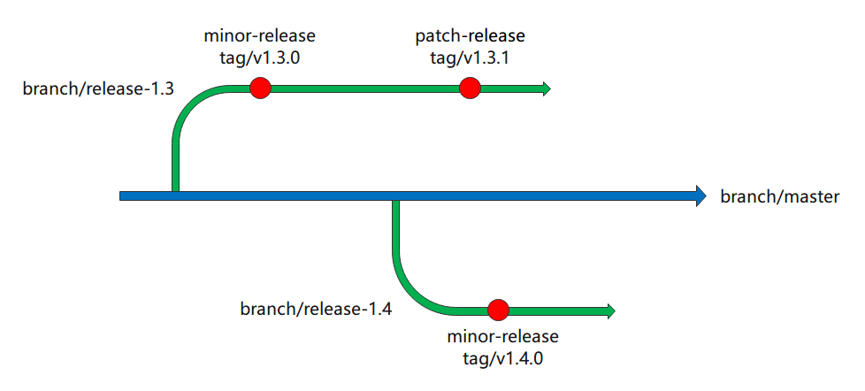

Karmada版本发布可分为minor版本发布和patch版本发布。例如，`v1.3.0`是一个minor版本，`v1.3.1`是一个patch版本。Minor版本表示此版本有新特性添加，同时兼容之前的版本；Patch版本表示此版本主要为Bug修复，同时兼容之前版本。release，tag和分支之间的关系如下图：


对于不同的版本发布，操作步骤也不同。

## Minor版本发布
Minor版本应该从对于的minor分支发布，发布步骤描述如下。

### 创建release分支(手动)
首先，确保所有必要PR都已被合入master 分支，然后从master分支创建minor release 分支。Minor release分支的命名应该符合`release-{major}.{minor}`格式，例如，`release-1.4`。 

### 准备发布说明(手动)
每个版本发布都需要格式正确的版本发布说明。版本发布说明应该遵循如下格式：
```text
# What's New
此版本发布的重点更新，例如，一些关键特性的支持。此部分内容需要手动整理收集。

# Other Notable Changes
## API Changes
* API更改列表，如API版本更新。此部分内容需要手动整理收集。

## Bug Fixes
* Bug修复列表。此部分内容需要手动整理收集。

## Features & Enhancements
* 新特性和功能增强。此部分内容需要手动整理收集。

## Security
* 安全相关修复。此部分内容需要手动整理收集。

## Other
### Dependencies
* 依赖相关更新，如golang版本更新。此部分内容需要手动整理收集。

### Instrumentation
* 可观测性相关更新，例如，增加监控数据/事件记录。此部分内容需要手动整理收集。
```
为了获取如上所有相关内容，需要对比新创建的minor release分支和上一版本的minor release tag，例如，比较`release-1.4`分支和`v1.3.0`tag。然后从这些对比修改中提取为如上不同类型的发布说明。例如，从[此修改](https://github.com/karmada-io/karmada/pull/2675)提取如下发布说明：
```text
## Bug Fixes
* `karmada-controller-manager`: Fixed the panic when cluster ImpersonatorSecretRef is nil.
```

### 提交发布说明(手动)
在发布说明准备好后，提交到minor release分支的`docs/CHANGELOG/CHANGELOG-{major}.{minor}.md`。

### 准备贡献者列表(手动)
每个版本发布都需要指明贡献者。比较新创建的minor release分支和前一个minor release tag获取贡献者的Github ID列表，例如，比较`release-1.4`分支和`v1.3.0` tag。此列表需要按照字母序排列，如：
```text
## Contributors
Thank you to everyone who contributed to this release!

Users whose commits are in this release (alphabetically by username)
@a
@B
@c
@D
...
```

### 更新描述文件(手动)
安装`Karmada`时，对应镜像需要从DockerHub/SWR拉取，所以我们需要更新描述文件中的镜像tag为最新的minor版本。如下文件需要更新：
* `charts/karmada/values.yaml`: 更新 `Karmada` 相关的镜像tag为即将发布的版本。
* `charts/index.yaml`: 增加对应版本的helm仓库索引。
 
### 添加升级文档(手动)
新minor版本发布时，对应升级文档`docs/administrator/upgrading/v{major}.{minor_previous}-v{major}.{minor_new}.md`需要被添加到 [website](https://github.com/karmada-io/website) 仓库。例如，发布minor版本`v1.4.0`时，需要添加升级文档`docs/administrator/upgrading/v1.3-v1.4.md`。

### 创建发布(手动)
现在，所有准备工作都已完成，让我们在Github发布页面上创建发布。
* 创建一个新的minor release tag，tag命名应该遵循`v{major}.{minor}.{patch}`格式，例如，`v1.4.0`。
* 目标分支为新创建的minor release分支。
* `Describe this release`的内容应该为章节`准备发布说明`和`准备贡献者列表`内容的合并。

### 添加发布产物(自动)
在版本发布后，GitHub会运行流水线`.github/workflows/release.yml`，构建`karmadactl`和`kubectl-karmada`二进制，并且将其添加到新发布的产物中。

### 构建/发布镜像(自动)
在版本发布后，Github会运行流水线`.github/workflows/swr-released-image.yml` 和 `.github/workflows/dockerhub-released-image.yml`，构建所有`Karmada`相关的组件镜像，并推送到DockerHub/SWR。

### 验证发布(手动)
在所有流水线完成后，你应该执行手动检查，确认所有发布产物都正确构建：
* 检查所有产物是否都被添加。
* 检查所有镜像是否都被推送到DockerHub/SWR。

## Patch版本发布
Patch版本应该从对应的minor release分支发布。

### 准备发布说明(手动)
此步骤和minor版本发布几乎一致，只是我们需要比较对应的minor release分支和minor tag来提取对应的发布说明，例如，对比`release-1.3` 分支和`v1.3.0` tag获取`1.3.1`patch版本发布说明。

### 创建发布(手动)
此步骤和minor版本发布几乎一致，只是target分支为对应的minor release分支，例如，从`release-1.3`分支创建release tag `v1.3.1`。同时，我们也不需要要指明贡献者，Github会自动在release note中添加贡献者列表。

### Attach asserts(automatically)
此步骤和minor版本发布一致。

### Build/Push images(automatically)
此步骤和minor版本发布一致。

### Verifying release(manually)
此步骤和minor版本发布一致。
