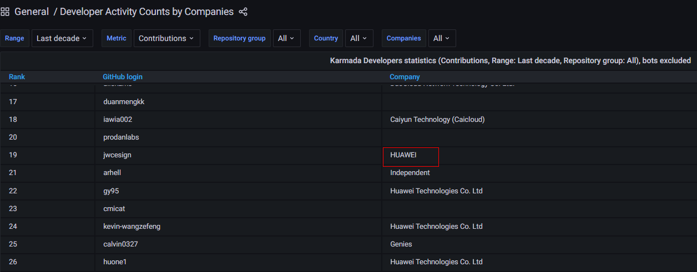
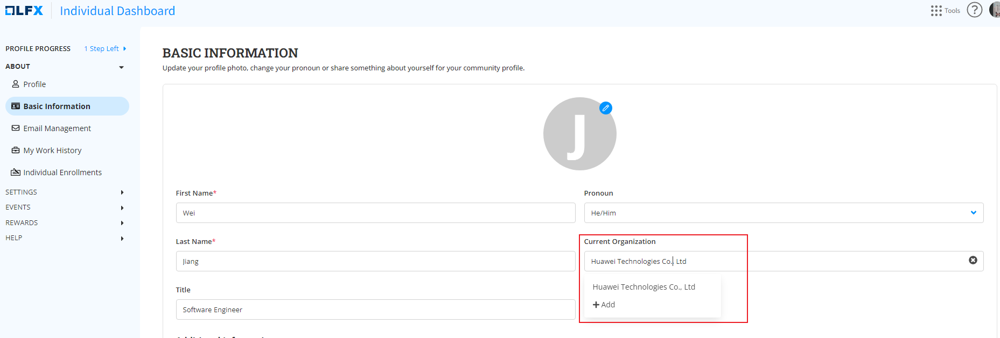

After contributing to [karmada-io](https://github.com/karmada-io) through issues, comments, pull requests, etc., you can check your contributions [here](https://karmada.devstats.cncf.io/d/66/developer-activity-counts-by-companies).

 If you notice that the information in the company column is either incorrect or blank, we highly recommend that you correct it. 

For instance, `Huawei Technologies Co. Ltd`should be used instead of `HUAWEI`:

Here are the steps to fix this issue.

## Verify your organization in the CNCF system
To begin, visit your profile [page](https://openprofile.dev/edit/profile) and ensure that your organization is accurate.

* If the organization incorrect, please select the right one.
* If your organization is not in the list, clieck on **Add** to add your organization.

## Update the CNCF repository used for calculating your contributions
Once you have verified your organization in the CNCF system, you must create a pull request in gitdm with the updated affiliations.  
To do this, you'll need to modify two files: `company_developers*.txt` and `developers_affiliations*.txt`. For reference, please see this example pull request: [PR Example](https://github.com/cncf/gitdm/pull/1257).

After the pull request has been successfully merged, it may take up to four weeks for the changes to be synced.