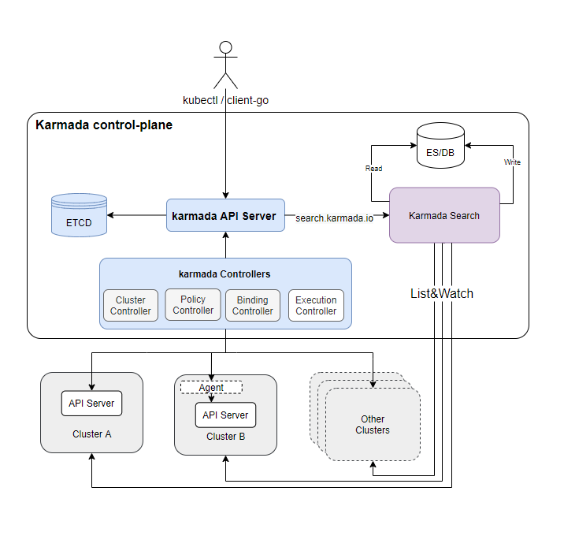

## 背景

多集群正在成为一种常见的实践，它使得服务更接近用户，但也导致在多个集群之间查询 Kubernetes 资源变得困难。
因此，我们需要一个缓存层和一个搜索引擎，以便 Karmada 可以在多个集群之间对 Kubernetes 资源进行缓存和搜索。
我们引入了一个名为 `karmada-search` 的新组件和一个名为 `search.karmada.io` 的新 API 组来实现它。

## karmada-search 可以做什么



karmada-search 可以：

* 加速跨区资源请求处理。
* 提供跨集群资源视图。
* 兼容多个 Kubernetes 资源版本。
* 统一资源请求条目。
* 减轻成员集群 API server 的压力。
* 适配各种搜索引擎和数据库。

另外，`karmada-search` 还支持代理一个全局资源。详细信息请参阅 [这里](./proxy-global-resource.md)。

:::note

1. 此功能旨在构建一个缓存，用于存储来自多个成员集群的任意资源。这些资源通过 `search/proxy` REST API 暴露。如果用户有访问 `search/proxy` 的权限，他们可以直接访问缓存的资源，而无需将请求路由到成员集群。
1. 如前所述，资源查询请求不会路由到成员集群。因此，如果一个秘钥在 Karmada 控制平面中被缓存，但是成员集群中的用户由于 RBAC 权限限制无法通过成员集群的 API 服务器访问它，他们仍然可以通过 Karmada 控制平面访问该秘钥。
1. 此功能旨在为需要查询和查看多个集群中的资源的管理员设计，而不是为最终用户设计。将此 API 暴露给最终用户可能导致最终用户能够查看不属于他们的资源。

:::

## 定义缓存范围

`ResourceRegistry` 中的 `.spec` 定义了缓存范围。

它有三个字段可设置：

- TargetCluster
- ResourceSelector
- BackendStore

### TargetCluster

`TargetCluster` means the cluster from which the cache system collects resources.
It's exactly the same with [clusterAffinity](../scheduling/resource-propagating.md#deploy-deployment-into-a-specified-set-of-target-clusters) in `PropagationPolicy`.
`TargetCluster` 指的是缓存系统收集资源的目标集群。
它与 `PropagationPolicy` 中的 [clusterAffinity](../scheduling/resource-propagating.md#deploy-deployment-into-a-specified-set-of-target-clusters) 完全相同。

### ResourceSelector

`ResourceSelector` 用于指定 `karmada-search` 缓存的资源类型。子字段包括 `APIVersion`、`Kind` 和 `Namespace`。

下面的示例中 `ResourceSelector` 表示目标是 `default` 命名空间中的 `Deployment`：

```yaml
apiVersion: search.karmada.io/v1alpha1
kind: ResourceRegistry
metadata:
  name: foo
spec:
  # ...
  resourceSelectors:
    - apiVersion: apps/v1
      kind: Deployment
      namespace: default
```

:::note

一个空的 `namespace` 字段意味着所有的命名空间都被定位。

:::

### BackendStore

`BackendStore` 指定缓存项的存储位置。默认为 `karmada-search` 的内存。现在 `BackendStore` 仅支持 `OpenSearch` 作为后端。

可以按照以下方式配置` BackendStore`：

```yaml
apiVersion: search.karmada.io/v1alpha1
kind: ResourceRegistry
metadata:
  name: foo
spec:
  # ...
  backendStore:
    openSearch:
      addresses:
        - http://10.240.0.100:9200
      secretRef:
        namespace: default
        name: opensearch-account
```

完整的示例可以参考[这里](../../tutorials/karmada-search.md)。