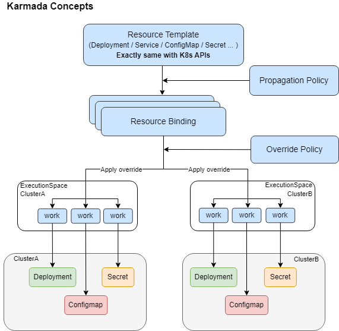

本页面介绍了有关 Karmada 的一些核心概念。

## 资源模板

Karmada 使用 Kubernetes 原生 API 定义联邦资源模板，以便轻松与现有 Kubernetes 采用的工具进行集成。

## 调度策略

Karmada 提供了一个独立的 Propagation(placement) Policy API 来定义多集群的调度要求。

- 支持 1:N 的策略映射机制。用户无需每次创建联邦应用时都标明调度约束。

- 在使用默认策略的情况下，用户可以直接与 Kubernetes API 交互。

## 差异化策略

Karmada 为不同的集群提供了一个可自动化生产独立配置的 Override Policy API。例如：

- 基于成员集群所在区域自动配置不同镜像仓库地址。

- 根据集群不同的云厂商，可以使用不同的存储类。

下图显示了 Karmada 资源如何调度到成员集群。

