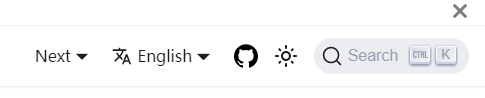

从 1.3 版本开始，我们将社区文档放在了 Karmada 网站上。
本文说明了如何对 `karmada-io/website` 代码仓库中的文档做贡献。

## 前提条件

- 文档类似于代码，也会按版本分类和存放。
  1.3 是我们归档的第一个版本。
- 文档需要为来自不同地区的读者翻译为多语言。
  社区目前支持中文和英语。
  英语是文档的官方语言。
- 因为我们的文档采用 Markdown 语法，所以如果你对 Markdown 不熟悉，请参阅 https://guides.github.com/features/mastering-markdown/，如果你正在查找更实质性的内容，请参阅 https://www.markdownguide.org/。
- 我们通过一个模块化静态网站生成器 [Docusaurus 2](https://docusaurus.io/) 来构建我们的网站。

## 设置

你可以通过克隆我们的网站代码仓库搭建本地环境。

```shell
git clone https://github.com/karmada-io/website.git
cd website
```

Karmada 网站的结构组成如下所示：

```
website
├── sidebars.json        # sidebar for the current docs version
├── docs                 # docs directory for the current docs version
│   ├── foo
│   │   └── bar.md       # https://mysite.com/docs/next/foo/bar
│   └── hello.md         # https://mysite.com/docs/next/hello
├── versions.json        # file to indicate what versions are available
├── versioned_docs
│   ├── version-1.1.0
│   │   ├── foo
│   │   │   └── bar.md   # https://mysite.com/docs/foo/bar
│   │   └── hello.md
│   └── version-1.0.0
│       ├── foo
│       │   └── bar.md   # https://mysite.com/docs/1.0.0/foo/bar
│       └── hello.md
├── versioned_sidebars
│   ├── version-1.1.0-sidebars.json
│   └── version-1.0.0-sidebars.json
├── docusaurus.config.js
└── package.json
```

`versions.json` 文件是一个从最老版本到最新版本的列表。
下表说明了一个版本文件如何映射版本和生成的 URL。

| 路径                                    | 版本        | URL               |
| --------------------------------------- | -------------- | ----------------- |
| `versioned_docs/version-1.0.0/hello.md` | 1.0.0          | /docs/1.0.0/hello |
| `versioned_docs/version-1.1.0/hello.md` | 1.1.0 (latest) | /docs/hello       |
| `docs/hello.md`                         | current        | /docs/next/hello  |

:::tip

`docs` 目录中的文件属于 `current` 文档版本。

`current` 文档版本被标记为 `Next` 并托管在 `/docs/next/*` 下。

贡献者们主要为当前版本的文档做贡献。
:::

## 编写文档

### 撰写标题

有关文章重要的一点是：在 Markdown 文件顶部的一个名为 **Front Matter** 的部分指定有关文章的元数据。

现在，让我们看一个简单的例子来说明 **Front Matter** 中最相关的条目：

```
---
title: 带标记的文档
---

## 次级标题
```

两行 --- 之间的顶部区域属于 Front Matter。
我们在此处定义了几个条目，告诉 Docusaurus 如何处理文章：
* 标题（title）相当于 HTML 文档中的 `<h1>` 或 Markdown 文章中的 `# <title>`。
* 每个文件都有一个唯一的 ID。默认情况下，文档 ID 是与根文档目录相关的文档名称（不带扩展名）。

### 链接到其他文档

你可以通过添加以下任意链接轻松跳转到其他位置：
* 你可以使用以下 Markdown 标记指向 `https://github.com` 或 `https://k8s.io` 等外部站点的绝对 URL：
   * `<https://github.com>` 或
   * `[kubernetes](https://k8s.io)`
* 链接到 Markdown 文件或生成的路径。
  你可以使用相对路径来索引相应的文件。
* 链接到图片或其他资源。
  如果你的文章包含图片或其他资源，你可以在 `/docs/resources` 中创建相应的目录，并将文章相关的文件放置在该目录中。
  现在我们将有关 Karmada 的公开图片存放在 `/docs/resources/general` 中。你可以使用以下方式链接到图片：
  * ``

### 目录组成

Docusaurus 2 使用一个侧边栏来管理文档。

创建侧边栏可用于：
* 对多个相关的文档分组
* 为每个文档显示侧边栏
* 提供分页导航，有 Next/Previous 按钮

对于 Karmada 文档，你可以查阅 <https://github.com/karmada-io/website/blob/main/sidebars.js> 了解文档的组成结构。

```
module.exports = {
    docs: [
        {
            type: "category",
            label: "Core Concepts",
            collapsed: false,
            items: [
                "core-concepts/introduction",
                "core-concepts/concepts",
                "core-concepts/architecture",
            ],
        },
        {
            type: "doc",
            id: "key-features/features",
        },
        {
            type: "category",
            label: "Get Started",
            items: [
                "get-started/nginx-example"
            ],
        },
....
```

目录中文档的顺序严格按照 items 的顺序排列。
```
type: "category",
label: "Core Concepts",
collapsed: false,
items: [
  "core-concepts/introduction",
  "core-concepts/concepts",
  "core-concepts/architecture",
],
```

如果新增一篇文档，必须将其添加到 `sidebars.js` 中才能正常显示。如果你不确定将文档放在哪儿，请在 PR 中询问社区成员。

### 有关中文文档

贡献中文文档有以下两种情况：
* 你想将现有的英文文档翻译成中文。
  在这种情况下，你需要修改 <https://github.com/karmada-io/website/tree/main/i18n/zh/docusaurus-plugin-content-docs/current> 中相应的文件内容。
  该目录的组织结构与英文完全相同。`current.json` 保存文档目录的中文译稿。如果要翻译目录名称，可以对其进行编辑。
* 你想贡献没有英文版本的中文文档。任何类型的文章都是受欢迎的。
  在这种情况下，你可以先将文章和标题添加到英文目录。
  文章内容可以先待定。
  然后将对应的中文内容添加到中文目录中。

## 调试文档

假设现在你已经完成了文档编辑。对 `karmada.io/website` 发起 PR 后，如果通过了 CI，就可以在网站上预览你的文档。

点击红色标记的 **Details**，可以看到网站的预览视图。


点击 **Next** 切换至当前版本，然后你可以看到你修改的文档相应的变更。
如果你有与中文版本相关的更改，请点击旁边的语言下拉框切换到中文。



如果预览的页面与预期不符，请再次检查文档。

### 拼写检查 (可选)

更新文件后，你可以使用 [拼写检查工具](https://github.com/crate-ci/typos) 查找并纠正拼写错误。

要安装拼写检查工具，可以参考 [安装](https://github.com/crate-ci/typos?tab=readme-ov-file#install)。

然后，只需在本地命令行的仓库 root 路径下执行 `typos . --config ./typos.toml`命令。

## FAQ

### 版本控制

对于各版本新补充的文档，我们将在各版本发布之日同步到最新版本，旧版本文档不做修改。
对于文档中发现的错误，我们将在每次发布时进行修复。
