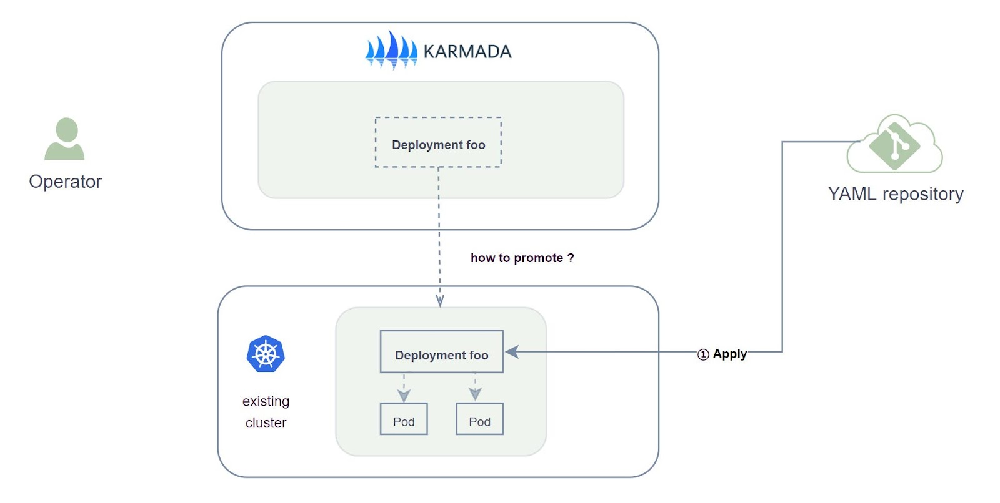

## Scenario

Assuming the user has a single kubernetes cluster which already has many native resource installed.

The user want to install Karmada for multi-cluster management, and hope to migrate the resource that already exist from original cluster to Karmada.
It is required that the pods already exist not be affected during the process of migration, which means the relevant container not be restarted.

So, how to migrate the existing resource?



## Recommended migration strategy

If you only want to migrate individual resources, you can just refer to [promote-legacy-workload](./promote-legacy-workload) to do it one by one.

If you want to migrate a batch of resources, you are advised to take over all resources based on resource granularity through few `PropagationPolicy` at first,
then if you have more propagate demands based on application granularity, you can apply higher priority `PropagationPolicy` to preempt them.

Thus, how to take over all resources based on resource granularity? You can do as follows.


### Step one

Since the existing resources will be token over by Karmada, there is no longer need to apply the related YAML config to member cluster.
That means, you can stop the corresponding operation or pipeline.

### Step two

Apply all the YAML config of resources to Karmada control plane, as the [ResourceTemplate](https://karmada.io/docs/core-concepts/concepts#resource-template) of Karmada.

### Step three

Edit a [PropagationPolicy](https://karmada.io/docs/core-concepts/concepts#propagation-policy), and apply it to Karmada control plane. You should pay attention to two fields：

* `spec.conflictResolution: Overwrite`：**the value must be [Overwrite](https://github.com/karmada-io/karmada/blob/master/docs/proposals/migration/design-of-seamless-cluster-migration-scheme.md#proposal).**
* `spec.resourceSelectors`：defining which resources are selected to migrate

here we provide two examples：

#### Eg1. migrate all deployments

If you want to migrate all deployments from `member1` cluster to Karmada, you shall apply:

```yaml
apiVersion: policy.karmada.io/v1alpha1
kind: PropagationPolicy
metadata:
  name: deployments-pp
spec:
  conflictResolution: Overwrite
  placement:
    clusterAffinity:
      clusterNames:
      - member1
  priority: 0
  resourceSelectors:
  - apiVersion: apps/v1
    kind: Deployment
  schedulerName: default-scheduler
```

#### Eg2. migrate all services

If you want to migrate all services from `member1` cluster to Karmada, you shall apply:

```yaml
apiVersion: policy.karmada.io/v1alpha1
kind: PropagationPolicy
metadata:
  name: services-pp
spec:
  conflictResolution: Overwrite
  placement:
    clusterAffinity:
      clusterNames:
      - member1
  priority: 0
  resourceSelectors:
  - apiVersion: v1
    kind: Service
  schedulerName: default-scheduler
```

### Step four

The rest migration operations will be finished by Karmada automatically.

## PropagationPolicy Preemption and Demo

Besides, if you have more propagate demands based on application granularity, you can apply higher priority `PropagationPolicy` 
to preempt those you applied in the migration mentioned above. Detail demo you can refer to the tutorial [Resource Migration](../../tutorials/resource-migration.md)

