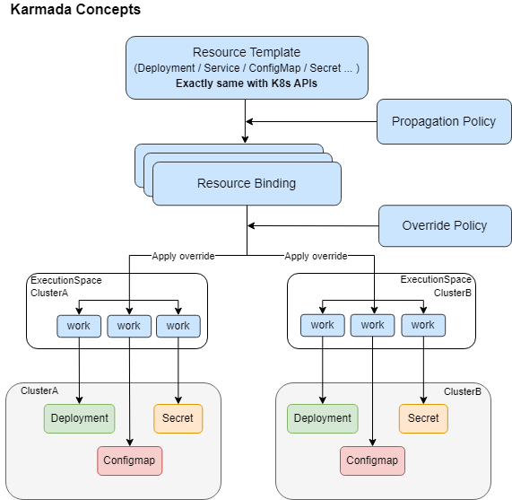

This page introduces some core concepts about Karmada.

## Resource Template

Karmada uses the Kubernetes Native API definition for the federated resource template, to make it easy to integrate with existing tools that have already been adopted by Kubernetes.

## Propagation Policy

Karmada offers a standalone Propagation (placement) Policy API to define multi-cluster scheduling and spreading requirements.

- Support 1:n mapping of policy:workloads. Users don't need to indicate scheduling constraints every time creating federated applications.

- With default policies, users can directly interact with the Kubernetes API.

## Override Policy

Karmada provides a standalone Override Policy API for specializing the automation of cluster-related configuration. For example:

- Override the image prefix based on the member cluster region.

- Override StorageClass depending on your cloud provider.

The following diagram shows how Karmada resources are propagated to member clusters.

