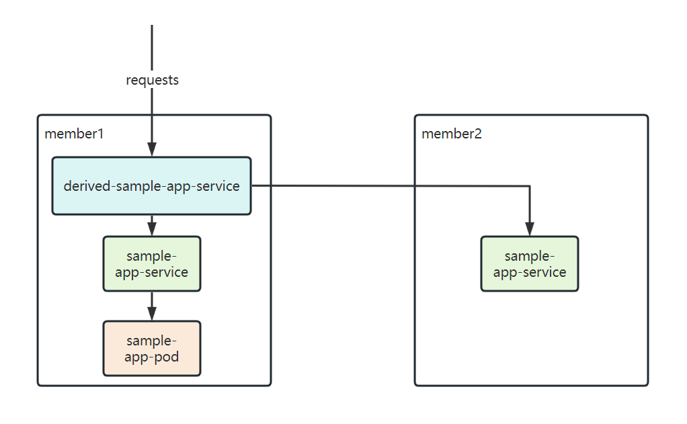

In Karmada, a FederatedHPA scales up/down the workload's replicas across multiple clusters, with the aim of automatically scaling the workload to match the demand.

FederatedHPA not only supports resource metrics such as CPU and memory, but also supports custom metrics
which may expand the use cases of FederatedHPA.

This document walks you through an example of enabling FederatedHPA to automatically manage scale for a cross-cluster app with custom metrics.

The walkthrough example will do as follows:  



* One sample-deployment's pod exists in `member1` cluster.
* The service is deployed in `member1` and `member2` cluster.
* Request the multi-cluster service and trigger an increase in the pod's custom metrics(http_requests_total).
* The replicas will be scaled up in `member1` and `member2` cluster.

## Prerequisites

### Karmada has been installed

You can install Karmada by referring to [Quick Start](https://github.com/karmada-io/karmada#quick-start), or directly run `hack/local-up-karmada.sh` script which is also used to run our E2E cases.

### Member Cluster Network

Ensure that at least two clusters have been added to Karmada, and the container networks between member clusters are connected.

- If you use the `hack/local-up-karmada.sh` script to deploy Karmada, Karmada will have three member clusters, and the container networks of the `member1` and `member2` will be connected.
- You can use `Submariner` or other related open source projects to connect networks between member clusters.

> Note: In order to prevent routing conflicts, Pod and Service CIDRs of clusters need non-overlapping.

### The ServiceExport and ServiceImport CRDs have been installed

You need to install `ServiceExport` and `ServiceImport` in the member clusters to enable multi-cluster service.

After `ServiceExport` and `ServiceImport` have been installed on the **Karmada Control Plane**, you can create `ClusterPropagationPolicy` to propagate those two CRDs to the member clusters.

```yaml
# propagate ServiceExport CRD
apiVersion: policy.karmada.io/v1alpha1
kind: ClusterPropagationPolicy
metadata:
  name: serviceexport-policy
spec:
  resourceSelectors:
    - apiVersion: apiextensions.k8s.io/v1
      kind: CustomResourceDefinition
      name: serviceexports.multicluster.x-k8s.io
  placement:
    clusterAffinity:
      clusterNames:
        - member1
        - member2
---        
# propagate ServiceImport CRD
apiVersion: policy.karmada.io/v1alpha1
kind: ClusterPropagationPolicy
metadata:
  name: serviceimport-policy
spec:
  resourceSelectors:
    - apiVersion: apiextensions.k8s.io/v1
      kind: CustomResourceDefinition
      name: serviceimports.multicluster.x-k8s.io
  placement:
    clusterAffinity:
      clusterNames:
        - member1
        - member2
```

### prometheus and prometheus-adapter have been installed in member clusters

You need to install `prometheus` and `prometheus-adapter` for member clusters to provide the custom metrics.
You can install it by running the following in member clusters:
```sh
git clone https://github.com/prometheus-operator/kube-prometheus.git
cd kube-prometheus
kubectl apply --server-side -f manifests/setup
kubectl wait \
	--for condition=Established \
	--all CustomResourceDefinition \
	--namespace=monitoring
kubectl apply -f manifests/
```

You can verify the installation by the following command:
```sh
$ kubectl --kubeconfig=/root/.kube/members.config --context=member1 get po -nmonitoring
NAME                                   READY   STATUS    RESTARTS   AGE
alertmanager-main-0                    2/2     Running   0          30h
alertmanager-main-1                    2/2     Running   0          30h
alertmanager-main-2                    2/2     Running   0          30h
blackbox-exporter-6bc47b9578-zcbb7     3/3     Running   0          30h
grafana-6b68cd6b-vmw74                 1/1     Running   0          30h
kube-state-metrics-597db7f85d-2hpfs    3/3     Running   0          30h
node-exporter-q8hdx                    2/2     Running   0          30h
prometheus-adapter-57d9587488-86ckj    1/1     Running   0          29h
prometheus-adapter-57d9587488-zrt29    1/1     Running   0          29h
prometheus-k8s-0                       2/2     Running   0          30h
prometheus-k8s-1                       2/2     Running   0          30h
prometheus-operator-7d4b94944f-kkwkk   2/2     Running   0          30h
```

### karmada-metrics-adapter has been installed in Karmada control plane

You need to install `karmada-metrics-adapter` in Karmada control plane to provide the metrics API, install it by running:
```sh
hack/deploy-metrics-adapter.sh ${host_cluster_kubeconfig} ${host_cluster_context} ${karmada_apiserver_kubeconfig} ${karmada_apiserver_context_name}
```

If you use the `hack/local-up-karmada.sh` script to deploy Karmada, `karmada-metrics-adapter` will be installed by default.

## Deploy workload in `member1` and `member2` cluster

You need to deploy a sample deployment(1 replica) and service in `member1` and `member2`.

```yaml
apiVersion: apps/v1
kind: Deployment
metadata:
  name: sample-app
  labels:
    app: sample-app
spec:
  replicas: 1
  selector:
    matchLabels:
      app: sample-app
  template:
    metadata:
      labels:
        app: sample-app
    spec:
      containers:
      - image: luxas/autoscale-demo:v0.1.2
        name: metrics-provider
        ports:
        - name: http
          containerPort: 8080
---
apiVersion: v1
kind: Service
metadata:
  labels:
    app: sample-app
  name: sample-app
spec:
  ports:
  - name: http
    port: 80
    protocol: TCP
    targetPort: 8080
  selector:
    app: sample-app
  type: ClusterIP
---
apiVersion: policy.karmada.io/v1alpha1
kind: PropagationPolicy
metadata:
  name: app-propagation
spec:
  resourceSelectors:
    - apiVersion: apps/v1
      kind: Deployment
      name: sample-app
    - apiVersion: v1
      kind: Service
      name: sample-app
  placement:
    clusterAffinity:
      clusterNames:
        - member1
        - member2
    replicaScheduling:
      replicaDivisionPreference: Weighted
      replicaSchedulingType: Divided
      weightPreference:
        staticWeightList:
          - targetCluster:
              clusterNames:
                - member1
            weight: 1
          - targetCluster:
              clusterNames:
                - member2
            weight: 1
```

After deploying, you can check the distribution of the pods and service:
```sh
$ karmadactl get pods
NAME                                  CLUSTER   READY   STATUS    RESTARTS   AGE
sample-app-9b7d8c9f5-xrnfx            member1   1/1     Running   0          111s
$ karmadactl get svc
NAME                 CLUSTER   TYPE        CLUSTER-IP      EXTERNAL-IP   PORT(S)   AGE     ADOPTION
sample-app           member1   ClusterIP   10.11.29.250    <none>        80/TCP    3m53s   Y
```

## Monitor your application in `member1` and `member2` cluster

In order to monitor your application, you'll need to set up a ServiceMonitor pointing at the application. Assuming you've set up your Prometheus instance to use ServiceMonitors with the app: sample-app label, create a ServiceMonitor to monitor the app's metrics via the service:

```yaml
apiVersion: monitoring.coreos.com/v1
kind: ServiceMonitor
metadata:
  name: sample-app
  labels:
    app: sample-app
spec:
  selector:
    matchLabels:
      app: sample-app
  endpoints:
  - port: http
```

```sh
kubectl create -f sample-app.monitor.yaml
```

Now, you should see your metrics (http_requests_total) appear in your Prometheus instance. Look them up via the dashboard, and make sure they have the namespace and pod labels. If not, check the labels on the service monitor match the ones on the Prometheus CRD.

## Launch you adapter in `member1` and `member2` cluster

After you deploy `prometheus-adapter`, you need to update to the adapter config which is necessary in order to expose custom metrics.

```yaml
apiVersion: v1
kind: ConfigMap
metadata:
  name: adapter-config
  namespace: monitoring
data:
  config.yaml: |-
    "rules":
    - "seriesQuery": |
         {namespace!="",__name__!~"^container_.*"}
      "resources":
        "template": "<<.Resource>>"
      "name":
        "matches": "^(.*)_total"
        "as": ""
      "metricsQuery": |
        sum by (<<.GroupBy>>) (
          irate (
            <<.Series>>{<<.LabelMatchers>>}[1m]
          )
        )
```

```sh
kubectl apply -f prom-adapter.config.yaml
# Restart prom-adapter pods
kubectl rollout restart deployment prometheus-adapter -n monitoring
```

## Register metrics API in `member1` and `member2` cluster

You also need to register the custom metrics API with the API aggregator (part of the main Kubernetes API server). For that you need to create an APIService resource.

```yaml
apiVersion: apiregistration.k8s.io/v1
kind: APIService
metadata:
  name: v1beta2.custom.metrics.k8s.io
spec:
  group: custom.metrics.k8s.io
  groupPriorityMinimum: 100
  insecureSkipTLSVerify: true
  service:
    name: prometheus-adapter
    namespace: monitoring
  version: v1beta2
  versionPriority: 100
```

```sh
kubectl create -f api-service.yaml
```

The API is registered as `custom.metrics.k8s.io/v1beta2`, and you can use the following command to verify:

```sh
kubectl get --raw "/apis/custom.metrics.k8s.io/v1beta2/namespaces/default/pods/*/http_requests?selector=app%3Dsample-app"
```

The output is similar to:

```json
{
  "kind": "MetricValueList", 
  "apiVersion": "custom.metrics.k8s.io/v1beta2", 
  "metadata": {}, 
  "items": [
    {
      "describedObject": {
        "kind": "Pod", 
        "namespace": "default", 
        "name": "sample-app-9b7d8c9f5-9lw6b", 
        "apiVersion": "/v1"
      }, 
      "metric": {
        "name": "http_requests", 
        "selector": null
      }, 
      "timestamp": "2023-06-14T09:09:54Z", 
      "value": "66m"
    }
  ]
}
```

If `karmada-metrics-adapter` is installed successfully, you can also verify it with the above command in Karmada control plane.


## Deploy FederatedHPA in Karmada control plane

Then let's deploy FederatedHPA in Karmada control plane.

```yaml
apiVersion: autoscaling.karmada.io/v1alpha1
kind: FederatedHPA
metadata:
  name: sample-app
spec:
  scaleTargetRef:
    apiVersion: apps/v1
    kind: Deployment
    name: sample-app
  minReplicas: 1
  maxReplicas: 10
  behavior:
    scaleDown:
      stabilizationWindowSeconds: 10
    scaleUp:
      stabilizationWindowSeconds: 10
  metrics:
    - type: Pods
      pods:
        metric:
          name: http_requests
        target:
          averageValue: 700m
          type: Value
```

After deploying, you can check the FederatedHPA:
```sh
NAME          REFERENCE-KIND   REFERENCE-NAME   MINPODS   MAXPODS   REPLICAS   AGE
sample-app    Deployment       sample-app       1         10        1          15d
```

## Export service to `member1` cluster

As mentioned before, you need a multi-cluster service to route the requests to the pods in `member1` and `member2` cluster, so let create this mult-cluster service.  
* Create a `ServiceExport` object on Karmada Control Plane, and then create a `PropagationPolicy` to propagate the `ServiceExport` object to `member1` and `member2` cluster.
  ```yaml
  apiVersion: multicluster.x-k8s.io/v1alpha1
  kind: ServiceExport
  metadata:
    name: sample-app
  ---
  apiVersion: policy.karmada.io/v1alpha1
  kind: PropagationPolicy
  metadata:
    name: serve-export-policy
  spec:
    resourceSelectors:
      - apiVersion: multicluster.x-k8s.io/v1alpha1
        kind: ServiceExport
        name: sample-app
    placement:
      clusterAffinity:
        clusterNames:
          - member1
          - member2
  ```
* Create a `ServiceImport` object on Karmada Control Plane, and then create a `PropagationPolicy` to propagate the `ServiceImport` object to `member1` cluster.
  ```yaml
  apiVersion: multicluster.x-k8s.io/v1alpha1
  kind: ServiceImport
  metadata:
    name: sample-app
  spec:
    type: ClusterSetIP
    ports:
    - port: 80
      protocol: TCP
  ---
  apiVersion: policy.karmada.io/v1alpha1
  kind: PropagationPolicy
  metadata:
    name: serve-import-policy
  spec:
    resourceSelectors:
      - apiVersion: multicluster.x-k8s.io/v1alpha1
        kind: ServiceImport
        name: sample-app
    placement:
      clusterAffinity:
        clusterNames:
          - member1
  ```

After deploying, you can check the multi-cluster service:
```sh
$ karmadactl get svc
NAME                    CLUSTER   TYPE        CLUSTER-IP      EXTERNAL-IP   PORT(S)   AGE   ADOPTION
derived-sample-app      member1   ClusterIP   10.11.59.213    <none>        80/TCP    9h    Y
```

## Install hey http load testing tool in member1 cluster

In order to do http requests, here you can use `hey`.
* Download `hey` and copy it to kind cluster container.
```sh
wget https://hey-release.s3.us-east-2.amazonaws.com/hey_linux_amd64
chmod +x hey_linux_amd64
docker cp hey_linux_amd64 member1-control-plane:/usr/local/bin/hey
```

## Test scaling up

* Check the pod distribution firstly.
  ```sh
  $ karmadactl get pods
  NAME                                  CLUSTER   READY   STATUS    RESTARTS   AGE
  sample-app-9b7d8c9f5-xrnfx            member1   1/1     Running   0          111s
  ```

* Check multi-cluster service ip.
  ```sh
  $ karmadactl get svc
  NAME                    CLUSTER   TYPE        CLUSTER-IP        EXTERNAL-IP   PORT(S)   AGE   ADOPTION
  derived-sample-app      member1   ClusterIP   10.11.59.213      <none>        80/TCP    20m   Y
  ```

* Request multi-cluster service with hey to increase the nginx pods' custom metrics(http_requests_total).
  ```sh
  docker exec member1-control-plane hey -c 1000 -z 1m http://10.11.59.213/metrics
  ```

* Wait 15s, the replicas will be scaled up, then you can check the pod distribution again.
  ```sh
  $ karmadactl get po -l app=sample-app
  NAME                         CLUSTER   READY   STATUS    RESTARTS   AGE
  sample-app-9b7d8c9f5-454vz   member2   1/1     Running   0          84s
  sample-app-9b7d8c9f5-7fjhn   member2   1/1     Running   0          69s
  sample-app-9b7d8c9f5-ddf4s   member2   1/1     Running   0          69s
  sample-app-9b7d8c9f5-mxqmh   member2   1/1     Running   0          84s
  sample-app-9b7d8c9f5-qbc2j   member2   1/1     Running   0          69s
  sample-app-9b7d8c9f5-2tgxt   member1   1/1     Running   0          69s
  sample-app-9b7d8c9f5-66n9s   member1   1/1     Running   0          69s
  sample-app-9b7d8c9f5-fbzps   member1   1/1     Running   0          84s
  sample-app-9b7d8c9f5-ldmhz   member1   1/1     Running   0          84s
  sample-app-9b7d8c9f5-xrnfx   member1   1/1     Running   0          87m
  ```

## Test scaling down

After 1 minute, the load testing tool will be stopped, then you can see the workload is scaled down across clusters.
```sh
$ karmadactl get pods -l app=sample-app
NAME                         CLUSTER   READY   STATUS    RESTARTS   AGE
sample-app-9b7d8c9f5-xrnfx   member1   1/1     Running   0          91m
```
